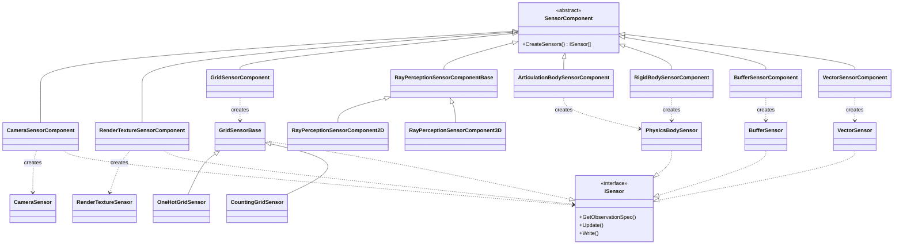
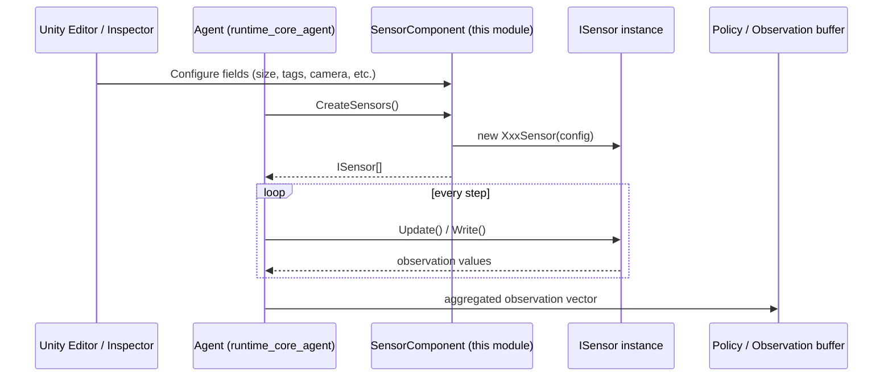
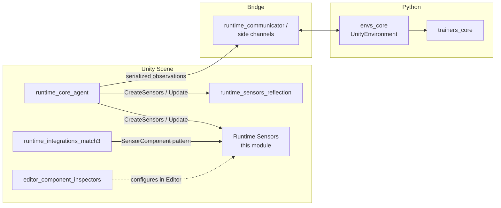

# Runtime Sensors

## Purpose

The **Runtime Sensors** module provides the concrete, user-facing `SensorComponent` implementations that ML-Agents
Agents use to perceive their environment. Each component is a `MonoBehaviour` that can be attached to an Agent
(or a child GameObject) in the Unity Editor; at runtime (or when the Agent initializes) it constructs one or more
`ISensor` instances that are polled every step to produce the observation vector fed into the policy network.

This module is purely about **observation generation on the Unity side** — it has no knowledge of training,
neural networks, or the Python side of the pipeline. It sits at the boundary between the Unity scene (physical
world, cameras, colliders, custom game state) and the rest of the ML-Agents observation pipeline.

Closely related modules:
- **[runtime_sensors_reflection](runtime_sensors_reflection.md)** — sibling module providing reflection-based
  sensors (`BoolReflectionSensor`, `FloatReflectionSensor`, etc.) that observe C# fields/properties directly via
  reflection, rather than through an explicit `SensorComponent`.
- **[editor_component_inspectors](editor_component_inspectors.md)** — custom Editor `Inspector` classes
  (`CameraSensorComponentEditor`, `GridSensorComponentEditor`, `RayPerceptionSensorComponentBaseEditor`, etc.) that
  render the Inspector UI for the components documented here.
- **[runtime_core_agent](runtime_core_agent.md)** — the `Agent`/`DecisionRequester` layer that owns the
  `SensorComponent`s attached to a GameObject and aggregates their `ISensor` outputs into the observation
  buffer sent to the policy.
- **[runtime_integrations_match3](runtime_integrations_match3.md)** — a specialized sensor/actuator pairing
  (`Match3SensorComponent`) that follows the same `SensorComponent` pattern for grid-based match-3 games.

## Architecture Overview

All components in this module derive from the abstract `SensorComponent` base class (part of the core
`Unity.MLAgents.Sensors` runtime library, outside this module) and implement `CreateSensors()`, which is invoked
by the Agent during initialization to obtain the actual `ISensor` objects used for observation collection.

### Sensor lifecycle / data flow

## Sub-modules

The ten components in this module are grouped by the kind of observation they produce:

| Sub-module | Components | Description |
|---|---|---|
| [runtime_sensors_visual](runtime_sensors_visual.md) | `CameraSensorComponent`, `RenderTextureSensorComponent` | Pixel-based observations captured from a Unity `Camera` or an arbitrary `RenderTexture`, with optional grayscale conversion, compression and frame-stacking. |
| [runtime_sensors_spatial](runtime_sensors_spatial.md) | `GridSensorComponent`, `CountingGridSensor`, `RayPerceptionSensorComponent2D`, `RayPerceptionSensorComponent3D` | Spatial/geometric perception: grid-based tag detection (one-hot or counting) via overlap checks, and 2D/3D ray-cast perception around the Agent. |
| [runtime_sensors_physics](runtime_sensors_physics.md) | `ArticulationBodySensorComponent`, `RigidBodySensorComponent` | Physics-body pose observations built from `ArticulationBody`/`Rigidbody` hierarchies, useful for ragdoll- and joint-driven agents. |
| [runtime_sensors_data](runtime_sensors_data.md) | `BufferSensorComponent`, `VectorSensorComponent` | Generic, user-populated numeric observations: a fixed-size float vector (`VectorSensor`) and a variable-length list of same-sized entity observations (`BufferSensor`), typically written to from Agent code (e.g. `CollectObservations`). |

## How this module fits into the system

Sensor components generate the raw observation data that the Agent packages and sends to the training backend
(see [runtime_communicator](runtime_communicator.md) and [envs_core](envs_core.md)) where it is consumed by the
trainers (see [trainers_core](trainers_core.md) and [Neural_Network_Building_Blocks](trainers_torch_entities.md)).

## Common Design Patterns

- **Component / Sensor separation**: The `SensorComponent` (a `MonoBehaviour`, editable in the Inspector) is a
  thin factory for the actual `ISensor` implementation, which does the heavy lifting and is a plain C# class
  (not a Unity object). This lets sensors be constructed, tested, and swapped independently of the Unity scene
  graph.
- **`UpdateSensor()` runtime patching**: Several components (`CameraSensorComponent`, `RenderTextureSensorComponent`,
  `GridSensorComponent`) expose an internal `UpdateSensor()` method invoked from property setters, allowing a
  subset of fields (e.g. compression type) to be changed safely after `CreateSensors()` has already run.
  Fields that affect array sizes (e.g. `Width`/`Height`, `ObservationSize`) are documented as **not** safe to
  change post-creation.
- **Optional observation stacking**: Visual and vector components (`CameraSensorComponent`,
  `RenderTextureSensorComponent`, `GridSensorComponent`, `VectorSensorComponent`) support wrapping their base
  sensor in a `StackingSensor` when `ObservationStacks > 1`, enabling temporal stacking of recent frames.
- **`[MovedFrom]` attributes**: Components migrated from the (now removed) `com.unity.ml-agents.extensions`
  package (`ArticulationBodySensorComponent`, `RigidBodySensorComponent`, `CountingGridSensor`) carry
  `[UnityEngine.Scripting.APIUpdating.MovedFrom]` attributes to preserve serialized references in existing scenes.
