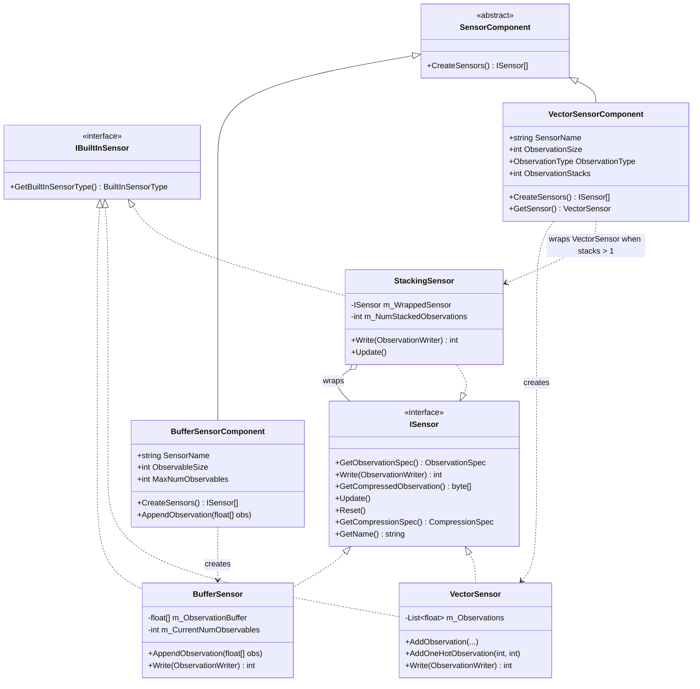
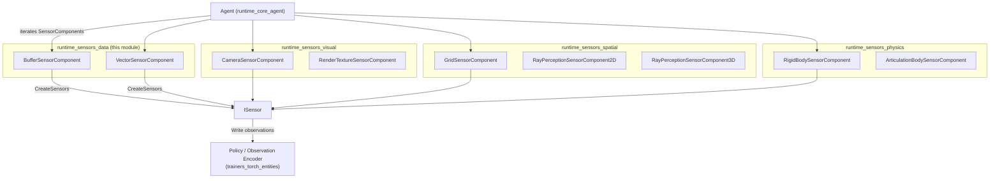
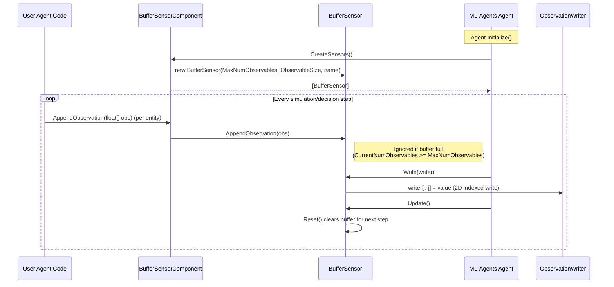
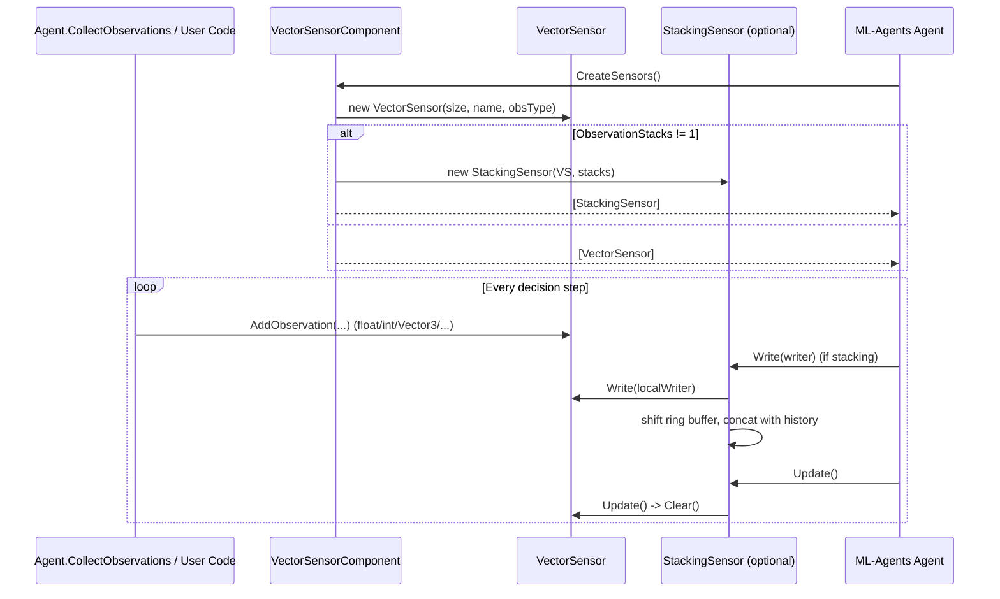

# Runtime Sensors — Data Sensors (`runtime_sensors_data`)

## Introduction

The **runtime_sensors_data** module provides Unity `SensorComponent` implementations that expose **generic, code-driven observation data** to an ML-Agents `Agent` — as opposed to sensors that automatically capture data from the physical/visual world (cameras, physics bodies, raycasts, grids). It contains two components:

| Component | Purpose |
|---|---|
| `BufferSensorComponent` | Exposes a **variable-length list of entities**, each represented by a fixed-size float vector (e.g. nearby enemies, items, or other agents), typically consumed by attention-based network architectures. |
| `VectorSensorComponent` | Exposes a **fixed-size vector of floats** that the user manually populates every step (the classic `CollectObservations`-driven "vector observation"), with optional frame-stacking. |

Both components are thin `MonoBehaviour` wrappers around lower-level `ISensor` implementations (`BufferSensor`, `VectorSensor`) defined in the core `Unity.MLAgents.Sensors` runtime API. They are siblings of the other sensor categories under the [`runtime_sensors`](runtime_sensors.md) parent module — visual sensors ([`runtime_sensors_visual`](runtime_sensors_visual.md)), spatial/perception sensors ([`runtime_sensors_spatial`](runtime_sensors_spatial.md)), and physics-body sensors ([`runtime_sensors_physics`](runtime_sensors_physics.md)) — but unlike those, they do not read from cameras, colliders, or rigid bodies; the data is supplied programmatically by the user's own game/agent code.

This document covers the architecture, data flow, and integration points of the module for developers extending or maintaining ML-Agents sensor tooling.

---

## Module Purpose & Core Functionality

### BufferSensorComponent
- Creates a `BufferSensor` (an `ISensor`) sized by `MaxNumObservables × ObservableSize`.
- Used for **variable-length, set-like observations** — e.g., "up to 20 visible enemies, each described by 4 floats." Internally the observation is marked as `DimensionProperty.VariableSize`, signalling to the trainer that a masking/attention-based network module (see [`ResidualSelfAttention`](Neural_Network_Building_Blocks.md)) should be used to process it.
- Exposes `AppendObservation(float[] obs)` which user code (typically in `Agent.CollectObservations` or a custom `MonoBehaviour`) calls once per relevant entity per step. Extra observations beyond `MaxNumObservables` are silently dropped.
- The buffer is cleared automatically on `Update()` (each agent step) via `Reset()`.

### VectorSensorComponent
- Creates a `VectorSensor`, the traditional 1-D fixed-length observation vector used since early ML-Agents versions.
- Optionally wraps the `VectorSensor` in a `StackingSensor` when `ObservationStacks > 1`, so that the last *N* frames of vector observations are concatenated — useful for giving the network temporal context without a recurrent network.
- Supports assigning an `ObservationType` (e.g. `Default` or `GoalSignal`) so the training pipeline can route the data appropriately (e.g. to goal-conditioning logic).
- Exposes `GetSensor()` for direct access to the underlying `VectorSensor`, letting user code call `AddObservation(...)` overloads (float, int, bool, `Vector2/3`, `Quaternion`, one-hot, etc.) directly instead of going through `Agent.CollectObservations`.

Both components follow the standard ML-Agents sensor lifecycle contract defined by `ISensor`:

```
GetObservationSpec() -> Write(ObservationWriter) -> Update() -> Reset()
```

---

## Architecture

### Class Diagram



### Component Relationships in the Sensors Ecosystem



---

## Data Flow

### Buffer Sensor — Per-Step Data Collection



### Vector Sensor — With Optional Stacking



---

## Integration Points

- **Agent lifecycle**: Both `SensorComponent`s are discovered by the `Agent` (see [`Unity_Agent_&_Environment_Foundation`](Unity_Agent_&_Environment_Foundation.md)) via `CreateSensors()` during initialization, and their `Write`/`Update`/`Reset` methods are invoked each step/episode as part of the standard sensor pipeline shared with all other sensors in [`runtime_sensors`](runtime_sensors.md).
- **Observation spec & trainer routing**: `ObservationSpec.VariableLength` (used by `BufferSensor`) signals the Python trainer to process the observation with a variable-length/attention network path; see `ResidualSelfAttention` / `EntityEmbedding` in [`Neural_Network_Building_Blocks`](Neural_Network_Building_Blocks.md) (`trainers_torch_entities`), which consumes these buffer-style observations as "entity" inputs to `ActionModel`/`NetworkBody`.
- **Observation type routing**: The `ObservationType` set on `VectorSensorComponent` (e.g. goal-conditioning) affects how `NetworkBody`/`ObservationEncoder` treats the observation on the training side.
- **Editor tooling**: Both components have dedicated Unity Editor inspectors — `BufferSensorComponentEditor` and `VectorSensorComponentEditor` — documented in [`editor_component_inspectors`](Unity_Editor_Tooling.md), which render the serialized fields (`SensorName`, `ObservableSize`, `MaxNumObservables`, `ObservationSize`, `ObservationStacks`, `ObservationType`) in the Inspector and warn about incompatible configurations.
- **Contrast with other sensors**: Unlike [`runtime_sensors_visual`](runtime_sensors_visual.md) (camera/render-texture capture), [`runtime_sensors_spatial`](runtime_sensors_spatial.md) (grid/ray perception), and [`runtime_sensors_physics`](runtime_sensors_physics.md) (rigidbody/articulation body introspection) — which automatically derive observations from the Unity scene — data sensors in this module are purely **data containers driven by user code**, making them the most flexible/general-purpose sensor type for custom game state.
- **Reflection sensors relation**: [`runtime_sensors_reflection`](runtime_sensors_reflection.md) sensors (e.g. `FloatReflectionSensor`) also expose scalar/vector game data automatically via reflection over `[Observable]`-tagged members, and internally wrap values similarly to how `VectorSensor` stores floats — conceptually adjacent to `VectorSensorComponent` but driven by reflection instead of manual `AddObservation` calls.

---

## Key Design Notes

1. **Buffer overflow handling**: `BufferSensor.AppendObservation` silently drops observations once `MaxNumObservables` is reached rather than throwing, to avoid crashing simulations when entity counts spike. Developers should size `MaxNumObservables` generously or accept truncation.
2. **Vector size mismatch handling**: `VectorSensor.Write` pads with zeros or truncates (with a `Debug.LogWarning`) when the number of `AddObservation` calls doesn't match `ObservationSize`. Runtime configuration changes to `ObservationSize` after sensor creation have no effect (documented via `[HideInInspector]` fields set at `CreateSensors()` time).
3. **Stacking is applied only to `VectorSensorComponent`**, not `BufferSensorComponent`, since `StackingSensor` assumes fixed-size (rank-1 or rank-3) observations, which is incompatible with the variable-length semantics of `BufferSensor`.
4. **No compression**: Both `BufferSensor` and `VectorSensor` return `null` from `GetCompressedObservation()` and use `CompressionSpec.Default()`, since these are numeric, non-visual observations that gain nothing from PNG/byte compression (contrast with `CameraSensor` in [`runtime_sensors_visual`](runtime_sensors_visual.md)).

---

## Related Modules

- [`runtime_sensors`](runtime_sensors.md) — parent module and shared `ISensor`/`SensorComponent` contracts.
- [`runtime_sensors_visual`](runtime_sensors_visual.md) — camera/render-texture based sensors.
- [`runtime_sensors_spatial`](runtime_sensors_spatial.md) — grid and ray-perception sensors.
- [`runtime_sensors_physics`](runtime_sensors_physics.md) — rigidbody/articulation-body sensors.
- [`runtime_sensors_reflection`](runtime_sensors_reflection.md) — reflection-based automatic observation sensors.
- [`Unity_Editor_Tooling`](Unity_Editor_Tooling.md) — Inspector editors for these components (`BufferSensorComponentEditor`, `VectorSensorComponentEditor`).
- [`Unity_Agent_&_Environment_Foundation`](Unity_Agent_&_Environment_Foundation.md) — the `Agent` that consumes these sensors each step.
- [`Neural_Network_Building_Blocks`](Neural_Network_Building_Blocks.md) — Python/PyTorch network components (`ResidualSelfAttention`, `NetworkBody`) that consume the buffer/vector observation data during training.
