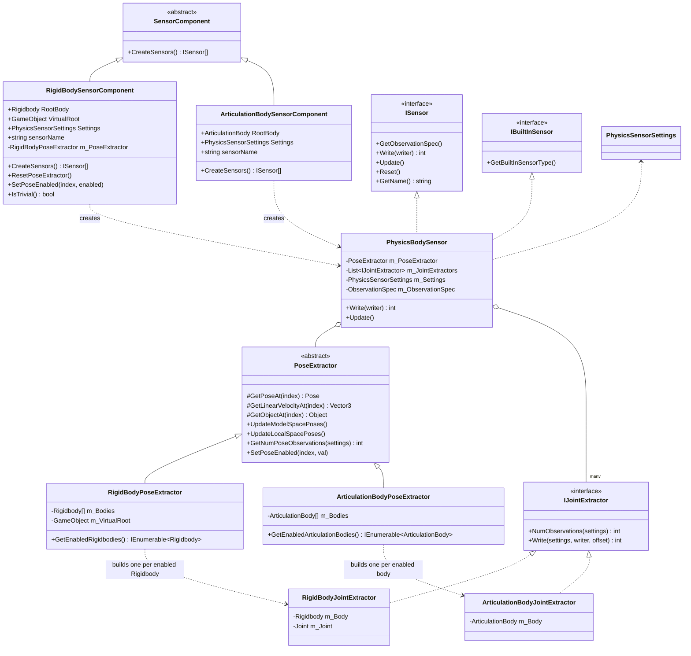
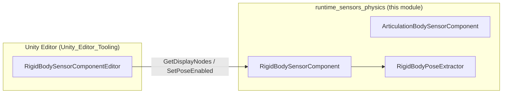
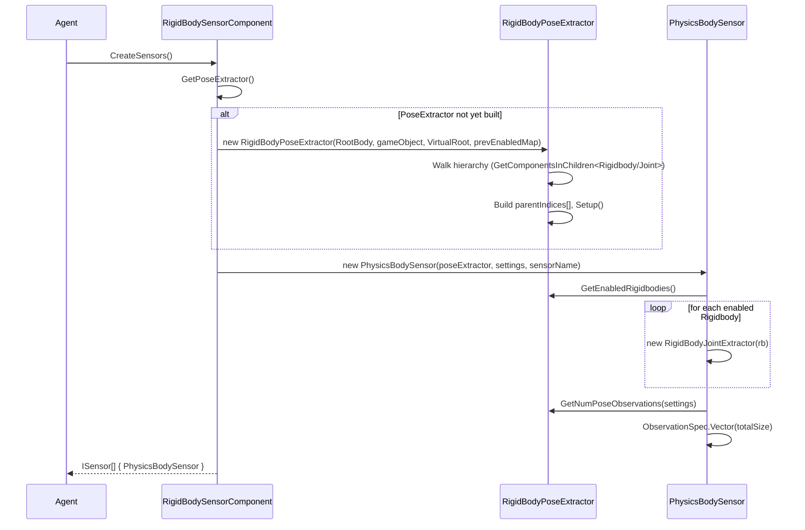
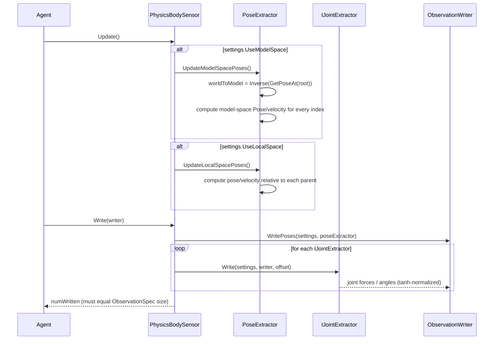
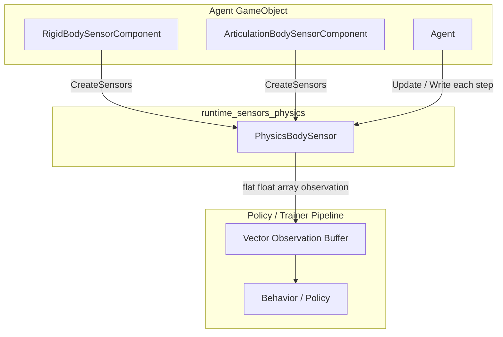

# Runtime Sensors: Physics Module

## Introduction

The **Runtime Sensors Physics** module provides ML-Agents sensor components that generate observations from a Unity physics hierarchy — either a `Rigidbody`/`Joint` skeleton or a modern `ArticulationBody` chain. These sensors are commonly used for ragdoll locomotion, robotic-arm control, and other tasks where an agent must perceive the pose, velocity, and joint state of an articulated physical body.

This module lives inside the broader Unity Perception & Sensing sensor family, as a sibling to visual sensors (`runtime_sensors_visual`), spatial/grid sensors (`runtime_sensors_spatial`), and data sensors (`runtime_sensors_data`). It exposes two `SensorComponent` implementations — `RigidBodySensorComponent` and `ArticulationBodySensorComponent` — that both funnel into a shared `PhysicsBodySensor` runtime sensor.

---

## Module Purpose

Physics-based agents (humanoid ragdolls, quadrupeds, robotic arms, etc.) need observations that describe:

- The **pose** (position/rotation) of each body part, in either world-relative "model space" (relative to a root) or "local space" (relative to a parent body).
- The **linear velocity** of each body part, in model or local space.
- **Joint-specific state**, such as joint angles (as sin/cos pairs) and the forces/torques currently applied by the physics solver.

Rather than requiring users to manually wire up dozens of `Transform` and `Rigidbody` references, this module automatically walks the physics hierarchy (via `GetComponentsInChildren`), builds a parent-child index, and produces a flat vector observation with a configurable subset of these features enabled via `PhysicsSensorSettings`.

---

## Core Components

| Component | Type | Description |
|---|---|---|
| `RigidBodySensorComponent` | `SensorComponent` (MonoBehaviour) | Editor-facing component attached to a GameObject; wraps a `Rigidbody`-based hierarchy connected via `Joint`s. |
| `ArticulationBodySensorComponent` | `SensorComponent` (MonoBehaviour) | Editor-facing component wrapping a Unity `ArticulationBody` hierarchy (Unity 2020.1+). |
| `PhysicsBodySensor` | `ISensor` / `IBuiltInSensor` | The actual runtime sensor created by both components; computes and writes the observation vector each step. |
| `PhysicsSensorSettings` | struct | Serializable flags controlling which observation categories (model space, local space, velocities, joint data) are included. |
| `PoseExtractor` (abstract) | base class | Generic hierarchy walker that computes model-space/local-space poses and velocities given parent-index mapping. |
| `RigidBodyPoseExtractor` | `PoseExtractor` | Concrete extractor for `Rigidbody` hierarchies; supports an optional "virtual root" GameObject for a stabilized reference frame. |
| `ArticulationBodyPoseExtractor` | `PoseExtractor` | Concrete extractor for `ArticulationBody` hierarchies. |
| `IJointExtractor` | interface | Abstraction for producing joint-specific observations (forces/torques, joint angles). |
| `RigidBodyJointExtractor` | `IJointExtractor` | Extracts `Joint.currentForce` / `currentTorque` (tanh-normalized) for a `Rigidbody`+`Joint` pair. |
| `ArticulationBodyJointExtractor` | `IJointExtractor` | Extracts joint position (sin/cos or linear, depending on `ArticulationJointType`) and joint force, tanh-normalized. |

---

## Architecture

### Class / Composition Diagram

### Editor Integration

Both `SensorComponent`s are configured in the Unity Inspector via a dedicated editor (`RigidBodySensorComponentEditor`), which is part of the [Unity_Editor_Tooling](Unity_Editor_Tooling.md) module (`editor_component_inspectors` group). The editor exposes a hierarchy tree view (built from `PoseExtractor.GetDisplayNodes()`) letting users toggle individual body poses on/off via `SetPoseEnabled`.

---

## Data Flow: Sensor Creation and Observation Cycle

### 1. Sensor Creation (Agent Initialization)

### 2. Per-Step Observation Collection

---

## Key Concepts

### Model Space vs. Local Space

`PoseExtractor` maintains a flat array of poses indexed by hierarchy position (index 0 = root, `m_ParentIndices[i]` = parent of `i`):

- **Model space**: every pose is expressed relative to the root body's pose (`worldToModel * currentWorldPose`). Useful for giving the policy a translation/rotation-invariant frame of reference.
- **Local space**: every pose is expressed relative to its immediate parent's pose. Useful for capturing joint-relative articulation independent of the rest of the body's orientation.

Both spaces optionally include a corresponding **linear velocity**, computed relative to the same reference frame.

### Virtual Root (RigidBody only)

`RigidBodySensorComponent.VirtualRoot` lets users supply an external GameObject (e.g., a stabilized "hips" tracker) to serve as index 0 in the pose hierarchy instead of the literal root `Rigidbody`. This shifts all other bodies to be parented under this virtual frame, which can significantly stabilize learning for locomotion tasks by decoupling observations from a possibly-jittery physical root body.

### Joint Observations

Two different notions of "joint observation" exist depending on the physics system:

- **RigidBody + Joint** (`RigidBodyJointExtractor`): only exposes `Joint.currentForce` / `currentTorque` (6 floats), tanh-clamped to `[-1, 1]`. Unity legacy `Joint` components don't expose a normalized "position" the way ArticulationBody does.
- **ArticulationBody** (`ArticulationBodyJointExtractor`): exposes both joint position (sine/cosine for revolute/spherical joints, or a normalized linear value for prismatic joints) and joint force per degree-of-freedom (`dofCount`), also tanh-clamped.

### `PhysicsSensorSettings` Feature Flags

| Flag | Effect |
|---|---|
| `UseModelSpaceTranslations` / `Rotations` | Include model-space position (3) / rotation quaternion (4) per enabled pose. |
| `UseLocalSpaceTranslations` / `Rotations` | Include local-space position (3) / rotation quaternion (4) per enabled pose. |
| `UseModelSpaceLinearVelocity` / `UseLocalSpaceLinearVelocity` | Include a 3-float velocity per enabled pose, in the corresponding space. |
| `UseJointPositionsAndAngles` | Include per-DOF joint angle/position observations (ArticulationBody only). |
| `UseJointForces` | Include per-joint force/torque observations. |

`PhysicsSensorSettings.Default()` enables only `UseModelSpaceTranslations` and `UseModelSpaceRotations`.

### Enabling/Disabling Individual Poses

By default, the root body's pose is disabled (`SetPoseEnabled(0, false)` in `RigidBodyPoseExtractor`'s constructor), since the root is always identity in model space and redundant. Individual bodies can be toggled via `SensorComponent.SetPoseEnabled(index, bool)`, which is exposed to the Inspector UI (`RigidBodySensorComponentEditor`) so that users can exclude irrelevant limbs from the observation vector, keeping the network input compact.

### Triviality Check

`RigidBodySensorComponent.IsTrivial()` detects a degenerate configuration (no `Joint`s found and no `VirtualRoot`), which would mean the sensor produces zero meaningful observations, allowing the editor to warn the user.

---

## Integration with the Agent Pipeline

`RigidBodySensorComponent` / `ArticulationBodySensorComponent` are standard `SensorComponent`s (base type shared with all other sensors in the Unity Perception & Sensing family), attached directly to the same GameObject as an `Agent`. During `Agent` initialization, `CreateSensors()` is invoked to produce the underlying `ISensor` (here, `PhysicsBodySensor`), which is then registered like any other sensor:

- Each simulation step, `Agent` calls `ISensor.Update()` then `ISensor.Write(ObservationWriter)` to populate the observation vector sent to the policy.
- The produced vector observation is uncompressed (`GetCompressedObservation()` returns `null`), and reports `BuiltInSensorType.PhysicsBodySensor` via `IBuiltInSensor` for internal Analytics/telemetry tracking (see [Unity-Python_Bridge_&_ML_Integration](Unity-Python_Bridge_&_ML_Integration.md) `runtime_analytics`).

For details on how observations feed into the broader agent decision loop, see [Unity_Agent_&_Environment_Foundation](Unity_Agent_&_Environment_Foundation.md). For how these observations ultimately reach the Python training side, see [Unity-Python_Bridge_&_ML_Integration](Unity-Python_Bridge_&_ML_Integration.md) and [Python_Environment_Interface_Layer](Python_Environment_Interface_Layer.md).

---

## Related Modules

- **Unity Perception & Sensing** (parent module) — sibling sensor families:
  - `runtime_sensors_visual` (camera/render-texture sensors)
  - `runtime_sensors_spatial` (grid and ray-perception sensors)
  - `runtime_sensors_data` (buffer/vector sensors)
  - `runtime_sensors_reflection` (reflection-based sensors auto-generated from `[Observable]` fields)
- **[Unity_Editor_Tooling](Unity_Editor_Tooling.md)** — `RigidBodySensorComponentEditor` provides the Inspector UI for toggling body poses (`editor_component_inspectors` group).
- **[Unity_Agent_&_Environment_Foundation](Unity_Agent_&_Environment_Foundation.md)** — the `Agent` class that owns and drives sensors each step.
- **[Unity-Python_Bridge_&_ML_Integration](Unity-Python_Bridge_&_ML_Integration.md)** — analytics (`InferenceAnalytics`) that record sensor usage, and the communicator layer that transmits observation vectors to Python.

---

## Summary

The `runtime_sensors_physics` module cleanly separates three concerns:

1. **Component/Editor layer** (`RigidBodySensorComponent`, `ArticulationBodySensorComponent`) — Unity Inspector-facing configuration.
2. **Sensor layer** (`PhysicsBodySensor`) — implements `ISensor`, computes `ObservationSpec` size and writes observation floats.
3. **Extraction layer** (`PoseExtractor` + `IJointExtractor` implementations) — physics-system-specific logic for walking a hierarchy and computing poses, velocities, and joint states.

This layered design allows both `Rigidbody`/`Joint` and `ArticulationBody` physics systems to share the same sensor and settings abstractions, differing only in their respective `PoseExtractor`/`IJointExtractor` implementations.
