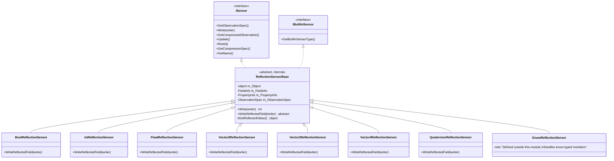
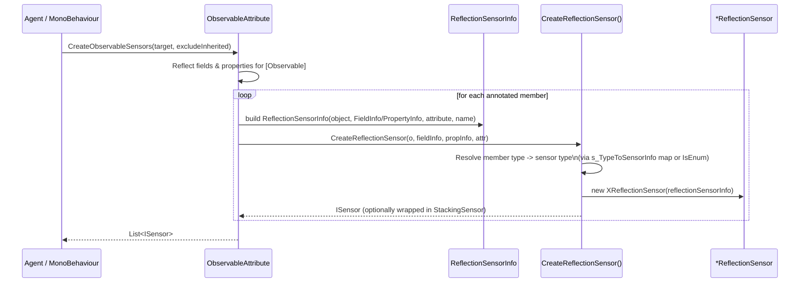

# Runtime Sensors Reflection

## Purpose

The **Runtime Sensors Reflection** module implements the concrete sensor
classes that back Unity ML-Agents' `[Observable]` attribute mechanism. Rather
than requiring developers to hand-write `ISensor` implementations for every
piece of state they want an `Agent` to observe, ML-Agents lets developers
simply annotate a field or property with `[Observable]`. At runtime, the
framework uses .NET reflection to discover these annotated members and
automatically wraps each one in a small, type-specific sensor that knows how
to read the member's value and write it into the observation buffer that is
sent to the trainer.

This module contains those type-specific sensor implementations:

| Sensor | Wrapped Type | Observation Size (floats) |
|---|---|---|
| `BoolReflectionSensor` | `System.Boolean` | 1 |
| `IntReflectionSensor` | `System.Int32` | 1 |
| `FloatReflectionSensor` | `System.Single` | 1 |
| `Vector2ReflectionSensor` | `UnityEngine.Vector2` | 2 |
| `Vector3ReflectionSensor` | `UnityEngine.Vector3` | 3 |
| `Vector4ReflectionSensor` | `UnityEngine.Vector4` | 4 |
| `QuaternionReflectionSensor` | `UnityEngine.Quaternion` | 4 |

All of these classes are `internal` — they are implementation details of the
reflection-based observation system and are never instantiated directly by
user code. They are created for the user automatically by the surrounding
reflection infrastructure (`ObservableAttribute` / `ReflectionSensors`,
documented as part of this module's context below).

## Why This Module Exists

Unity ML-Agents agents observe the world through `ISensor` implementations
(see [`runtime_sensors`](runtime_sensors.md) for the broader family of
built-in sensors such as camera, ray-cast, and grid sensors). Writing a
dedicated sensor class for every scalar or struct field an agent might need
to observe would be tedious boilerplate. The reflection sensors solve this by:

1. Letting a developer write `[Observable] public float health;` on any
   `MonoBehaviour` or plain object referenced by an `Agent`.
2. Having the framework scan the object's fields/properties for the
   `ObservableAttribute` at `Agent` initialization time.
3. Instantiating the correct `*ReflectionSensor` subclass for the member's
   declared type (`bool`, `int`, `float`, `Vector2/3/4`, `Quaternion`, or
   `enum`).
4. Registering the resulting sensor with the agent's sensor list so it
   participates in the normal observation-collection pipeline like any other
   `ISensor`.

This keeps the "observe this value" authoring experience declarative and
low-friction while still routing through the same `ISensor` / `ObservationWriter`
contract used everywhere else in the sensor system.

## Architecture Overview

### Class Hierarchy

All reflection sensors derive from a shared abstract base class,
`ReflectionSensorBase` (defined outside this module's core file set, in
`Sensors/Reflection/ReflectionSensorBase.cs`), which itself implements the
core `ISensor` / `IBuiltInSensor` interfaces used throughout the sensor
system (see [`runtime_sensors`](runtime_sensors.md)).



`ReflectionSensorBase` handles all the shared plumbing:

- Stores the reflected target object plus either a `FieldInfo` or
  `PropertyInfo` (exactly one is non-null).
- Caches the sensor's name and its `ObservationSpec` (a flat vector of
  `size` floats, where `size` is supplied by the concrete subclass'
  constructor: 1 for scalars, 2/3/4 for vector/quaternion types).
- Implements `Write(ObservationWriter)` by delegating to the abstract
  `WriteReflectedField(ObservationWriter)` method that each subclass must
  implement, then returning the number of floats written.
- Provides `GetReflectedValue()`, a helper that pulls the current value out
  of the target object via `FieldInfo.GetValue` or the property's getter,
  so subclasses don't need to duplicate that branching logic.
- Reports `BuiltInSensorType.ReflectionSensor` for analytics/telemetry
  purposes and returns `null` for `GetCompressedObservation()` since these
  are uncompressed vector observations.

Each concrete class in this module differs only in **(a)** the fixed
observation size passed to the base constructor and **(b)** the type cast and
write logic inside `WriteReflectedField`.

### Creation Flow (Reflection Discovery)

The sensors in this module are never constructed directly by user code.
They are produced by `ObservableAttribute`'s static helper methods
(`ReflectionSensors`-style factory logic), which scans a target object for
annotated members and instantiates the matching sensor type.



Key points of this flow:

- **Type resolution table**: `ObservableAttribute` keeps a static
  `Dictionary<Type, (int size, Type sensorType)>` mapping each supported
  .NET/Unity type to its observation size and the sensor class in this
  module that handles it. Enum-typed members are special-cased and routed
  to `EnumReflectionSensor` instead.
- **Unsupported types** are silently skipped when creating sensors (and
  reported as an error string when just computing total observation size via
  `GetTotalObservationSize`), so adding `[Observable]` to an unsupported
  field type does not crash — it simply produces no observation (with a
  diagnostic message surfaced to the user).
- **Optional stacking**: if `ObservableAttribute.numStackedObservations > 1`,
  the freshly created reflection sensor is wrapped in a `StackingSensor`
  (part of the general sensor infrastructure) before being returned, so
  reflected values can participate in frame-stacking just like other
  sensors.

### Observation Write Flow

At each observation-collection step, the agent's sensor pipeline calls
`Write` on every registered `ISensor`, including reflection sensors:

```mermaid
flowchart LR
    A[Agent collects observations] --> B[ISensor.Write(ObservationWriter)]
    B --> C[ReflectionSensorBase.Write]
    C --> D[WriteReflectedField - abstract, subclass-specific]
    D --> E[GetReflectedValue via FieldInfo/PropertyInfo]
    E --> F[Cast to expected type]
    F --> G[Write float(s) into ObservationWriter]
    G --> H[Return number of floats written]
```

Each subclass's `WriteReflectedField` implementation is a thin cast +
write:

- **Scalar types** (`Bool`, `Int`, `Float`) write a single float at index 0
  (booleans are converted to `1.0f`/`0.0f`).
- **Vector/Quaternion types** use `ObservationWriter`'s `Add(...)` overloads
  or explicit indexed writes (`Vector2ReflectionSensor` writes `x`/`y`
  individually; `Vector3`, `Vector4`, and `Quaternion` sensors use the
  writer's built-in `Add` helper for the corresponding Unity struct).

## Core Components

| Component | File | Responsibility |
|---|---|---|
| `BoolReflectionSensor` | `BoolReflectionSensor.cs` | Observes a `bool` field/property as `1.0f`/`0.0f`. |
| `IntReflectionSensor` | `IntReflectionSensor.cs` | Observes an `int` field/property as a single float. |
| `FloatReflectionSensor` | `FloatReflectionSensor.cs` | Observes a `float` field/property directly. |
| `Vector2ReflectionSensor` | `Vector2ReflectionSensor.cs` | Observes a `Vector2` as two floats (`x`, `y`). |
| `Vector3ReflectionSensor` | `Vector3ReflectionSensor.cs` | Observes a `Vector3` as three floats. |
| `Vector4ReflectionSensor` | `Vector4ReflectionSensor.cs` | Observes a `Vector4` as four floats. |
| `QuaternionReflectionSensor` | `QuaternionReflectionSensor.cs` | Observes a `Quaternion` as four floats. |

All seven classes share an identical structural pattern: a constructor that
forwards a fixed observation size to `ReflectionSensorBase`, and a single
override of `WriteReflectedField` that casts the reflected value to its
expected .NET/Unity type and writes it into the `ObservationWriter`.

## Relationship to the Rest of the System

- **Parent context — [`runtime_sensors`](runtime_sensors.md)**: the broader
  runtime sensors module (camera, grid, ray-perception, buffer, vector,
  physics-body sensors) that this reflection module complements. Reflection
  sensors follow the exact same `ISensor` contract as those hand-written
  sensors, so from the Agent's perspective they are indistinguishable from
  any other sensor once created.
- **Editor tooling — [`editor_component_inspectors`](editor_component_inspectors.md)**
  and [`editor_core`](editor_core.md): while these Editor-side modules
  provide custom Inspectors for the various `*SensorComponent` classes,
  reflection sensors have no dedicated `SensorComponent`/editor counterpart
  — they are attached implicitly through the `[Observable]` attribute rather
  than a component added in the Inspector.
- **Consumption by training infrastructure**: observations produced by these
  sensors flow into the same `ObservationWriter` / trajectory pipeline used
  by all other sensors, ultimately reaching the Python trainer side via the
  communicator and being consumed by the neural network input encoders
  described in
  [`trainers_torch_entities`](trainers_torch_entities.md) (specifically the
  vector observation path, e.g. `VectorInput`).

## Design Notes & Constraints

- **Internal visibility**: every class in this module is `internal`,
  reinforcing that these are implementation details invoked only through the
  reflection-driven `ObservableAttribute` API, not a public extension point.
- **Fixed, type-driven observation size**: each subclass hardcodes its
  observation size in the constructor call to `ReflectionSensorBase` (e.g.
  `base(reflectionSensorInfo, 4)` for `Quaternion`), matching the sizes
  declared in `ObservableAttribute`'s type-to-sensor-info map. This means
  adding support for a new observable type requires creating a new sensor
  class here **and** registering it in that map.
  Given that a `Quaternion` is a 4-component float value, `4` is used both
  for `Vector4ReflectionSensor` and `QuaternionReflectionSensor`, but they
  are distinct classes because their reflected .NET types differ.
- **No compression**: reflection sensors always return `null` from
  `GetCompressedObservation()` — they only ever produce uncompressed vector
  observations, which is appropriate since the wrapped values are scalars or
  small fixed-size structs, not imagery.
- **Stateless between steps**: `Update()` and `Reset()` are no-ops, since the
  sensor always reads the live value directly from the target object at
  `Write` time rather than maintaining its own internal state.
