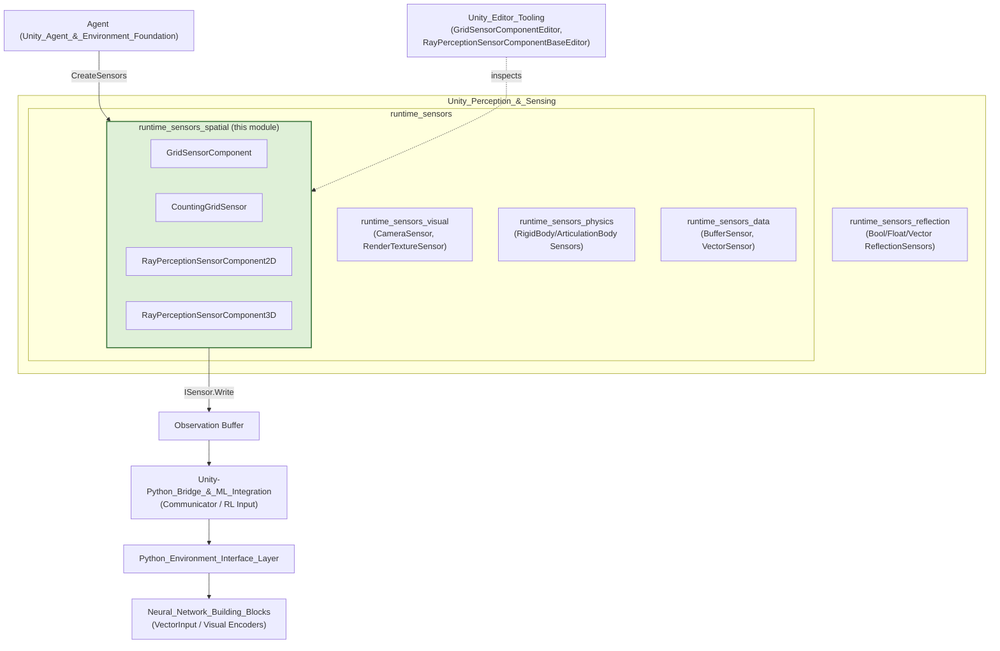
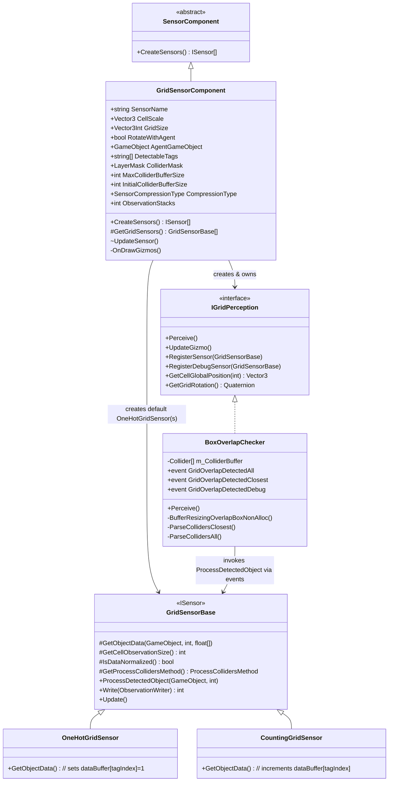
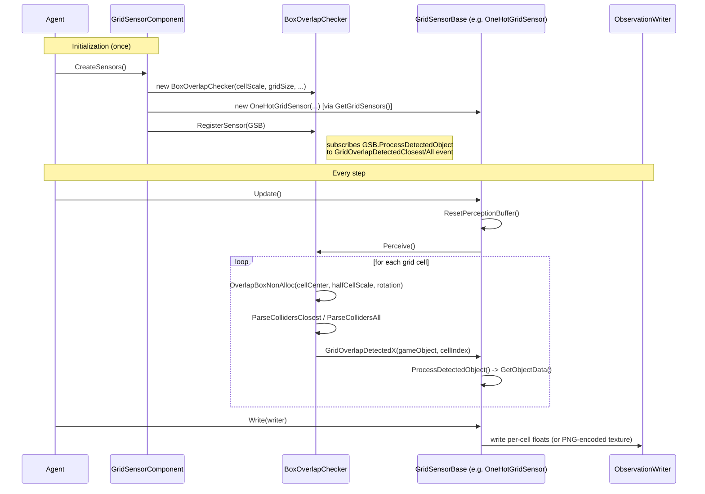
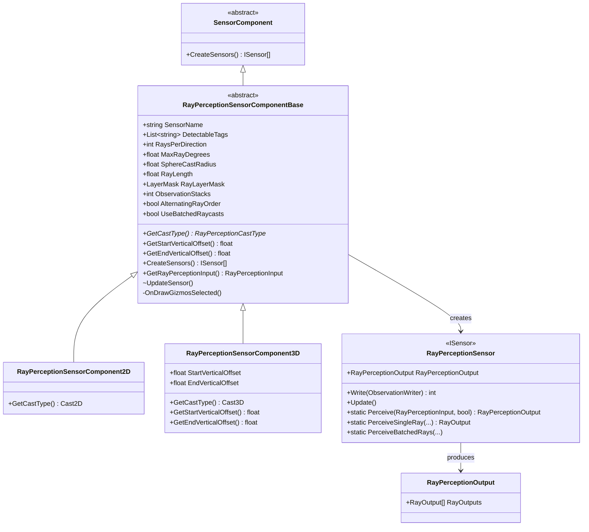
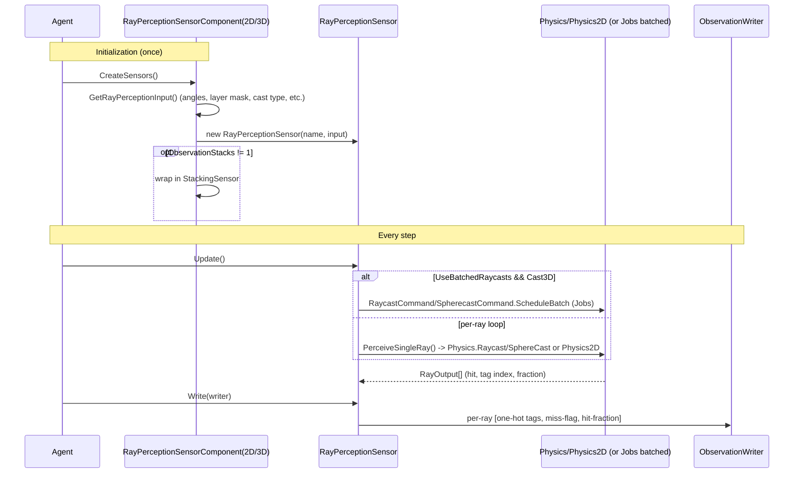
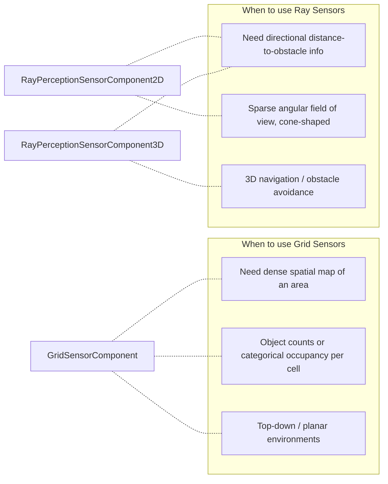
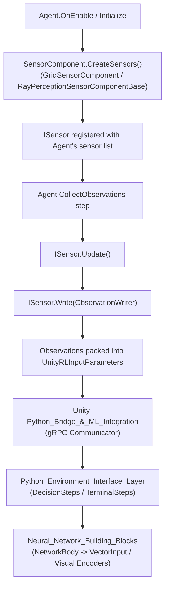

# Runtime Sensors: Spatial Perception (`runtime_sensors_spatial`)

## Introduction

The **`runtime_sensors_spatial`** module provides Unity ML-Agents components for **spatial environmental perception** — allowing an Agent to "see" the layout of objects around it without using rendered images. It implements two complementary perception strategies:

1. **Grid-based perception** (`GridSensorComponent`, `CountingGridSensor`) — divides the space around the agent into a discretized 2D grid of cells and uses Physics overlap queries to detect what objects occupy each cell (either one-hot tag encoding or object counts).
2. **Ray-based perception** (`RayPerceptionSensorComponent2D`, `RayPerceptionSensorComponent3D`) — casts a fan of rays (or spherecasts) outward from the agent and encodes what each ray hits (tag, hit/miss, distance).

Both approaches produce structured, low-dimensional observations that are cheaper to train on than raw camera images while still conveying rich spatial information about surrounding objects. This module is a sibling to [`runtime_sensors_visual`](runtime_sensors_visual.md) (camera/render-texture based perception) and [`runtime_sensors_physics`](runtime_sensors_physics.md) (physics-body state sensors), together forming the broader [`runtime_sensors`](runtime_sensors.md) sensor family under [`Unity_Perception_&_Sensing`](Unity_Perception_&_Sensing.md).

All sensors created here implement Unity ML-Agents' `ISensor` interface and are consumed by the Agent's observation pipeline; the resulting float/byte buffers are eventually transmitted to the training backend described in [`Python_Environment_Interface_Layer`](Python_Environment_Interface_Layer.md) and consumed by neural encoders in [`Neural_Network_Building_Blocks`](Neural_Network_Building_Blocks.md) (e.g., `VectorInput`, visual encoders).

---

## Module Position in the System

Editor-side inspectors for these components (`GridSensorComponentEditor`, `RayPerceptionSensorComponent2DEditor`, `RayPerceptionSensorComponent3DEditor`) live in [`Unity_Editor_Tooling`](Unity_Editor_Tooling.md) under `editor_component_inspectors`.

---

## Core Components

| Component | File | Role |
|---|---|---|
| `GridSensorComponent` | `GridSensorComponent.cs` | `SensorComponent` that configures and instantiates one or more `GridSensorBase`-derived sensors (default: `OneHotGridSensor`) plus a `BoxOverlapChecker` for physics queries. |
| `CountingGridSensor` | `CountingGridSensor.cs` | A `GridSensorBase` implementation that counts occurrences of each detectable tag per cell (as opposed to one-hot encoding). |
| `RayPerceptionSensorComponent2D` | `RayPerceptionSensorComponent2D.cs` | Concrete `RayPerceptionSensorComponentBase` configured for 2D physics casting (`Physics2D`). |
| `RayPerceptionSensorComponent3D` | `RayPerceptionSensorComponent3D.cs` | Concrete `RayPerceptionSensorComponentBase` configured for 3D physics casting (`Physics`), with additional vertical ray offset controls. |

### Supporting (base/internal) types referenced by this module

These are defined outside this module's file set but are essential to understanding its architecture:

- **`GridSensorBase`** *(abstract-ish base, in `GridSensorBase.cs`)* — implements `ISensor`; manages the perception buffer, PNG/None compression, and cell-to-observation encoding contract (`GetObjectData`, `GetCellObservationSize`, `IsDataNormalized`, `GetProcessCollidersMethod`).
- **`OneHotGridSensor`** — default `GridSensorBase` subclass used by `GridSensorComponent`; encodes the closest detected tag per cell as a one-hot vector.
- **`IGridPerception`** *(internal interface)* — abstraction for grid-cell physics queries and gizmo drawing; decouples `GridSensorBase` from the concrete overlap-detection strategy.
- **`BoxOverlapChecker`** *(internal)* — the concrete `IGridPerception` implementation using `Physics.OverlapBoxNonAlloc` per cell; raises events (`GridOverlapDetectedAll`, `GridOverlapDetectedClosest`, `GridOverlapDetectedDebug`) that registered `GridSensorBase` instances subscribe to.
- **`RayPerceptionSensorComponentBase`** *(abstract, in `RayPerceptionSensorComponentBase.cs`)* — shared configuration (ray count, cone angle, cast radius, layer mask, observation stacking) and sensor factory logic for the 2D/3D components.
- **`RayPerceptionSensor`** — the actual `ISensor` implementation that performs per-frame raycasts (or batched raycasts via Unity Jobs) and encodes hit results into a flat float observation array.
- **`RayPerceptionOutput` / `RayPerceptionCastType`** — data/output structures describing per-ray hit results and the 2D vs 3D cast mode.
- **`SensorComponent`** *(abstract base, shared across all sensor modules)* — the root Unity `MonoBehaviour` contract (`CreateSensors()`) that both `GridSensorComponent` and `RayPerceptionSensorComponentBase` implement.
- **`StackingSensor`** — generic decorator (shared infra) used by both grid and ray components to stack multiple time-steps of observations when `ObservationStacks > 1`.

---

## Architecture: Grid Sensor Subsystem

### Grid Sensor Data Flow (per simulation step)

### Grid Cell Encoding Strategies

| Sensor | `GetCellObservationSize()` | `ProcessCollidersMethod` | Encoding |
|---|---|---|---|
| `OneHotGridSensor` (default) | `DetectableTags.Length` | `ProcessClosestColliders` | `dataBuffer[tagIndex] = 1` for the closest matching object |
| `CountingGridSensor` | `DetectableTags.Length` | `ProcessAllColliders` | `dataBuffer[tagIndex] += 1` for every matching collider in the cell |

`GridSensorComponent.GetGridSensors()` is `virtual` — custom grid sensor types (e.g., `CountingGridSensor`, or user-defined `GridSensorBase` subclasses) can be plugged in by subclassing `GridSensorComponent` and overriding this factory method.

### Key Configuration Fields (`GridSensorComponent`)

- `CellScale` / `GridSize` — physical size and cell count of the grid (grid is always 2D: `GridSize.y` is forced to 1).
- `RotateWithAgent` — whether the grid rotates with the agent's transform or stays world-aligned.
- `DetectableTags` — tags recognized by the sensor; determines per-cell observation vector length.
- `ColliderMask` / `MaxColliderBufferSize` / `InitialColliderBufferSize` — tune the underlying `Physics.OverlapBoxNonAlloc` buffer sizing/performance.
- `CompressionType` — `PNG` (only valid for normalized data, e.g. one-hot) or `None` (required for unbounded data like counts).
- `ObservationStacks` — wraps produced sensors in a `StackingSensor` for temporal stacking.
- `ShowGizmos` / `DebugColors` / `GizmoYOffset` — Scene-view debug visualization support (`OnDrawGizmos` uses a dedicated debug `GridSensorBase` with `SensorCompressionType.None` to avoid triggering PNG-normalization validation).

---

## Architecture: Ray Perception Sensor Subsystem

### Ray Sensor Data Flow (per simulation step)

### Ray Configuration & Encoding

- **Ray fan generation**: `GetRayAnglesAlternating` (default, center-out ordering — for backward compatibility) or `GetRayAngles` (left-to-right, better suited for convolutional processing) based on `AlternatingRayOrder`.
- **Cast type**: `RayPerceptionSensorComponent2D` always uses `RayPerceptionCastType.Cast2D` (`Physics2D`); `RayPerceptionSensorComponent3D` always uses `Cast3D` (`Physics`), and additionally supports `StartVerticalOffset`/`EndVerticalOffset` to raise/lower ray start and end points.
- **Cast shape**: `SphereCastRadius = 0` → simple raycast; `> 0` → sphere/circle cast.
- **Batched raycasts**: `UseBatchedRaycasts` (3D only) uses Unity's `RaycastCommand`/`SpherecastCommand` + Jobs system (`NativeArray`, `JobHandle`) for performance when many rays are cast.
- **Per-ray observation layout** (`RayOutput.ToFloatArray`): `[one-hot detectable tag (n)] + [miss-flag (1)] + [hit-fraction (1)]`, repeated per ray → total size = `numRays * (numDetectableTags + 2)`.
- **Debug gizmos**: `OnDrawGizmosSelected` re-runs a cast (editor-time) or reuses cached `RayPerceptionOutput` to draw color-coded rays (`rayHitColor` → `rayMissColor` lerp by hit fraction), with fading alpha for stale (non-current-frame) observations.

---

## Comparison: Grid vs. Ray Perception

| Aspect | Grid Sensors | Ray Sensors |
|---|---|---|
| Underlying query | `Physics.OverlapBoxNonAlloc` per cell | `Physics.Raycast`/`SphereCast` (or `Physics2D`) per ray |
| Observation shape | Visual-like `[channels, height, width]` (`ObservationSpec.Visual`) | Flat vector (`ObservationSpec.Vector`) |
| Compression | PNG (if normalized) or None | None (`CompressionSpec.Default()`) |
| Extensibility point | Override `GridSensorComponent.GetGridSensors()` / subclass `GridSensorBase` | Subclass `RayPerceptionSensorComponentBase` (rare; 2D/3D cover most cases) |
| Editor support | `GridSensorComponentEditor` | `RayPerceptionSensorComponent2DEditor` / `3DEditor` |

---

## Integration with the Agent Lifecycle

For details on the agent that owns and drives these sensors, see [`Unity_Agent_&_Environment_Foundation`](Unity_Agent_&_Environment_Foundation.md). For how observations are consumed downstream during training, see [`Training_Orchestration_&_Lifecycle_Infrastructure`](Training_Orchestration_&_Lifecycle_Infrastructure.md) and [`Neural_Network_Building_Blocks`](Neural_Network_Building_Blocks.md).

---

## Related Modules

- [`runtime_sensors_visual`](runtime_sensors_visual.md) — Camera and RenderTexture-based visual observations (sibling module under `runtime_sensors`).
- [`runtime_sensors_physics`](runtime_sensors_physics.md) — RigidBody/ArticulationBody physics-state sensors.
- [`runtime_sensors_data`](runtime_sensors_data.md) — Buffer and Vector sensors for raw/structured numeric data.
- [`runtime_sensors_reflection`](runtime_sensors_reflection.md) — Reflection-based sensors that auto-generate observations from component fields/properties.
- [`Unity_Editor_Tooling`](Unity_Editor_Tooling.md) — Custom Inspector editors (`GridSensorComponentEditor`, `RayPerceptionSensorComponentBaseEditor`) for configuring these components in the Unity Editor.
- [`Unity_Agent_&_Environment_Foundation`](Unity_Agent_&_Environment_Foundation.md) — The `Agent` class that owns `SensorComponent`s and drives the per-step observation/decision cycle.
- [`Unity-Python_Bridge_&_ML_Integration`](Unity-Python_Bridge_&_ML_Integration.md) — Transmits packed observations to the Python training process.
