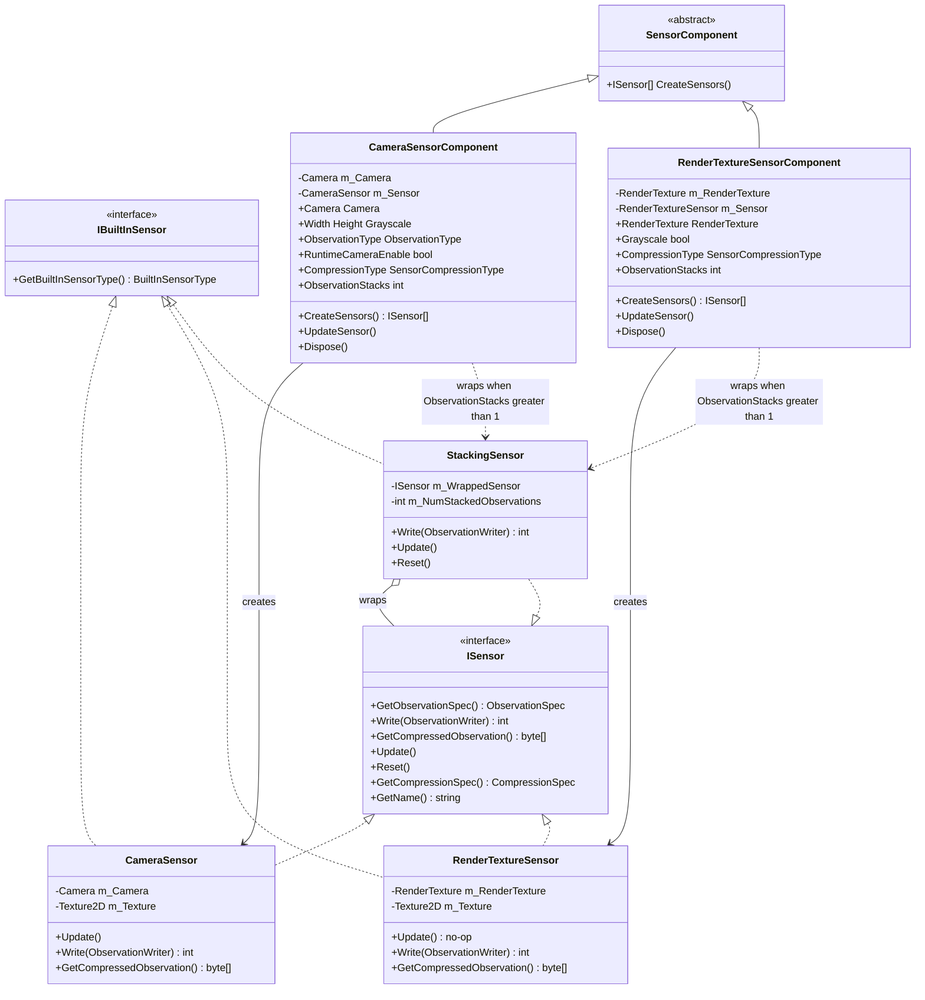
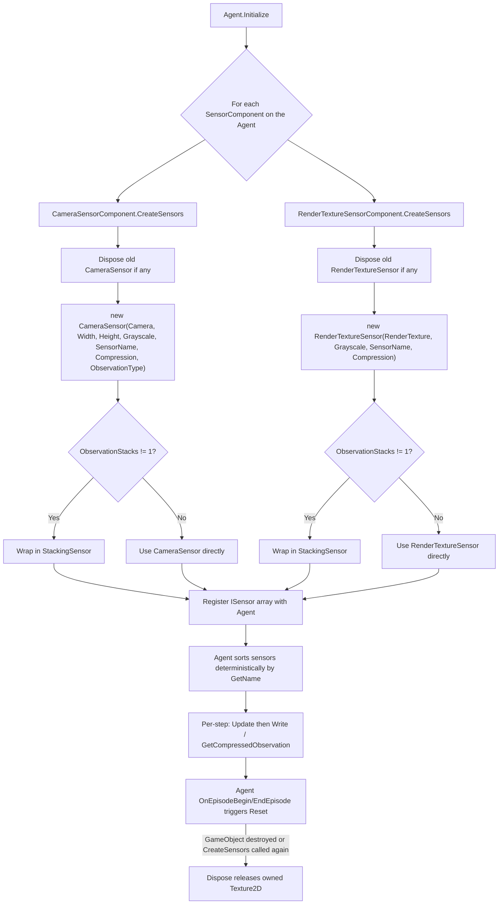
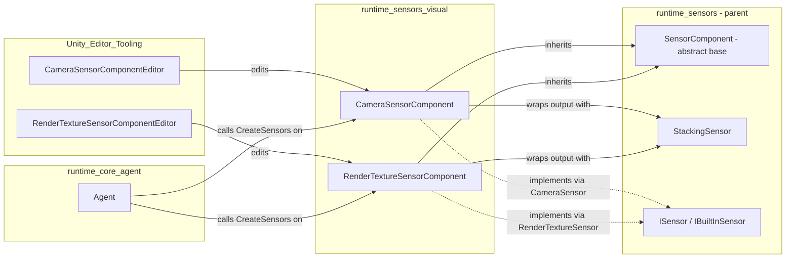

# Runtime Sensors: Visual

## Introduction

The **runtime_sensors_visual** module provides the visual observation capabilities of the ML-Agents Toolkit runtime. It contains the two `SensorComponent` implementations that let an Agent perceive its environment through pixel data:

- **`CameraSensorComponent`** — captures live frames from a Unity `Camera` and converts them into observations.
- **`RenderTextureSensorComponent`** — wraps a pre-existing `RenderTexture` (e.g. produced by a custom render pipeline, a secondary camera, or a procedurally generated texture) and exposes it as an observation source.

Both components follow the same architectural pattern used throughout the sensor system: they are lightweight `MonoBehaviour` configuration wrappers that, on demand, construct the actual `ISensor` implementation (`CameraSensor` / `RenderTextureSensor`) which performs the per-step rendering and observation-writing work. This separation keeps Unity Inspector-facing configuration decoupled from the runtime sensor logic that the Agent's policy pipeline consumes.

This module is a sibling of [runtime_sensors_spatial](runtime_sensors_spatial.md) (grid/ray perception sensors), [runtime_sensors_physics](runtime_sensors_physics.md) (rigidbody/articulation sensors), and [runtime_sensors_data](runtime_sensors_data.md) (buffer/vector sensors), all of which live under the broader [runtime_sensors](runtime_sensors.md) component family within [Unity_Perception_&_Sensing](Unity_Perception_%26_Sensing.md).

---

## Module Purpose & Core Functionality

| Component | Responsibility |
|---|---|
| `CameraSensorComponent` | Configures and instantiates a `CameraSensor` that renders a Unity `Camera`'s view into a texture each step, optionally converting to grayscale, compressing (PNG), and stacking multiple frames. |
| `RenderTextureSensorComponent` | Configures and instantiates a `RenderTextureSensor` that reads pixels directly from an existing `RenderTexture` each step, with the same grayscale/compression/stacking options. |
| `CameraSensor` (runtime sensor, not a `MonoBehaviour`) | Implements `ISensor`/`IBuiltInSensor`. Renders the target `Camera` to an internal `Texture2D` via `RenderTexture.GetTemporary`, then writes raw or PNG-compressed observation data. |
| `RenderTextureSensor` (runtime sensor) | Implements `ISensor`/`IBuiltInSensor`. Reads pixels from the supplied `RenderTexture` into an internal `Texture2D`, then writes raw or PNG-compressed observation data. |
| `StackingSensor` (shared utility, defined in `runtime_sensors`) | Optionally wraps either sensor to maintain a rolling buffer of the last *N* frames, concatenated along the channel dimension, so temporal information can be fed to the policy network. |

Both `SensorComponent` subclasses share a nearly identical configuration surface:

- `SensorName` — identifier used for deterministic sensor ordering on the Agent.
- `Width` / `Height` *(Camera only — `RenderTextureSensorComponent` infers dimensions from the assigned texture)*.
- `Grayscale` — collapse RGB to a single channel.
- `CompressionType` — `SensorCompressionType.PNG` (default) or `None`.
- `ObservationStacks` — number of frames to stack (1 = no stacking).
- `ObservationType` *(Camera only)* — marks the observation as `Default`, `Goal`, etc.

`CameraSensorComponent` additionally exposes `RuntimeCameraEnable`, which controls whether the wrapped `Camera` GameObject is actually rendering during play — a performance optimization, since the sensor renders the camera manually via `Camera.Render()` and does not need Unity's normal per-frame rendering pipeline to run.

---

## Architecture



### Design Notes

- **Component/Sensor split**: `CameraSensorComponent`/`RenderTextureSensorComponent` are `MonoBehaviour`s configured in the Unity Inspector (see [Unity_Editor_Tooling](Unity_Editor_Tooling.md) for their custom Inspector drawers `CameraSensorComponentEditor` and `RenderTextureSensorComponentEditor`). They do not themselves implement `ISensor`; instead they act as factories via `CreateSensors()`, called by the Agent during initialization (see [runtime_core_agent](runtime_core_agent.md) and the Agent lifecycle documentation).
- **Lazy instantiation & disposal**: Both components implement `IDisposable`. `CreateSensors()` first calls `Dispose()` to tear down any previously created sensor (and its owned `Texture2D`) before constructing a fresh one — this supports Agent re-initialization (e.g. environment resets that recreate sensors).
- **Runtime-mutable vs. fixed fields**: Only a subset of properties (`Camera`, `CompressionType`, `RuntimeCameraEnable` for `CameraSensorComponent`; `CompressionType` for `RenderTextureSensorComponent`) call `UpdateSensor()` to propagate changes to an already-created sensor. Fields like `Width`, `Height`, `Grayscale`, and `ObservationStacks` only take effect at sensor-creation time because they affect the fixed `ObservationSpec` shape that the training backend expects to remain stable throughout an episode/run.
- **Optional stacking**: When `ObservationStacks != 1`, the created sensor is wrapped in a `StackingSensor`, which maintains a circular buffer of raw/compressed frames and concatenates them along the channel dimension, exposing an aggregated `ObservationSpec` to downstream consumers.

---

## Component Interaction & Data Flow

```mermaid
sequenceDiagram
    participant Inspector as Unity Inspector
    participant Agent as Agent (runtime_core_agent)
    participant Component as CameraSensorComponent / RenderTextureSensorComponent
    participant Sensor as CameraSensor / RenderTextureSensor
    participant Stack as StackingSensor (optional)
    participant Writer as ObservationWriter
    participant Policy as Policy / Communicator

    Inspector->>Component: Configure fields (Camera/RenderTexture, size, compression, stacks)
    Agent->>Component: CreateSensors()
    Component->>Component: Dispose() previous sensor
    Component->>Sensor: new CameraSensor(...) or new RenderTextureSensor(...)
    alt ObservationStacks greater than 1
        Component->>Stack: new StackingSensor(sensor, n)
        Component-->>Agent: return [StackingSensor]
    else no stacking
        Component-->>Agent: return [sensor]
    end

    loop Every Agent step
        Agent->>Sensor: Update()
        Note over Sensor: CameraSensor renders Camera to Texture2D;<br/>RenderTextureSensor is a no-op here
        Agent->>Sensor: GetCompressedObservation() or Write(writer)
        Sensor->>Sensor: ObservationToTexture(...) (RenderTextureSensor reads texture here)
        Sensor->>Writer: WriteTexture(texture, grayscale)
        Sensor-->>Agent: byte[] or int elements written
    end

    Agent->>Policy: Aggregate observations across all sensors
    Policy->>Policy: Forward to inference/training (see runtime_inference, Training_Orchestration_&_Lifecycle_Infrastructure)
```

Key data-flow distinctions between the two sensors:

- **`CameraSensor.Update()`** actively renders the wrapped `Camera` into the internal `Texture2D` using a temporary `RenderTexture` (`RenderTexture.GetTemporary`), restoring the camera's original rect/target afterward. This happens once per Agent step.
- **`RenderTextureSensor.Update()`** is a no-op; instead, texture readback (`ObservationToTexture`) happens lazily inside `Write()` / `GetCompressedObservation()`, since the `RenderTexture` is assumed to already be populated by some other process (e.g., a dedicated camera, a custom shader, or an external render pass) independent of the sensor's own render loop.

---

## Sensor Creation & Lifecycle



Both `Dispose()` implementations explicitly destroy the internally owned `Texture2D` (via `Utilities.DestroyTexture`) to avoid leaking GPU/CPU memory across repeated sensor recreation (e.g., domain reloads in the Editor, or environment resets in training).

---

## Configuration & Editor Integration

The Inspector experience for these components is implemented in the sibling [Unity_Editor_Tooling](Unity_Editor_Tooling.md) module:

- `CameraSensorComponentEditor` — custom editor for `CameraSensorComponent`.
- `RenderTextureSensorComponentEditor` — custom editor for `RenderTextureSensorComponent`.

These editors typically lock certain fields (e.g., `Width`/`Height`, `Grayscale`, `ObservationStacks`) from being changed at runtime in the Inspector, reflecting the constraint that the `ObservationSpec` must remain fixed once a sensor is created and registered with a trainer.

---

## Dependencies & Relationships



**Related modules:**

- [runtime_sensors](runtime_sensors.md) — parent module; defines the shared `SensorComponent` base class and `StackingSensor` utility used here.
- [runtime_sensors_spatial](runtime_sensors_spatial.md) — sibling module for grid and ray-cast based perception sensors.
- [runtime_sensors_physics](runtime_sensors_physics.md) — sibling module for physics-body sensors (RigidBody/ArticulationBody).
- [runtime_sensors_data](runtime_sensors_data.md) — sibling module for non-visual structured data sensors (Buffer/Vector).
- [runtime_sensors_reflection](runtime_sensors_reflection.md) — reflection-based sensors that auto-generate observations from Agent fields/properties.
- [Unity_Editor_Tooling](Unity_Editor_Tooling.md) — custom Inspector editors for these sensor components.
- [runtime_core_agent](runtime_core_agent.md) — the Agent that owns and drives `SensorComponent`s through their lifecycle.
- [Neural_Network_Building_Blocks](Neural_Network_Building_Blocks.md) — see the `VisualEncoder` family (`NatureVisualEncoder`, `SimpleVisualEncoder`, `ResNetVisualEncoder`, etc.) which consume the pixel observations produced by these sensors on the Python training side.
- [Python_Environment_Interface_Layer](Python_Environment_Interface_Layer.md) — receives the serialized/compressed observation bytes via the gRPC communicator for use in training and inference.

---

## Usage Guidance

1. **Choosing between the two components**:
   - Use `CameraSensorComponent` when you want the sensor to control and render a specific `Camera` directly (the most common case for first-person/third-person visual observations).
   - Use `RenderTextureSensorComponent` when the visual data is produced by an external process — e.g., a shared `RenderTexture` fed by a custom render pipeline, a minimap camera, or a procedurally generated texture — and you simply want to sample its current contents each step.

2. **Performance considerations**:
   - Set `RuntimeCameraEnable = false` (default) on `CameraSensorComponent` when the camera is only used for observations, since the sensor renders it manually via `Camera.Render()`; leaving the camera's normal rendering enabled would waste GPU cycles rendering to the screen/backbuffer unnecessarily.
   - Prefer `SensorCompressionType.PNG` for large images to reduce bandwidth between Unity and the Python trainer; use `None` only for small resolutions or debugging.
   - Use `ObservationStacks` sparingly — each additional stack multiplies memory usage and the number of channels fed into the visual encoder network.

3. **Disposal**: Because both components implement `IDisposable` and manage native `Texture2D` resources, avoid manually holding references to the internal sensor; let the Agent's lifecycle (`CreateSensors`/`Dispose`) manage sensor recreation.
