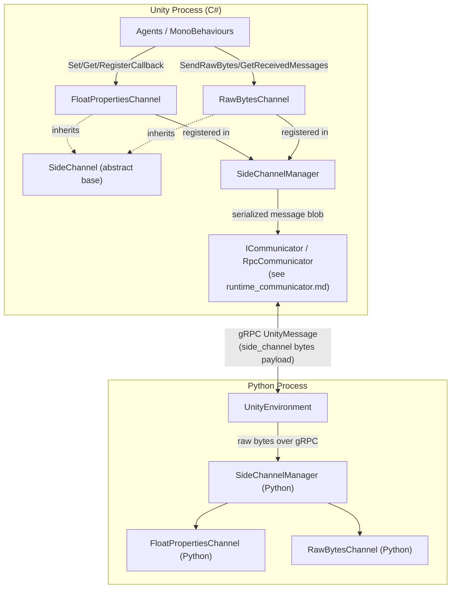
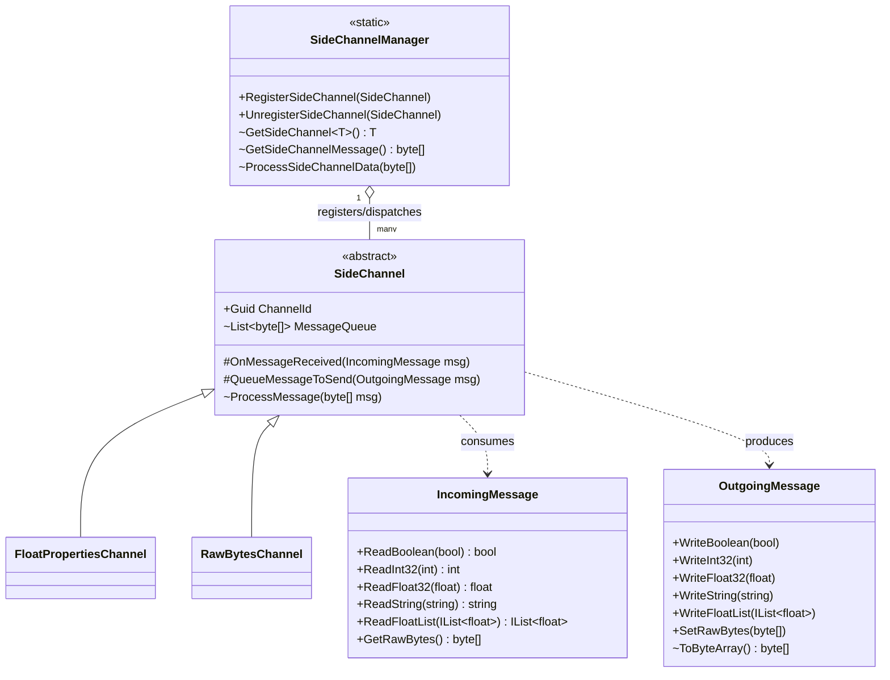
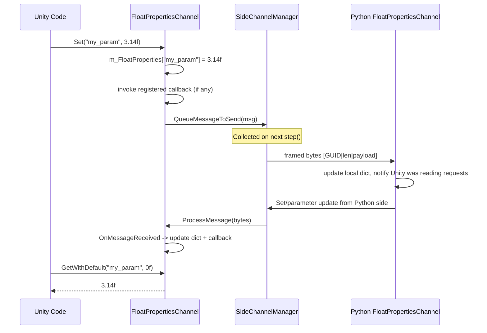
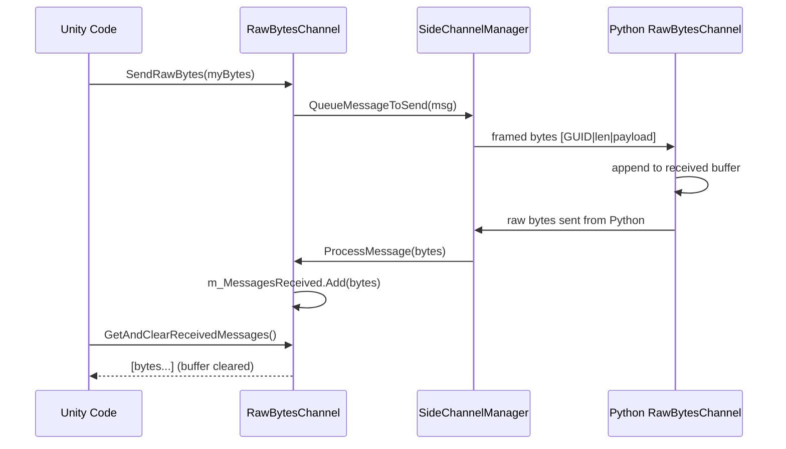

# Runtime Side Channels (Unity)

## 1. Purpose

The **Runtime Side Channels** module provides two ready-to-use, strongly-typed
**side channel** implementations on the Unity (C#) side of the ML-Agents
Toolkit:

| Component | Purpose |
|---|---|
| [`FloatPropertiesChannel`](#floatpropertieschannel) | Exchanges a keyed dictionary of `string -> float` values between Unity and Python (e.g. environment parameters, curriculum values, custom metrics). |
| [`RawBytesChannel`](#rawbyteschannel) | Exchanges arbitrary, unstructured byte arrays between Unity and Python, letting callers define their own wire format on top. |

Side channels are a general-purpose, **out-of-band communication mechanism**
that runs alongside the main observation/action RL loop. They let Unity and
Python exchange auxiliary data (configuration, statistics, custom messages)
every simulation step **without** having to route it through the
observation/action tensors that make up the core RL protocol.

This module builds directly on top of the abstract side-channel
infrastructure (`SideChannel`, `SideChannelManager`, `IncomingMessage`,
`OutgoingMessage`) defined in the same C# assembly, and mirrors equivalent
implementations on the Python side documented in
[Python_Environment_Interface_Layer's side-channel sub-module](envs_sidechannel.md).

## 2. Where this module fits



* On the Unity side, `SideChannelManager` collects outgoing messages from all
  registered channels into a single byte blob each step, and dispatches
  incoming bytes back to the correct channel (see [`SideChannel.cs`, `SideChannelManager.cs`]).
* That blob travels over the same gRPC transport used for the main RL protocol,
  as part of the `UnityMessage`/`UnityRLInput`/`UnityRLOutput` exchange handled
  by the communicator layer — see
  [runtime_communicator.md](runtime_communicator.md).
* On the Python side, the mirror implementation lives in
  `mlagents_envs.side_channel`, documented in
  [envs_sidechannel.md](envs_sidechannel.md). Each channel type is matched
  between Unity and Python purely by a shared `Guid`/UUID **channel ID** —
  there is no compile-time coupling between the two languages.
* Training-specific side channels built on top of this same infrastructure
  (e.g. `EngineConfigurationChannel`, `EnvironmentParametersChannel`,
  `StatsSideChannel`, `TrainingAnalyticsSideChannel`) are documented in
  [envs_sidechannel.md](envs_sidechannel.md) and
  [trainers_core.md](trainers_core.md) respectively.

## 3. Core Side-Channel Infrastructure (context)

Both components documented here derive from the abstract `SideChannel` class
and rely on the `IncomingMessage` / `OutgoingMessage` helper classes for
binary (de)serialization. These are shared, foundational types used by every
side channel in the codebase (Unity built-ins, Python built-ins, and any
custom user channels):



Key mechanics provided by the base infrastructure that both channels rely on:

- **Channel identity**: Each `SideChannel` has a `Guid ChannelId`. The
  `SideChannelManager` uses this ID as a dictionary key to route incoming
  bytes to the right channel and to prefix outgoing messages so Python can
  demultiplex them.
- **Message framing**: `SideChannelManager.GetSideChannelMessage` writes, for
  every queued message, `[16-byte channel GUID][4-byte length][payload
  bytes]`. `ProcessSideChannelData` reverses this framing on receipt.
- **Resilience**: `SideChannel.ProcessMessage` wraps `OnMessageReceived` in a
  try/catch so a malformed message in one channel cannot crash the whole
  simulation; messages for channels that aren't registered yet are cached and
  replayed once the channel registers.
- **Binary encoding**: `OutgoingMessage`/`IncomingMessage` wrap a
  `BinaryWriter`/`BinaryReader` over a `MemoryStream`, providing typed
  read/write helpers (`bool`, `int32`, `float32`, `string`, `float` lists, and
  raw bytes) with safe defaulting when the stream is exhausted.

## 4. Components

### FloatPropertiesChannel

`FloatPropertiesChannel` implements a shared, replicated key/value store of
floats between Unity and Python. It is commonly used for simple environment
configuration values, custom curriculum parameters, or ad-hoc telemetry that
doesn't warrant a dedicated protocol.

**Responsibilities:**
- Maintain a local `Dictionary<string, float>` (`m_FloatProperties`) mirroring
  the last known value for each key.
- `Set(key, value)`: updates the local dictionary, serializes `(key, value)`
  into an `OutgoingMessage`, and queues it for the next simulation step. It
  also immediately invokes any callback registered for that key.
- `GetWithDefault(key, defaultValue)`: reads the current local value, or
  returns a caller-supplied default if the key has never been set.
- `RegisterCallback(key, action)`: lets consumers subscribe an
  `Action<float>` that fires whenever the property is created or updated —
  whether the update originated locally (via `Set`) or remotely (via a
  message from Python).
- `Keys()`: returns all currently known property keys.
- `OnMessageReceived(msg)`: parses an incoming `(string key, float value)`
  pair, updates the dictionary, and fires the registered callback (if any).

**Identity:** Uses a fixed default channel GUID
(`60ccf7d0-4f7e-11ea-b238-784f4387d1f7`) unless a custom `Guid` is supplied in
the constructor, which lets it seamlessly match its Python counterpart
`mlagents_envs.side_channel.float_properties_channel.FloatPropertiesChannel`
without extra configuration (see [envs_sidechannel.md](envs_sidechannel.md)).



### RawBytesChannel

`RawBytesChannel` is a minimal, protocol-agnostic channel for exchanging raw
byte payloads. Unlike `FloatPropertiesChannel`, it imposes no structure on the
data — callers are responsible for encoding/decoding their own message
format on both the Unity and Python sides.

**Responsibilities:**
- `SendRawBytes(data)`: wraps a `byte[]` in an `OutgoingMessage` via
  `SetRawBytes` and queues it for transmission.
- `OnMessageReceived(msg)`: appends the raw bytes of every incoming message to
  an internal `List<byte[]>` (`m_MessagesReceived`).
- `GetAndClearReceivedMessages()`: returns all messages received since the
  last call and clears the internal buffer (consuming read).
- `GetReceivedMessages()`: same as above, but **does not** clear the buffer
  (peeking read), letting multiple consumers observe the same messages.

**Identity:** Unlike `FloatPropertiesChannel`, `RawBytesChannel` has **no
default GUID** — the constructor requires an explicit `Guid channelId`. This
is because raw-bytes channels are typically used for custom,
application-specific protocols where the developer defines a unique channel
ID shared between their Unity and Python code.



## 5. Registration & Lifecycle

Neither `FloatPropertiesChannel` nor `RawBytesChannel` automatically registers
itself. To become active, an instance must be explicitly registered with the
static `SideChannelManager`:

```csharp
var floatChannel = new FloatPropertiesChannel();
SideChannelManager.RegisterSideChannel(floatChannel);

// ... use floatChannel.Set / GetWithDefault / RegisterCallback ...

SideChannelManager.UnregisterSideChannel(floatChannel);
```

`SideChannelManager` (part of the same `Unity.MLAgents.SideChannels`
namespace) is the piece that:
1. Ensures channel-id uniqueness across all registered channels.
2. Batches every registered channel's queued outgoing messages into a single
   byte array once per step (`GetSideChannelMessage`), which the communicator
   then attaches to the outgoing `UnityMessage` (see
   [runtime_communicator.md](runtime_communicator.md)).
3. Demultiplexes incoming byte blobs from Python
   (`ProcessSideChannelData`) back to the channel matching each message's
   GUID, caching messages for channels not yet registered.

## 6. Wire Format Summary

Both channels ultimately produce/consume byte payloads framed identically by
`SideChannelManager`:

```
[ 16 bytes: Channel GUID ][ 4 bytes: payload length (int32) ][ N bytes: payload ]
```

The payload itself is channel-specific:

| Channel | Payload layout |
|---|---|
| `FloatPropertiesChannel` | `[4-byte key length][key ASCII bytes][4-byte float32 value]` |
| `RawBytesChannel` | Opaque — exactly the bytes passed to `SendRawBytes` / received via `GetRawBytes` |

## 7. Extending: Writing a Custom Side Channel

Both classes in this module serve as reference implementations for building
custom side channels:

1. Subclass `SideChannel`.
2. Choose a `ChannelId` — either fixed (like `FloatPropertiesChannel`'s
   default) or externally supplied (like `RawBytesChannel`'s constructor
   argument) — and make sure the same GUID is used by the matching Python
   `SideChannel` subclass (see [envs_sidechannel.md](envs_sidechannel.md)).
3. Implement `OnMessageReceived(IncomingMessage msg)` to parse incoming data
   using the typed `Read*` helpers.
4. Expose public methods that build an `OutgoingMessage`, write data with the
   typed `Write*` helpers, and call `QueueMessageToSend(msg)`.
5. Register/unregister the instance with `SideChannelManager` at the
   appropriate point in your application lifecycle.

## 8. Related Documentation

- [runtime_communicator.md](runtime_communicator.md) — the gRPC communicator
  layer that transports side-channel byte blobs between Unity and Python
  alongside the main RL observation/action protocol.
- [envs_sidechannel.md](envs_sidechannel.md) — the Python-side mirror
  implementations (`SideChannel`, `SideChannelManager`, `IncomingMessage`,
  `OutgoingMessage`, `FloatPropertiesChannel`, `RawBytesChannel`) plus
  training-oriented channels (`EngineConfigurationChannel`,
  `EnvironmentParametersChannel`, `StatsSideChannel`,
  `DefaultTrainingAnalyticsSideChannel`).
- [envs_core.md](envs_core.md) — `UnityEnvironment`, which owns the Python
  `SideChannelManager` instance and drives the per-step exchange of
  side-channel data.
- [trainers_core.md](trainers_core.md) — `TrainingAnalyticsSideChannel`, a
  higher-level side channel built on this same infrastructure, used to report
  training configuration/analytics from the trainer to Unity.
