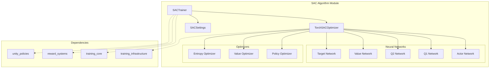
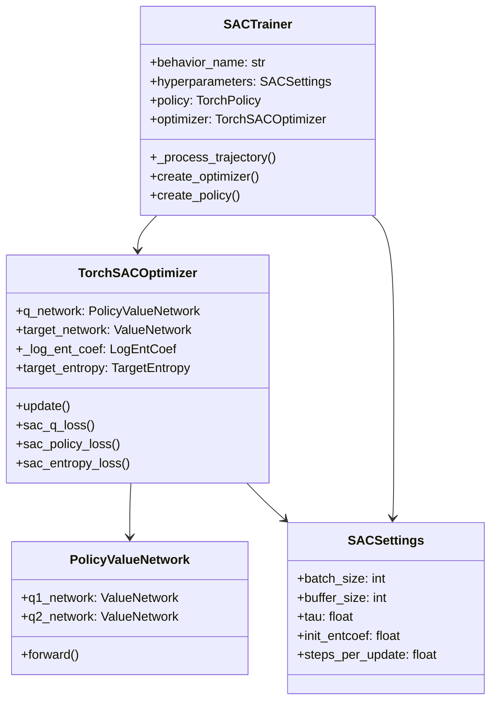
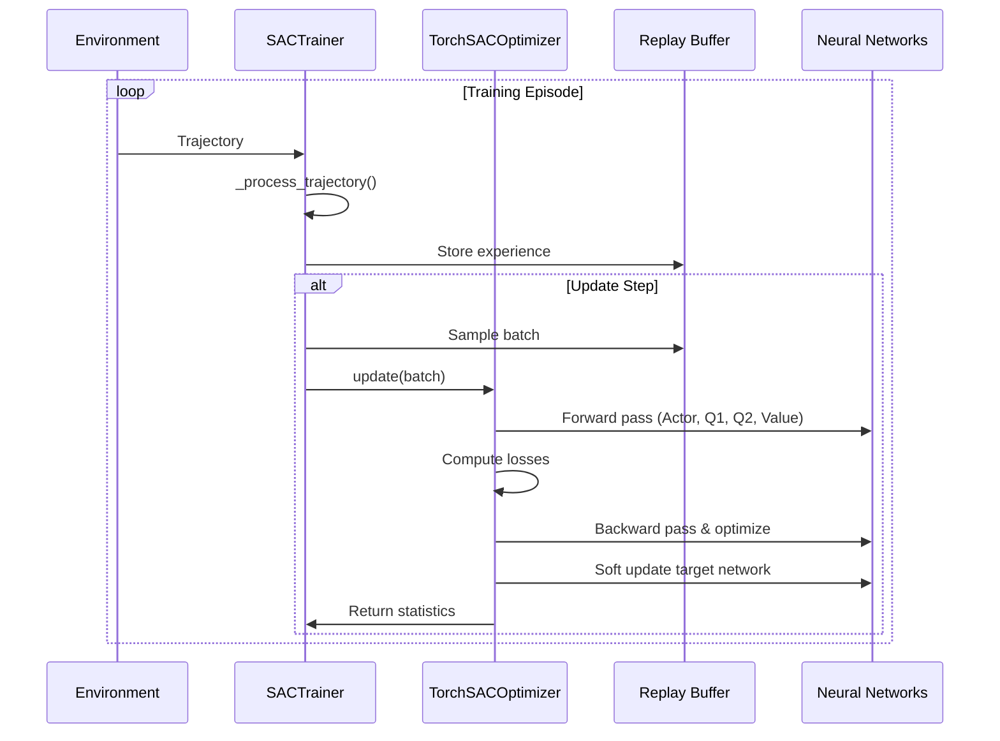
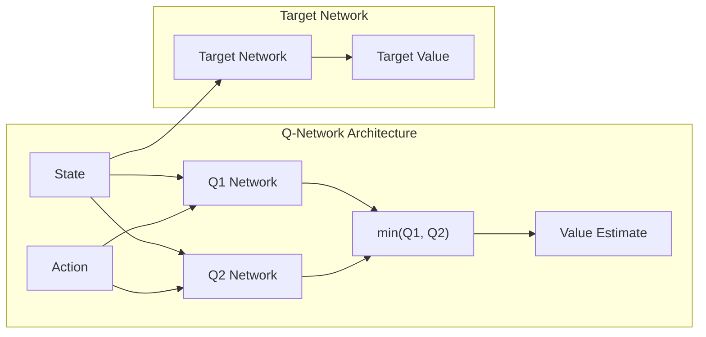
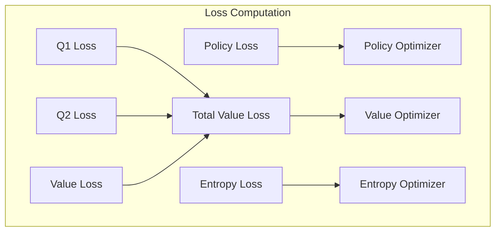

# SAC Algorithm Module

## Overview

The SAC (Soft Actor-Critic) algorithm module implements a state-of-the-art off-policy reinforcement learning algorithm that combines the benefits of actor-critic methods with maximum entropy reinforcement learning. SAC is particularly effective for continuous control tasks and provides stable training through its dual Q-network architecture and automatic entropy tuning.

This module is part of the ML-Agents training algorithms suite and provides a complete implementation of SAC as described in the original paper "Soft Actor-Critic: Off-Policy Maximum Entropy Deep Reinforcement Learning with a Stochastic Actor" (https://arxiv.org/abs/1801.01290).

## Core Components

### SACTrainer
- **Purpose**: Main trainer class that orchestrates the SAC training process
- **Key Features**:
  - Off-policy learning with experience replay
  - Support for both discrete and continuous action spaces
  - Recurrent network support
  - Automatic entropy coefficient tuning
  - Multi-reward signal support

### SACSettings
- **Purpose**: Configuration class containing all SAC-specific hyperparameters
- **Key Parameters**:
  - `batch_size`: Training batch size (default: 128)
  - `buffer_size`: Experience replay buffer size (default: 50,000)
  - `tau`: Soft update coefficient for target networks (default: 0.005)
  - `init_entcoef`: Initial entropy coefficient (default: 1.0)
  - `steps_per_update`: Training steps per environment step (default: 1)

## Architecture Overview



## Component Relationships



## Training Process Flow



## SAC Algorithm Components

### Dual Q-Network Architecture



### Loss Functions

The SAC algorithm optimizes three main loss functions:

1. **Q-Function Loss**: Minimizes temporal difference error for both Q-networks
2. **Policy Loss**: Maximizes expected Q-value while maintaining entropy
3. **Entropy Loss**: Automatically tunes entropy coefficient



## Key Features

### Maximum Entropy Framework
- Balances exploration and exploitation through entropy regularization
- Automatic entropy coefficient tuning for optimal performance
- Supports both discrete and continuous action spaces

### Off-Policy Learning
- Utilizes experience replay for sample efficiency
- Stable learning through target network soft updates
- Configurable replay buffer size and update frequency

### Multi-Reward Signal Support
- Compatible with various reward signals (curiosity, GAIL, etc.)
- Separate Q-networks for each reward signal
- Configurable gamma values per reward signal

## Integration Points

### With Training Core
- Inherits from `OffPolicyTrainer` in [training_core](training_core.md)
- Utilizes `TorchPolicy` for neural network management
- Integrates with environment management systems

### With Unity Runtime
- Compatible with Unity ML-Agents environments
- Supports various observation types through [unity_sensors](unity_sensors.md)
- Works with different actuator types from [unity_actuators](unity_actuators.md)

### With Reward Systems
- Integrates with [reward_systems](reward_systems.md) for multi-objective learning
- Supports intrinsic motivation through curiosity and other reward providers
- Handles reward signal normalization and scaling

## Configuration

### Hyperparameter Settings
```python
sac_settings = SACSettings(
    batch_size=128,           # Training batch size
    buffer_size=50000,        # Replay buffer capacity
    buffer_init_steps=0,      # Initial buffer fill steps
    tau=0.005,               # Target network soft update rate
    steps_per_update=1,       # Training steps per environment step
    init_entcoef=1.0,        # Initial entropy coefficient
    save_replay_buffer=False  # Whether to save replay buffer
)
```

### Network Architecture
- Utilizes `SimpleActor` with conditional sigma and tanh squashing
- Dual Q-networks for stable value estimation
- Separate target network for stable learning
- Support for recurrent networks (LSTM)

## Performance Characteristics

### Advantages
- **Sample Efficiency**: Off-policy learning with experience replay
- **Stability**: Dual Q-networks and soft target updates
- **Exploration**: Automatic entropy tuning promotes exploration
- **Versatility**: Supports both discrete and continuous actions

### Use Cases
- Continuous control tasks (robotics, autonomous vehicles)
- Environments requiring balanced exploration-exploitation
- Multi-agent scenarios with coordination requirements
- Tasks with sparse or delayed rewards

## Monitoring and Debugging

### Key Metrics
- Policy Loss: Measures policy improvement
- Q1/Q2 Loss: Value function learning progress
- Value Loss: State value estimation accuracy
- Entropy Coefficients: Automatic tuning progress
- Learning Rate: Adaptive learning rate scheduling

### Common Issues
- **Entropy Collapse**: Monitor entropy coefficients
- **Q-Function Overestimation**: Dual Q-networks mitigate this
- **Sample Efficiency**: Adjust buffer size and update frequency
- **Convergence**: Monitor loss trends and value estimates

## Dependencies

This module depends on several other components:
- [training_core](training_core.md): Base trainer classes and abstractions
- [training_infrastructure](training_infrastructure.md): Network settings and optimization utilities
- [reward_systems](reward_systems.md): Multi-reward signal support
- [unity_policies](unity_policies.md): Policy interfaces and implementations

## Future Enhancements

- Support for distributional Q-learning
- Integration with advanced exploration strategies
- Multi-task learning capabilities
- Improved memory efficiency for large replay buffers