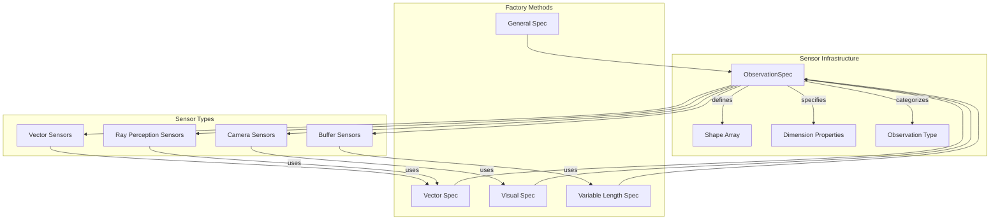
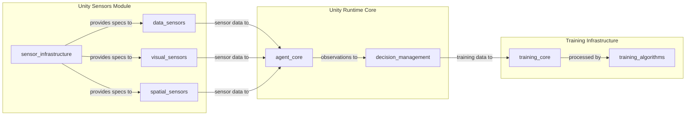
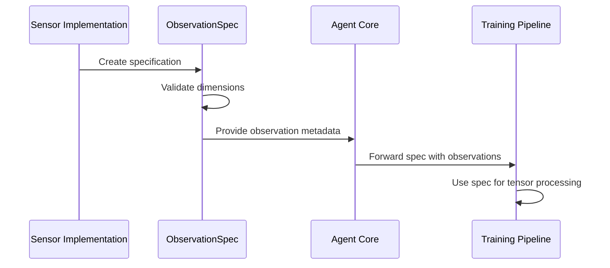
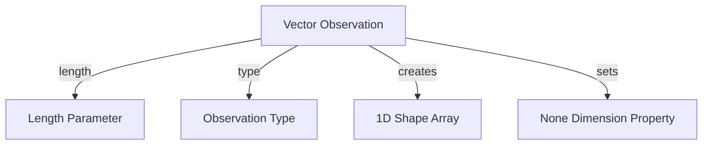
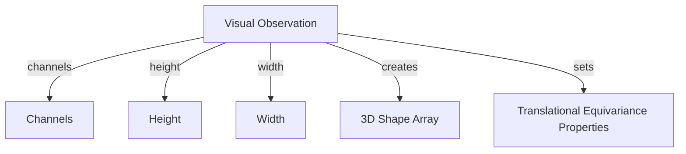
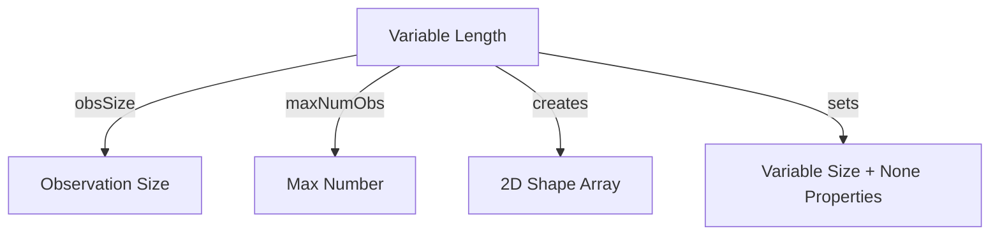
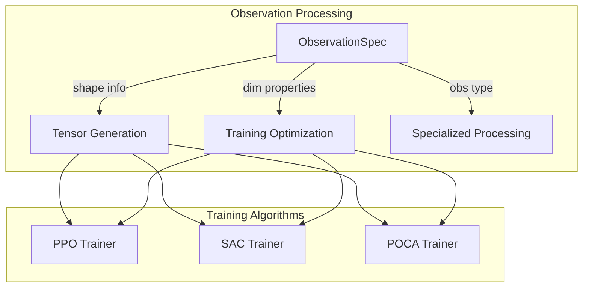

# Sensor Infrastructure Module

The sensor_infrastructure module provides the foundational specification system for all sensor observations in Unity ML-Agents. It defines the core data structures and metadata that describe how observations are structured, processed, and interpreted by the machine learning pipeline.

## Overview

This module serves as the cornerstone of the sensor system, providing standardized specifications that enable different sensor types to communicate their observation characteristics to the training infrastructure. The `ObservationSpec` class acts as a contract between sensors and the ML pipeline, ensuring consistent data interpretation across all sensor implementations.

## Core Components

### ObservationSpec

The `ObservationSpec` struct is the primary component that encapsulates all metadata about sensor observations, including dimensional properties, data types, and training usage patterns.

**Key Responsibilities:**
- Define observation tensor shapes and dimensions
- Specify dimensional properties for training optimization
- Categorize observation types for specialized handling
- Provide factory methods for common observation patterns

**Core Properties:**
- **Shape**: Defines the dimensional structure of observations
- **DimensionProperties**: Specifies properties of each dimension for training optimization
- **ObservationType**: Categorizes the observation for specialized processing
- **Rank**: Provides the number of dimensions in the observation tensor

## Architecture

## Component Relationships

## Data Flow

## Observation Specification Types

### Vector Observations

**Usage Pattern:**
- Numerical data arrays (velocities, positions, health values)
- Feature vectors from processed game state
- Scalar measurements and statistics

### Visual Observations

**Usage Pattern:**
- Camera sensor outputs
- Rendered game views
- Processed image data

### Variable Length Observations

**Usage Pattern:**
- Dynamic lists of entities
- Varying number of detected objects
- Flexible buffer-based observations

## Integration Points

### With Data Sensors
The sensor_infrastructure module provides specifications that [data_sensors](data_sensors.md) use to define their observation characteristics:
- Vector sensors use `Vector()` factory method
- Buffer sensors use `VariableLength()` factory method

### With Visual Sensors
[Visual_sensors](visual_sensors.md) rely on the infrastructure for camera-based observations:
- Camera sensors use `Visual()` factory method for RGB/grayscale images
- Supports translational equivariance properties for CNN optimization

### With Spatial Sensors
[Spatial_sensors](spatial_sensors.md) utilize vector specifications for ray-based perception:
- Ray perception sensors use `Vector()` for hit distance arrays
- 2D and 3D variants share the same specification pattern

### With Agent Core
The specifications flow to [agent_core](agent_core.md) where they inform:
- Observation collection and validation
- Tensor shape verification
- Training data preparation

## Training Pipeline Integration

## Dimension Properties

The module supports various dimension properties that optimize training:

- **None**: Standard dimensions without special properties
- **TranslationalEquivariance**: For spatial dimensions in visual data
- **VariableSize**: For dynamic dimensions in buffer observations

These properties inform the training algorithms about how to process different types of observations efficiently.

## Error Handling and Validation

The `ObservationSpec` constructor includes validation to ensure:
- Shape and dimension properties arrays have matching lengths
- Consistent specification across all sensor implementations
- Early detection of configuration errors

## Performance Considerations

- Uses `InplaceArray<T>` for memory-efficient storage
- Struct-based design minimizes allocation overhead
- Factory methods provide optimized common configurations
- Validation occurs at construction time, not during runtime observation processing

## Future Extensibility

The modular design allows for:
- New observation types through additional factory methods
- Extended dimension properties for specialized training algorithms
- Custom observation specifications for domain-specific sensors
- Integration with new ML frameworks and training approaches

This infrastructure module forms the foundation that enables the entire Unity ML-Agents sensor ecosystem to operate cohesively while maintaining flexibility for diverse observation types and training scenarios.