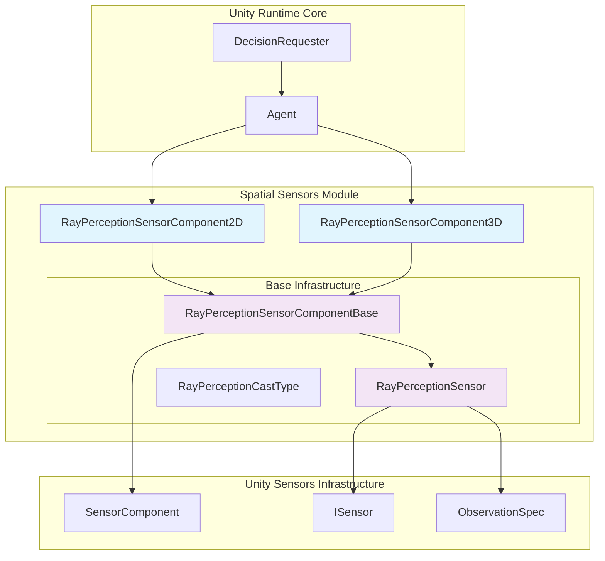
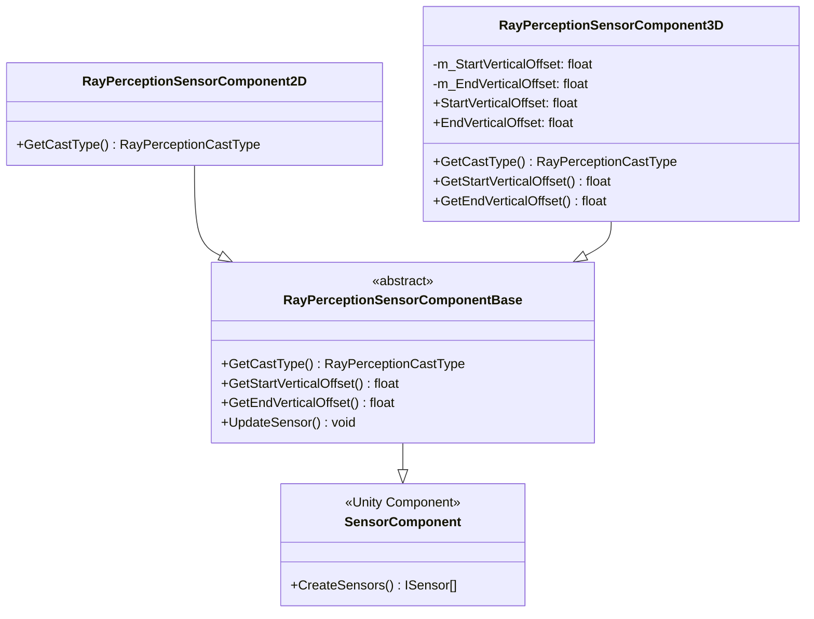
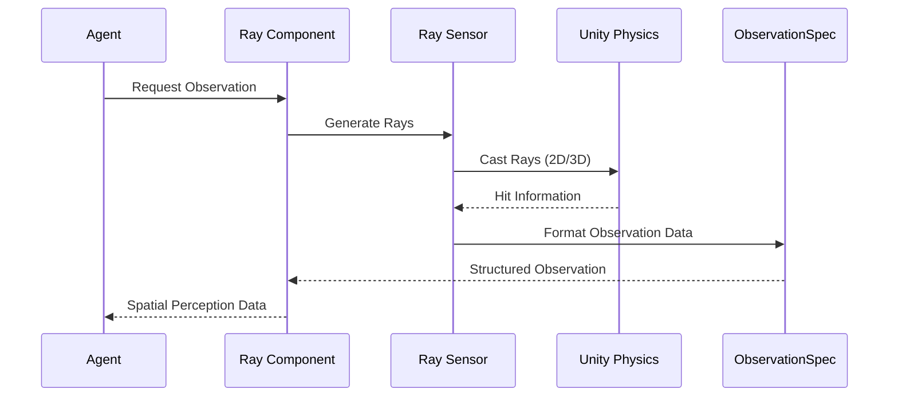

# Spatial Sensors Module

The spatial_sensors module provides specialized sensor components for spatial perception in Unity ML-Agents environments. This module focuses on ray-based perception systems that enable agents to understand their spatial environment through ray casting in both 2D and 3D contexts.

## Overview

The spatial_sensors module is part of the broader [unity_sensors](unity_sensors.md) system and provides ray perception capabilities that allow ML agents to perceive their environment through directional sensing. These sensors cast rays in specified directions to detect objects, distances, and environmental features, making them essential for navigation, obstacle avoidance, and spatial reasoning tasks.

## Architecture



## Core Components

### RayPerceptionSensorComponent2D

A Unity component that provides 2D ray perception capabilities for ML agents.

**Key Features:**
- Specialized for 2D environments and physics
- Inherits from `RayPerceptionSensorComponentBase`
- Uses 2D physics casting for ray detection
- Integrated with Unity's component menu system

**Functionality:**
- Returns `RayPerceptionCastType.Cast2D` to specify 2D ray casting
- Automatically handles 2D physics interactions
- Provides spatial awareness in 2D game environments

### RayPerceptionSensorComponent3D

A Unity component that provides 3D ray perception capabilities with additional vertical offset controls.

**Key Features:**
- Specialized for 3D environments and physics
- Enhanced with vertical offset parameters for precise ray positioning
- Supports complex 3D spatial reasoning
- Configurable ray start and end positions

**Configuration Parameters:**
- `StartVerticalOffset`: Vertical offset for ray starting position (-10 to 10 range)
- `EndVerticalOffset`: Vertical offset for ray ending position (-10 to 10 range)
- Both parameters trigger sensor updates when modified

**Functionality:**
- Returns `RayPerceptionCastType.Cast3D` for 3D ray casting
- Provides vertical offset control for precise ray positioning
- Enables complex 3D environmental perception

## Component Relationships



## Data Flow



## Integration with ML-Agents System

### Sensor Infrastructure Integration

The spatial sensors integrate with the broader sensor infrastructure:

- **ObservationSpec**: Defines the structure and properties of spatial observations
- **ISensor Interface**: Provides standardized sensor behavior
- **SensorComponent**: Unity component base for sensor attachment

### Agent Integration

Spatial sensors are typically attached to agent GameObjects and work with:

- **[Agent Core](agent_core.md)**: Primary agent behavior and decision-making
- **[Decision Management](decision_management.md)**: Observation collection and action execution
- **[Unity Runtime Core](unity_runtime_core.md)**: Overall agent lifecycle management

### Training Integration

Spatial perception data flows to training systems:

- **[Training Core](training_core.md)**: Processes spatial observations for learning
- **[Training Algorithms](training_algorithms.md)**: Uses spatial data for policy optimization
- **[Reward Systems](reward_systems.md)**: May incorporate spatial awareness for reward calculation

## Usage Patterns

### 2D Environment Setup

```csharp
// Attach RayPerceptionSensorComponent2D to agent GameObject
var rayComponent2D = gameObject.AddComponent<RayPerceptionSensorComponent2D>();
// Configure ray parameters through inspector or code
```

### 3D Environment Setup

```csharp
// Attach RayPerceptionSensorComponent3D to agent GameObject
var rayComponent3D = gameObject.AddComponent<RayPerceptionSensorComponent3D>();
rayComponent3D.StartVerticalOffset = 0.5f;  // Adjust ray start height
rayComponent3D.EndVerticalOffset = -0.5f;   // Adjust ray end height
```

## Configuration and Customization

### Ray Perception Parameters

Both components inherit configuration from their base class:
- Ray length and direction
- Detection layers and tags
- Number of rays and angular distribution
- Ray hit detection and processing

### 3D-Specific Configuration

The 3D component provides additional vertical control:
- **Start Vertical Offset**: Adjusts where rays begin vertically
- **End Vertical Offset**: Adjusts where rays end vertically
- **Range**: Both offsets support -10 to 10 unit range
- **Real-time Updates**: Changes trigger immediate sensor updates

## Performance Considerations

### Ray Casting Optimization

- **Physics Layer Management**: Use appropriate physics layers to limit ray casting scope
- **Ray Count Optimization**: Balance perception quality with computational cost
- **Update Frequency**: Consider sensor update rates based on agent needs

### 2D vs 3D Performance

- **2D Sensors**: Generally more performant due to simpler physics calculations
- **3D Sensors**: Higher computational cost but provide richer spatial information
- **Vertical Offsets**: Minimal performance impact for 3D offset calculations

## Dependencies

### Internal Dependencies

- **[Sensor Infrastructure](sensor_infrastructure.md)**: Core sensor interfaces and specifications
- **[Unity Sensors](unity_sensors.md)**: Parent sensor system architecture

### External Dependencies

- **Unity Physics**: 2D and 3D physics systems for ray casting
- **Unity Component System**: GameObject component architecture
- **[Unity Runtime Core](unity_runtime_core.md)**: Agent and decision management systems

## Best Practices

### Sensor Configuration

1. **Choose Appropriate Dimension**: Use 2D sensors for 2D games, 3D sensors for 3D environments
2. **Optimize Ray Parameters**: Balance ray count and length with performance requirements
3. **Layer Management**: Use physics layers to control what objects rays can detect
4. **Vertical Offset Usage**: In 3D, use vertical offsets to avoid ground/ceiling interference

### Integration Patterns

1. **Multi-Sensor Setup**: Combine spatial sensors with other sensor types for comprehensive perception
2. **Agent Attachment**: Attach sensors directly to agent GameObjects for proper transform relationships
3. **Configuration Management**: Use inspector settings for design-time configuration, code for runtime adjustments

### Performance Optimization

1. **Selective Updates**: Update sensors only when necessary
2. **Physics Optimization**: Configure physics settings to optimize ray casting performance
3. **Ray Distribution**: Use efficient ray distribution patterns for optimal coverage

## Related Modules

- **[Visual Sensors](visual_sensors.md)**: Camera-based perception systems
- **[Data Sensors](data_sensors.md)**: Vector and buffer-based data collection
- **[Unity Actuators](unity_actuators.md)**: Action execution systems that work with spatial perception
- **[Unity Runtime Core](unity_runtime_core.md)**: Core agent and decision management
- **[Training Algorithms](training_algorithms.md)**: Learning systems that process spatial observations