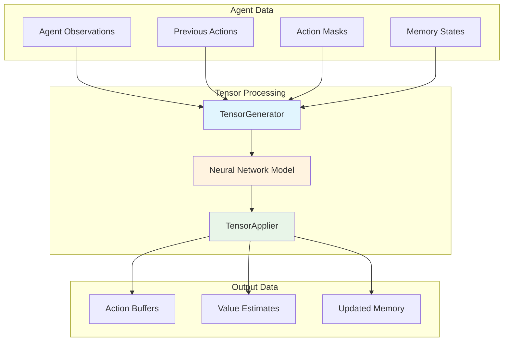
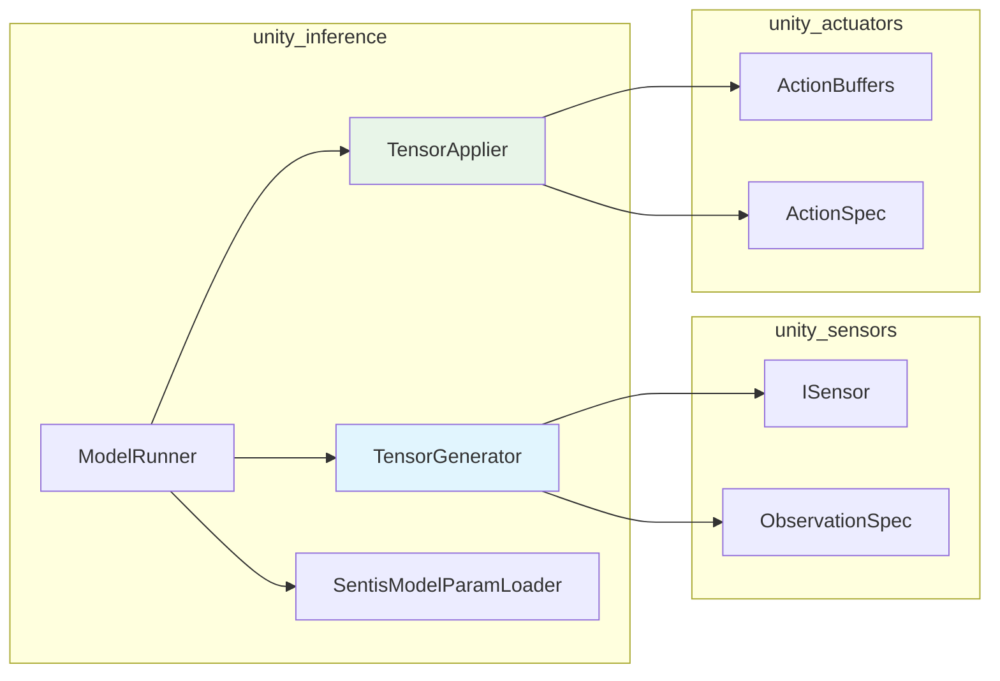
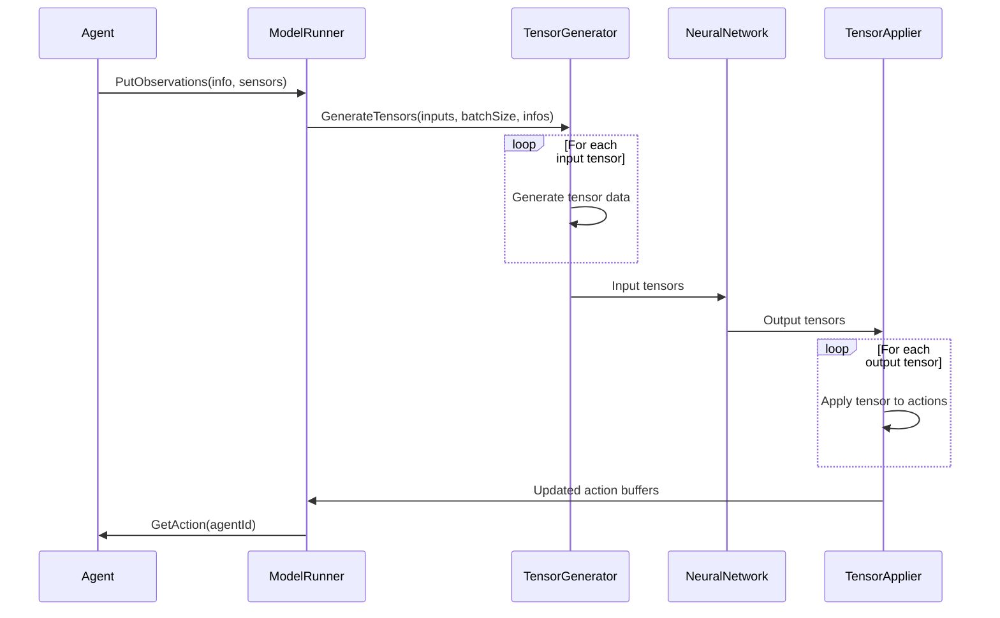
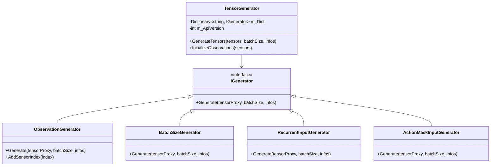
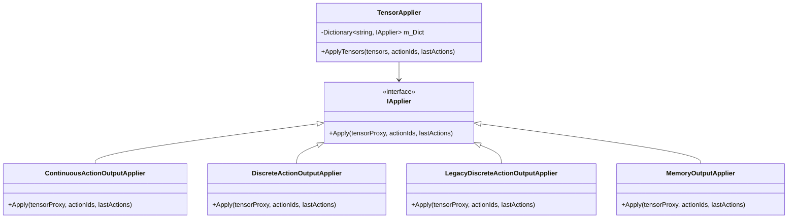
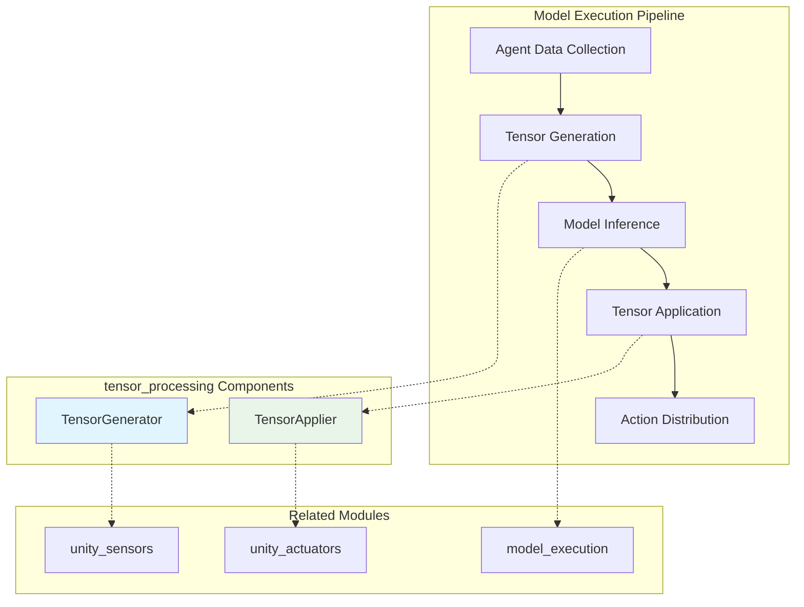

# Tensor Processing Module

The tensor_processing module is a critical component of Unity ML-Agents' inference system, responsible for converting between Unity's agent data structures and neural network tensor formats. This module bridges the gap between ML-Agents' high-level agent observations/actions and the low-level tensor operations required for neural network inference.

## Core Components

### TensorGenerator
The `TensorGenerator` class converts agent observations, actions, and metadata into tensors suitable for neural network input. It implements a flexible generator pattern that handles different types of input data based on the model's API version and requirements.

### TensorApplier
The `TensorApplier` class processes neural network output tensors and applies the results back to agent action buffers. It handles the conversion from raw tensor outputs to structured action data that agents can execute.

## Architecture Overview

## Component Relationships

## Data Flow Architecture

## TensorGenerator Deep Dive

### Generator Interface Pattern
The `TensorGenerator` uses an interface-based pattern where each tensor type has its own generator implementation:

### Supported Input Types
The generator handles various input tensor types:

- **Batch Size Placeholder**: Dynamic batch sizing
- **Sequence Length Placeholder**: For recurrent models
- **Recurrent Input**: LSTM/GRU memory states
- **Previous Action**: Action history for temporal models
- **Action Mask**: Discrete action masking
- **Random Normal Epsilon**: Stochastic policy sampling
- **Observations**: Sensor data (vector, visual, spatial)

### API Version Compatibility
The generator supports two model API versions:

**MLAgents 1.0 (Legacy)**:
- Separate vector and visual observation handling
- Visual observations indexed by visual sensor count
- Legacy tensor naming conventions

**MLAgents 2.0 (Current)**:
- Unified observation handling
- Observations indexed by sensor index
- Standardized tensor naming

## TensorApplier Deep Dive

### Applier Interface Pattern
Similar to the generator, the `TensorApplier` uses interface-based appliers:

### Output Processing Types
The applier handles different output tensor types:

- **Continuous Actions**: Direct float values for continuous control
- **Discrete Actions**: Probability distributions for discrete choices
- **Memory Output**: Updated recurrent states
- **Value Estimates**: State value predictions (when available)

## Integration with Model Execution

## Key Features

### Batch Processing
Both components support efficient batch processing of multiple agents:
- Dynamic batch sizing based on active agents
- Vectorized tensor operations
- Memory-efficient data handling

### Memory Management
Proper tensor lifecycle management:
- Automatic tensor allocation and deallocation
- Memory pooling for frequently used tensors
- Garbage collection optimization

### Model Compatibility
Support for different model architectures:
- Feedforward networks
- Recurrent networks (LSTM/GRU)
- Multi-modal input handling
- Mixed continuous/discrete action spaces

### Error Handling
Comprehensive validation and error reporting:
- Tensor shape validation
- Model compatibility checking
- Graceful degradation on errors

## Performance Considerations

### Optimization Strategies
1. **Tensor Reuse**: Minimize allocation overhead
2. **Batch Optimization**: Process multiple agents simultaneously
3. **Memory Pooling**: Reuse tensor memory across inference cycles
4. **Shape Validation**: Early validation to prevent runtime errors

### Profiling Integration
The module integrates with Unity's profiler for performance monitoring:
- Tensor generation timing
- Model execution profiling
- Memory usage tracking
- Batch processing efficiency

## Dependencies

### Internal Dependencies
- **[model_execution](model_execution.md)**: ModelRunner orchestrates tensor processing
- **[model_validation](model_validation.md)**: SentisModelParamLoader validates tensor compatibility

### External Dependencies
- **[unity_sensors](unity_sensors.md)**: Provides observation data for tensor generation
- **[unity_actuators](unity_actuators.md)**: Receives processed action data from tensors
- **Unity Sentis**: Low-level tensor operations and neural network execution

## Usage Patterns

### Typical Workflow
1. **Initialization**: Create generators and appliers based on model specifications
2. **Observation Processing**: Convert sensor data to input tensors
3. **Model Execution**: Feed tensors through neural network
4. **Action Processing**: Convert output tensors to action buffers
5. **Memory Management**: Update recurrent states and clean up resources

### Configuration
The tensor processing components are configured automatically based on:
- Model architecture and API version
- Agent action specifications
- Sensor configurations
- Inference device capabilities

## Error Handling and Validation

### Common Error Scenarios
- **Shape Mismatches**: Input/output tensor shapes don't match expectations
- **Missing Tensors**: Required tensors not found in model
- **Type Incompatibilities**: Data type mismatches between model and runtime
- **Memory Constraints**: Insufficient memory for batch processing

### Validation Process
The module performs extensive validation during initialization and runtime:
- Model compatibility checking
- Tensor shape validation
- Action space verification
- Memory requirement assessment

## Future Considerations

### Extensibility
The interface-based design allows for easy extension:
- New generator types for custom sensors
- Additional applier implementations for specialized actions
- Support for emerging neural network architectures

### Performance Improvements
Potential optimization areas:
- GPU-accelerated tensor operations
- Advanced memory management strategies
- Parallel processing for large batches
- Optimized data layouts for specific hardware

This module serves as the critical bridge between Unity's agent-based simulation environment and the mathematical world of neural network inference, ensuring efficient and reliable data transformation in both directions.