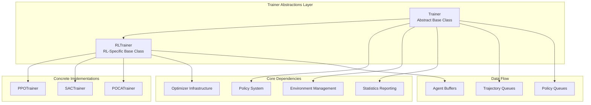
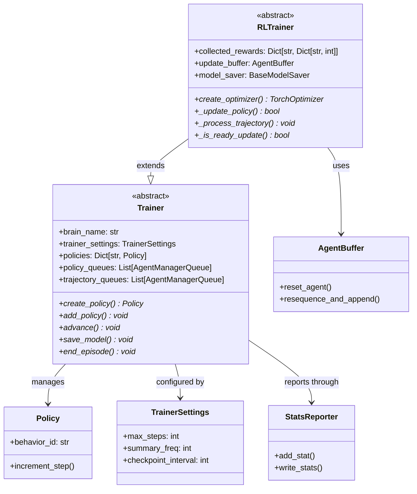
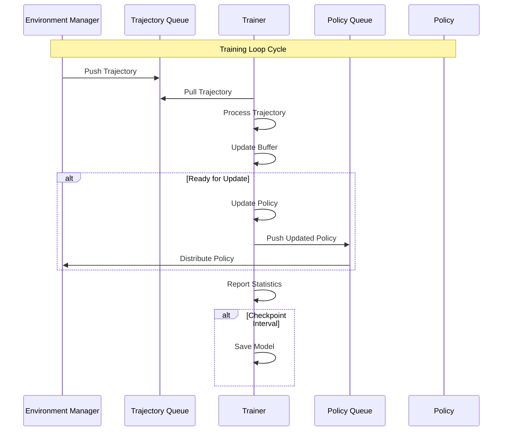
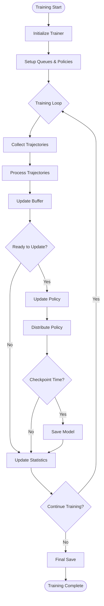

# Trainer Abstractions Module

## Overview

The trainer_abstractions module provides the foundational abstract base classes for all machine learning trainers in the Unity ML-Agents system. This module defines the core interfaces and common functionality that all concrete training algorithms must implement, establishing a consistent architecture for reinforcement learning and other training paradigms.

## Core Components

### Trainer (Base Abstract Class)
The `Trainer` class serves as the fundamental abstract base class for all trainers in the ML-Agents ecosystem. It defines the essential interface and common functionality that all training implementations must provide.

**Key Responsibilities:**
- Managing training lifecycle and state
- Handling policy creation and management
- Coordinating with environment managers through queues
- Providing statistics reporting infrastructure
- Managing model persistence and checkpointing

**Core Properties:**
- `brain_name`: Identifier for the behavior being trained
- `trainer_settings`: Configuration parameters for training
- `is_training`: Training mode flag
- `policies`: Dictionary of managed policies
- `policy_queues`: Queues for distributing updated policies
- `trajectory_queues`: Queues for receiving training data

### RLTrainer (Reinforcement Learning Base Class)
The `RLTrainer` extends the base `Trainer` class with reinforcement learning-specific functionality, including reward signal processing, buffer management, and policy optimization workflows.

**Key Enhancements:**
- Reward signal collection and aggregation
- Agent buffer management for experience replay
- Model checkpointing and persistence
- Policy update orchestration
- Statistics tracking for RL metrics

## Architecture Overview

## Component Relationships

## Data Flow Architecture

## Training Process Flow

## Key Interfaces and Contracts

### Abstract Methods (Trainer)
All concrete trainer implementations must provide:

- **`create_policy()`**: Factory method for policy creation
- **`add_policy()`**: Policy registration and management
- **`advance()`**: Main training step execution
- **`save_model()`**: Model persistence implementation
- **`end_episode()`**: Episode cleanup and reset

### Abstract Methods (RLTrainer)
Reinforcement learning trainers must additionally implement:

- **`create_optimizer()`**: Optimizer factory method
- **`_update_policy()`**: Core policy update logic
- **`_process_trajectory()`**: Trajectory processing pipeline
- **`_is_ready_update()`**: Update readiness determination

## Integration Points

### With Environment Management
- Receives trajectories through `trajectory_queues`
- Distributes updated policies through `policy_queues`
- Coordinates with [environment_management](environment_management.md) module

### With Policy System
- Creates and manages policy instances
- Integrates with [policy_system](policy_system.md) for policy lifecycle management

### With Training Algorithms
- Provides base classes extended by specific algorithms
- Supports [training_algorithms](training_algorithms.md) implementations (PPO, SAC, POCA)

### With Training Infrastructure
- Uses configuration from [training_infrastructure](training_infrastructure.md)
- Integrates with optimizer and network components

### With Reward Systems
- Processes reward signals through RLTrainer
- Coordinates with [reward_systems](reward_systems.md) for multi-signal training

## Configuration and Settings

The trainer abstractions work with `TrainerSettings` to configure:

- **Training Parameters**: Max steps, learning rates, batch sizes
- **Infrastructure Settings**: Threading, checkpointing, summary frequency
- **Network Configuration**: Architecture, memory settings
- **Reward Processing**: Signal weights, normalization

## Threading and Concurrency

The trainer abstractions support both synchronous and asynchronous training modes:

- **Threaded Mode**: Allows policy updates during environment steps
- **Synchronous Mode**: Enforces strict on-policy updates
- **Queue Management**: Thread-safe trajectory and policy distribution

## Statistics and Monitoring

Built-in statistics reporting includes:

- **Training Metrics**: Steps, episodes, rewards
- **Performance Indicators**: Policy update frequency, buffer utilization
- **Hyperparameter Tracking**: Configuration persistence
- **Custom Metrics**: Algorithm-specific statistics

## Model Persistence

The trainer abstractions provide comprehensive model management:

- **Checkpointing**: Periodic model snapshots with metadata
- **Final Export**: ONNX format for deployment
- **Checkpoint Management**: Automatic cleanup and retention policies
- **Recovery**: Loading from saved checkpoints

## Error Handling and Validation

The abstractions include robust error handling for:

- **Configuration Validation**: Settings verification
- **Queue Management**: Empty queue handling
- **Memory Management**: Buffer overflow prevention
- **Model Persistence**: Save/load error recovery

## Performance Considerations

Key performance aspects:

- **Memory Efficiency**: Circular buffers for reward tracking
- **Queue Optimization**: Non-blocking operations where possible
- **Statistics Batching**: Efficient metric aggregation
- **Threading**: Minimal blocking in training loops

## Extension Points

The trainer abstractions provide several extension mechanisms:

- **Custom Reward Providers**: Integration with reward systems
- **Algorithm-Specific Optimizers**: Flexible optimizer architecture
- **Custom Statistics**: Extensible reporting framework
- **Model Savers**: Pluggable persistence backends

This module serves as the foundation for all training implementations in Unity ML-Agents, providing a consistent, extensible, and robust architecture for machine learning training workflows.