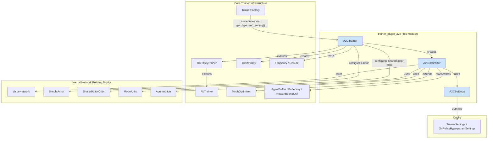

# Trainer Plugin: A2C (Advantage Actor-Critic)

## 1. Purpose & Overview

The `trainer_plugin_a2c` module is an **out-of-tree ML-Agents trainer plugin** that implements the
**Advantage Actor-Critic (A2C)** reinforcement learning algorithm. It is one of the example
plugins shipped in `ml-agents-trainer-plugin`, demonstrating how third-party algorithms can be
integrated into the ML-Agents training stack without modifying the core `mlagents` package.

A2C is a simpler, synchronous on-policy sibling of PPO (see [Built-in_RL_Algorithms](trainers_ppo.md)):
it also relies on a policy (actor) and a value function (critic), Generalized Advantage
Estimation (GAE), and gradient-based updates, but it performs **exactly one epoch per update** and
uses a straightforward policy-gradient loss instead of PPO's clipped surrogate objective.

The module consists of exactly two files:

| File | Core Components | Responsibility |
|---|---|---|
| `a2c_optimizer.py` | `A2COptimizer`, `A2CSettings` | Defines A2C hyperparameters and implements the loss computation / gradient update step |
| `a2c_trainer.py` | `A2CTrainer` | Orchestrates trajectory collection, advantage/return computation, and drives the optimizer through the standard on-policy trainer lifecycle |

Because the plugin is small and tightly coupled (the trainer directly owns and drives the
optimizer), it is documented as a single, self-contained page rather than split into sub-modules.

## 2. Position in the Overall System

The plugin builds entirely on abstractions provided by the core `ml-agents` training
infrastructure (see [Training_Orchestration_&_Lifecycle_Infrastructure](trainers_core.md),
[trainers_trainer_base.md](trainers_trainer_base.md), [trainers_policy.md](trainers_policy.md),
[trainers_optimizer.md](trainers_optimizer.md)) and on the shared neural-network building blocks
in [Neural_Network_Building_Blocks](trainers_torch_entities_networks.md). It plugs into the
trainer registration mechanism (`TrainerFactory`, see [trainers_trainer_base.md](trainers_trainer_base.md))
via the module-level `get_type_and_setting()` function, exactly like the sibling plugin documented
in [trainer_plugin_dqn.md](trainer_plugin_dqn.md).



## 3. Component Reference

### 3.1 `A2CSettings`

A configuration dataclass (built with `attr.s`) that extends `OnPolicyHyperparamSettings`
(defined in [Training_Orchestration_&_Lifecycle_Infrastructure settings](trainers_core_config_settings.md)).
It captures the hyperparameters unique to A2C:

| Field | Default | Description |
|---|---|---|
| `beta` | `5.0e-3` | Entropy bonus coefficient |
| `lambd` | `0.95` | GAE lambda parameter |
| `num_epoch` | `1` (validated) | Must always be `1` — A2C performs a single gradient pass per batch, unlike PPO's multi-epoch updates |
| `shared_critic` | `False` | Whether the critic shares parameters/network with the actor |
| `learning_rate_schedule` | `ScheduleType.LINEAR` | Learning-rate decay schedule |
| `beta_schedule` | `ScheduleType.LINEAR` | Entropy coefficient decay schedule |

A validator (`_check_num_epoch_one`) enforces the single-epoch constraint at construction time,
raising `TrainerConfigError` if violated.

### 3.2 `A2COptimizer`

Extends `TorchOptimizer` (see [trainers_optimizer.md](trainers_optimizer.md)) and is responsible
for the actual gradient computation and parameter update.

**Construction:**
- Builds/attaches a critic: if `shared_critic` is `True`, the critic *is* the policy's actor
  (a `SharedActorCritic`); otherwise a dedicated `ValueNetwork` is instantiated using the reward
  signal names and the policy's observation specs.
- Creates a single `torch.optim.Adam` optimizer over the combined actor + critic parameters.
- Sets up `ModelUtils.DecayedValue` schedulers for learning rate and entropy beta, decaying over
  `trainer_settings.max_steps`.

**`update(batch, num_sequences)`** — the core training step:
1. Pulls decayed learning rate and beta values for the current step.
2. Converts the `AgentBuffer` batch fields (`returns`, observations, actions, action masks,
   memories, critic memories) into tensors via `ObsUtil`, `AgentAction`, and `ModelUtils`.
3. Runs the actor's `get_stats(...)` to obtain `log_probs` and `entropy`.
4. Runs the critic's `critic_pass(...)` to obtain value estimates per reward-signal head.
5. Computes:
   - **Value loss**: mean squared error between returns and value estimates, averaged across
     reward-signal heads.
   - **Policy loss**: negative mean of `log_probs * advantages` (plain policy gradient, no PPO
     clipping).
   - **Total loss**: `policy_loss + 0.5 * value_loss - beta * mean(entropy)`.
6. Backpropagates and steps the Adam optimizer; updates the learning rate in-place.
7. Returns a stats dictionary (`Losses/Policy Loss`, `Losses/Value Loss`, `Policy/Learning Rate`,
   `Policy/Beta`) consumed by [`StatsReporter`](trainers_core_monitoring.md).

`get_modules()` exposes the optimizer and critic (plus any reward-signal modules) for checkpointing
by the [model saver](trainers_model_saver.md).

```mermaid
sequenceDiagram
    participant Trainer as A2CTrainer
    participant Opt as A2COptimizer
    participant Actor as Policy.actor
    participant Critic as ValueNetwork / SharedActorCritic

    Trainer->>Opt: update(batch, num_sequences)
    Opt->>Opt: decay_learning_rate / decay_beta
    Opt->>Actor: get_stats(obs, masks, actions, memories)
    Actor-->>Opt: log_probs, entropy
    Opt->>Critic: critic_pass(obs, memories)
    Critic-->>Opt: value estimates per reward signal
    Opt->>Opt: compute value_loss, policy_loss, total loss
    Opt->>Opt: loss.backward(); optimizer.step()
    Opt-->>Trainer: update_stats (losses, LR, beta)
```

### 3.3 `A2CTrainer`

Extends `OnPolicyTrainer` (see [trainers_trainer_base.md](trainers_trainer_base.md)), reusing the
generic on-policy trainer loop (trajectory collection → buffer accumulation → periodic update →
policy/model export) while supplying A2C-specific pieces:

- **`create_policy(...)`** — builds a `TorchPolicy` using either `SimpleActor` (independent actor
  and critic) or `SharedActorCritic` (when `shared_critic=True`), the latter requiring the list of
  reward-signal names as `stream_names`.
- **`create_optimizer(...)`** — instantiates an `A2COptimizer` bound to the trainer's policy and
  settings.
- **`_process_trajectory(trajectory)`** — the heart of A2C-specific data preparation:
  1. Delegates to the base class for bookkeeping, then converts the `Trajectory` into an
     `AgentBuffer`.
  2. Updates observation normalization statistics on both actor and critic.
  3. Obtains bootstrapped value estimates via `optimizer.get_trajectory_value_estimates(...)`.
  4. Evaluates every configured reward signal (extrinsic + auxiliary, e.g. curiosity/GAIL — see
     [Neural_Network_Building_Blocks reward providers](trainers_torch_components_reward_providers.md))
     and accumulates rewards per agent.
  5. For each reward signal, computes GAE (`get_gae`, shared with PPO) to derive
     `local_advantage`/`local_return`, storing them per reward-signal head.
  6. Aggregates per-head advantages/returns into single **global** `ADVANTAGES` and
     `DISCOUNTED_RETURNS` buffer entries (mean across reward signals) — this is the key
     simplification versus PPO, which keeps multiple heads separately weighted.
  7. Appends the fully processed buffer to the update buffer and reports end-of-episode stats when
     the trajectory terminates.
- **`get_settings_type()`** returns `A2CSettings`; **`get_trainer_name()`** returns `"a2c"`.

```mermaid
flowchart LR
    Traj["Trajectory"] --> ToBuf["to_agentbuffer()"]
    ToBuf --> Norm["Update actor & critic normalization"]
    Norm --> ValEst["optimizer.get_trajectory_value_estimates()"]
    ValEst --> RewardEval["Evaluate reward signals\n(extrinsic, curiosity, GAIL, RND...)"]
    RewardEval --> GAE["Per-signal GAE\n(get_gae)"]
    GAE --> Global["Aggregate to global\nADVANTAGES / DISCOUNTED_RETURNS"]
    Global --> AppendBuf["_append_to_update_buffer()"]
    AppendBuf --> Update["A2COptimizer.update()\n(triggered by RLTrainer loop)"]
```



### 3.4 Plugin Registration

```python
def get_type_and_setting():
    return {A2CTrainer.get_trainer_name(): A2CTrainer}, {
        A2CTrainer.get_trainer_name(): A2CSettings
    }
```

This module-level function is the plugin entry point discovered by the core
`TrainerFactory`/plugin-loading mechanism (see [trainers_trainer_base.md](trainers_trainer_base.md)),
mapping the trainer type string `"a2c"` to the `A2CTrainer` class and its `A2CSettings` schema.
This mirrors the registration pattern used by the sibling [DQN plugin](trainer_plugin_dqn.md).

## 4. Relationship to Built-in Algorithms

A2C shares almost its entire data pipeline (trajectory processing, GAE, buffer keys, reward-signal
evaluation) with PPO (see [trainers_ppo.md](trainers_ppo.md)) — both extend `OnPolicyTrainer`. The
essential differences are:

| Aspect | PPO | A2C |
|---|---|---|
| Update epochs | Multiple (`num_epoch` configurable) | Fixed at `1` |
| Policy loss | Clipped surrogate objective | Plain policy gradient (`-log_prob * advantage`) |
| Advantage/return handling | Per reward-signal head, weighted | Averaged into single global advantage/return |
| Critic sharing | Optional (`SharedActorCritic`) | Optional (`shared_critic` flag), same mechanism |

This makes the A2C plugin a compact, instructive reference implementation for authoring new
trainer plugins that reuse ML-Agents' core RL scaffolding.

## 5. Key External Dependencies

| Dependency | Module Doc |
|---|---|
| `OnPolicyTrainer`, `RLTrainer`, `Trainer`, `TrainerFactory` | [trainers_trainer_base.md](trainers_trainer_base.md) |
| `TorchOptimizer` | [trainers_optimizer.md](trainers_optimizer.md) |
| `TorchPolicy` | [trainers_policy.md](trainers_policy.md) |
| `AgentBuffer`, `BufferKey`, `RewardSignalUtil` | [trainers_core_data_pipeline.md](trainers_core_data_pipeline.md) |
| `Trajectory`, `ObsUtil` | [trainers_core_data_pipeline.md](trainers_core_data_pipeline.md) |
| `TrainerSettings`, `OnPolicyHyperparamSettings`, `ScheduleType` | [trainers_core_config_settings.md](trainers_core_config_settings.md) |
| `ValueNetwork`, `SimpleActor`, `SharedActorCritic` | [trainers_torch_entities_networks.md](trainers_torch_entities_networks.md) |
| `ModelUtils`, `AgentAction` | [trainers_torch_entities_utils_serialization_utils.md](trainers_torch_entities_utils_serialization_utils.md), [trainers_torch_entities_actions.md](trainers_torch_entities_actions.md) |
| `BehaviorSpec` | [envs_core_api.md](envs_core_api.md) |
| `timed` (timers) | [envs_core_utils.md](envs_core_utils.md) |
| Sibling plugin | [trainer_plugin_dqn.md](trainer_plugin_dqn.md) |
| Reference on-policy algorithm | [trainers_ppo.md](trainers_ppo.md) |
