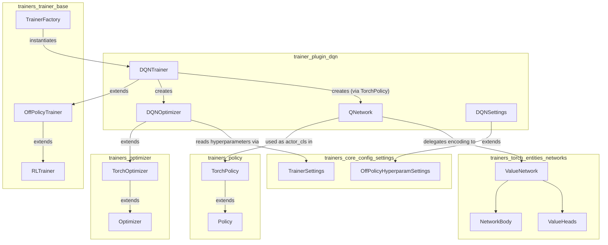
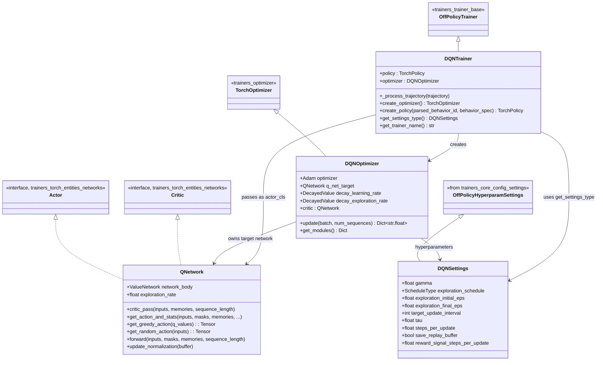
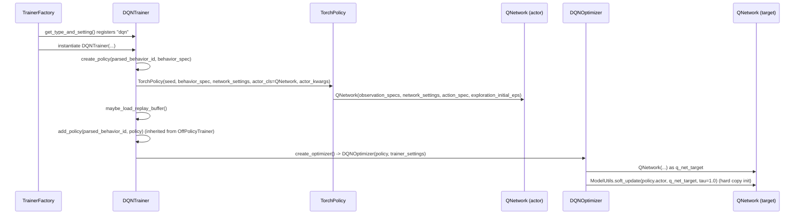
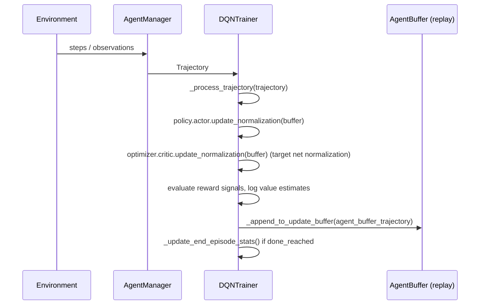
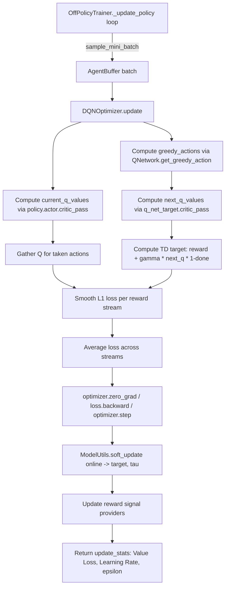
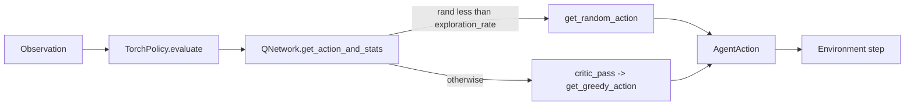

# Trainer Plugin: DQN

## 1. Purpose & Overview

The `trainer_plugin_dqn` module is a **plug-in RL algorithm implementation** for the ML-Agents
Toolkit that provides a PyTorch-based **Deep Q-Network (DQN)** trainer. It is one of the
"extensible" algorithms shipped outside of the core `mlagents` package (see the sibling
[trainer_plugin_a2c](trainer_plugin_a2c.md) module for the analogous A2C plugin), demonstrating
how third parties can add new trainers to ML-Agents without modifying the core training loop.

DQN is a **value-based, off-policy** algorithm suited to **discrete action spaces**. Instead of
learning an explicit policy distribution, it learns a Q-network that estimates the value of every
discrete action and acts (near-)greedily with respect to those values, using an epsilon-greedy
exploration schedule and a slowly-updated target network to stabilize learning.

The module is composed of exactly two files:

| File | Responsibility |
|---|---|
| `dqn_optimizer.py` | Defines the `QNetwork` (the Q-value network, doubling as both actor and critic), the `DQNSettings` hyperparameter schema, and the `DQNOptimizer` which implements the DQN loss/update rule. |
| `dqn_trainer.py` | Defines `DQNTrainer`, which wires policy/optimizer creation into the generic off-policy training loop and handles trajectory processing, checkpointing hooks, and plugin registration (`get_type_and_setting`). |

Because it is small enough to be a single cohesive unit, this documentation does **not** split
into further sub-modules; instead it explains both files together and links out to the shared
infrastructure they build upon.

## 2. Where DQN Fits in the System

DQN reuses almost all of its scaffolding from the core trainer infrastructure and neural-network
building blocks documented elsewhere in this wiki:

- **[trainers_trainer_base](trainers_trainer_base.md)** — `DQNTrainer` is a subclass of
  `OffPolicyTrainer` (itself a subclass of `RLTrainer`/`Trainer`), which supplies the generic
  replay-buffer-driven update loop, checkpointing, and reward-signal bookkeeping. Trainer
  instantiation itself is driven by `TrainerFactory` in the same doc.
- **[trainers_optimizer](trainers_optimizer.md)** — `DQNOptimizer` extends `TorchOptimizer`
  (`Optimizer`), gaining trajectory value-estimation utilities, reward-signal creation, and
  behavioral-cloning module support "for free".
- **[trainers_policy](trainers_policy.md)** — DQN uses the generic `TorchPolicy` wrapper, simply
  supplying `QNetwork` as the custom `actor_cls`.
- **[trainers_torch_entities_networks](trainers_torch_entities_networks.md)** — `QNetwork`
  delegates its observation encoding and multi-head value estimation to the shared `ValueNetwork`
  / `NetworkBody` / `ValueHeads` classes, and implements the shared `Actor`/`Critic` interfaces.
- **[trainers_core_config_settings](trainers_core_config_settings.md)** — `DQNSettings` extends
  `OffPolicyHyperparamSettings` from the shared settings schema (`settings.py`), so DQN
  hyperparameters are parsed/validated the same way as SAC's.
- **[trainer_plugin_a2c](trainer_plugin_a2c.md)** — sibling plugin illustrating the on-policy
  counterpart pattern; useful for contrasting how a plugin trainer for an on-policy algorithm
  differs from this off-policy one.
- **[trainers_torch_components_reward_providers](trainers_torch_components_reward_providers.md)**
  — reward signal providers (`extrinsic`, `curiosity`, `gail`, `rnd`) that `DQNOptimizer` iterates
  over during `update()`.
- **[trainers_core_data_pipeline](trainers_core_data_pipeline.md)** — supplies `AgentBuffer`,
  `RewardSignalUtil`, and `ObsUtil`/trajectory conversion utilities consumed by both files.

## 3. Architecture

### 3.1 Class relationships

### 3.2 Component roles

- **`DQNSettings`** — `attrs`-based hyperparameter schema (subclass of
  `OffPolicyHyperparamSettings`, defined in
  [trainers_core_config_settings](trainers_core_config_settings.md)). It holds discount factor
  (`gamma`), the epsilon-greedy exploration schedule
  (`exploration_schedule`, `exploration_initial_eps`, `exploration_final_eps`), target-network
  update cadence (`target_update_interval`, `tau`), and update frequency
  (`steps_per_update`, `reward_signal_steps_per_update`). It is registered as the settings type
  for the trainer via `DQNTrainer.get_settings_type()`.

- **`QNetwork`** — A `torch.nn.Module` that simultaneously fulfills both the `Actor` and `Critic`
  interfaces (see [trainers_torch_entities_networks](trainers_torch_entities_networks.md)). It
  wraps a shared `ValueNetwork` (which internally uses `NetworkBody` for observation encoding and
  `ValueHeads` for multi-reward-stream Q-value heads). Because DQN has no separate policy network,
  the "actor" *is* the Q-network: actions are chosen via `get_greedy_action` (argmax over summed
  Q-values across reward streams) or, during exploration, `get_random_action`. Two instances of
  `QNetwork` exist at runtime — the **online network** (`policy.actor`) and the **target network**
  (`DQNOptimizer.q_net_target`), used to compute stable TD targets.

- **`DQNOptimizer`** — Implements the DQN training step:
  1. Samples a mini-batch of transitions (current/next observations, actions, dones, rewards per
     signal) from the replay buffer.
  2. Computes current Q-values from the online network and greedy next-actions using the *online*
     network (Double-DQN style action selection) then evaluates them via the *target* network.
  3. Computes TD targets: `reward + (1 - done) * gamma * Q_target(next_obs, greedy_action)`.
  4. Computes smooth L1 (Huber) loss between current Q and TD target, averaged across all reward
     streams, and performs a gradient step.
  5. Soft-updates (`ModelUtils.soft_update`) the target network towards the online network by
     factor `tau`.
  6. Delegates to each configured reward signal provider's own `update()` (see
     [trainers_torch_components_reward_providers](trainers_torch_components_reward_providers.md)).

- **`DQNTrainer`** — Glue code binding `QNetwork`/`DQNOptimizer` into the generic
  `OffPolicyTrainer` lifecycle (buffer accumulation, `_is_ready_update`, replay-buffer
  save/load, checkpointing — all inherited, see
  [trainers_trainer_base](trainers_trainer_base.md)). It overrides:
  - `_process_trajectory` — converts a `Trajectory` into an `AgentBuffer`, updates observation
    normalization on both actor and critic (target) networks, records reward-signal statistics,
    computes value estimates for logging, handles trajectory truncation on `interrupted` episodes,
    and appends to the shared update buffer.
  - `create_policy` — builds a `TorchPolicy` using `QNetwork` as `actor_cls`, passing
    `exploration_initial_eps` and the list of reward-signal stream names as `actor_kwargs`; also
    triggers `maybe_load_replay_buffer()`.
  - `create_optimizer` — instantiates `DQNOptimizer`.
  - `get_settings_type` / `get_trainer_name` — static plugin metadata (`"dqn"`).
  - Module-level `get_type_and_setting()` — the entry point used by ML-Agents'
    `TrainerFactory` (see [trainers_trainer_base](trainers_trainer_base.md)) plugin discovery
    mechanism to register `"dqn"` as a selectable trainer type together with its settings class.

## 4. Data & Control Flow

### 4.1 Trainer setup (plugin registration → policy/optimizer creation)

### 4.2 Trajectory collection & buffer update

### 4.3 Policy update (DQN learning step)

### 4.4 Action selection at inference/rollout time

## 5. Key Design Notes

- **Actor == Critic**: Unlike PPO/SAC where the actor (policy) and critic (value function) are
  distinct networks, DQN's `QNetwork` implements *both* the `Actor` and `Critic` interfaces from
  [trainers_torch_entities_networks](trainers_torch_entities_networks.md), since Q-values
  directly determine the greedy action.
- **Double-DQN-style target computation**: greedy action selection for the TD target uses the
  *online* network's Q-values (`self.policy.actor.get_greedy_action(current_q_values)`), while the
  *value* of that action is read off the *target* network (`self.q_net_target`), reducing
  overestimation bias typical of vanilla DQN.
- **Soft target updates**: rather than a hard periodic copy, the current implementation performs
  continuous Polyak/soft updates via `tau` after every optimizer step, similarly to SAC's target
  network handling. `target_update_interval` is defined in `DQNSettings` but is currently unused
  by `DQNOptimizer.update`, reserved for a potential hard-update strategy.
- **Multi-reward-stream support**: like other optimizers in this codebase, `DQNOptimizer` computes
  a separate Q-head and TD loss per reward signal (extrinsic, curiosity, GAIL, RND — see
  [trainers_torch_components_reward_providers](trainers_torch_components_reward_providers.md)) and
  averages the losses, mirroring the pattern used by the built-in
  [trainers_sac](trainers_sac.md) and [trainers_poca_optimizer](trainers_poca_optimizer.md)
  optimizers.
- **ONNX export caveat**: the code contains a `# TODO: fix saving to onnx` comment; `QNetwork`
  exposes extra parameters (`version_number`, `memory_size_vector`, etc.) mirroring the export
  interface used by
  [trainers_torch_entities_utils_serialization_export](trainers_torch_entities_utils_serialization_export.md),
  but export correctness is a known limitation.
- **Discrete-only**: `QNetwork.get_random_action` assumes a single discrete branch
  (`action_spec.discrete_branches[0]`), so this plugin currently targets simple discrete action
  spaces rather than multi-branch or continuous actions.

## 6. Extending / Modifying This Plugin

Because `DQNTrainer`/`DQNOptimizer` follow the standard extension points of the trainer framework
(see [trainers_trainer_base](trainers_trainer_base.md) and
[trainers_optimizer](trainers_optimizer.md)), typical modifications involve:

- Adjusting `DQNSettings` fields (e.g., adding prioritized-replay parameters) — validated
  automatically through the shared `attrs`-based settings framework
  ([trainers_core_config_settings](trainers_core_config_settings.md)).
- Swapping `QNetwork`'s internal encoder configuration through `NetworkSettings` — no plugin code
  changes needed since encoding is delegated to `ValueNetwork`/`NetworkBody`
  ([trainers_torch_entities_networks](trainers_torch_entities_networks.md)).
- Implementing a genuine hard-update schedule using `target_update_interval` inside
  `DQNOptimizer.update`, replacing/augmenting the current soft-update call.
- Registering a new trainer name by editing `get_type_and_setting()` if forking this plugin into a
  variant algorithm (e.g., a Rainbow-style extension).

## 7. Related Documentation

- [trainer_plugin_a2c](trainer_plugin_a2c.md) — sibling on-policy plugin trainer.
- [trainers_trainer_base](trainers_trainer_base.md) — `Trainer`, `RLTrainer`, `OffPolicyTrainer`,
  `OnPolicyTrainer`, `TrainerFactory`.
- [trainers_optimizer](trainers_optimizer.md) — `Optimizer`, `TorchOptimizer` base classes.
- [trainers_policy](trainers_policy.md) — `Policy`, `TorchPolicy`, `ModelCheckpointManager`.
- [trainers_torch_entities_networks](trainers_torch_entities_networks.md) — `NetworkBody`,
  `ValueNetwork`, `Actor`/`Critic` interfaces used by `QNetwork`.
- [trainers_torch_entities_utils_serialization_utils](trainers_torch_entities_utils_serialization_utils.md)
  — `ModelUtils` helpers (`soft_update`, `DecayedValue`, tensor conversions) used throughout
  `DQNOptimizer`.
- [trainers_core_config_settings](trainers_core_config_settings.md) — `TrainerSettings`,
  `OffPolicyHyperparamSettings`, `NetworkSettings`, `ScheduleType`.
- [trainers_core_data_pipeline](trainers_core_data_pipeline.md) — `AgentBuffer`, `BufferKey`,
  `RewardSignalUtil`, `Trajectory`, `ObsUtil`.
- [trainers_torch_components_reward_providers](trainers_torch_components_reward_providers.md) —
  reward signal providers consumed by `DQNOptimizer`.
- [trainers_sac](trainers_sac.md) / [trainers_poca_optimizer](trainers_poca_optimizer.md) — other
  off-policy/target-network based optimizers with similar design patterns.
