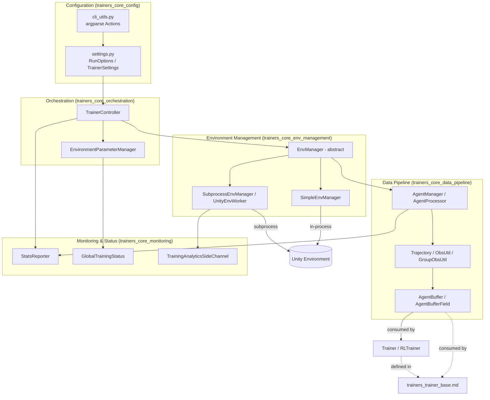
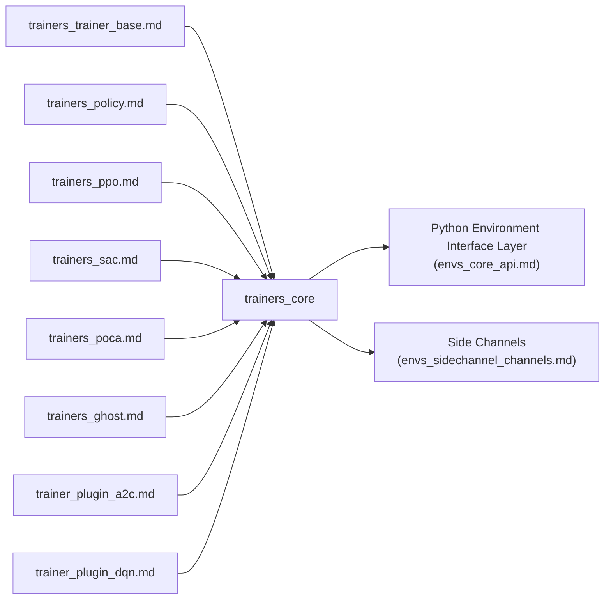
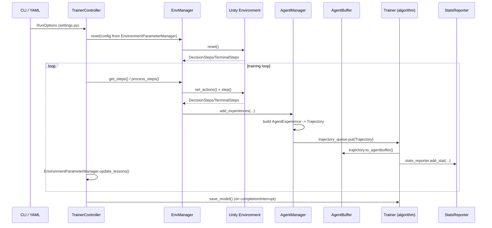

# Trainers Core

## Introduction

`trainers_core` is the backbone infrastructure of the ML-Agents Python training package
(`mlagents.trainers`). It does not implement any specific reinforcement-learning
algorithm (PPO, SAC, POCA, etc. — see [Built-in RL Algorithms](trainers_ppo.md)); instead it
provides the generic machinery that every algorithm needs in order to run a
training session end-to-end:

- Reading and validating run configuration (YAML + CLI) into strongly typed settings objects.
- Managing one or more Unity environment instances (single-process or multi-process/subprocess).
- Converting raw environment observations/rewards into per-agent `Trajectory` objects that
  algorithm-specific `Trainer`s (see [Trainer Base Classes](trainers_trainer_base.md)) can consume.
- Storing collected experience in an efficient, serializable `AgentBuffer`.
- Driving the main training loop (`TrainerController`), including curriculum/parameter
  randomization progression.
- Reporting statistics (console, TensorBoard) and persisting/reloading training state
  across resumed runs.
- Sending anonymized training analytics back to the Unity process.

Because `trainers_core` sits at the center of the training stack, nearly every other
trainer module depends on it: [Trainer Base Classes](trainers_trainer_base.md),
[Policy](trainers_policy.md), [Optimizer](trainers_optimizer.md),
[Model Saver](trainers_model_saver.md), [Ghost Training (Self-Play)](trainers_ghost.md), and the
concrete algorithms in [Built-in RL Algorithms](trainers_ppo.md) /
[Extensible RL Algorithm Plugins](trainer_plugin_a2c.md) all build on top of the abstractions
defined here. `trainers_core` itself depends on the
[Python Environment Interface Layer](envs_core_api.md) (`mlagents_envs`) for the actual
Unity communication protocol, side channels, and gRPC/RPC plumbing.

## Architecture Overview

`trainers_core` is organized into five cohesive sub-modules:

| Sub-module | Responsibility | Documentation |
|---|---|---|
| Configuration | CLI parsing and typed settings/config schema (`RunOptions`, `TrainerSettings`, ...) | [trainers_core_config.md](trainers_core_config.md) |
| Environment Management | Abstraction over one or many Unity environment instances | [trainers_core_env_management.md](trainers_core_env_management.md) |
| Data Pipeline | Converting raw env steps into `Trajectory`/`AgentBuffer` data for training | [trainers_core_data_pipeline.md](trainers_core_data_pipeline.md) |
| Monitoring & Status | Stats reporting, persisted training status, training analytics | [trainers_core_monitoring.md](trainers_core_monitoring.md) |
| Orchestration | The main training loop and environment-parameter/curriculum scheduling | [trainers_core_orchestration.md](trainers_core_orchestration.md) |

### High-level component diagram

### External dependencies

## Sub-module Details

### Configuration
Handles the `mlagents-learn` command-line interface (`cli_utils.py`) and the large,
`attrs`-based configuration schema in `settings.py` (`RunOptions`, `TrainerSettings`,
`NetworkSettings`, reward-signal settings, environment-parameter/curriculum sampler
settings, engine/env/checkpoint/torch settings, etc.). This is the single source of
truth for how a training run is configured, whether from a YAML file or CLI flags.
See [trainers_core_config.md](trainers_core_config.md).

### Environment Management
Defines the `EnvManager` abstraction (and the `EnvironmentStep` data structure) that
decouples the training loop from how Unity environments are actually run. Two
implementations are provided: `SimpleEnvManager` (single in-process environment, mainly
for testing) and `SubprocessEnvManager` (spawns one or more subprocess workers via
`UnityEnvWorker`, supports environment restarts on crash). See
[trainers_core_env_management.md](trainers_core_env_management.md).

### Data Pipeline
Converts raw `DecisionSteps`/`TerminalSteps` coming from the environment into
per-agent `Trajectory` objects (`agent_processor.py`, `trajectory.py`), including
multi-agent group bookkeeping. Trajectories are then flattened into `AgentBuffer`
(`buffer.py`), the primary in-memory, keyed, padded/batched storage structure consumed
by all trainers and optimizers. See [trainers_core_data_pipeline.md](trainers_core_data_pipeline.md).

### Monitoring & Status
Provides `StatsReporter` and its writers (`ConsoleWriter`, `TensorboardWriter`) for
publishing training metrics, `GlobalTrainingStatus` for persisting/restoring
cross-run state (such as curriculum lesson number) to/from `training_status.json`,
and `TrainingAnalyticsSideChannel` for sending anonymized training-run analytics to
the Unity process. See [trainers_core_monitoring.md](trainers_core_monitoring.md).

### Orchestration
`TrainerController` is the top-level driver of a training session: it creates
trainers/policies/agent managers as new behaviors appear, repeatedly advances the
`EnvManager`, checks curriculum progress via `EnvironmentParameterManager`, resets the
environment when needed, and saves models on completion or interruption. See
[trainers_core_orchestration.md](trainers_core_orchestration.md).

## End-to-End Data Flow

## Related Modules

- [Trainer Base Classes](trainers_trainer_base.md) — `Trainer`, `RLTrainer`, `OnPolicyTrainer`,
  `OffPolicyTrainer`, `TrainerFactory`, which consume `AgentBuffer`/`Trajectory` and are
  instantiated/driven by `TrainerController`.
- [Policy](trainers_policy.md) and [Optimizer](trainers_optimizer.md) — used by trainers to
  select actions and update models from `AgentBuffer` data.
- [Model Saver](trainers_model_saver.md) — checkpointing, invoked at the end of
  `TrainerController.start_learning`.
- [Ghost Training (Self-Play)](trainers_ghost.md) — builds on `EnvironmentParameterManager`-style
  scheduling and `TrainerController` integration for self-play team swapping.
- [Built-in RL Algorithms](trainers_ppo.md) ([SAC](trainers_sac.md), [POCA](trainers_poca.md)) and
  [Extensible RL Algorithm Plugins](trainer_plugin_a2c.md) ([DQN](trainer_plugin_dqn.md)) — concrete
  algorithms that plug into the `Trainer`/`Optimizer` abstractions defined on top of `trainers_core`.
- [Python Environment Interface Layer](envs_core_api.md) — underlying `UnityEnvironment`,
  `BaseEnv`, side channels, and RPC communicator that `EnvManager` implementations wrap.
- [Neural Network Building Blocks](trainers_torch_entities.md) — PyTorch modules used by
  policies/optimizers that consume the data produced by the Data Pipeline sub-module.
