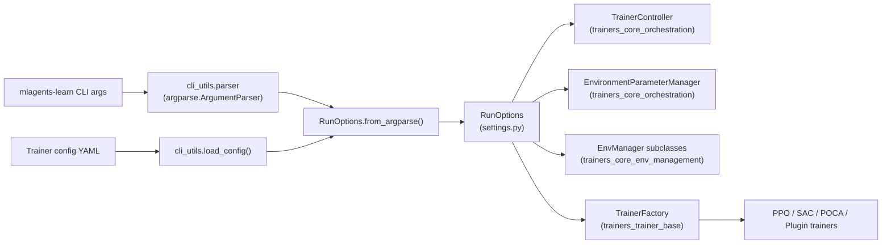
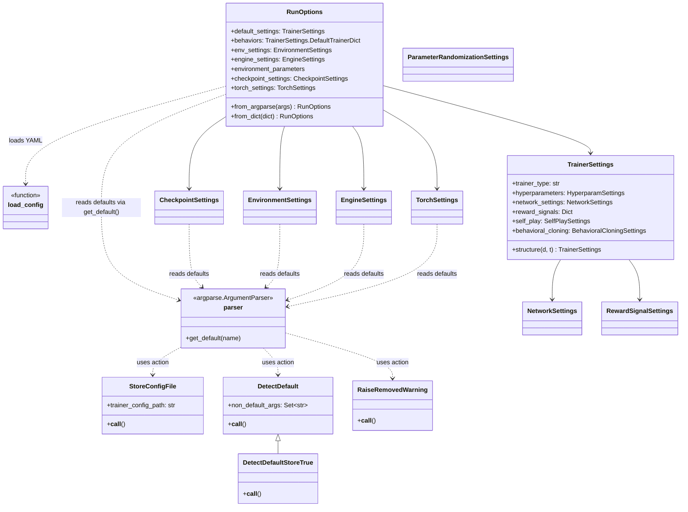
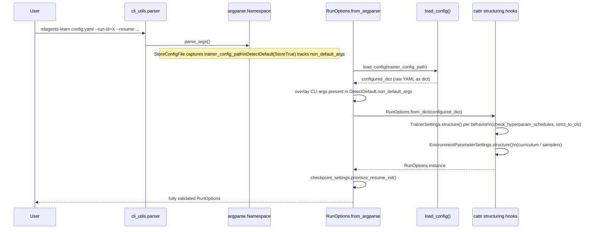

# Trainers Core Config

## Purpose

`trainers_core_config` is the configuration backbone of the ML-Agents Python trainer
(`ml-agents/mlagents/trainers`). It is responsible for two closely related concerns:

1. **Parsing command-line invocation** of the `mlagents-learn` executable (flags such as
   `--run-id`, `--env`, `--resume`, engine/graphics options, torch device, etc.).
2. **Defining and validating the full configuration schema** for a training run — trainer
   hyperparameters, network architecture, reward signals, environment parameter
   randomization/curricula, checkpointing, and engine/environment settings — merging
   values coming from a YAML config file with values coming from the command line into a
   single, strongly-typed `RunOptions` object.

Every other trainer component (the [orchestration layer](trainers_core_orchestration.md),
the [trainer base classes](trainers_trainer_base.md), the built-in
[PPO](trainers_ppo.md)/[SAC](trainers_sac.md)/[POCA](trainers_poca.md) algorithms, and
external [plugin trainers](trainer_plugin_a2c.md) such as
[A2C](trainer_plugin_a2c.md)/[DQN](trainer_plugin_dqn.md)) consumes the typed settings
objects produced here (`TrainerSettings`, `NetworkSettings`, `RewardSignalSettings`, etc.)
rather than parsing configuration themselves. This makes `trainers_core_config` the single
source of truth for "how was this run configured."

## Where it fits in the system

`trainers_core_config` is a child of [trainers_core](trainers_core.md), the broader
runtime/support layer for the Python trainer process. It sits *before* everything else in
the training pipeline: the CLI is parsed, a `RunOptions` is built, and only then does
[`TrainerController`](trainers_core_orchestration.md) (in `trainers_core_orchestration`)
spin up environments (via [`trainers_core_env_management`](trainers_core_env_management.md))
and trainers (via [`trainers_trainer_base`](trainers_trainer_base.md) /
[`trainers_ghost`](trainers_ghost.md)).

## Sub-modules

`trainers_core_config` is split into two tightly coupled but independently documented
sub-modules:

| Sub-module | File | Responsibility |
|---|---|---|
| [trainers_core_config_cli](trainers_core_config_cli.md) | `cli_utils.py` | Defines the `argparse` parser and custom `Action` classes used to build the CLI, and loads/parses YAML config files into raw dictionaries. |
| [trainers_core_config_settings](trainers_core_config_settings.md) | `settings.py` | Defines the full `attrs`-based configuration schema (`RunOptions`, `TrainerSettings`, `NetworkSettings`, reward-signal settings, environment-parameter/curriculum settings, checkpoint/engine/environment/torch settings) and the `cattr`-based structuring/validation logic that merges CLI args and YAML into one object graph. |

See [trainers_core_config_cli.md](trainers_core_config_cli.md) and
[trainers_core_config_settings.md](trainers_core_config_settings.md) for full component-level
detail.

## High-level architecture

## Configuration resolution flow

The following sequence shows how a training run's final configuration is assembled,
combining defaults, YAML file contents, and explicit CLI overrides.

## Key design points

- **Single parser instance**: `cli_utils.py` builds one module-level `parser` object; every
  `attrs`-based settings class in `settings.py` reads its default value from
  `parser.get_default(...)` so CLI defaults and dataclass defaults never diverge.
- **`DetectDefault` tracking**: custom `argparse.Action` subclasses record which CLI flags
  were *explicitly* passed by the user (`DetectDefault.non_default_args`). This lets
  `RunOptions.from_argparse` know whether to let a YAML value stand or override it with the
  CLI value — including special-case conflict resolution between `--resume` and
  `--initialize-from` (`CheckpointSettings.prioritize_resume_init`).
- **`attrs` + `cattr` schema**: the entire settings tree is declared with `attr.s` classes
  and (de)serialized with `cattr`, using custom structure/unstructure hooks
  (`TrainerSettings.structure`, `ParameterRandomizationSettings.structure/unstructure`,
  `EnvironmentParameterSettings.structure`, `RewardSignalSettings.structure`) to support
  polymorphic config sections (different trainer types, different reward signals, different
  parameter-randomization samplers, curriculum lessons).
- **Extensibility via plugins**: `TrainerSettings` resolves its `hyperparameters` type
  through `mlagents.plugins.all_trainer_settings`/`all_trainer_types`, which is how
  built-in algorithms ([PPO](trainers_ppo.md), [SAC](trainers_sac.md),
  [POCA](trainers_poca.md)) and external ones
  ([A2C](trainer_plugin_a2c.md), [DQN](trainer_plugin_dqn.md)) plug their own
  `*Settings` (e.g. `PPOSettings`, `SACSettings`, `POCASettings`, `A2CSettings`,
  `DQNSettings`) into the same configuration mechanism without modifying this module.
- **Downstream consumption**: `RunOptions` is produced once at start-up and threaded through
  [`TrainerController`](trainers_core_orchestration.md),
  [`EnvironmentParameterManager`](trainers_core_orchestration.md),
  the [`EnvManager` family](trainers_core_env_management.md), and
  [`TrainerFactory`](trainers_trainer_base.md), which uses `TrainerSettings` per behavior
  name to instantiate the correct trainer/optimizer/policy stack.

## Related modules

- [trainers_core.md](trainers_core.md) — parent module; general trainer runtime support.
- [trainers_core_orchestration.md](trainers_core_orchestration.md) — consumes `RunOptions`
  to drive the main training loop.
- [trainers_core_env_management.md](trainers_core_env_management.md) — consumes
  `EnvironmentSettings`/`EngineSettings` to launch and manage Unity environment instances.
- [trainers_trainer_base.md](trainers_trainer_base.md) — `TrainerFactory` consumes
  `TrainerSettings` to build concrete trainers.
- [trainers_ppo.md](trainers_ppo.md), [trainers_sac.md](trainers_sac.md),
  [trainers_poca.md](trainers_poca.md) — built-in algorithms that extend
  `HyperparamSettings`/`RewardSignalSettings`.
- [trainer_plugin_a2c.md](trainer_plugin_a2c.md), [trainer_plugin_dqn.md](trainer_plugin_dqn.md)
  — external algorithm plugins that extend the same settings mechanism.
- [envs_sidechannel_channels.md](envs_sidechannel_channels.md) — `EnvironmentParametersChannel`,
  used by `ParameterRandomizationSettings.apply()` to push sampler configuration into Unity.
