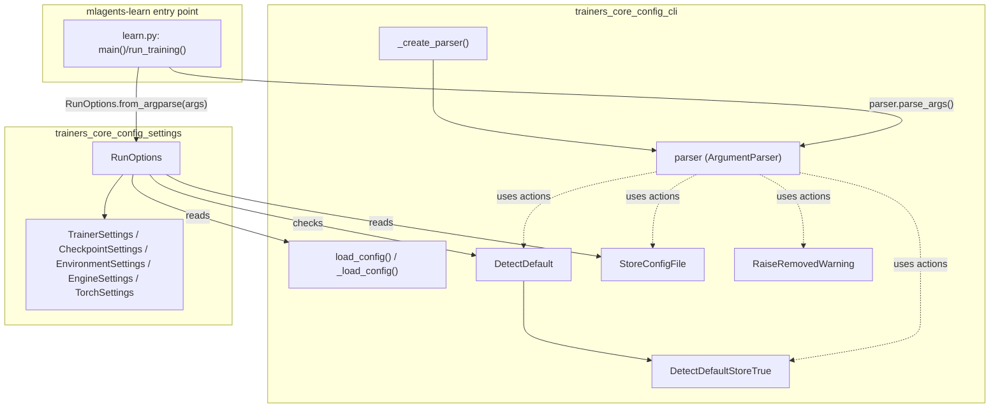
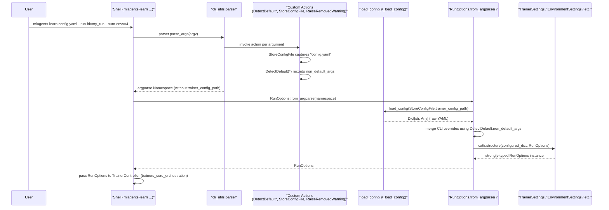
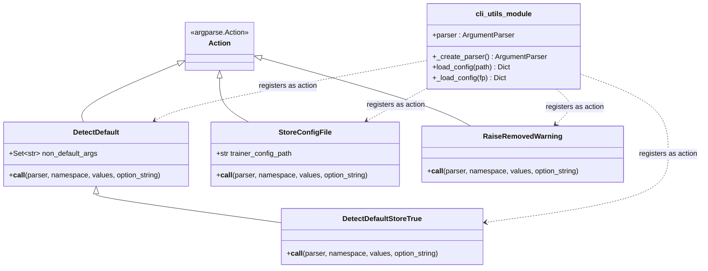
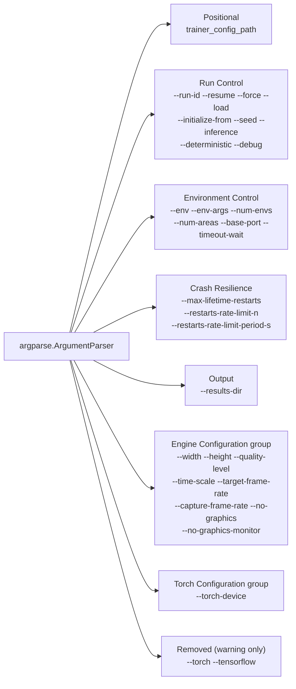
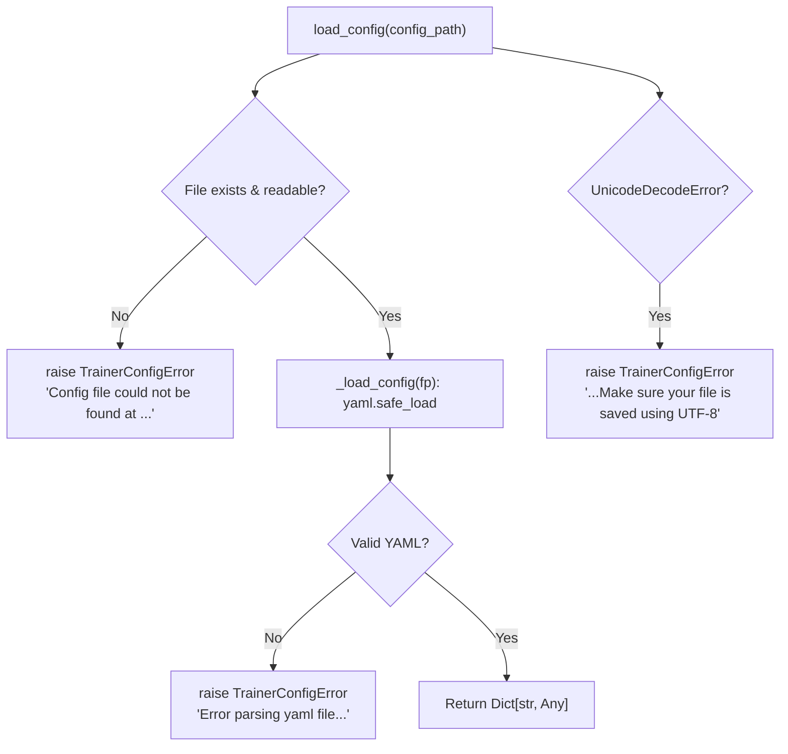

# Trainers Core Config CLI

## Introduction

The **Trainers Core Config CLI** module is the command-line entry point for the ML-Agents Python training toolkit (`mlagents-learn`). It defines the full set of command-line arguments accepted by the trainer, provides the `argparse.Action` subclasses used to track which arguments were explicitly supplied by the user (as opposed to defaults), and exposes utilities for loading the YAML trainer configuration file from disk.

This module is intentionally small and focused: it does **not** contain the schema for training hyperparameters (that lives in [`trainers_core_config_settings`](trainers_core_config_settings.md)) nor does it run training itself (that is orchestrated by [`trainers_core_orchestration`](trainers_core_orchestration.md)). Instead, it acts as the **bridge between the shell/CLI world and the structured configuration world**, producing a `Namespace` of parsed arguments and a raw YAML dictionary that downstream code (`RunOptions.from_argparse`) merges into strongly-typed settings objects.

It is a child of [`trainers_core_config`](trainers_core_config.md), sibling to [`trainers_core_config_settings`](trainers_core_config_settings.md), inside the larger [`Training_Orchestration_&_Lifecycle_Infrastructure`](trainers_core.md) module.

---

## Module Purpose & Responsibilities

| Responsibility | Description |
|---|---|
| **CLI argument definition** | Declares every flag accepted by `mlagents-learn` (env path, run-id, seed, engine configuration, torch device, restart/rate-limit policy, etc.) via a single `argparse.ArgumentParser`. |
| **Default-vs-explicit tracking** | Custom `argparse.Action` subclasses record which arguments were *actually passed* on the command line, so that CLI values can correctly override YAML config values without CLI defaults silently clobbering YAML settings. |
| **Config file path capture** | Captures the positional `trainer_config_path` argument outside of the normal `Namespace` so it doesn't get treated as a "training setting" itself. |
| **YAML loading** | Loads and parses the trainer configuration YAML file into a plain `Dict[str, Any]`, raising descriptive `TrainerConfigError`s on I/O or parsing failures. |
| **Deprecation handling** | Provides a mechanism (`RaiseRemovedWarning`) to keep removed flags (e.g. `--torch`, `--tensorflow`) parseable while warning users they no longer have any effect. |

---

## Core Components

### `cli_utils.py`

| Component | Type | Purpose |
|---|---|---|
| `DetectDefault` | `argparse.Action` (base) | Records into a class-level `Set[str]` (`non_default_args`) which destination names were explicitly set by the user. |
| `DetectDefaultStoreTrue` | `argparse.Action` | Same as `DetectDefault` but for boolean flags (`store_true` semantics) — sets the value to `True` and records it as non-default. |
| `StoreConfigFile` | `argparse.Action` | Captures the positional trainer config YAML path into a class attribute (`StoreConfigFile.trainer_config_path`) and removes it from the parsed `Namespace`, since the config path itself is not a trainer setting. |
| `RaiseRemovedWarning` | `argparse.Action` | Used for deprecated/removed arguments (`--torch`, `--tensorflow`); logs a warning instead of raising an error, preserving backward CLI compatibility. |
| `_create_parser()` | function | Builds and returns the fully configured `argparse.ArgumentParser`, including argument groups for "Engine Configuration" and "Torch Configuration". |
| `load_config(config_path)` | function | Opens the YAML file at `config_path`, delegates to `_load_config`, and converts I/O / decode errors into `TrainerConfigError`. |
| `_load_config(fp)` | function | Parses a YAML file-like object via `yaml.safe_load`, converting `yaml.parser.ParserError` into a friendly `TrainerConfigError`. |
| `parser` | module-level singleton | The result of `_create_parser()`, imported and used by both the CLI entry point and `RunOptions.from_argparse`. |

---

## Architecture

### Relationship to other modules

- **[`trainers_core_config_settings`](trainers_core_config_settings.md)** — `RunOptions.from_argparse()` is the primary consumer of this module. It calls `parser.parse_args()` indirectly (via the CLI entry point), reads `StoreConfigFile.trainer_config_path`, calls `load_config()` to parse the YAML, and inspects `DetectDefault.non_default_args` to decide which CLI-supplied values should override YAML-supplied values.
- **[`trainers_core_orchestration`](trainers_core_orchestration.md)** — `TrainerController` and the training entry point consume the final `RunOptions` object (built using this module) to configure the full training run (checkpointing, environment settings, engine settings, etc.).
- **[`envs_core_api`](envs_core_api.md)** — `UnityEnvironment.BASE_ENVIRONMENT_PORT` is imported here as the default value for `--base-port`, directly tying CLI defaults to the environment communication layer.
- **`mlagents.trainers.exception.TrainerConfigError`** — used throughout for consistent, user-facing configuration error reporting.

---

## Data Flow: From Shell Command to `RunOptions`

**Key design point:** because `argparse` always assigns a default value to every argument (even when the user didn't type it), a naive merge of CLI args over YAML config would always let CLI defaults silently override YAML settings. The `DetectDefault` family of actions solves this by recording, in a class-level set, only the destinations that were **actually supplied** on the command line. `RunOptions.from_argparse` uses `DetectDefault.non_default_args` as an allow-list when copying CLI values into the configuration dictionary, ensuring YAML values are only overridden when the user explicitly passed the corresponding flag.

---

## Component Interaction Detail

---

## Argument Categories

The parser produced by `_create_parser()` organizes arguments into logical groups:

Each of these groups corresponds directly to a settings dataclass in [`trainers_core_config_settings`](trainers_core_config_settings.md):

| CLI Group | Corresponding Settings Class |
|---|---|
| Run Control / Output | `CheckpointSettings` |
| Environment Control | `EnvironmentSettings` |
| Engine Configuration | `EngineSettings` |
| Torch Configuration | `TorchSettings` |

This mapping is exploited directly inside `RunOptions.from_argparse`, which checks `key in attr.fields_dict(<SettingsClass>)` to route each non-default CLI argument to the correct nested settings dictionary before structuring the final `RunOptions`.

---

## Error Handling

All configuration-related failures surface as `TrainerConfigError` (defined in `mlagents.trainers.exception`), giving users consistent, actionable error messages regardless of whether the failure originated from a missing file, an encoding issue, or malformed YAML.

---

## Usage Notes for Maintainers

- **Adding a new CLI flag**: add the `argparser.add_argument(...)` call in `_create_parser()`, choose the appropriate `action` (`DetectDefault`, `DetectDefaultStoreTrue`, or plain default if the value should always apply), and add a matching field to the correct dataclass in `settings.py` (see [`trainers_core_config_settings`](trainers_core_config_settings.md)) so `RunOptions.from_argparse` can route it correctly.
- **Deprecating a flag**: switch its `action` to `RaiseRemovedWarning` rather than deleting it outright, to avoid breaking existing scripts/CI that still pass the flag.
- **`StoreConfigFile.trainer_config_path` and `DetectDefault.non_default_args` are class-level (mutable, shared) state.** This is convenient for the single-process CLI use case but should be reset/handled carefully in tests that invoke `parser.parse_args()` or `RunOptions.from_argparse()` multiple times in the same process.
- The module has no direct dependency on Torch, gRPC, or Unity runtime code — its only external dependency of note is `mlagents_envs.environment.UnityEnvironment` (for the default base port constant), keeping it lightweight and quick to import from the `mlagents-learn` console script.

---

## Related Documentation

- [`trainers_core_config`](trainers_core_config.md) — parent module covering the full configuration subsystem.
- [`trainers_core_config_settings`](trainers_core_config_settings.md) — defines `RunOptions` and all the typed settings dataclasses that this module's parsed arguments are merged into.
- [`trainers_core_orchestration`](trainers_core_orchestration.md) — consumes the final `RunOptions` to drive `TrainerController` and manage the training lifecycle.
- [`envs_core_api`](envs_core_api.md) — source of `UnityEnvironment.BASE_ENVIRONMENT_PORT`, referenced as a CLI default.
