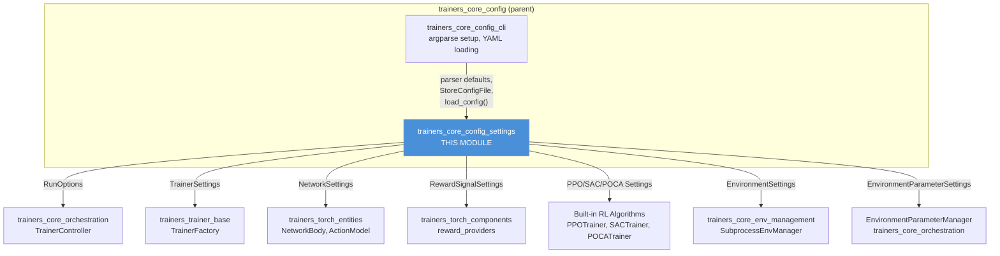
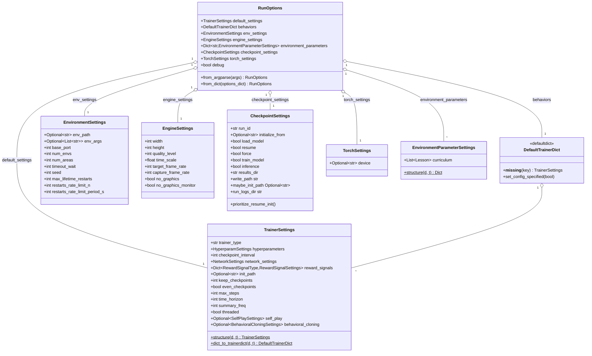
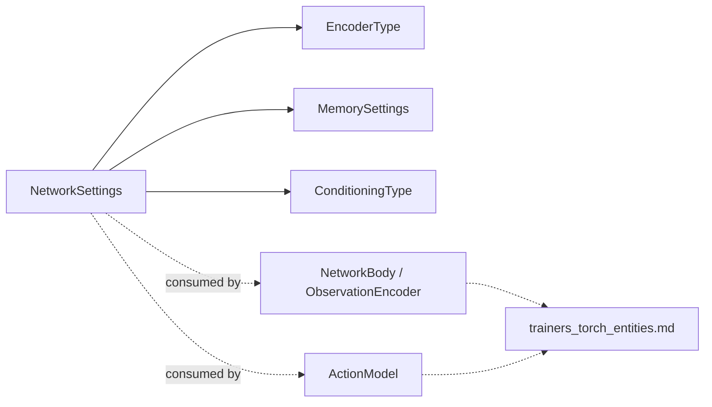
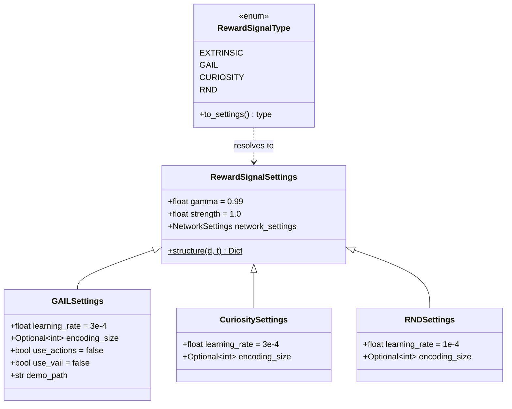
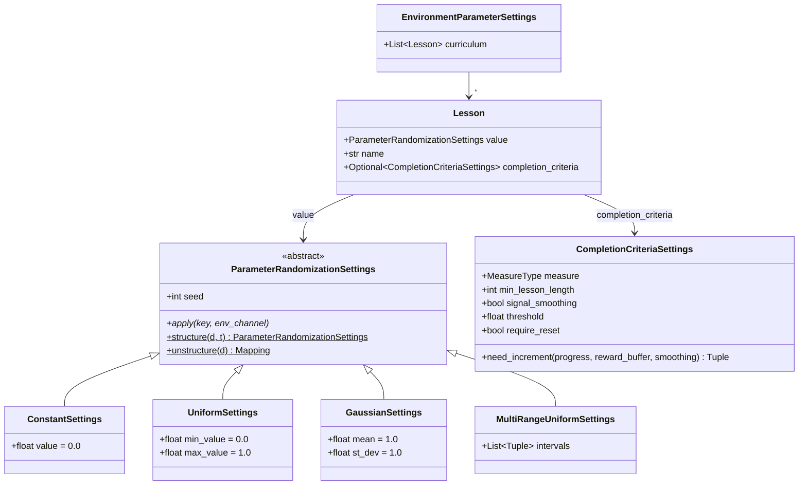
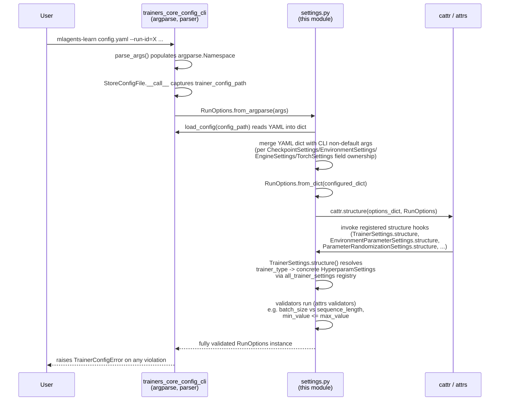
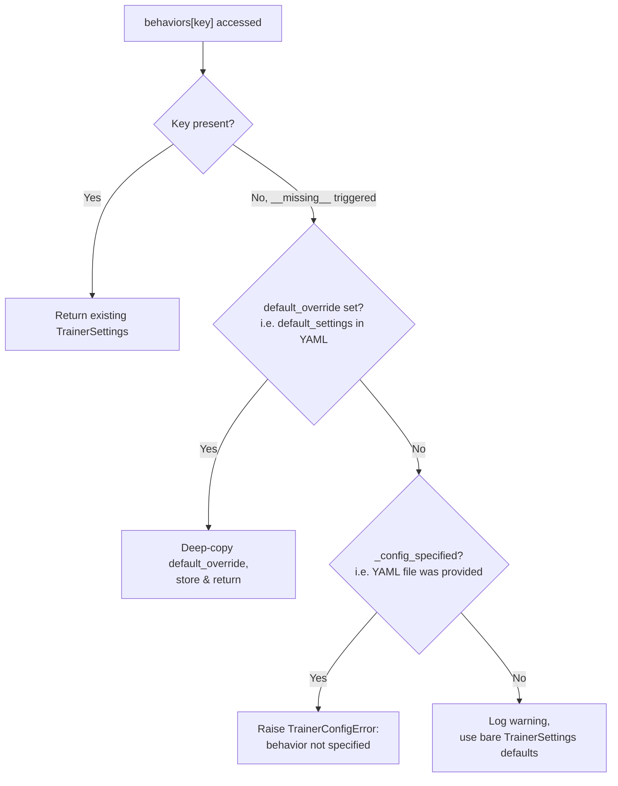
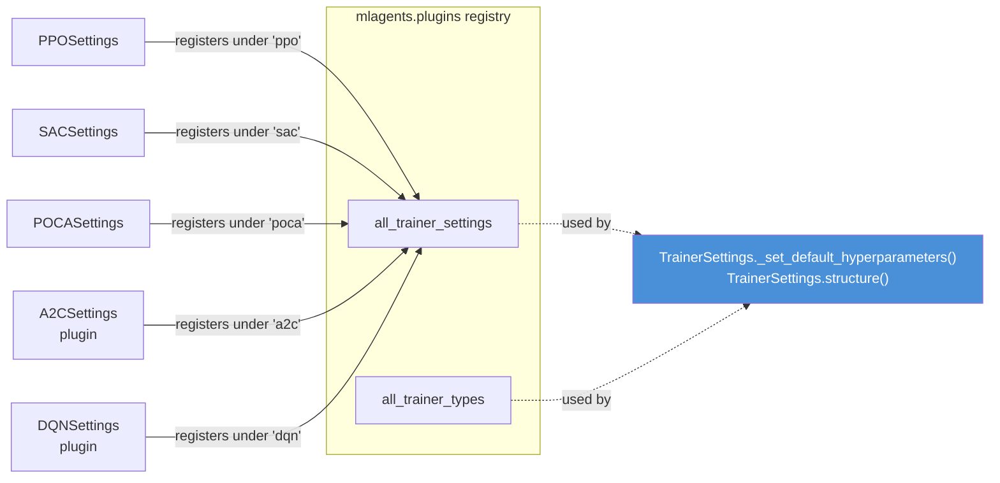

# Trainers Core Config Settings

## Introduction

`trainers_core_config_settings` is the **single source of truth for all typed configuration** used by the ML-Agents Python trainer stack. It is implemented almost entirely in [`ml-agents/mlagents/trainers/settings.py`](#) and defines the `attrs`-based data classes that represent every configurable aspect of a training run: network architecture, hyperparameters for each trainer algorithm, intrinsic reward signals, environment parameter randomization/curricula, checkpointing behavior, and engine/environment/torch runtime options.

This module is the schema and validation layer that sits between:
- **User input** — YAML configuration files and CLI arguments (parsed by [`trainers_core_config_cli`](trainers_core_config_cli.md))
- **Runtime consumers** — the orchestration layer ([`trainers_core_orchestration`](trainers_core_orchestration.md)), trainer implementations ([`trainers_trainer_base`](trainers_trainer_base.md), [`Built-in_RL_Algorithms`](trainers_ppo.md)), and neural network construction ([`Neural_Network_Building_Blocks`](trainers_torch_entities.md))

Because it converts loosely-typed dictionaries (from YAML/CLI) into strongly-typed, validated Python objects, it is the primary guard-rail against misconfiguration in ML-Agents training runs.

---

## Module Position in the System



---

## Core Responsibilities

1. **Typed schema definition** for every trainer-facing configuration object using `attrs` (`@attr.s(auto_attribs=True)`).
2. **Structuring/unstructuring** raw `dict`/YAML data into these typed objects via `cattr`, including custom hooks for polymorphic fields (e.g., choosing `PPOSettings` vs `SACSettings` based on `trainer_type`).
3. **Validation** of cross-field constraints (e.g., memory size must divide batch size, sampler min ≤ max, curriculum lesson chains must be well-formed).
4. **Defaulting** — every field either has a static default or draws its default from CLI parser defaults (via [`trainers_core_config_cli`](trainers_core_config_cli.md)'s `parser.get_default(...)`), guaranteeing CLI and YAML consistency.
5. **Merging CLI overrides into YAML config** through `RunOptions.from_argparse`.
6. **Extensibility hooks** so that external plugins (see [`Extensible_RL_Algorithm_Plugins`](trainer_plugin_a2c.md)) can register new trainer-specific hyperparameter classes via `mlagents.plugins.all_trainer_settings`.

---

## Top-Level Structure (`RunOptions`)

`RunOptions` is the root configuration object for an entire `mlagents-learn` invocation. Everything else in this module is either a field of `RunOptions` or a field nested within one of its fields.



---

## Trainer Hyperparameter Hierarchy

`TrainerSettings.hyperparameters` is polymorphic: its concrete type depends on `trainer_type` and is resolved through the `all_trainer_settings` plugin registry (populated by [`Built-in_RL_Algorithms`](trainers_ppo.md) and [`Extensible_RL_Algorithm_Plugins`](trainer_plugin_a2c.md)).

```mermaid
classDiagram
    class HyperparamSettings {
        +int batch_size = 1024
        +int buffer_size = 10240
        +float learning_rate = 3e-4
        +ScheduleType learning_rate_schedule
    }
    class OnPolicyHyperparamSettings {
        +int num_epoch = 3
    }
    class OffPolicyHyperparamSettings {
        +int batch_size = 128
        +int buffer_size = 50000
        +int buffer_init_steps = 0
        +float steps_per_update = 1
        +bool save_replay_buffer = false
        +float reward_signal_steps_per_update = 4
    }
    HyperparamSettings <|-- OnPolicyHyperparamSettings
    HyperparamSettings <|-- OffPolicyHyperparamSettings

    class PPOSettings {
        (defined in trainers_ppo)
    }
    class POCASettings {
        (defined in trainers_poca)
    }
    class SACSettings {
        (defined in trainers_sac)
    }
    class A2CSettings {
        (Extensible_RL_Algorithm_Plugins)
    }
    class DQNSettings {
        (Extensible_RL_Algorithm_Plugins)
    }
    OnPolicyHyperparamSettings <|-- PPOSettings
    OnPolicyHyperparamSettings <|-- POCASettings
    OnPolicyHyperparamSettings <|-- A2CSettings
    OffPolicyHyperparamSettings <|-- SACSettings
    OffPolicyHyperparamSettings <|-- DQNSettings
```

> Concrete algorithm hyperparameter classes (`PPOSettings`, `SACSettings`, `POCASettings`, `A2CSettings`, `DQNSettings`) live in their respective trainer modules — see [`Built-in_RL_Algorithms`](trainers_ppo.md) and [`Extensible_RL_Algorithm_Plugins`](trainer_plugin_a2c.md) — but they subclass `HyperparamSettings`/`OnPolicyHyperparamSettings`/`OffPolicyHyperparamSettings` defined here.

---

## Network Settings

`NetworkSettings` configures the shared neural-network architecture consumed by [`trainers_torch_entities`](trainers_torch_entities.md) (`NetworkBody`, `ObservationEncoder`, `ActionModel`, etc.):

| Field | Type | Purpose |
|---|---|---|
| `normalize` | `bool` | Enable running observation normalization |
| `hidden_units` | `int` | Width of fully-connected layers |
| `num_layers` | `int` | Depth of fully-connected encoder |
| `vis_encode_type` | `EncoderType` | Visual encoder architecture (`SIMPLE`, `NATURE_CNN`, `RESNET`, `MATCH3`, `FULLY_CONNECTED`) |
| `memory` | `Optional[MemorySettings]` | Enables recurrent (LSTM) policy; validates `memory_size` divisibility/positivity |
| `goal_conditioning_type` | `ConditioningType` | `HYPER` (hypernetwork-based) or `NONE` |
| `deterministic` | `bool` | Deterministic vs. stochastic action selection at inference |



---

## Reward Signal Settings

Intrinsic/extrinsic reward configuration is resolved polymorphically by `RewardSignalType`, mirroring the trainer-hyperparameter pattern. Each subtype maps to a reward provider implemented in [`trainers_torch_components`](trainers_torch_components.md).



`RewardSignalType.to_settings()` is used by `RewardSignalSettings.structure()` (a `cattr` structure hook) to pick the correct subtype while parsing YAML, and each type is ultimately instantiated as a `BaseRewardProvider` subclass at runtime — see [`trainers_torch_components`](trainers_torch_components.md).

---

## Environment Parameter Randomization & Curriculum

Environment parameters support three concepts, all defined in this module:

1. **Samplers** (`ParameterRandomizationSettings` subtypes) — how a scalar parameter value is drawn each episode.
2. **Lessons** — a named sampler bound to an optional `CompletionCriteriaSettings`.
3. **Curricula** (`EnvironmentParameterSettings`) — an ordered list of `Lesson`s for one parameter, consumed by `EnvironmentParameterManager` in [`trainers_core_orchestration`](trainers_core_orchestration.md).



Each sampler's `apply(key, env_channel)` method sends the sampling configuration to Unity through an `EnvironmentParametersChannel` (see [`envs_sidechannel_channels`](envs_sidechannel_channels.md)), decoupling the Python-side schema from the Unity-side side-channel protocol.

---

## Configuration Loading & Structuring Flow

`RunOptions` is produced from CLI args + YAML through a well-defined pipeline that combines this module with [`trainers_core_config_cli`](trainers_core_config_cli.md).



Key structuring/validation utilities defined at module scope:

- `check_and_structure(key, value, class_type)` — validates a field exists on the target attrs class and structures its value with `cattr`.
- `strict_to_cls(d, t)` — structures an entire mapping into an attrs class `t`, rejecting unknown keys.
- `deep_update_dict(d, update_d)` — recursively merges nested dict configs (used to layer `default_settings` under per-behavior overrides).
- `defaultdict_to_dict(d)` — unstructure helper for `collections.defaultdict`-based containers like `TrainerSettings.DefaultTrainerDict`.
- `check_hyperparam_schedules(val, trainer_type)` — backfills `beta_schedule`/`epsilon_schedule` from `learning_rate_schedule` for PPO/POCA if unspecified.

---

## `TrainerSettings.DefaultTrainerDict`: Per-Behavior Configuration

Unity environments can expose multiple distinct "Behaviors" (agent policies). `RunOptions.behaviors` is a `TrainerSettings.DefaultTrainerDict`, a `collections.defaultdict` subclass keyed by behavior name:



This mechanism allows:
- Strict validation when a full YAML config is supplied (every behavior must be explicitly configured or covered by `default_settings`).
- Lenient auto-defaulting when running without a config file (e.g., quick experiments), while still logging a warning.

This dict is consumed directly by `TrainerFactory` (see [`trainers_trainer_base`](trainers_trainer_base.md)) to construct the correct `Trainer`/`Optimizer` per behavior name.

---

## Command-Line & Runtime Settings

Several `attrs` classes mirror groups of CLI flags, each deriving its defaults from the shared `argparse.ArgumentParser` (`parser`) defined in [`trainers_core_config_cli`](trainers_core_config_cli.md):

| Class | Fields (highlights) | Consumed By |
|---|---|---|
| `CheckpointSettings` | `run_id`, `resume`, `force`, `initialize_from`, `results_dir`, `inference` | `TrainerController`, `ModelCheckpointManager` ([`trainers_policy`](trainers_policy.md)) |
| `EnvironmentSettings` | `env_path`, `num_envs`, `num_areas`, `base_port`, `seed`, restart-rate-limiting fields | `SubprocessEnvManager`/`SimpleEnvManager` ([`trainers_core_env_management`](trainers_core_env_management.md)) |
| `EngineSettings` | `width`, `height`, `time_scale`, `no_graphics`, `target_frame_rate` | Unity engine configuration channel ([`envs_sidechannel_channels`](envs_sidechannel_channels.md)) |
| `TorchSettings` | `device` | `TorchPolicy`/`TorchOptimizer` device placement ([`trainers_policy`](trainers_policy.md), [`trainers_optimizer`](trainers_optimizer.md)) |

`CheckpointSettings` also implements `prioritize_resume_init()`, which resolves conflicts when both `--resume` and `--initialize-from` are set (from CLI or YAML), always preferring `resume` and logging a warning when overridden.

`SerializationSettings` (a plain class, not `attrs`) holds static export configuration (`convert_to_onnx`, `onnx_opset`) used by the model export pipeline (`ModelSerializer` in [`trainers_torch_entities`](trainers_torch_entities.md)).

---

## Self-Play Settings

`SelfPlaySettings` configures competitive self-play training, consumed by `GhostTrainer`/`GhostController` (see [`trainers_ghost`](trainers_ghost.md)):

| Field | Default | Description |
|---|---|---|
| `save_steps` | 20000 | Steps between saving a new snapshot opponent |
| `team_change` | `save_steps * 5` | Steps between switching learning team |
| `swap_steps` | 2000 | Steps between swapping opponent snapshot |
| `window` | 10 | Number of snapshots retained for opponent sampling |
| `play_against_latest_model_ratio` | 0.5 | Probability of playing against the most recent policy vs. a historical snapshot |
| `initial_elo` | 1200.0 | Starting ELO rating for self-play ranking |

---

## Behavioral Cloning Settings

`BehavioralCloningSettings` configures pretraining/BC-loss from demonstration data, consumed by `BCModule` in [`trainers_torch_components`](trainers_torch_components.md):

- `demo_path` (required) — path to a `.demo` file (see [`runtime_demonstrations`](runtime_demonstrations.md) / `DemonstrationRecorder`)
- `steps`, `strength`, `samples_per_update`
- `num_epoch`, `batch_size` — `None` defers to the parent trainer's hyperparameters

---

## Extensibility Model

New trainer algorithms (built-in or third-party plugins) integrate with this module purely through **registration**, without modifying `settings.py`:



`TrainerSettings.structure()` looks up `d_copy["trainer_type"]` in `all_trainer_types` (validating it is a recognized value) and `all_trainer_settings` (to select the concrete hyperparameter class), meaning any RL algorithm module that registers itself in these dictionaries automatically gains full YAML/CLI configuration support. See [`Built-in_RL_Algorithms`](trainers_ppo.md) and [`Extensible_RL_Algorithm_Plugins`](trainer_plugin_a2c.md) for concrete examples.

---

## Error Handling

All configuration errors raised by this module use `TrainerConfigError` (and non-fatal issues use `TrainerConfigWarning`), both defined in `mlagents.trainers.exception`. Representative validation failures include:

- Unknown YAML key for a given settings class (`check_and_structure`)
- Invalid `trainer_type`
- Missing `sampler_type`/`sampler_parameters` in a parameter randomization config
- `min_value > max_value` in `UniformSettings`, or malformed intervals in `MultiRangeUniformSettings`
- Non-terminal curriculum lesson missing a `completion_criteria`
- `memory_size` not positive or not divisible by 2
- `sequence_length > batch_size` when memory is enabled
- Behavior name missing from YAML when a full config file is required

These errors surface to the user at CLI startup (via `RunOptions.from_argparse`), before any Unity environment or training loop is started — see [`trainers_core_orchestration`](trainers_core_orchestration.md) for how `TrainerController` consumes the validated `RunOptions`.

---

## Summary of Key Types

| Category | Types |
|---|---|
| Root | `RunOptions` |
| Trainer config | `TrainerSettings`, `TrainerSettings.DefaultTrainerDict`, `HyperparamSettings` (+ On/OffPolicy variants) |
| Network | `NetworkSettings`, `EncoderType`, `ScheduleType`, `ConditioningType` |
| Reward signals | `RewardSignalSettings`, `GAILSettings`, `CuriositySettings`, `RNDSettings`, `RewardSignalType` |
| Env parameter randomization | `ParameterRandomizationSettings`, `ConstantSettings`, `UniformSettings`, `GaussianSettings`, `MultiRangeUniformSettings`, `ParameterRandomizationType` |
| Curriculum | `Lesson`, `CompletionCriteriaSettings`, `CompletionCriteriaSettings.MeasureType`, `EnvironmentParameterSettings` |
| Runtime/CLI | `CheckpointSettings`, `EnvironmentSettings`, `EngineSettings`, `TorchSettings`, `SerializationSettings` |
| Auxiliary trainer features | `SelfPlaySettings`, `BehavioralCloningSettings` |

## Related Modules

- [`trainers_core_config_cli`](trainers_core_config_cli.md) — argparse definitions and YAML loading that feed this module's defaults and raw config dicts.
- [`trainers_core_orchestration`](trainers_core_orchestration.md) — `TrainerController` and `EnvironmentParameterManager`, primary consumers of `RunOptions`.
- [`trainers_trainer_base`](trainers_trainer_base.md) — `TrainerFactory` uses `TrainerSettings.DefaultTrainerDict` to instantiate trainers per behavior.
- [`trainers_core_env_management`](trainers_core_env_management.md) — consumes `EnvironmentSettings` to launch/manage Unity environment subprocesses.
- [`trainers_torch_entities`](trainers_torch_entities.md) / [`trainers_torch_components`](trainers_torch_components.md) — consume `NetworkSettings` and `RewardSignalSettings` respectively.
- [`Built-in_RL_Algorithms`](trainers_ppo.md) and [`Extensible_RL_Algorithm_Plugins`](trainer_plugin_a2c.md) — define concrete `HyperparamSettings` subclasses registered into this module's polymorphic resolution system.
- [`envs_sidechannel_channels`](envs_sidechannel_channels.md) — `EnvironmentParametersChannel` receives sampler configuration via `ParameterRandomizationSettings.apply()`.
