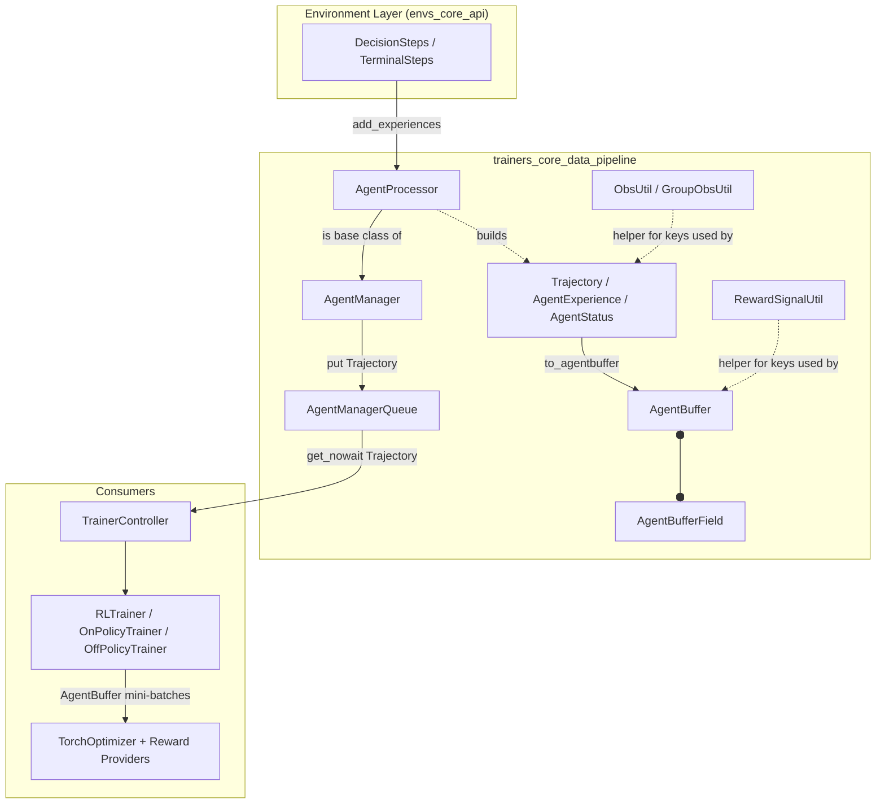
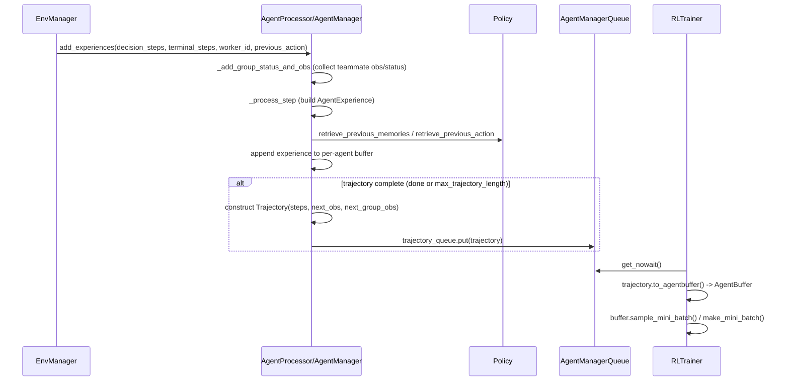
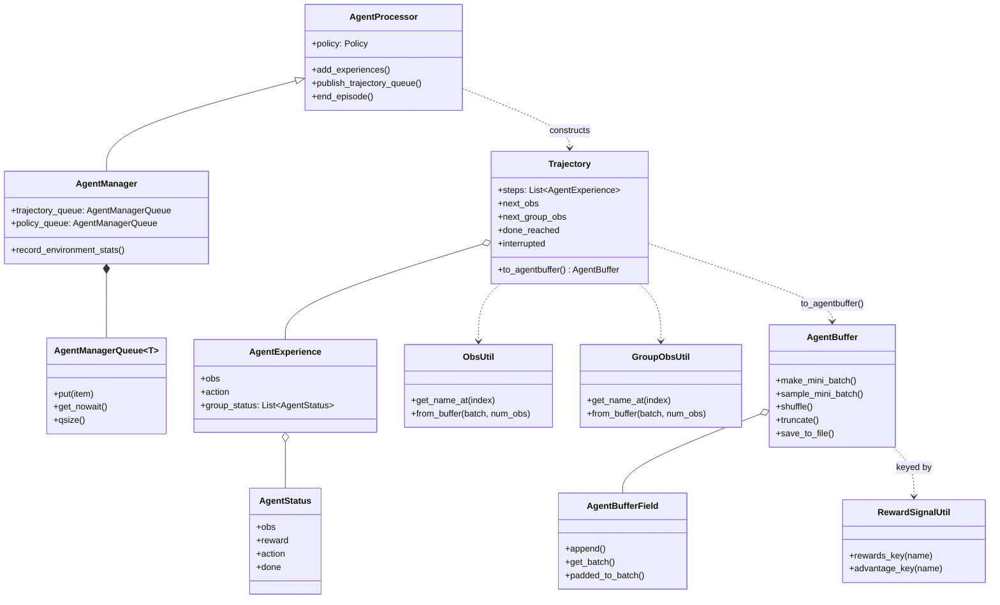

# Trainers Core Data Pipeline

## Introduction and Purpose

The **Trainers Core Data Pipeline** module is the beating heart of the ML-Agents
Python training loop's *data plumbing*: it converts the raw, per-step
observation/reward/action information that streams in from the Unity
environment into the structured, model-ready tensors that RL algorithms
(PPO, SAC, POCA, and community plugins such as A2C/DQN) consume during
optimization.

It sits directly between:

* the **environment management layer** ([trainers_core_env_management](trainers_core_env_management.md)),
  which drives Unity environments and produces `DecisionSteps`/`TerminalSteps`
  (defined in [envs_core_api](envs_core_api.md)), and
* the **trainer/optimizer layer** ([trainers_trainer_base](trainers_trainer_base.md),
  [trainers_optimizer](trainers_optimizer.md), and the concrete algorithms in
  `Built-in_RL_Algorithms` / `Extensible_RL_Algorithm_Plugins`), which consume
  batched `AgentBuffer` mini-batches to compute losses and update networks.

Concretely, the module is responsible for three intertwined concerns:

1. **Per-agent experience assembly** — `AgentManager`/`AgentProcessor` track
   every agent's most recent step, stitch together consecutive steps into
   `AgentExperience` records (including teammate/group information for
   multi-agent scenarios), and emit completed `Trajectory` objects.
2. **Trajectory → tensor conversion** — `Trajectory.to_agentbuffer()`, together
   with the `ObsUtil`/`GroupObsUtil` helpers, flattens a list of
   `AgentExperience` into columnar `AgentBuffer` storage keyed by strongly
   typed `BufferKey`/`ObservationKeyPrefix` enums.
3. **Generic columnar storage & batching** — `AgentBuffer` and
   `AgentBufferField` provide a dict-of-lists data structure with utilities
   for shuffling, mini-batching, sequence padding (for RNNs), truncation, and
   HDF5 persistence, used by every trainer's update step.

## Architecture Overview

### Data Flow (single environment step)

## High-Level Functionality

The module's three source files map to three logically distinct
responsibilities that together form the pipeline. They are documented in
detail below; there are no further child-module documents because the three
files are tightly coupled stages of one linear pipeline rather than
independently deployable sub-systems.

### 1. Agent & Trajectory Assembly — `agent_processor.py`

* **`AgentProcessor`** maintains, per global agent id, the history needed to
  turn consecutive environment steps into `AgentExperience` records:
  * `_last_step_result` / `_last_take_action_outputs`: caches of the previous
    observation and the policy's outputs for that observation (actions,
    log-probs, entropy), used to pair "state at t" with "action taken at t"
    once the reward/next-state at `t+1` arrives.
  * `_current_group_obs` / `_group_status`: per-group-id caches of teammate
    observations/rewards/actions/done flags, enabling cooperative multi-agent
    trajectories (used by POCA-style trainers).
  * `_episode_steps` / `_episode_rewards`: bookkeeping for episode-length and
    cumulative-reward statistics reported via `StatsReporter`
    (see [trainers_core_monitoring](trainers_core_monitoring.md)).
  * `add_experiences(...)` is the main entry point invoked once per step by
    the environment-management layer; it drives group-status collection,
    experience construction (`_process_step`), trajectory emission, and
    cleanup of finished agents (`_clean_agent_data`, `end_episode`).
  * Completed `Trajectory` objects are pushed to any number of subscribed
    `AgentManagerQueue`s via `publish_trajectory_queue`.

* **`AgentManagerQueue[T]`** is a thin, typed wrapper around `queue.Queue`
  that associates a queue with a `behavior_id`, exposing `put`, `get_nowait`,
  `qsize`, and a bounded/unbounded mode; it decouples environment-stepping
  threads/processes from trainer-update threads.

* **`AgentManager`** extends `AgentProcessor` with exactly one
  `trajectory_queue` (bounded, size 20, when threaded) and one unbounded
  `policy_queue`, and adds `record_environment_stats`, which forwards
  environment-emitted custom statistics (`EnvironmentStats`) to the
  `StatsReporter` using the correct aggregation method
  (`AVERAGE`/`SUM`/`HISTOGRAM`/`MOST_RECENT`). One `AgentManager` exists per
  Behavior and is owned by the environment-management layer
  (see `SubprocessEnvManager`/`SimpleEnvManager` in
  [trainers_core_env_management](trainers_core_env_management.md)).

### 2. Trajectory Representation & Flattening — `trajectory.py`

* **`AgentStatus`** — minimal per-step snapshot (`obs`, `reward`, `action`,
  `done`) used to describe *teammates* inside an `AgentExperience`.
* **`AgentExperience`** — the full per-timestep record for the owning agent:
  observations, reward, done/interrupted flags, action + log-probs, action
  mask, previous action, recurrent memory, and the list of teammates'
  `AgentStatus` plus shared `group_reward`.
* **`Trajectory`** — an ordered list of `AgentExperience` plus the
  bootstrapping `next_obs`/`next_group_obs`, agent id, and behavior id.
  * `to_agentbuffer()` is the critical conversion routine: it iterates the
    trajectory step by step and appends every field (observations, next
    observations, actions, log-probs, masks, memory, group/teammate data) into
    a fresh `AgentBuffer`, using strongly typed `BufferKey`s so downstream
    optimizers can address exactly the fields they need.
  * Convenience properties `done_reached`, `all_group_dones_reached`, and
    `interrupted` let trainers reason about episode termination without
    re-inspecting raw steps.
* **`ObsUtil`** / **`GroupObsUtil`** — helpers that generate the
  `(ObservationKeyPrefix, index)` composite keys used to store/retrieve
  per-observation-stream data (current vs. next; individual vs. group), and
  that extract/transpose observation lists back out of an `AgentBuffer` for
  consumption by the [Neural_Network_Building_Blocks](trainers_torch_entities.md)
  encoders (e.g., `ObservationEncoder`, `NetworkBody`).

### 3. Columnar Storage & Batching — `buffer.py`

* **`BufferKey`, `ObservationKeyPrefix`, `RewardSignalKeyPrefix`** — enums
  defining every field name the pipeline knows about (actions, log-probs,
  rewards, dones, group fields, memory, advantages, returns, etc.), plus the
  composite-key type `AgentBufferKey`. Using enums instead of raw strings
  gives compile-time-checkable, collision-free field identifiers shared
  across the entire trainer stack.
* **`RewardSignalUtil`** — static factory methods that build the
  `(RewardSignalKeyPrefix, name)` keys for a named reward signal's rewards,
  value estimates, returns, advantages, and baselines — used by reward
  providers in [Neural_Network_Building_Blocks](trainers_torch_components.md)
  (extrinsic/GAIL/RND/curiosity) and by `RLTrainer` when writing signal
  outputs into the shared buffer.
* **`AgentBufferField`** — a `list` subclass representing a single named
  column of data (one entry per timestep). Provides:
  * `append`/`set`/`reset_field` for mutation, with per-field `padding_value`.
  * `get_batch(batch_size, training_length, sequential)` to extract
    (optionally overlapping) sequences, needed for LSTM training.
  * `padded_to_batch(...)` / `to_ndarray()` to materialize the column as a
    dense `np.ndarray` (or, for group fields containing variable numbers of
    teammates, a list of padded arrays) ready to feed into PyTorch.
* **`AgentBuffer`** — a `MutableMapping` from `AgentBufferKey` to
  `AgentBufferField`, i.e., a dict-of-columns table representing one agent's
  (or one mini-batch's) full experience:
  * `make_mini_batch(start, end)` / `sample_mini_batch(batch_size, sequence_length)`
    — slice or randomly sample contiguous sequences for SGD updates.
  * `shuffle(sequence_length, key_list)` — consistently reshuffle multiple
    columns together (preserving row alignment) before epoch iteration.
  * `truncate(max_length, sequence_length)` — bound memory growth by dropping
    old experiences once a trainer's buffer exceeds its configured size.
  * `resequence_and_append(target_buffer, ...)` — append this buffer's data
    into another buffer with padding, used when merging trajectories from
    multiple agents into one trainer-wide `AgentBuffer`.
  * `save_to_file` / `load_from_file` — HDF5 (de)serialization, mainly used
    for testing and for behavioral-cloning demonstration replay
    (see `DemonstrationRecorder`/`DemonstrationSummary` in
    [runtime_demonstrations](runtime_demonstrations.md) and the offline
    Editor-side demonstration tooling in
    [editor_core_demonstration_tooling](editor_core_demonstration_tooling.md)).
  * `num_experiences` — the canonical "buffer length" property, requiring all
    fields to remain equal length (validated via `check_length`).

## Component Relationships

## How This Module Fits Into the Overall System

* **Upstream dependency**: `AgentProcessor.add_experiences` is fed
  `DecisionSteps`/`TerminalSteps` (from [envs_core_api](envs_core_api.md)) and
  a `Policy` (from [trainers_policy](trainers_policy.md)) by the
  environment-management layer described in
  [trainers_core_env_management](trainers_core_env_management.md).
* **Sibling dependency**: statistics generated while assembling trajectories
  (episode length, entropy, custom environment stats) are reported through
  `StatsReporter`, documented in
  [trainers_core_monitoring](trainers_core_monitoring.md).
* **Downstream consumers**: `TrainerController`
  ([trainers_core_orchestration](trainers_core_orchestration.md)) drains each
  `AgentManager`'s `trajectory_queue`; the base trainer classes
  (`RLTrainer`, `OnPolicyTrainer`, `OffPolicyTrainer` in
  [trainers_trainer_base](trainers_trainer_base.md)) call
  `Trajectory.to_agentbuffer()` and accumulate the results into a
  trainer-wide `AgentBuffer`. Optimizers
  ([trainers_optimizer](trainers_optimizer.md)) and concrete algorithms
  (PPO/SAC/POCA and the A2C/DQN plugins) then call `sample_mini_batch` /
  `make_mini_batch` to produce the tensors fed into the neural network
  building blocks described in
  [trainers_torch_entities](trainers_torch_entities.md) and
  [trainers_torch_components](trainers_torch_components.md).
* **Configuration**: buffer sizing, sequence length, and time-horizon
  settings originate from `TrainerSettings`/`NetworkSettings`
  (see [trainers_core_config_settings](trainers_core_config_settings.md)).

In short, this module is the *translation layer* that makes the rest of the
training stack agnostic to how many agents, environments, or workers are
running: everything downstream only ever sees clean `Trajectory` and
`AgentBuffer` objects.
