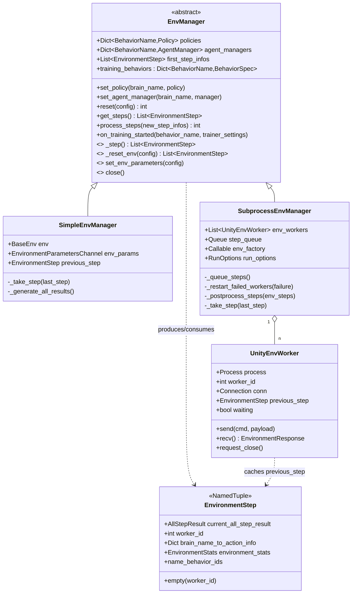
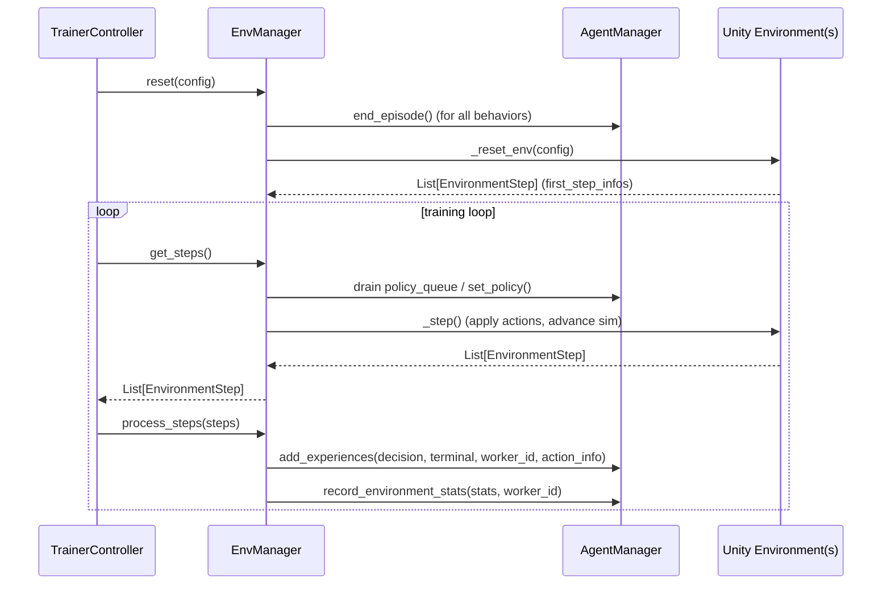
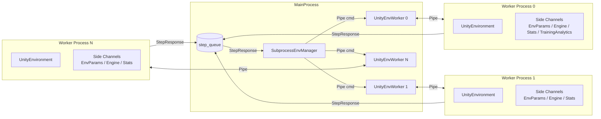
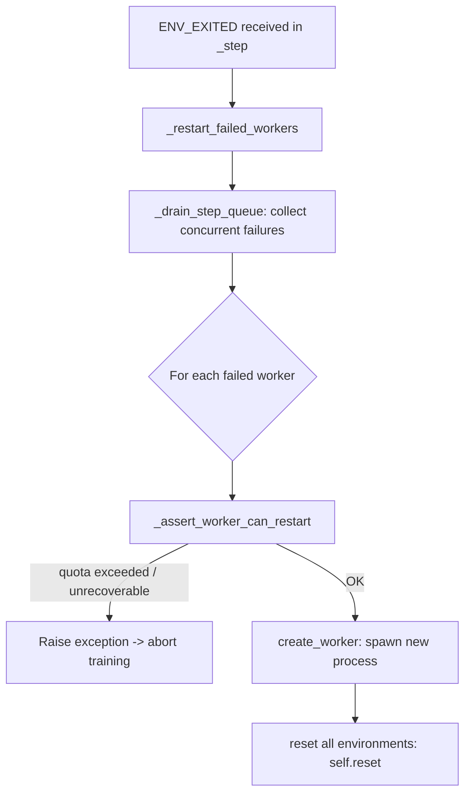
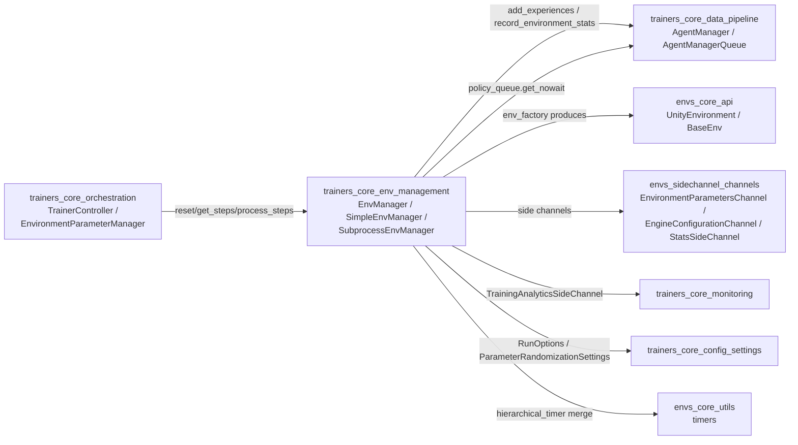

# Trainers Core: Environment Management

## 1. Purpose

The **Environment Management** module is the abstraction layer that sits between the ML-Agents
**training loop** (`TrainerController`, see [trainers_core_orchestration](trainers_core_orchestration.md))
and the actual **Unity simulation environment(s)** (`UnityEnvironment`, see
[envs_core_api](envs_core_api.md)).

It is responsible for:

- Defining a uniform interface (`EnvManager`) for stepping, resetting, and querying one or more
  Unity environment instances, regardless of whether they run in-process or in separate
  subprocesses.
- Feeding environment step results (observations, rewards, done flags) into the
  per-behavior `AgentManager` pipelines (see [trainers_core_data_pipeline](trainers_core_data_pipeline.md))
  so that trajectories can be assembled and fed to trainers.
- Distributing the latest policy weights to the environment(s) before every step.
- Propagating environment parameter randomization / curriculum settings
  (see [trainers_core_config_settings](trainers_core_config_settings.md)) into the simulation via
  side channels (see [envs_sidechannel_channels](envs_sidechannel_channels.md)).
- Providing production-grade parallelism through multiple worker subprocesses
  (`SubprocessEnvManager`), including automatic restart of crashed Unity instances.
- Providing a simple, single-process implementation (`SimpleEnvManager`) primarily used for
  testing and for simple/non-parallel training setups.

This module is a child of [trainers_core](trainers_core.md) and is a peer of
[trainers_core_data_pipeline](trainers_core_data_pipeline.md),
[trainers_core_monitoring](trainers_core_monitoring.md), and
[trainers_core_orchestration](trainers_core_orchestration.md) within the training infrastructure.

## 2. Module Contents

| File | Core Components |
|---|---|
| `mlagents/trainers/env_manager.py` | `EnvManager` (abstract base class), `EnvironmentStep` (result container) |
| `mlagents/trainers/simple_env_manager.py` | `SimpleEnvManager` |
| `mlagents/trainers/subprocess_env_manager.py` | `EnvironmentCommand`, `UnityEnvWorker`, `SubprocessEnvManager` |

## 3. Architecture Overview

`EnvManager` is an abstract base class that owns the shared bookkeeping (policies, per-behavior
`AgentManager`s, and the "first step" bootstrap after a reset) and defines the abstract contract
that concrete environment managers must implement: `_step()`, `_reset_env()`,
`set_env_parameters()`, `training_behaviors`, and `close()`.

Two concrete implementations exist:

- **`SimpleEnvManager`** — wraps a single `BaseEnv` (typically a `UnityEnvironment`) directly in
  the calling process. Straightforward, synchronous, and easy to debug; used in unit tests and
  simple training scenarios (e.g. `--num-envs=1` without subprocesses).
- **`SubprocessEnvManager`** — spawns `n_env` OS subprocesses, each running its own
  `UnityEnvironment` instance (created via a picklable `env_factory`). Communication with each
  worker happens over a `multiprocessing.Pipe` (for commands) and a shared `multiprocessing.Queue`
  (for step results), enabling steps across environments to be produced and consumed in parallel.
  It also implements crash detection and bounded automatic restart of individual workers.



## 4. Key Concepts

### 4.1 `EnvironmentStep`

A `NamedTuple` that packages a single "tick" of environment results:

- `current_all_step_result`: `Dict[BehaviorName, Tuple[DecisionSteps, TerminalSteps]]` — the raw
  observation/reward data per behavior, using types defined in
  [envs_core_api](envs_core_api.md) (`mlagents_envs.base_env`).
- `worker_id`: which worker (0 for `SimpleEnvManager`, 0..n-1 for `SubprocessEnvManager`) produced
  this step.
- `brain_name_to_action_info`: the `ActionInfo` (from `mlagents.trainers.action_info`) that was
  applied to produce this step — used later to associate actions with the resulting transition
  when building trajectories.
- `environment_stats`: `EnvironmentStats` gathered from the Unity `StatsSideChannel` (see
  [envs_sidechannel_channels](envs_sidechannel_channels.md)).

### 4.2 `EnvManager` Lifecycle

`EnvManager` defines the following high-level orchestration used by `TrainerController`:

1. **`reset(config)`** — ends the current episode on all registered `AgentManager`s, then delegates
   to the abstract `_reset_env(config)` to actually reset the underlying environment(s) and
   capture the initial `EnvironmentStep`(s) into `first_step_infos`.
2. **`get_steps()`** —
   - On the very first call after a reset, flushes `first_step_infos` through
     `_process_step_infos()` so `AgentManager`s are properly seeded.
   - Drains each behavior's `policy_queue` (an `AgentManagerQueue`, see
     [trainers_core_data_pipeline](trainers_core_data_pipeline.md)) to pick up the most recent
     policy weights pushed by the trainer, calling `set_policy()`.
   - Delegates to the abstract `_step()` to actually advance the simulation and returns the
     resulting `List[EnvironmentStep]`.
3. **`process_steps(new_step_infos)`** — pushes the `DecisionSteps`/`TerminalSteps` and associated
   `ActionInfo` for every behavior into the corresponding `AgentManager.add_experiences()`, and
   forwards `environment_stats` via `AgentManager.record_environment_stats()`. This is the bridge
   from raw environment output into the trajectory-building pipeline described in
   [trainers_core_data_pipeline](trainers_core_data_pipeline.md).



### 4.3 Environment Parameters & Policy Distribution

Both `SimpleEnvManager.set_env_parameters()` and `SubprocessEnvManager.set_env_parameters()`
forward a `Dict[str, Union[float, ParameterRandomizationSettings]]` (produced by
`EnvironmentParameterManager`, see [trainers_core_orchestration](trainers_core_orchestration.md))
to the environment(s) through an `EnvironmentParametersChannel` side channel
(see [envs_sidechannel_channels](envs_sidechannel_channels.md)). `SubprocessEnvManager` sends this
as an `EnvironmentCommand.ENVIRONMENT_PARAMETERS` message to each worker, where the channel lives
inside the worker subprocess.

## 5. `SimpleEnvManager`

`SimpleEnvManager` wraps exactly one `BaseEnv` and runs entirely in the calling process:

- `_step()`: computes actions for every behavior via `self.policies[brain_name].get_action(...)`
  (worker id fixed to `0`), applies them with `env.set_actions()`, calls `env.step()`, then reads
  back results with `env.get_steps()` for every behavior into a single `EnvironmentStep`.
- `_reset_env(config)`: applies environment parameters, calls `env.reset()`, and builds the initial
  `EnvironmentStep`.
- `training_behaviors`: simply proxies `env.behavior_specs`.

This class has no subprocess/queue machinery and is the natural choice for unit tests
(e.g., with `mlagents_envs.mock_communicator.MockCommunicator`-backed environments) or single,
non-parallel training runs.

## 6. `SubprocessEnvManager`

`SubprocessEnvManager` is the production implementation used for parallel training across multiple
Unity instances.

### 6.1 Process & Communication Model

- For each of `n_env` workers, a `multiprocessing.Process` running the module-level `worker()`
  function is started, connected to the main process via a `multiprocessing.Pipe`
  (`UnityEnvWorker.conn`) for command/response messages, and a shared `multiprocessing.Queue`
  (`step_queue`) used by *all* workers to publish `STEP` results asynchronously.
- Each worker process:
  1. Deserializes the `env_factory` via `cloudpickle` (needed because plain function objects are
     not picklable, notably on Windows).
  2. Builds its own side channels: `EnvironmentParametersChannel`, `EngineConfigurationChannel`,
     `StatsSideChannel`, and (only for `worker_id == 0`) a `TrainingAnalyticsSideChannel`
     (see [trainers_core_monitoring](trainers_core_monitoring.md) and
     [envs_sidechannel_channels](envs_sidechannel_channels.md)).
  3. Creates its own `UnityEnvironment` via the factory, then loops, handling
     `EnvironmentCommand`s sent from the main process (`STEP`, `BEHAVIOR_SPECS`,
     `ENVIRONMENT_PARAMETERS`, `TRAINING_STARTED`, `RESET`, `CLOSE`).



### 6.2 Stepping Protocol

- `_queue_steps()`: for every worker that is not already `waiting`, computes the next
  `ActionInfo` per behavior via `_take_step()` and sends an `EnvironmentCommand.STEP` message,
  marking the worker as `waiting=True`.
- `_step()`: calls `_queue_steps()`, then polls `step_queue` (non-blocking loop) until at least one
  distinct worker has reported back a `STEP` result; results are turned into `EnvironmentStep`s via
  `_postprocess_steps()`, which also merges each worker's `TimerNode` into the main process' timer
  tree (see `mlagents_envs.timers`, part of [envs_core_utils](envs_core_utils.md)) using
  `hierarchical_timer("workers")`.
- Because `step_queue` is shared across all workers, `SubprocessEnvManager` can return steps as
  soon as *any* subset of workers finish, rather than waiting in lock-step for all of them —
  maximizing throughput across heterogeneous environment speeds.

```mermaid
sequenceDiagram
    participant SEM as SubprocessEnvManager
    participant W as UnityEnvWorker (per worker)
    participant P as Worker Process

    SEM->>SEM: _queue_steps() (for idle workers)
    SEM->>W: send(STEP, action_info)
    W->>P: STEP command
    P->>P: env.set_actions(); env.step(); env.get_steps()
    P->>SEM: step_queue.put(StepResponse)
    SEM->>SEM: poll step_queue (get_nowait loop)
    SEM->>SEM: _postprocess_steps() -> List[EnvironmentStep]
```

### 6.3 Fault Tolerance & Worker Restart

`SubprocessEnvManager` treats `EnvironmentCommand.ENV_EXITED` messages specially:

- `_step()` detects an `ENV_EXITED` response while polling the queue and calls
  `_restart_failed_workers()`.
- `_restart_failed_workers()` drains the entire `step_queue` (`_drain_step_queue()`) to collect any
  *other* concurrent failures, so a batch of simultaneously-crashed workers is handled together.
- For each failed worker, `_assert_worker_can_restart()` checks whether the exception type is
  recoverable (`UnityCommunicationException`, `UnityTimeOutException`,
  `UnityEnvironmentException`, `UnityCommunicatorStoppedException`) and whether the worker is still
  within its restart quota (`_worker_has_restart_quota()`, governed by
  `RunOptions.env_settings.max_lifetime_restarts`,
  `restarts_rate_limit_n`, and `restarts_rate_limit_period_s` — see
  [trainers_core_config_settings](trainers_core_config_settings.md)). If the quota is exceeded, the
  original exception is re-raised and training aborts.
- Workers within quota are recreated with `create_worker()`, and — because all pending training
  trajectories could now be inconsistent — `self.reset(self.env_parameters)` is called to restart
  every environment cleanly.



### 6.4 Shutdown

`close()` requests every worker to close (`UnityEnvWorker.request_close()`), then drains
`step_queue` waiting for `CLOSED` acknowledgements up to `WORKER_SHUTDOWN_TIMEOUT_S` (10s). Any
worker that fails to acknowledge in time is forcibly `terminate()`d and logged as an error, to avoid
leaking zombie processes.

## 7. Relationship to Other Modules



- **[trainers_core_orchestration](trainers_core_orchestration.md)**: `TrainerController` drives the
  main loop by calling `EnvManager.reset()`, `get_steps()`, and `process_steps()`; it also
  registers `AgentManager`s via `set_agent_manager()` and pushes policies via `set_policy()`.
  `EnvironmentParameterManager` supplies the `config` dict consumed by `set_env_parameters()`.
- **[trainers_core_data_pipeline](trainers_core_data_pipeline.md)**: `AgentManager` and
  `AgentManagerQueue` are the consumers of `EnvironmentStep` data (`add_experiences`,
  `record_environment_stats`) and the source of updated `Policy` objects retrieved via
  `policy_queue`.
- **[trainers_core_config_settings](trainers_core_config_settings.md)**: `RunOptions`,
  `EnvironmentSettings`, `EngineSettings`, and `ParameterRandomizationSettings` configure worker
  count, restart quotas, engine parameters, and environment parameter sampling.
- **[envs_core_api](envs_core_api.md)**: `UnityEnvironment` / `BaseEnv`, `BehaviorSpec`,
  `DecisionSteps`, `TerminalSteps` define the low-level environment contract that both
  `SimpleEnvManager` and worker processes in `SubprocessEnvManager` operate against.
- **[envs_sidechannel_channels](envs_sidechannel_channels.md)** /
  **[envs_sidechannel_framework](envs_sidechannel_framework.md)**: side channels used to configure
  engine settings, transmit environment parameters, and collect environment-side statistics.
- **[trainers_core_monitoring](trainers_core_monitoring.md)**: `TrainingAnalyticsSideChannel` is
  instantiated inside worker 0 to report training analytics events back through Unity; `StatsReporter`
  ultimately consumes the `environment_stats` gathered here.
- **[envs_core_utils](envs_core_utils.md)**: `timers` utilities (`TimerNode`, `hierarchical_timer`,
  `reset_timers`, `get_timer_root`) are used to merge per-worker profiling data into the main
  process' timer tree.

## 8. Summary

The `trainers_core_env_management` module cleanly decouples the training loop from the mechanics of
running Unity simulations. `EnvManager` establishes the contract; `SimpleEnvManager` offers a
minimal, single-process reference implementation; and `SubprocessEnvManager` provides the scalable,
fault-tolerant, multi-process implementation used in real training runs — including automatic
detection and bounded restart of crashed Unity environment instances.
