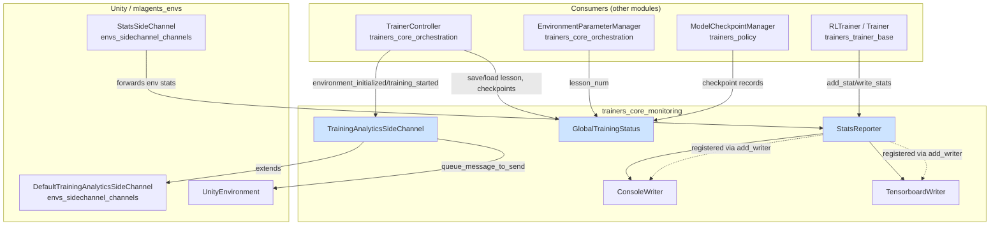
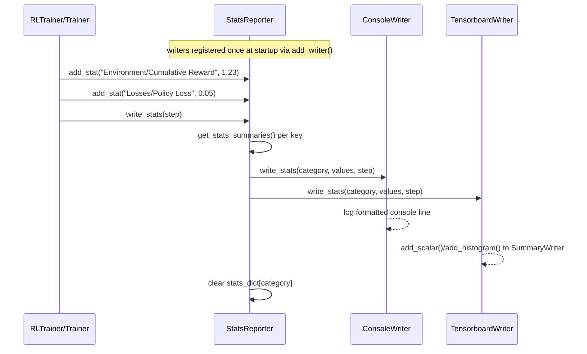
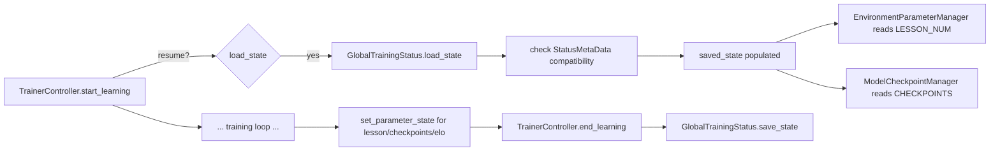
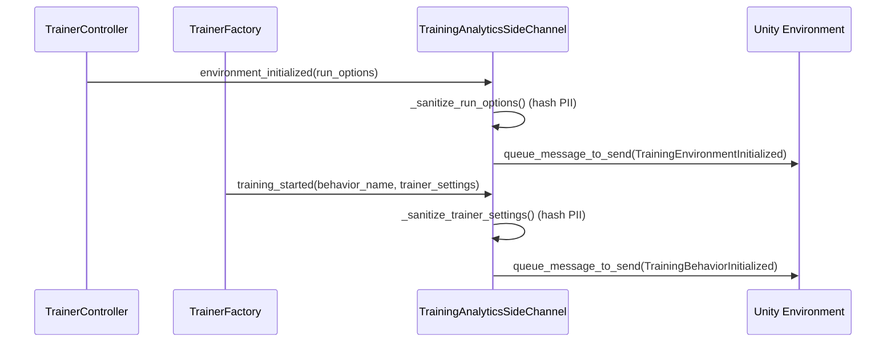
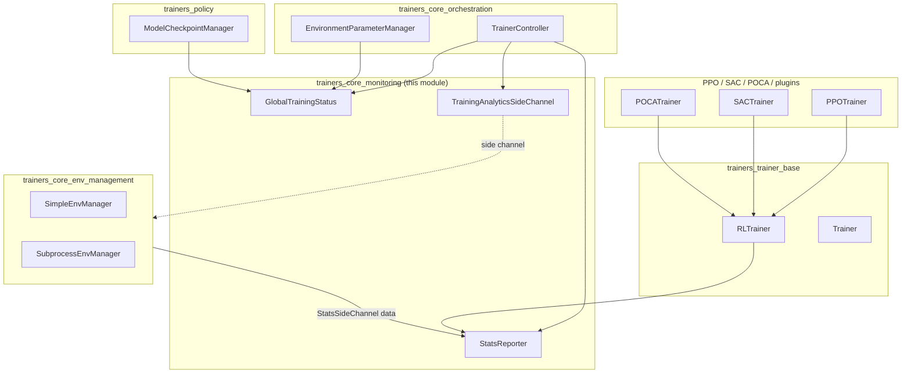

# Trainers Core Monitoring

## Introduction

The **Trainers Core Monitoring** module is the observability backbone of the ML-Agents Python training stack. It is responsible for three closely related concerns:

1. **Statistics collection & reporting** — gathering scalar/histogram metrics produced during training (rewards, losses, policy entropy, etc.) and dispatching them to one or more output sinks (console, TensorBoard, timer gauges).
2. **Training status persistence** — durably recording lightweight state (curriculum lesson number, checkpoint history, ELO ratings) that must survive across training resumptions but doesn't belong inside a model checkpoint.
3. **Training analytics telemetry** — sending anonymized, privacy-scrubbed metadata about a training run (hyperparameters, reward-signal usage, environment configuration) back into the Unity environment for internal analytics logging.

This module sits underneath [`trainers_core_orchestration`](trainers_core_orchestration.md) (the `TrainerController`) and is consumed by nearly every other trainer component — including [`trainers_trainer_base`](trainers_trainer_base.md), [`trainers_core_env_management`](trainers_core_env_management.md), [`trainers_core_data_pipeline`](trainers_core_data_pipeline.md), and the concrete algorithm implementations in [`Built-in_RL_Algorithms`](trainers_ppo.md) ([PPO](trainers_ppo.md), [SAC](trainers_sac.md), [POCA](trainers_poca.md)) — as the common mechanism for emitting metrics and checkpoints of training progress.

It is part of the parent module `Training_Orchestration_&_Lifecycle_Infrastructure`, alongside sibling sub-modules [`trainers_core_config`](trainers_core_config_settings.md), [`trainers_core_env_management`](trainers_core_env_management.md), [`trainers_core_data_pipeline`](trainers_core_data_pipeline.md), and [`trainers_core_orchestration`](trainers_core_orchestration.md).

## Architecture Overview

## Sub-modules

This module has no further sub-module decomposition — it consists of three files that together form a single cohesive "monitoring" concern. Each is documented in detail below.

### 1. Statistics Reporting (`stats.py`)

**Core components:** `StatsReporter`, `StatsWriter` (abstract), `ConsoleWriter`, `TensorboardWriter`, `GaugeWriter`, `StatsSummary`, `StatsPropertyType`.

`StatsReporter` is the central façade used throughout training code to record metric values under a `category` (typically the behavior/trainer name) and a `key` (e.g. `Environment/Cumulative Reward`). It maintains process-wide class-level state (`stats_dict`, `stats_aggregation`) protected by an `RLock`, so multiple trainers/threads can safely add stats concurrently.

Key design points:

- **Registration pattern**: Writers (`ConsoleWriter`, `TensorboardWriter`, `GaugeWriter`) are registered once via the static method `StatsReporter.add_writer()`. All `StatsReporter` instances (one per category) then broadcast to the same shared writer list — this is a class-level Observer pattern.
- **Aggregation methods**: Stats can be aggregated as `AVERAGE`, `SUM`, `MOST_RECENT`, or `HISTOGRAM` (from `mlagents_envs.side_channel.stats_side_channel.StatsAggregationMethod`), letting different metric types be summarized appropriately when flushed.
- **`add_stat` vs `set_stat`**: `add_stat` appends a value to a running list per write cycle (later aggregated); `set_stat` overwrites with the "most recent" value only (used for things like `Is Training` flags).
- **`write_stats(step)`**: flushes accumulated stats for a category into `StatsSummary` objects and dispatches them to every registered `StatsWriter`, then clears the buffer. This is called periodically (typically per-summary-interval) by trainers.
- **Writer implementations**:
  - `ConsoleWriter` — logs a compact, human-readable line per category with elapsed time, mean reward/std, self-play ELO, and training-state.
  - `TensorboardWriter` — creates a per-category `SummaryWriter` (writing to `{base_dir}/{category}`), logs scalars/histograms, and can clear stale event files from previous runs.
  - `GaugeWriter` — mirrors every stat into `mlagents_envs.timers` gauges for offline profiling/analysis (see [`envs_core_utils`](envs_core_utils.md) `TimerNode`/`TimerStack`).

Stats can originate not only from Python-side trainer code but also from the Unity environment itself, forwarded through `StatsSideChannel` (see [`envs_sidechannel_channels`](envs_sidechannel_channels.md)) and relayed into a `StatsReporter` by the environment manager layer ([`trainers_core_env_management`](trainers_core_env_management.md)).

### 2. Training Status Persistence (`training_status.py`)

**Core components:** `StatusType` (Enum), `StatusMetaData`, `GlobalTrainingStatus`.

`GlobalTrainingStatus` is a static/class-level registry (similar in spirit to `StatsReporter`) that stores arbitrary, JSON-serializable state per category that must persist across a `--resume` of training but isn't part of a neural-network checkpoint file. Typical examples:

- Curriculum **lesson number** (`StatusType.LESSON_NUM`), set by `EnvironmentParameterManager` in [`trainers_core_orchestration`](trainers_core_orchestration.md).
- **Checkpoint history** and **final checkpoint** paths (`StatusType.CHECKPOINTS`, `StatusType.FINAL_CHECKPOINT`), set by `ModelCheckpointManager` in [`trainers_policy`](trainers_policy.md).
- Self-play **ELO** rating (`StatusType.ELO`), used by [`trainers_ghost`](trainers_ghost.md).
- **Metadata** (`StatusType.STATS_METADATA`) — records the ML-Agents/PyTorch versions used to produce the saved state, enabling `StatusMetaData.check_compatibility()` to warn users when resuming training with a mismatched version.

Persistence is a simple flat JSON file (`training_status.json` by convention), loaded/saved via `load_state(path)` / `save_state(path)`, both invoked by `TrainerController` at the start/end of a training run (see [`trainers_core_orchestration`](trainers_core_orchestration.md)).

### 3. Training Analytics Telemetry (`training_analytics_side_channel.py`)

**Core component:** `TrainingAnalyticsSideChannel`, which extends `DefaultTrainingAnalyticsSideChannel` from [`envs_sidechannel_channels`](envs_sidechannel_channels.md) (part of the [`Python_Environment_Interface_Layer`](envs_sidechannel_framework.md)).

This side channel pushes structured, privacy-conscious metadata about the training run to the connected Unity environment (for optional internal analytics), using the same channel UUID as `DefaultTrainingAnalyticsSideChannel` so Unity-side handling is unified whether or not the full Python trainer stack is in use.

Two outbound events are supported:

- **`environment_initialized(run_options)`** — sent once when the environment connects; packages Python/ML-Agents/PyTorch versions, device type, number of environments, and a sanitized dump of the full `RunOptions` (see [`trainers_core_config_settings`](trainers_core_config_settings.md)) into a `TrainingEnvironmentInitialized` protobuf message.
- **`training_started(behavior_name, config)`** — sent once per behavior when its `Trainer` begins; packages a `TrainingBehaviorInitialized` protobuf message describing trainer type, which reward signals are enabled (extrinsic/GAIL/curiosity/RND — see [`trainers_torch_components`](trainers_torch_components.md)), network architecture (layers, hidden units, recurrence), self-play/curriculum flags, and a sanitized `TrainerSettings` dump.

**Privacy sanitization**: Both `_sanitize_run_options` and `_sanitize_trainer_settings` deep-copy the config and replace potentially personally-identifiable strings (behavior names, curriculum names, file paths such as `init_path`/`demo_path`/`results_dir`) with an HMAC-SHA256 hash (`_hash`) keyed by a fixed vendor key, before serializing to JSON and embedding in the outgoing protobuf message.

The side channel is registered with the environment/communicator stack alongside other side channels (engine configuration, environment parameters, stats) managed by `SideChannelManager` — see [`envs_sidechannel_framework`](envs_sidechannel_framework.md) and [`envs_sidechannel_channels`](envs_sidechannel_channels.md).

## How This Module Fits Into the System

- **Upstream dependency**: `TrainingAnalyticsSideChannel` depends on the side-channel framework defined in the [Python Environment Interface Layer](envs_sidechannel_framework.md).
- **Downstream consumers**: `TrainerController` and `EnvironmentParameterManager` (in [`trainers_core_orchestration`](trainers_core_orchestration.md)) drive `GlobalTrainingStatus` and instantiate `TrainingAnalyticsSideChannel`; every concrete `Trainer`/`RLTrainer` (in [`trainers_trainer_base`](trainers_trainer_base.md) and the algorithm-specific trainers in [`trainers_ppo`](trainers_ppo.md), [`trainers_sac`](trainers_sac.md), [`trainers_poca`](trainers_poca.md), and the plugin trainers in [`Extensible_RL_Algorithm_Plugins`](trainer_plugin_a2c.md)) call into `StatsReporter` to publish training metrics.
- **Config dependency**: sanitization logic operates on `RunOptions`/`TrainerSettings` defined in [`trainers_core_config_settings`](trainers_core_config_settings.md).

## Summary

`trainers_core_monitoring` provides the shared, thread-safe infrastructure for emitting human-readable console logs, TensorBoard summaries, resumable training state, and anonymized training telemetry. Its class-level static registries (`StatsReporter.writers`, `GlobalTrainingStatus.saved_state`) make it a lightweight, globally-accessible service layer that decouples metric/state producers (trainers, environment managers, parameter managers) from the concrete sinks (console, TensorBoard, JSON file, Unity analytics channel).
