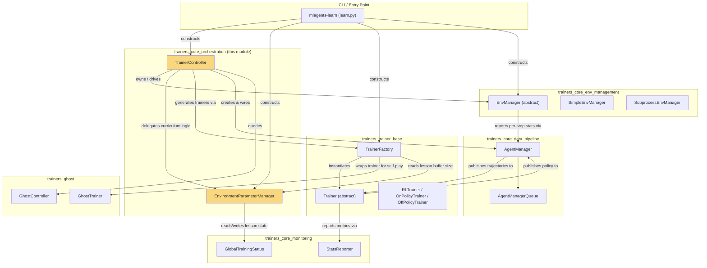
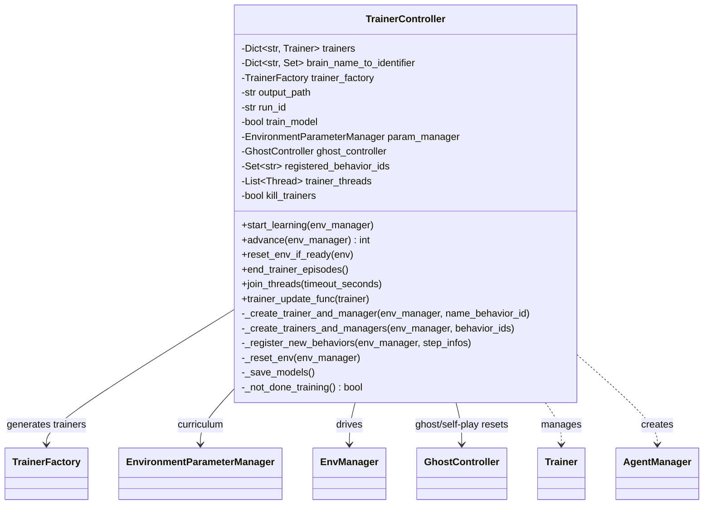
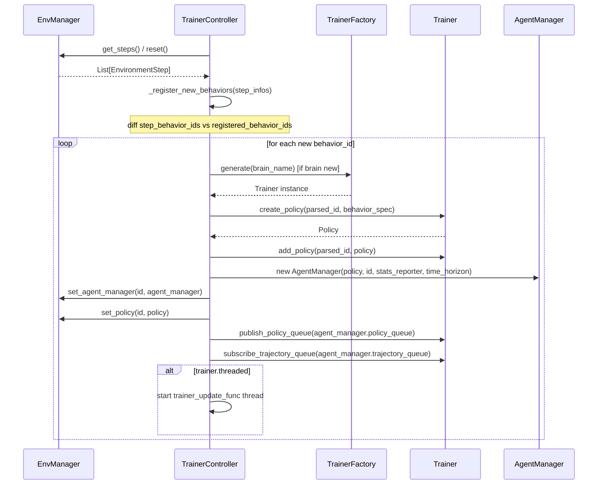
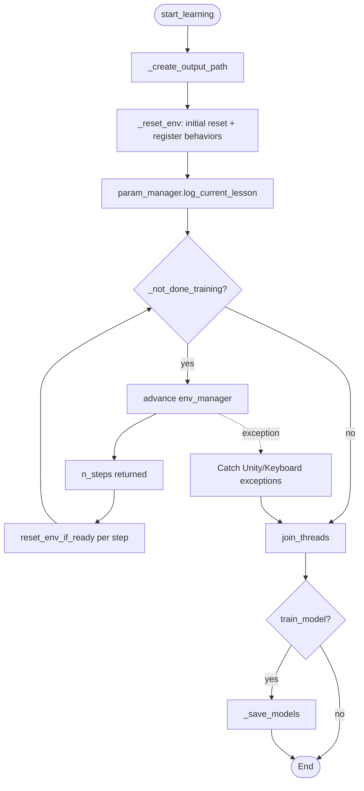
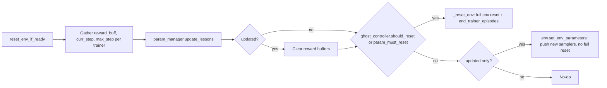
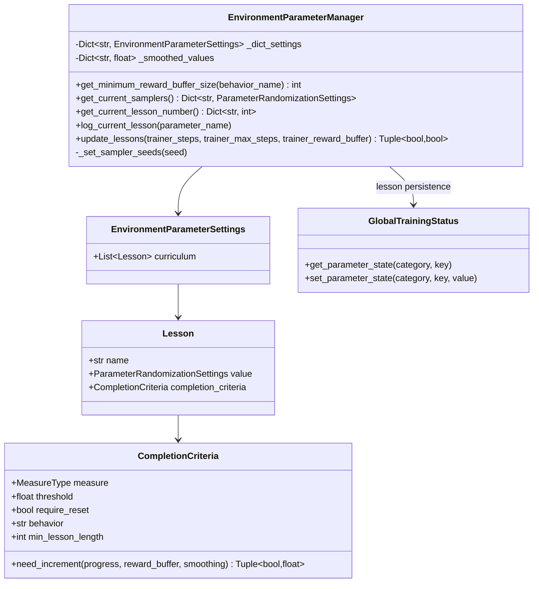
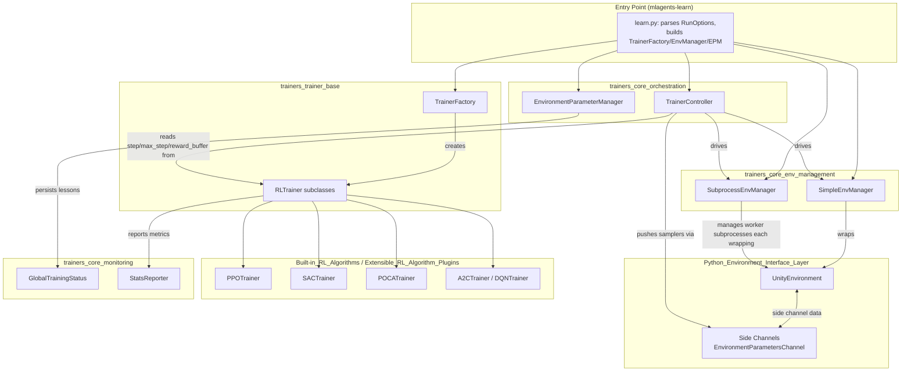

# Trainers Core Orchestration

## Introduction

The **Trainers Core Orchestration** module is the top-level control layer of the ML-Agents training stack. It is responsible for coordinating the entire training loop: creating trainers on demand, driving environment steps, propagating environment-parameter (curriculum) changes, and deciding when training is complete. It is the "glue" that sits above the environment management, data pipeline, and trainer implementations, turning individually reusable components into an end-to-end training session.

Two components make up this module:

| Component | File | Responsibility |
|---|---|---|
| `TrainerController` | `mlagents/trainers/trainer_controller.py` | Main training loop driver. Owns trainer lifecycle, drives environment stepping, dispatches curriculum updates, and manages graceful shutdown/model saving. |
| `EnvironmentParameterManager` | `mlagents/trainers/environment_parameter_manager.py` | Tracks and updates environment parameter curricula (lesson progression), and exposes the current sampler configuration to be pushed into the environment. |

This module is a child of [Training Orchestration & Lifecycle Infrastructure](trainers_core.md) (`trainers_core`), and it depends heavily on sibling modules for environment access, trainer implementations, and monitoring/state persistence.

---

## Purpose & Responsibilities

`TrainerController` is invoked once per training run (from the CLI entry point, `mlagents-learn`) and:

1. **Bootstraps trainers dynamically** — as new behaviors (brains) appear in the environment, it lazily creates a `Trainer`, wires it to an `AgentManager`, and (if the trainer is threaded) spins up a dedicated thread for it.
2. **Drives the main loop** — repeatedly requests environment steps, processes them into trajectories, advances non-threaded trainers synchronously, and checks for curriculum/env resets.
3. **Curriculum orchestration** — delegates lesson-management logic to `EnvironmentParameterManager`, and resets the environment whenever a lesson change requires it (or a ghost/self-play team swap occurs).
4. **Graceful termination** — catches Unity communication/environment exceptions and keyboard interrupts, ensures trainer threads are joined, and saves the final models.

`EnvironmentParameterManager` encapsulates the curriculum learning state machine:

1. Tracks, per environment parameter, which "lesson" is currently active (persisted via `GlobalTrainingStatus` so that training runs can be resumed).
2. Exposes the current sampler settings (`ParameterRandomizationSettings`) for each parameter so `TrainerController` can push them to the environment via side channels.
3. Evaluates `CompletionCriteria` (based on trainer step count and/or a smoothed reward buffer) to determine when to advance to the next lesson, and flags whether advancing requires a full environment reset.

---

## Architecture Overview



---

## Key Component: `TrainerController`

### Responsibilities

- Maintains a registry of active `Trainer` instances keyed by brain name (`self.trainers`).
- Tracks which fully-qualified behavior IDs (`name_behavior_id`, e.g. `BehaviorName?team=0`) have already been registered (`self.registered_behavior_ids`).
- Lazily instantiates trainers, policies, and `AgentManager`s the first time a new behavior ID is observed in the environment.
- Runs the master loop (`start_learning`) until all trainers report they are done training.
- Coordinates model saving and thread lifecycle on both normal completion and error/interrupt paths.

### Constructor Dependencies



### Trainer/Behavior Registration Flow

New behavior IDs appear whenever the Unity environment introduces a brain that hasn't been seen yet (e.g., at the very first reset, or dynamically for self-play/team-based scenarios). `TrainerController` lazily wires up all necessary objects:



### Main Training Loop



`advance()` performs the per-tick work:
1. Calls `env_manager.get_steps()` to step the Unity environment (or subprocess workers) and obtain `EnvironmentStep`s.
2. Registers any newly observed behaviors.
3. Calls `env_manager.process_steps()` to feed decision/terminal steps into each `AgentManager` (producing trajectories).
4. Publishes the current curriculum lesson number to each trainer's `StatsReporter` (for TensorBoard/console visibility).
5. Synchronously advances any **non-threaded** trainers (threaded trainers run in their own loop via `trainer_update_func`).

### Curriculum / Environment Reset Decision

`reset_env_if_ready` is called once per processed step and decides whether the environment must be reset because:
- A curriculum lesson changed and `require_reset` is set (`EnvironmentParameterManager.update_lessons`), or
- The `GhostController` signals a self-play team swap (`should_reset()`).



### Threading Model

- Trainers configured as `threaded` (see `TrainerSettings.threaded`, in [trainers_core_config](trainers_core_config.md)) run in dedicated daemon threads via `trainer_update_func`, continuously calling `trainer.advance()` until `kill_trainers` is set.
- Non-threaded trainers are advanced synchronously inside the main loop's `advance()` call — this enforces strict on-policy behavior for trainers that need it (e.g., avoiding policy updates mid-episode).
- `join_threads()` stops all threads and merges their `hierarchical_timer` timing data (from [Python_Environment_Interface_Layer](envs_core.md)'s `timers.py`) back into the main thread for consolidated profiling output.

### Error Handling & Shutdown

`start_learning` wraps the loop in a `try/except` that specifically handles:
- `KeyboardInterrupt`
- `UnityCommunicationException`, `UnityEnvironmentException`, `UnityCommunicatorStoppedException` (from [envs_core_api](envs_core.md))

On any of these, threads are joined and, unless the exception was a user-initiated interrupt or a stopped communicator, the exception is re-raised so the process exits with a non-zero code. In `finally`, `_save_models()` persists model checkpoints if `train_model` is `True`.

---

## Key Component: `EnvironmentParameterManager`

### Responsibilities

- Maintain a per-parameter **lesson index**, persisted through `GlobalTrainingStatus` (see [trainers_core_monitoring](trainers_core_monitoring.md)) so a resumed run continues from the correct lesson.
- Seed each curriculum lesson's sampler deterministically if no explicit seed was configured.
- Provide the current `ParameterRandomizationSettings` for every parameter (`get_current_samplers`), consumed by `TrainerController._reset_env` and pushed to Unity through the `EnvironmentParametersChannel` (see [envs_sidechannel_channels](envs_sidechannel.md)).
- Evaluate `CompletionCriteria` per lesson (step-progress ratio and/or a smoothed reward-buffer metric) to determine when to advance lessons, and whether advancing needs a hard environment reset.
- Compute the minimum reward-buffer size a given behavior's trainer must retain, based on `min_lesson_length` from any curriculum referencing that behavior.

### Data Model



`EnvironmentParameterSettings`, `ParameterRandomizationSettings`, and `CompletionCriteriaSettings` are defined in [trainers_core_config_settings](trainers_core_config.md) (`settings.py`).

### Lesson Update Flow

```mermaid
sequenceDiagram
    participant TC as TrainerController
    participant EPM as EnvironmentParameterManager
    participant GTS as GlobalTrainingStatus

    TC->>EPM: update_lessons(curr_step, max_step, reward_buffer)
    loop for each parameter
        EPM->>GTS: get_parameter_state(param, LESSON_NUM)
        EPM->>EPM: lesson.completion_criteria.need_increment(progress, reward_buffer, smoothed)
        alt must_increment
            EPM->>GTS: set_parameter_state(param, LESSON_NUM, next_lesson)
            EPM->>EPM: log_current_lesson(param)
            Note over EPM: updated = True; must_reset |= require_reset
        end
    end
    EPM-->>TC: (updated, must_reset)
```

---

## End-to-End Interaction with the Rest of the System



### Relationship Summary

| Dependency | Direction | Purpose |
|---|---|---|
| [trainers_core_env_management](trainers_core_env_management.md) (`EnvManager`, `SimpleEnvManager`, `SubprocessEnvManager`) | `TrainerController` → `EnvManager` | Stepping the Unity environment(s), retrieving/processing steps, applying env parameters. |
| [trainers_trainer_base](trainers_trainer_base.md) (`Trainer`, `TrainerFactory`) | `TrainerController` → `TrainerFactory` → `Trainer` | Dynamic creation of algorithm-specific trainers based on `TrainerSettings`. |
| [trainers_core_data_pipeline](trainers_core_data_pipeline.md) (`AgentManager`) | `TrainerController` creates, `EnvManager` feeds | Converts raw environment steps into trajectories consumed by trainers. |
| [trainers_core_monitoring](trainers_core_monitoring.md) (`GlobalTrainingStatus`, `StatsReporter`) | `EnvironmentParameterManager` ↔ `GlobalTrainingStatus`; `TrainerController` → `StatsReporter` | Persist curriculum lesson state across resumed runs; report lesson/training metrics. |
| [trainers_ghost](trainers_ghost.md) (`GhostController`, `GhostTrainer`) | `TrainerController` ↔ `GhostController` | Self-play team rotation signals a full environment reset, same as curriculum lesson changes. |
| [trainers_core_config](trainers_core_config.md) (`settings.py`, `EnvironmentParameterSettings`, `CompletionCriteriaSettings`) | `EnvironmentParameterManager` consumes | Declarative curriculum/lesson configuration parsed from the run's YAML config. |
| [Python_Environment_Interface_Layer](envs_core.md) (`UnityEnvironment`, exceptions, `timers`) | `TrainerController` catches exceptions, uses timers | Underlying gRPC-based communication with the Unity process and hierarchical timing/profiling. |
| [Built-in_RL_Algorithms](trainers_ppo.md) / [Extensible_RL_Algorithm_Plugins](trainer_plugin_a2c.md) | `TrainerFactory` instantiates concrete `Trainer` subclasses | Actual PPO/SAC/POCA/A2C/DQN training logic driven by `TrainerController.advance()`. |

---

## Design Notes

- **Lazy behavior registration**: Because Unity environments can expose new brains/behaviors dynamically (e.g., self-play team creation, procedurally spawned agents), `TrainerController` never assumes a fixed set of trainers up front. All wiring happens reactively based on observed `name_behavior_ids` in `EnvironmentStep`s.
- **Separation of stepping vs. training cadence**: `EnvManager.get_steps()`/`process_steps()` (stepping/data collection) is decoupled from `Trainer.advance()` (learning update), allowing threaded trainers to train asynchronously while the environment keeps stepping, and non-threaded trainers to enforce strict synchronization.
- **Curriculum as a first-class citizen**: The `EnvironmentParameterManager` abstraction isolates lesson-progression logic from the main loop; `TrainerController` only needs to know *whether* an update/reset occurred, not the underlying completion criteria semantics.
- **Resilience**: The controller distinguishes between benign termination (user interrupt, cleanly stopped Unity communicator) and unexpected failures, ensuring model artifacts are saved and threads cleaned up in both cases, while still surfacing real errors via re-raised exceptions.
