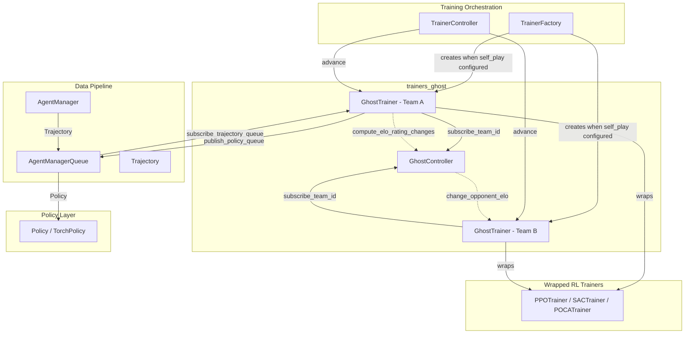
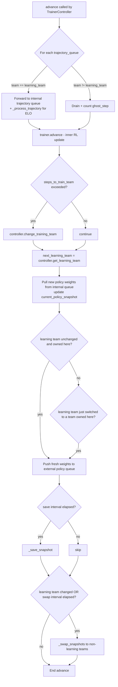
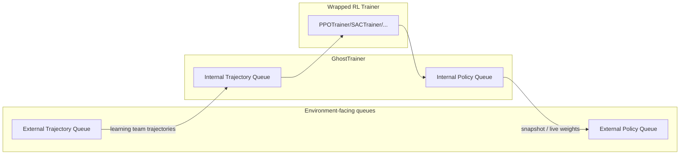

# Trainers Ghost Module

## Overview

The `trainers_ghost` module implements **self-play training** for the ML-Agents Toolkit. It enables adversarial multi-agent scenarios (e.g., 1v1 games, symmetric or asymmetric team competitions) by wrapping a standard reinforcement-learning trainer (PPO, SAC, POCA, etc. — see [Built-in_RL_Algorithms](trainers_ppo.md)) with self-play bookkeeping: policy snapshotting, opponent swapping, learning-team rotation, and ELO rating tracking.

Self-play works by ensuring that, at any given time, only **one team is "learning"** while the other team(s) play against frozen ("ghosted") snapshots of past or current policies. The module is composed of two closely-coupled components:

| Component | File | Responsibility |
|---|---|---|
| `GhostController` | `ghost/controller.py` | Global, run-wide coordinator. Tracks which team is currently learning, cycles the learning team, and computes ELO rating changes between teams. |
| `GhostTrainer` | `ghost/trainer.py` | Per-behavior-name `Trainer` decorator/wrapper. Delegates actual learning to an inner RL trainer, manages policy snapshots, routes trajectories/policies to the correct queues, and reports ELO to the `GhostController`. |

These two classes cooperate: many `GhostTrainer` instances (one per team/brain) subscribe to a single, shared `GhostController`, which arbitrates which team trains next and mediates ELO updates across all subscribed trainers.

## Position in the System

`trainers_ghost` sits inside the broader [Training_Orchestration_&_Lifecycle_Infrastructure](trainers_core.md) domain. It is instantiated by `TrainerFactory` (see [trainers_trainer_base](trainers_trainer_base.md)) whenever a behavior's configuration includes `self_play` settings, and it is driven each training iteration by the `TrainerController` (see [trainers_core_orchestration](trainers_core_orchestration.md)).



## Architecture

### `GhostController` — Learning-Team Arbitration

`GhostController` is a **singleton per training run**. It maintains:
- A FIFO queue (`deque`) of team ids waiting to become the learning team.
- The currently active `_learning_team`.
- A registry (`_ghost_trainers`) mapping team id → `GhostTrainer`, used to query opponent ELO across trainers (important in asymmetric games where teams are managed by different `GhostTrainer` instances).
- A `_changed_training_team` flag consumed by `TrainerController` via `should_reset()` to trigger a full episode reset when the learning team switches.

Key operations:
- `subscribe_team_id(team_id, trainer)` — registers a team/trainer pair; the first team registered becomes the initial learning team.
- `change_training_team(step)` — rotates the learning team: pushes the current one to the back of the queue and pops the next.
- `compute_elo_rating_changes(rating, result)` — standard ELO formula; looks up the opponent's rating from the appropriate `GhostTrainer` and updates it in place via `change_opponent_elo`.

```mermaid
sequenceDiagram
    participant GT as GhostTrainer
    participant GC as GhostController

    GT->>GC: subscribe_team_id(team_id, self)
    Note over GC: First team becomes learning_team;<br/>others queued

    loop every advance()
        GT->>GC: get_learning_team
        alt steps_to_train_team exceeded
            GT->>GC: change_training_team(step)
            Note over GC: rotate queue,<br/>set _changed_training_team = True
        end
    end

    GT->>GC: compute_elo_rating_changes(current_elo, result)
    GC->>GT: change_opponent_elo(change) (on opponent's trainer)
```

### `GhostTrainer` — Self-Play Trainer Wrapper

`GhostTrainer` extends the abstract [`Trainer`](trainers_trainer_base.md) base class and implements the **decorator pattern** around an inner concrete trainer (e.g. `PPOTrainer`, `POCATrainer` — see [Built-in_RL_Algorithms](trainers_ppo.md)). It exposes the same `Trainer` interface to `TrainerController` while internally re-routing data:

- **Trajectories** from the currently-learning team's agents are forwarded into an internal queue consumed by the wrapped trainer; trajectories from non-learning ("ghosted") agents are simply counted (`ghost_step`) and discarded.
- **Policies** produced by the wrapped trainer are snapshotted and distributed: the learning team gets the live, updating policy; other teams receive frozen snapshots chosen either from history (`policy_snapshots`, a rolling window) or from the current policy, based on `play_against_latest_model_ratio`.
- **ELO** is tracked per snapshot slot (`policy_elos`) and updated on episode completion via `_process_trajectory`, which infers win/loss/draw from the terminal reward sign and asks the `GhostController` to compute the rating delta.

Important self-play configuration (from `SelfPlaySettings`, see [trainers_core_config_settings](trainers_core_config_settings.md)):

| Setting | Effect |
|---|---|
| `window` | Number of past policy snapshots retained for opponent sampling |
| `play_against_latest_model_ratio` | Probability of facing the current (vs. a historical) snapshot |
| `save_steps` | Wrapped-trainer steps between snapshot saves |
| `swap_steps` | Ghost-steps between snapshot swaps for non-learning teams |
| `team_change` | Wrapped-trainer steps before rotating the learning team |
| `initial_elo` | Starting ELO rating (persisted across runs via `GlobalTrainingStatus`, see [trainers_core_monitoring](trainers_core_monitoring.md)) |

#### `advance()` Control Flow

`advance()` is the core per-step method invoked by `TrainerController`. It performs, in order:

1. **Trajectory routing** — for each subscribed trajectory queue, if the source team is the learning team, trajectories are forwarded to the wrapped trainer's internal queue and scored for ELO; otherwise they are drained/discarded and counted toward `ghost_step`.
2. **Delegate advance** — calls `self.trainer.advance()` so the wrapped trainer performs its normal optimization step.
3. **Team-change check** — if enough wrapped-trainer steps (`steps_to_train_team`) have elapsed, asks the `GhostController` to rotate the learning team.
4. **Policy propagation** — pulls any new policy weights from the wrapped trainer's internal policy queue into `current_policy_snapshot`, and if this trainer still owns the (possibly new) learning team, pushes the fresh weights into that team's external policy queue.
5. **Learning-team handoff** — if the learning team just changed to (or away from) a team owned by this `GhostTrainer`, propagates the correct policy immediately.
6. **Snapshot save** — every `steps_between_save` (wrapped) steps, calls `_save_snapshot()` to add the current weights/ELO to the rolling window.
7. **Snapshot swap** — on learning-team change or every `steps_between_swap` (ghost) steps, calls `_swap_snapshots()` to push a (possibly historical) snapshot to each non-learning team's policy queue.



#### `create_policy()` — First Encounter Logic

When `TrainerController`/`AgentManager` first encounters an agent, `create_policy` is called:
- It always creates a policy via the wrapped trainer (`self.trainer.create_policy`).
- The **first team encountered** becomes `wrapped_trainer_team` — this team's agents are actually optimized by the inner trainer. A second internal policy is also created and registered with the wrapped trainer via `add_policy`, and an initial snapshot is saved immediately.
- Any **other team** (the ghosted opponent(s)) simply receives a policy whose weights are loaded from the wrapped trainer's policy — it will subsequently be updated only through snapshot swaps.
- Every team id is registered with the `GhostController` via `subscribe_team_id`.

#### Queue Wiring: `publish_policy_queue` / `subscribe_trajectory_queue`

Both methods override the base `Trainer` behavior to additionally create **internal** queues that connect the `GhostTrainer` to its wrapped trainer, but only for the team that owns the wrapped trainer (`wrapped_trainer_team`):



## Dependencies

`trainers_ghost` builds on and interacts with several other modules:

- **[trainers_trainer_base](trainers_trainer_base.md)** — `GhostTrainer` subclasses `Trainer` and is produced by `TrainerFactory`.
- **[trainers_policy](trainers_policy.md)** — `Policy` objects are created, weight-loaded (`load_weights`/`get_weights`), and exchanged between queues.
- **[trainers_optimizer](trainers_optimizer.md)** — `TorchOptimizer` type is referenced (though `GhostTrainer.create_optimizer` is a no-op — optimization is delegated entirely to the wrapped trainer).
- **[trainers_core_data_pipeline](trainers_core_data_pipeline.md)** — `Trajectory` and `AgentManagerQueue` are the data-flow primitives routed by `GhostTrainer`.
- **[trainers_core_monitoring](trainers_core_monitoring.md)** — ELO ratings are persisted/retrieved via `GlobalTrainingStatus`, and reported via `StatsReporter`/`StatsPropertyType.SELF_PLAY`.
- **[trainers_core_config_settings](trainers_core_config_settings.md)** — `SelfPlaySettings` (part of `TrainerSettings`) configures all self-play behavior (window, swap/save/team-change intervals, initial ELO, etc.).
- **[Python_Environment_Interface_Layer](envs_core_api.md)** — `BehaviorSpec` describes the observation/action shape used when creating policies.
- **[Built-in_RL_Algorithms](trainers_ppo.md)** — Any concrete `Trainer` (`PPOTrainer`, `SACTrainer`, `POCATrainer`) can be wrapped by `GhostTrainer` to add self-play semantics on top of standard RL training.

## Summary

The `trainers_ghost` module cleanly separates two concerns:
- **`GhostController`** owns *global* self-play state — whose turn it is to learn, and ELO bookkeeping across all teams/trainers in the run.
- **`GhostTrainer`** owns *per-trainer* self-play mechanics — snapshotting, queue routing, and delegating actual optimization to a wrapped RL trainer.

Together they let any of the standard trainers in [Built-in_RL_Algorithms](trainers_ppo.md) be used, unmodified, in adversarial multi-agent training scenarios.
