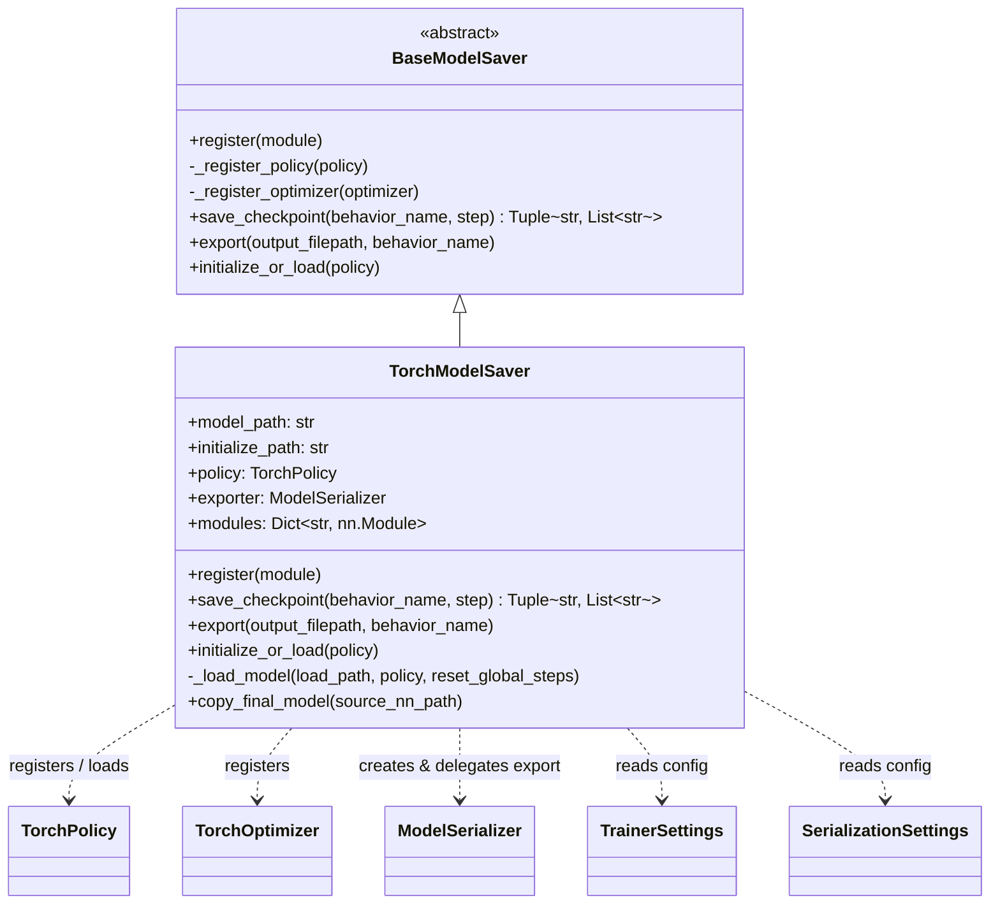
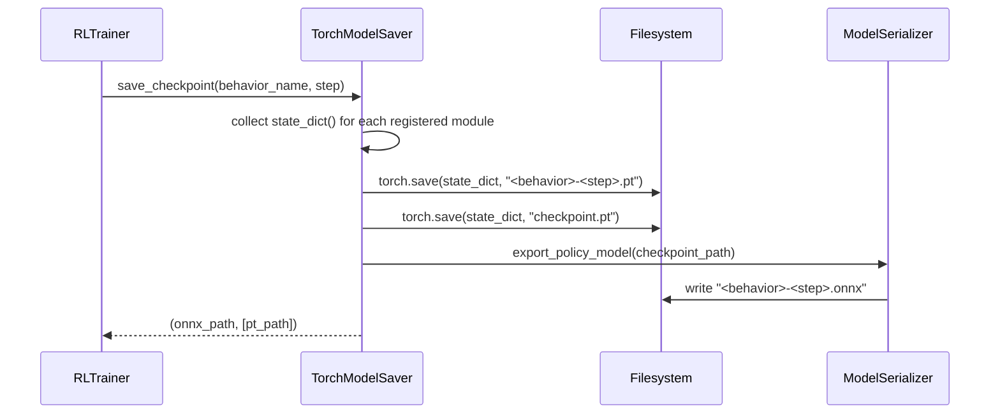

# Trainers Model Saver Module

## 1. Purpose

The `trainers_model_saver` module is responsible for **persisting and restoring the learned state of ML-Agents trainers**. It provides the abstraction and concrete PyTorch implementation used to:

- Take periodic **checkpoints** of a policy/optimizer's neural network weights during training.
- **Export** the trained policy to a deployable inference format (`.onnx`) that the Unity runtime can load.
- **Initialize or resume** training by loading previously saved weights, either from a fresh initialization path or from the trainer's own checkpoint directory.

It sits at the boundary between the higher-level training loop (see [trainers_trainer_base](trainers_trainer_base.md) and [trainers_core](trainers_core.md)) and the lower-level policy/optimizer/network objects (see [trainers_policy](trainers_policy.md), [trainers_optimizer](trainers_optimizer.md), and [trainers_torch_entities](trainers_torch_entities.md)). The `RLTrainer` (part of `trainers_trainer_base`) owns an instance of a model saver and delegates all disk I/O concerns to it, keeping the training loop itself agnostic of file formats and serialization details.

## 2. Architecture Overview

The module follows a simple **Strategy / Template pattern**: `BaseModelSaver` defines the abstract contract for saving/loading models, and `TorchModelSaver` provides the concrete PyTorch-based implementation. This design allows ML-Agents to potentially support other backends in the future without changing the code that consumes the model saver.



- **`BaseModelSaver`** (`model_saver.py`) — an `abc.ABC` that declares the interface every model saver implementation must follow: `register`, `save_checkpoint`, `export`, and `initialize_or_load`. It also provides two no-op helper hooks, `_register_policy` and `_register_optimizer`, intended to be used by subclasses to specialize registration behavior for different module types.

- **`TorchModelSaver`** (`torch_model_saver.py`) — the production implementation used by all PyTorch-based trainers (PPO, SAC, POCA, and the plugin trainers A2C/DQN). It:
  - Collects the `state_dict()` of all registered modules (policy networks, optimizers, value networks, etc., see [trainers_policy](trainers_policy.md) and [trainers_optimizer](trainers_optimizer.md)).
  - Writes `.pt` checkpoint files and maintains a rolling `checkpoint.pt` for resuming.
  - Delegates ONNX export to a [`ModelSerializer`](trainers_torch_entities.md) instance built from the registered `TorchPolicy`.
  - Loads state dicts back into modules when resuming or initializing from another run, gracefully handling missing/unexpected/mismatched keys.

## 3. How It Fits Into the System

```mermaid
flowchart TD
    subgraph Training_Orchestration["Training Orchestration (trainers_trainer_base / trainers_core)"]
        RLTrainer["RLTrainer"]
        TrainerController["TrainerController"]
    end

    subgraph Model_Saver["trainers_model_saver (this module)"]
        BMS["BaseModelSaver"]
        TMS["TorchModelSaver"]
        BMS <|-- TMS
    end

    subgraph Policy_Optimizer["trainers_policy / trainers_optimizer"]
        Policy["TorchPolicy"]
        Optimizer["TorchOptimizer"]
    end

    subgraph NN_Blocks["trainers_torch_entities"]
        Serializer["ModelSerializer"]
        Networks["NetworkBody / ActionModel / ..."]
    end

    subgraph Config["trainers_core_config_settings"]
        TS["TrainerSettings"]
        SS["SerializationSettings"]
    end

    TrainerController --> RLTrainer
    RLTrainer -- creates --> TMS
    RLTrainer -- calls save_checkpoint / initialize_or_load --> TMS
    TMS -- register(policy) --> Policy
    TMS -- register(optimizer) --> Optimizer
    TMS -- builds --> Serializer
    Policy --> Networks
    Optimizer --> Networks
    TS --> TMS
    SS --> TMS
```

- **Upstream consumer**: `RLTrainer` (in [trainers_trainer_base](trainers_trainer_base.md)) instantiates a `TorchModelSaver`, registers its `Policy` and `Optimizer`, and invokes `save_checkpoint` at configured intervals and `initialize_or_load` at trainer startup. The `GhostTrainer` (in [trainers_ghost](trainers_ghost.md)) also uses a model saver to initialize a frozen opponent policy independently of the "live" policy.
- **`ModelCheckpointManager`** (in [trainers_policy](trainers_policy.md)) tracks checkpoint metadata (paths, rewards, step numbers) produced by `save_checkpoint`, complementing the raw file I/O performed here.
- **Downstream dependencies**: `TorchPolicy` and `TorchOptimizer` (in [trainers_policy](trainers_policy.md) / [trainers_optimizer](trainers_optimizer.md)) expose `get_modules()`, returning the dictionary of named `nn.Module`/optimizer objects that `TorchModelSaver` persists. `ModelSerializer` (in [trainers_torch_entities](trainers_torch_entities.md)) performs the actual ONNX graph export using the policy's underlying neural network model.
- **Configuration**: `TrainerSettings` and `SerializationSettings` (in [trainers_core_config_settings](trainers_core_config_settings.md)) supply the model path, initialization path, checkpoint retention count, and ONNX export toggles.

## 4. Core Components

### 4.1 `BaseModelSaver`

Abstract base class defining the model-saver contract. Key responsibilities delegated to subclasses:

| Method | Responsibility |
|---|---|
| `register(module)` | Add a module (policy, optimizer, etc.) to the internal registry so its state can be checkpointed/exported. |
| `_register_policy(policy)` / `_register_optimizer(optimizer)` | Optional specialization hooks for handling different module types during registration. |
| `save_checkpoint(behavior_name, step)` | Persist all registered modules' state to disk; returns the exported model path and any auxiliary file paths. |
| `export(output_filepath, behavior_name)` | Serialize the policy graph to a deployable format (e.g., ONNX) without necessarily writing a full checkpoint. |
| `initialize_or_load(policy)` | Load existing weights (resume) or initialize from another path, optionally targeting an explicitly provided policy rather than the registered one (used by ghost trainers). |

### 4.2 `TorchModelSaver`

Concrete implementation for the PyTorch backend.

**State held:**
- `model_path`: directory where checkpoints for the current run are written.
- `initialize_path`: optional path to initialize weights from a *different* prior run (`TrainerSettings.init_path`).
- `_keep_checkpoints`: number of checkpoints to retain (from `TrainerSettings.keep_checkpoints`; pruning is handled by the caller/`RLTrainer`, not shown in this file).
- `load`: whether this run should resume from `model_path`.
- `policy`: the registered `TorchPolicy`, used to build the `ModelSerializer`.
- `exporter`: a `ModelSerializer` bound to `policy` for ONNX export.
- `modules`: a flat dict of `{name: nn.Module | optimizer}` aggregated from all registered objects via `get_modules()`.

**Key behaviors:**

- `register(module)` — Accepts a `TorchPolicy` or `TorchOptimizer`, merges its `get_modules()` dict into `self.modules`, and records the first-registered `TorchPolicy` as `self.policy` (constructing the `ModelSerializer` exporter at that time).
- `save_checkpoint(behavior_name, step)` — Serializes the `state_dict()` of every registered module to `<model_path>/<behavior_name>-<step>.pt`, refreshes the rolling `checkpoint.pt`, triggers `export()` to also write the `.onnx` file, and returns `(onnx_path, [pt_path])`.
- `export(output_filepath, behavior_name)` — Thin delegation to `ModelSerializer.export_policy_model`.
- `initialize_or_load(policy=None)` — Chooses between initializing from `initialize_path` (fresh transfer/init) or resuming from the run's own `checkpoint.pt` (`self.load=True`); resets the policy's global step counter to 0 in the initialization case.
- `_load_model(load_path, policy, reset_global_steps)` — Loads a saved `state_dict` and applies it per-module with `strict=False`, logging (but not failing on) missing/unexpected keys, and gracefully handling `KeyError`/`ValueError`/`RuntimeError` for modules whose shapes changed between runs (e.g., due to config changes).
- `copy_final_model(source_nn_path)` — Copies the final exported `.onnx` file to a destination path if ONNX conversion is enabled via `SerializationSettings.convert_to_onnx`.

## 5. Process Flows

### 5.1 Checkpointing during training



### 5.2 Initialization / Resume at trainer startup

```mermaid
sequenceDiagram
    participant RLT as RLTrainer
    participant TMS as TorchModelSaver
    participant FS as Filesystem
    participant POL as TorchPolicy

    RLT->>TMS: initialize_or_load(policy?)
    alt initialize_path is set
        TMS->>FS: torch.load(initialize_path)
        TMS->>POL: load_state_dict per module (strict=False)
        TMS->>POL: set_step(0)
    else load == True (resume)
        TMS->>FS: torch.load(model_path/checkpoint.pt)
        TMS->>POL: load_state_dict per module (strict=False)
        Note over TMS,POL: global step preserved
    else fresh run
        Note over TMS: nothing to load; modules keep their initialized weights
    end
```

## 6. Related Modules

- [trainers_trainer_base](trainers_trainer_base.md) — `RLTrainer`, `Trainer`, and `TrainerFactory`, which own and drive `BaseModelSaver`/`TorchModelSaver` instances.
- [trainers_policy](trainers_policy.md) — `TorchPolicy` and `ModelCheckpointManager`, providing the registered modules and higher-level checkpoint bookkeeping.
- [trainers_optimizer](trainers_optimizer.md) — `TorchOptimizer`, another type of module registered with the saver.
- [trainers_torch_entities](trainers_torch_entities.md) — `ModelSerializer`, used internally to export the ONNX graph.
- [trainers_core_config_settings](trainers_core_config_settings.md) — `TrainerSettings` and `SerializationSettings`, the configuration inputs consumed by `TorchModelSaver`.
- [trainers_ghost](trainers_ghost.md) — `GhostTrainer`/`GhostController`, which use `initialize_or_load` with an explicit policy argument to manage frozen opponent snapshots.
