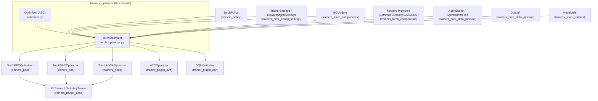
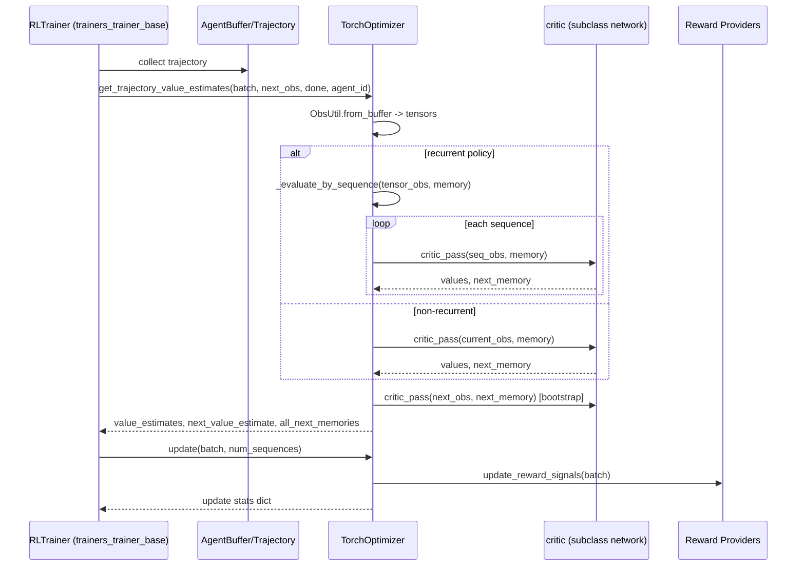

# Trainers Optimizer Module

## Purpose

The `trainers_optimizer` module defines the **abstract contract and shared PyTorch implementation for policy optimizers** in the ML-Agents training stack. An *Optimizer* is the component responsible for:

- Computing losses (policy loss, value loss, auxiliary losses)
- Applying gradient updates to a `Policy`'s underlying neural networks
- Managing reward signals (extrinsic + intrinsic, e.g. curiosity, GAIL, RND)
- Computing value estimates and bootstrapping targets used by trainers to build advantage/return targets

This module sits at the boundary between the **generic RL trainer lifecycle** (see [Training Orchestration & Lifecycle Infrastructure](trainers_core.md), [trainers_trainer_base.md](trainers_trainer_base.md)) and the **concrete algorithm implementations** (PPO, SAC, POCA — see [Built-in RL Algorithms](trainers_ppo.md), [trainers_sac.md](trainers_sac.md), [trainers_poca.md](trainers_poca.md); and the pluggable A2C/DQN algorithms in [Extensible RL Algorithm Plugins](trainer_plugin_a2c.md), [trainer_plugin_dqn.md](trainer_plugin_dqn.md)).

It contains only two files:

| File | Component | Role |
|---|---|---|
| `optimizer/optimizer.py` | `Optimizer` | Abstract base class defining the minimal `update()` contract |
| `optimizer/torch_optimizer.py` | `TorchOptimizer` | Concrete PyTorch-aware base class with reward-signal management, value estimation, and BC (behavioral cloning) integration |

No algorithm-specific loss functions (PPO clip loss, SAC Q-loss, etc.) live here — those are implemented by subclasses of `TorchOptimizer` in the algorithm-specific modules.

## Architecture Overview



## Component Responsibilities

### `Optimizer` (abstract base)

Defined in `optimizer/optimizer.py`. It is a minimal `abc.ABC` that:

- Holds a `reward_signals: Dict[str, ...]` container (populated by subclasses)
- Declares the single abstract method:

```python
def update(self, batch: AgentBuffer, num_sequences: int) -> Dict[str, float]:
```

Every concrete optimizer must implement `update()`, which consumes a minibatch (`AgentBuffer`) plus the number of recurrent sequences in that batch, performs one gradient step, and returns a dictionary of scalar statistics (e.g. `{"Losses/Policy Loss": 0.12}`) that flow into [`StatsReporter`](trainers_core.md).

### `TorchOptimizer` (PyTorch base implementation)

Defined in `optimizer/torch_optimizer.py`. Extends `Optimizer` and provides the common machinery shared by all PyTorch-based algorithms:

1. **Construction** — Takes a [`TorchPolicy`](trainers_policy.md) and `TrainerSettings`:
   - Initializes bookkeeping tensors (`update_dict`, `value_heads`, `memory_in/out`, `global_step`)
   - Builds reward signals from `trainer_settings.reward_signals` via `create_reward_signals()`
   - Optionally constructs a `BCModule` (behavioral cloning) if `trainer_settings.behavioral_cloning` is configured — see [Neural Network Building Blocks](trainers_torch_components.md)
   - Maintains a `critic_memory_dict` for recurrent critic state per agent

2. **`critic` property** — Abstract-like hook (raises `NotImplementedError` unless overridden) that subclasses must provide, exposing the value-function network used for `critic_pass()` calls.

3. **`create_reward_signals()`** — Instantiates one `BaseRewardProvider` per configured `RewardSignalType` (extrinsic, curiosity, GAIL, RND — see [Neural Network Building Blocks](trainers_torch_components.md)) via the `create_reward_provider` factory, keyed by signal name.

4. **`_evaluate_by_sequence()`** — Splits a full trajectory into fixed-length recurrent sequences (respecting `policy.sequence_length`), running the critic sequence-by-sequence while carrying forward LSTM memory. Handles the leftover/padded tail sequence. Returns per-signal value tensors, the collected intermediate memories (`AgentBufferField`), and the final memory state. This is required because recurrent critics cannot process an arbitrarily long trajectory in one forward pass without resetting memory incorrectly.

5. **`update_reward_signals()`** — Iterates all configured reward providers and calls their `update()`, aggregating stats (e.g. curiosity/GAIL network losses).

6. **`get_trajectory_value_estimates()`** — The key value-estimation entry point used by all RL trainers when computing GAE/returns:
   - Converts an `AgentBuffer` trajectory into tensors via `ObsUtil.from_buffer`
   - Dispatches to `_evaluate_by_sequence` (recurrent) or a single `critic.critic_pass` (non-recurrent)
   - Computes bootstrap value estimate for the observation *following* the trajectory
   - Zeroes out the bootstrap value for reward signals where `ignore_done=False` when the trajectory is terminal
   - Persists/clears recurrent critic memory in `critic_memory_dict` across trajectory segments per `agent_id`

## Data Flow: Value Estimation During Training



## Relationship to Algorithm-Specific Optimizers

`TorchOptimizer` is never used directly in training; it is subclassed by each algorithm to add its own loss computation and `critic` implementation:

- **`TorchPPOOptimizer`** ([trainers_ppo.md](trainers_ppo.md)) — clipped surrogate policy loss + value loss
- **`TorchSACOptimizer`** ([trainers_sac.md](trainers_sac.md)) — soft actor-critic Q/value/policy losses, entropy tuning
- **`TorchPOCAOptimizer`** ([trainers_poca.md](trainers_poca.md)) — multi-agent counterfactual credit assignment
- **`A2COptimizer`** ([trainer_plugin_a2c.md](trainer_plugin_a2c.md)) and **`DQNOptimizer`** ([trainer_plugin_dqn.md](trainer_plugin_dqn.md)) — example third-party/plugin algorithms demonstrating the extensibility of the `TorchOptimizer` contract

Each subclass is paired with a `Trainer` subclass (e.g. `PPOTrainer`, `SACTrainer`) from [trainers_trainer_base.md](trainers_trainer_base.md) that owns the training loop and calls `optimizer.update()` and `optimizer.get_trajectory_value_estimates()`.

## Key Dependencies

- **[trainers_policy.md](trainers_policy.md)** — `TorchPolicy` supplies the actor network, memory handling, and `behavior_spec` used to construct reward providers and evaluate observations.
- **[trainers_core.md](trainers_core.md)** (via `trainers_core_data_pipeline` and `trainers_core_config_settings`) — `AgentBuffer`/`AgentBufferField`/`ObsUtil` for data access, and `TrainerSettings`/`RewardSignalSettings` for configuration.
- **[trainers_torch_components.md](trainers_torch_components.md)** — `BCModule` and the reward-provider hierarchy (`BaseRewardProvider`, extrinsic/curiosity/GAIL/RND implementations) consumed via `create_reward_provider`.
- **[trainers_torch_entities.md](trainers_torch_entities.md)** — `ModelUtils` for tensor conversion utilities.

## Summary

The `trainers_optimizer` module is intentionally small and generic: it standardizes *how* a policy gets updated and *how* value estimates and reward signals are computed, while delegating all algorithm-specific loss math to subclasses. This separation lets new RL algorithms be added (including through the plugin system) simply by subclassing `TorchOptimizer` and implementing `update()` and `critic`, without needing to reimplement trajectory bootstrapping, recurrent value evaluation, or reward-signal orchestration.
