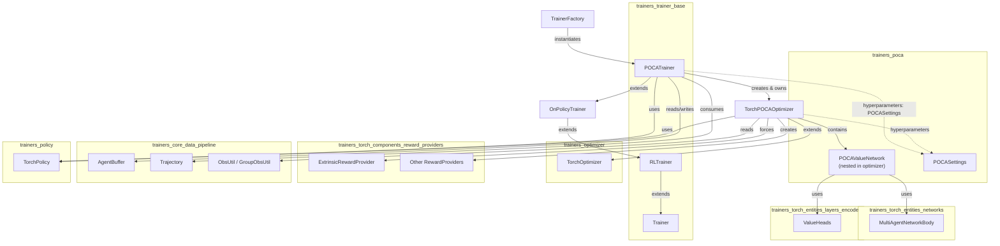

# Trainers POCA Module

## Introduction

The `trainers_poca` module implements **MA-POCA** (Multi-Agent POsthumous Credit Assignment), a
cooperative multi-agent reinforcement learning algorithm used by the ML-Agents Toolkit. MA-POCA
extends the single-agent PPO algorithm (see [Built-in RL Algorithms — PPO](trainers_ppo.md)) with a
**centralized critic** and a **counterfactual baseline** that allow a variable-sized group of agents
sharing the same observation/action space to learn a *joint* value function while still training
individual, decentralized policies. This lets agents that die or leave the group mid-episode still
receive properly discounted credit for their contribution to team success — a common requirement in
cooperative games and multi-agent training scenarios (e.g. `SimpleMultiAgentGroup`, see
[Unity Agent & Environment Foundation](runtime_core_agent.md)).

The module is composed of exactly two files:

| File | Responsibility |
|---|---|
| `poca/trainer.py` | `POCATrainer` — orchestrates trajectory collection, credit assignment (lambda-returns/advantages), and update scheduling. |
| `poca/optimizer_torch.py` | `TorchPOCAOptimizer` (and its nested `POCAValueNetwork`) plus `POCASettings` — implements the centralized critic/baseline network and the PPO-style clipped-loss optimization step. |

## Position in the System

`trainers_poca` is a peer of `trainers_ppo` and `trainers_sac` under the
**Built-in RL Algorithms** family. All three plug into the generic trainer infrastructure defined in
[Training Orchestration & Lifecycle Infrastructure](trainers_core.md):

- `TrainerFactory` (in `trainers_trainer_base.md`) instantiates a `POCATrainer` when a behavior's
  config specifies `trainer_type: poca`.
- `POCATrainer` inherits from `OnPolicyTrainer` / `RLTrainer` / `Trainer`
  (see [trainers_trainer_base.md](trainers_trainer_base.md)) to reuse generic on-policy update-loop
  logic (mini-batching, epochs, buffer management).
- `TorchPOCAOptimizer` inherits from `TorchOptimizer` (see [trainers_optimizer.md](trainers_optimizer.md))
  to reuse reward-signal creation, behavioral cloning hook-up, and generic sequence evaluation helpers.
- The centralized critic is built from `MultiAgentNetworkBody`, `ValueHeads`, `EntityEmbedding`, and
  `ResidualSelfAttention`, all defined in
  [Neural Network Building Blocks](trainers_torch_entities_networks.md) and
  [trainers_torch_entities_layers_encoders.md](trainers_torch_entities_layers_encoders.md).
- Reward signals (extrinsic, curiosity, GAIL, RND) are supplied via
  [trainers_torch_components_reward_providers.md](trainers_torch_components_reward_providers.md); POCA
  specifically forces `ExtrinsicRewardProvider.add_groupmate_rewards = True` and warns against using
  intrinsic reward signals not designed for multi-agent settings.
- Trajectories/buffers (`AgentBuffer`, `Trajectory`, `ObsUtil`, `GroupObsUtil`) come from
  [trainers_core_data_pipeline.md](trainers_core_data_pipeline.md).

## Architecture Overview



## Sub-module Documentation

Because this module has exactly two tightly-coupled files that together implement a single
algorithm, the detailed documentation is organized into two focused sub-module pages that mirror the
file split, so each concern (training/credit-assignment loop vs. network/optimization) can be read
independently:

- **[trainers_poca_trainer.md](trainers_poca_trainer.md)** — `POCATrainer`: trajectory processing,
  lambda-return/advantage computation with group-reward bookkeeping, policy creation, and the
  training-loop hooks required by the generic `Trainer`/`RLTrainer` base classes.
- **[trainers_poca_optimizer.md](trainers_poca_optimizer.md)** — `TorchPOCAOptimizer` and
  `POCAValueNetwork`: the centralized-critic/baseline network architecture, the PPO-style clipped
  update step, memory (LSTM) handling for sequential evaluation, and `POCASettings` hyperparameters.

## End-to-End Data Flow

```mermaid
sequenceDiagram
    participant Env as Unity Environment
    participant AP as AgentManager/AgentProcessor
    participant PT as POCATrainer
    participant OPT as TorchPOCAOptimizer
    participant CR as POCAValueNetwork (critic+baseline)
    participant BUF as Update AgentBuffer

    Env->>AP: Steps & observations (per agent in group)
    AP->>PT: Trajectory (per-agent, incl. group obs/rewards)
    PT->>OPT: get_trajectory_and_baseline_value_estimates()
    OPT->>CR: critic_pass(all_obs) / baseline(self_obs, groupmate_obs+actions)
    CR-->>OPT: value_estimates, baseline_estimates, memories
    OPT-->>PT: value & baseline estimates, next-value, memories
    PT->>PT: compute lambda-returns & advantages (per reward signal)
    PT->>BUF: append processed trajectory
    Note over PT,BUF: Repeats until buffer_size reached
    PT->>OPT: update(minibatch, num_sequences) [via OnPolicyTrainer._update_policy]
    OPT->>CR: forward pass, compute losses
    OPT->>OPT: backprop + Adam step (policy + critic params)
    OPT-->>PT: update_stats (losses, LR, epsilon, beta)
```

## Key Concepts

- **Centralized critic with attention**: `POCAValueNetwork` wraps a `MultiAgentNetworkBody` that uses
  self-attention (`ResidualSelfAttention`, `EntityEmbedding`) so the critic can handle a *variable*
  number of teammates without a fixed-size input, encoding each groupmate's (observation, action) pair
  as an "entity".
- **Baseline vs. Value**: The `critic_pass` produces the joint state-value `V`. The `baseline` method
  marginalizes out the acting agent's own action (using only its observation) while keeping
  groupmates' actions, producing a per-agent counterfactual baseline `B` used to reduce variance in the
  advantage estimate — this is the core MA-POCA credit-assignment trick.
- **Group-aware advantages**: `POCATrainer._process_trajectory` computes a lambda-return per reward
  signal, subtracts the baseline (not the value) to get a local advantage, then averages the
  per-signal advantages into a single global advantage stored on the buffer.
- **Policy architecture reuse**: Despite the specialized critic, the actual acting policy uses a
  standard `SimpleActor` (same decentralized-actor design as PPO), keeping decentralized execution
  compatible with centralized training.

## Related Documentation

- [Built-in RL Algorithms — PPO](trainers_ppo.md) (sibling on-policy trainer, similar loss structure)
- [Built-in RL Algorithms — SAC](trainers_sac.md) (sibling off-policy trainer)
- [trainers_trainer_base.md](trainers_trainer_base.md) (base classes: `Trainer`, `RLTrainer`, `OnPolicyTrainer`, `TrainerFactory`)
- [trainers_optimizer.md](trainers_optimizer.md) (`Optimizer`, `TorchOptimizer` base classes)
- [trainers_policy.md](trainers_policy.md) (`Policy`, `TorchPolicy`)
- [trainers_torch_entities_networks.md](trainers_torch_entities_networks.md) (`MultiAgentNetworkBody`, `NetworkBody`, `Critic`-related classes)
- [trainers_torch_entities_attention_conditioning.md](trainers_torch_entities_attention_conditioning.md) (`ResidualSelfAttention`, `EntityEmbedding`)
- [trainers_torch_components_reward_providers.md](trainers_torch_components_reward_providers.md) (reward signal implementations)
- [trainers_core_data_pipeline.md](trainers_core_data_pipeline.md) (`AgentBuffer`, `Trajectory`, `ObsUtil`, `GroupObsUtil`)
- [trainers_core_config_settings.md](trainers_core_config_settings.md) (`TrainerSettings`, `OnPolicyHyperparamSettings`, `NetworkSettings`)
- [runtime_core_agent.md](runtime_core_agent.md) (`SimpleMultiAgentGroup`, group-based Unity-side agent grouping)
