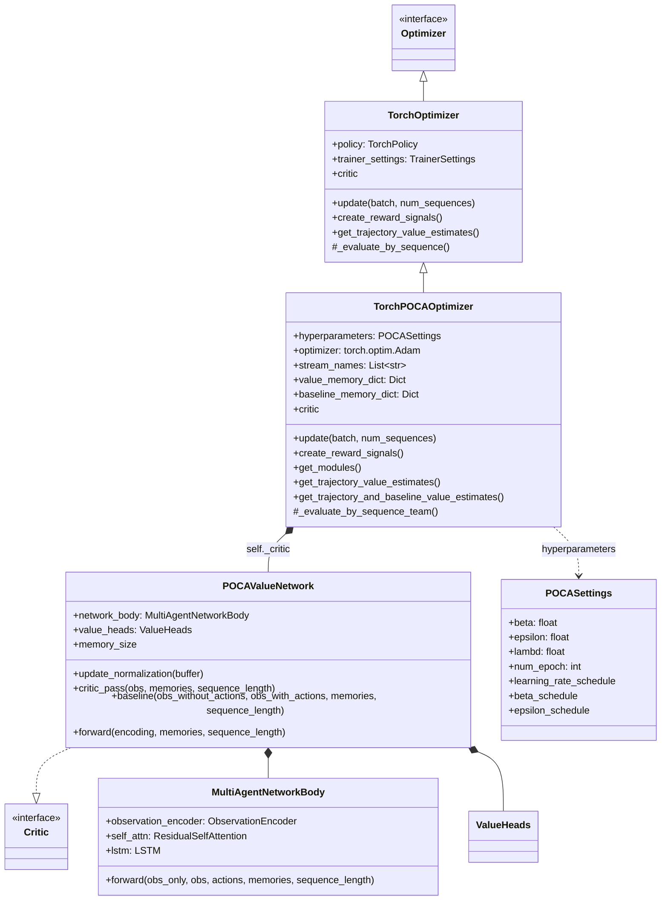
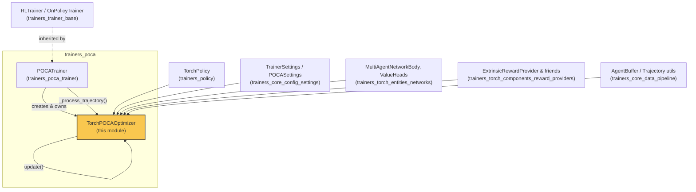
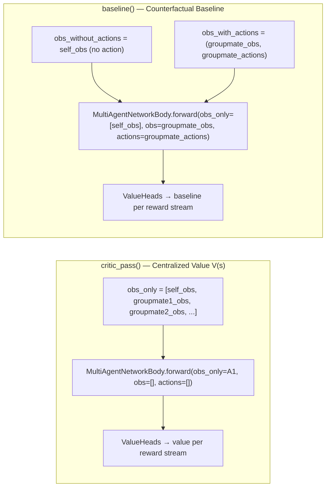
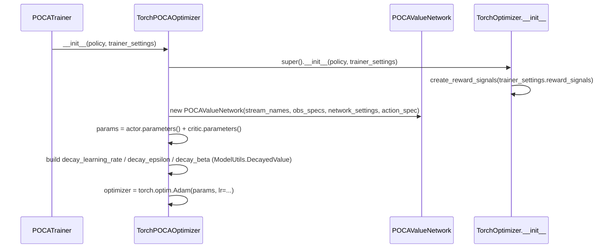
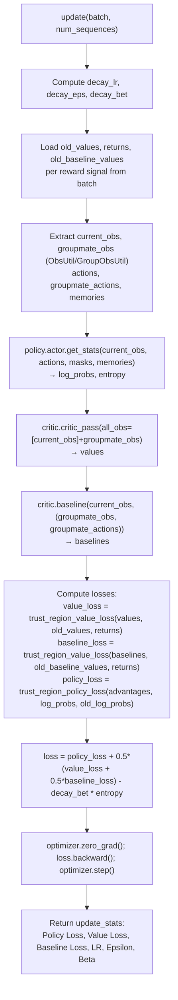
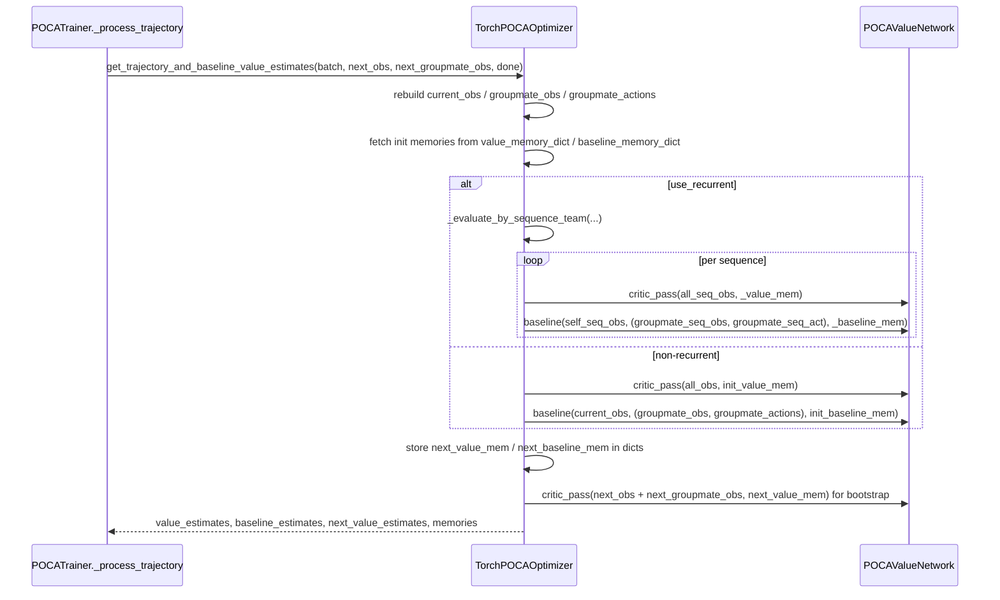
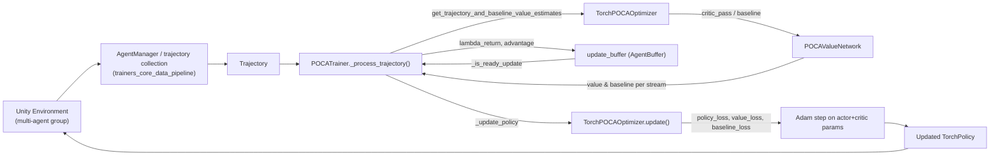

# Trainers POCA Optimizer

## Introduction

The **`trainers_poca_optimizer`** module implements the optimization logic for **MA-POCA** (Multi-Agent POsthumous Credit Assignment), Unity ML-Agents' cooperative multi-agent reinforcement learning algorithm. It contains:

- **`POCASettings`** — the hyperparameter schema for the POCA trainer (PPO-style clipping/epsilon, entropy `beta`, GAE `lambd`, learning-rate/epsilon/beta decay schedules).
- **`TorchPOCAOptimizer`** — a concrete `TorchOptimizer` (see [trainers_optimizer](trainers_optimizer.md)) that trains a shared policy using a **centralized critic** and a **counterfactual baseline**, enabling agents in a group to receive credit for their individual contribution to team success.
- **`TorchPOCAOptimizer.POCAValueNetwork`** — the neural network wrapper that computes both the *centralized value function* (uses observations of all agents in the group) and the *counterfactual baseline* (marginalizes out the acting agent's own action while conditioning on groupmates' state-action pairs).

This module is the optimizer half of the POCA algorithm; the companion trainer/data-collection half lives in [trainers_poca_trainer](trainers_poca_trainer.md) (`POCATrainer`). Together they form the `trainers_poca` package, one of the [Built-in RL Algorithms](trainers_ppo.md) (alongside PPO and SAC).

---

## Purpose & Core Functionality

MA-POCA solves the multi-agent credit-assignment problem in cooperative settings where agents share group ("team") rewards in addition to individual rewards. The key ideas implemented here:

1. **Centralized Critic (`critic_pass`)** — A value function V(s) that conditions on the observations of *all* agents in the group (self + groupmates), computed via a permutation-invariant self-attention network (`MultiAgentNetworkBody`, see [trainers_torch_entities_networks](trainers_torch_entities_networks.md)). This lets each agent's value estimate account for what its teammates are seeing/doing.
2. **Counterfactual Baseline (`baseline`)** — An estimate of the value function that conditions on the *actions* of all groupmates but *not* on the acting agent's own action. Subtracting this baseline from the return produces a per-agent advantage that isolates the agent's individual contribution to the team's success — the "posthumous credit assignment" trick.
3. **PPO-style clipped surrogate loss** — Policy, value, and baseline losses all use `ModelUtils.trust_region_value_loss` / `trust_region_policy_loss` (clipped surrogate objectives), the same mechanism used by [trainers_ppo](trainers_ppo.md).
4. **Variable-size, permutation-invariant groups** — Because agent groups can vary in size across episodes, the attention-based `MultiAgentNetworkBody` handles a variable number of teammates using NaN-masking and self-attention rather than fixed-size concatenation.
5. **Recurrent (LSTM) support** — Separate memory streams are tracked for the critic (`CRITIC_MEMORY`) and the baseline (`BASELINE_MEMORY`), each evaluated sequence-by-sequence via `_evaluate_by_sequence_team`.

---

## Architecture

### Class Relationships

### Module Position within POCA & Training Orchestration

---

## `POCASettings`

`POCASettings` extends `OnPolicyHyperparamSettings` (see [trainers_core_config_settings](trainers_core_config_settings.md)) and is registered in the trainer settings schema for `trainer_type: poca`. It supplies:

| Field | Default | Purpose |
|---|---|---|
| `beta` | `5.0e-3` | Entropy regularization coefficient |
| `epsilon` | `0.2` | PPO clip range for policy/value/baseline losses |
| `lambd` | `0.95` | GAE lambda for computing lambda-returns |
| `num_epoch` | `3` | Number of epochs per update |
| `learning_rate_schedule` | `LINEAR` | Decay schedule for learning rate |
| `beta_schedule` | `LINEAR` | Decay schedule for entropy coefficient |
| `epsilon_schedule` | `LINEAR` | Decay schedule for clip range |

These are consumed through `ModelUtils.DecayedValue` inside `TorchPOCAOptimizer.__init__` to produce time-varying `decay_lr`, `decay_eps`, and `decay_bet` values used every `update()` call.

---

## `TorchPOCAOptimizer.POCAValueNetwork`

The `POCAValueNetwork` is a `torch.nn.Module` implementing the `Critic` interface (from [trainers_torch_entities_networks](trainers_torch_entities_networks.md)). It wraps a `MultiAgentNetworkBody` (attention-based encoder for variable numbers of agents) followed by `ValueHeads` (one linear layer per reward-signal stream).

### Two Modes of Forward Computation

- **`critic_pass(obs, memories, sequence_length)`**: Computes `V(s)` for the whole group. All agents' observations are passed as `obs_only` (no actions attached) — this is the fully centralized value function used for value-loss and for bootstrapping (`next_value_estimates`).
- **`baseline(obs_without_actions, obs_with_actions, memories, sequence_length)`**: Computes the counterfactual baseline `b(s, a^{-i})` — the acting agent's own observation is passed *without* an action (`obs_only`), while every groupmate's observation+action pair is passed via the `obs`/`actions` parameters. This yields a value estimate that "marginalizes" the agent's own action, isolating the effect of its groupmates' choices.
- **`forward(encoding, ...)`**: Shared tail — simply runs the fused attention encoding through `ValueHeads`.
- **`update_normalization(buffer)`**: Delegates to the underlying `MultiAgentNetworkBody` / `ObservationEncoder` to keep running observation statistics current.

The `+1` in `encoding_size + 1` (constructor) accounts for a **normalized agent-count feature** appended to the attention output by `MultiAgentNetworkBody.forward` — this lets the critic/baseline be aware of how many teammates are currently present (group sizes can vary between episodes).

---

## `TorchPOCAOptimizer`

### Initialization

Key points:
- A **single Adam optimizer** jointly updates the policy actor's parameters (`self.policy.actor`) and the critic's parameters (`self.critic`) — POCA does not use separate optimizers for actor/critic.
- `create_reward_signals` is **overridden** to (a) warn if non-extrinsic reward signals (Curiosity, GAIL, RND) are configured, since POCA is only validated with extrinsic rewards, and (b) force `add_groupmate_rewards = True` on any `ExtrinsicRewardProvider` (see [trainers_torch_components_reward_providers](trainers_torch_components_reward_providers.md)) so that team rewards are correctly folded into each agent's reward signal.

### `update()` — The Training Step

Notable design details:
- **Both value and baseline losses use the clipped trust-region formulation**, weighted `0.5*(value_loss + 0.5*baseline_loss)` relative to the policy loss — this balances gradient magnitude between the centralized critic and the counterfactual baseline.
- Memory tensors for `MEMORY` (actor), `CRITIC_MEMORY` (value function), and `BASELINE_MEMORY` (baseline) are each recovered independently from the buffer, reflecting the three separate recurrent state streams used in POCA.
- Data comes from `ObsUtil` / `GroupObsUtil` (see [trainers_core_data_pipeline](trainers_core_data_pipeline.md) — `trajectory.py`), which know how to reconstruct per-agent and per-groupmate observation tensors from a flattened `AgentBuffer`.

### Trajectory & Baseline Value Estimation (used by `POCATrainer`)

`get_trajectory_and_baseline_value_estimates()` is the primary entry point called by [`POCATrainer._process_trajectory`](trainers_poca_trainer.md) after an episode/trajectory segment is collected. It:

1. Reconstructs `current_obs`, `groupmate_obs`, `groupmate_actions` from the trajectory buffer.
2. Retrieves or initializes per-agent recurrent memory (`value_memory_dict`, `baseline_memory_dict`), keyed by `agent_id`.
3. Dispatches to either:
   - **`_evaluate_by_sequence_team`** (if `policy.use_recurrent`) — splits the trajectory into fixed-length LSTM sequences, running `critic_pass` and `baseline` per-sequence while carrying memory forward, similar in structure to `TorchOptimizer._evaluate_by_sequence` but tracking *two* parallel memory streams (value + baseline) and *team* observations.
   - **Direct `critic_pass` / `baseline` calls** (non-recurrent case) over the whole trajectory at once.
4. Computes `next_value_estimates` by bootstrapping with `next_obs` (and `next_groupmate_obs`) — the observation(s) immediately following the trajectory — using the final memory state.
5. Zeroes out the bootstrap value if the episode is `done` (unless the reward signal has `ignore_done=True`).
6. Returns `(value_estimates, baseline_estimates, next_value_estimates, all_next_value_mem, all_next_baseline_mem)`.

`get_trajectory_value_estimates()` is retained as a thin wrapper around the above for interface compatibility with the base `TorchOptimizer` (used elsewhere in the trainer hierarchy), assuming no groupmate observations.

The returned `value_estimates` and `baseline_estimates` are then used by `POCATrainer` to compute **lambda-returns** and **per-agent advantages** (`local_advantage = lambda_return - baseline_estimate`), which are subsequently averaged across the group to form the `BufferKey.ADVANTAGES` consumed by `update()`.

### `get_modules()`

Exposes the optimizer's Adam optimizer state and critic network for checkpointing/serialization, merged with each reward provider's own modules — consumed by [`TorchModelSaver`](trainers_policy.md) (see `trainers_model_saver`).

---

## End-to-End Data Flow

---

## Relationship to Other Modules

- **[trainers_poca_trainer](trainers_poca_trainer.md)** — `POCATrainer`, the sibling module that owns a `TorchPOCAOptimizer` instance, drives trajectory collection, computes lambda-returns/advantages using the optimizer's value/baseline estimates, and triggers `update()`.
- **[trainers_optimizer](trainers_optimizer.md)** — Base `Optimizer` / `TorchOptimizer` classes that `TorchPOCAOptimizer` extends; provides shared reward-signal creation, single-agent `_evaluate_by_sequence`, and the generic `get_trajectory_value_estimates` contract.
- **[trainers_torch_entities_networks](trainers_torch_entities_networks.md)** — `MultiAgentNetworkBody`, `ValueHeads`, and `Critic` interface used to build `POCAValueNetwork`.
- **[trainers_torch_entities_attention_conditioning](trainers_torch_entities_attention_conditioning.md)** — `ResidualSelfAttention` / `EntityEmbedding`, the attention mechanism underlying `MultiAgentNetworkBody`'s permutation-invariant handling of variable group sizes.
- **[trainers_torch_components_reward_providers](trainers_torch_components_reward_providers.md)** — `ExtrinsicRewardProvider` and other reward signals; POCA specifically enables `add_groupmate_rewards` on the extrinsic provider.
- **[trainers_policy](trainers_policy.md)** — `TorchPolicy`, whose actor network and parameters are jointly optimized with the POCA critic.
- **[trainers_core_config_settings](trainers_core_config_settings.md)** — `TrainerSettings`, `NetworkSettings`, `OnPolicyHyperparamSettings`, `ScheduleType`, base classes for `POCASettings`.
- **[trainers_core_data_pipeline](trainers_core_data_pipeline.md)** — `AgentBuffer`, `BufferKey`, `RewardSignalUtil`, `ObsUtil`, `GroupObsUtil`, `AgentBufferField` — the data structures used to move trajectory data (including group observations/actions) into and out of the optimizer.
- **[trainers_ppo](trainers_ppo.md)** / **[trainers_sac](trainers_sac.md)** — sibling built-in algorithm optimizers; `TorchPOCAOptimizer` shares the clipped-objective philosophy with `TorchPPOOptimizer` but extends it to a multi-agent, centralized-critic setting.
