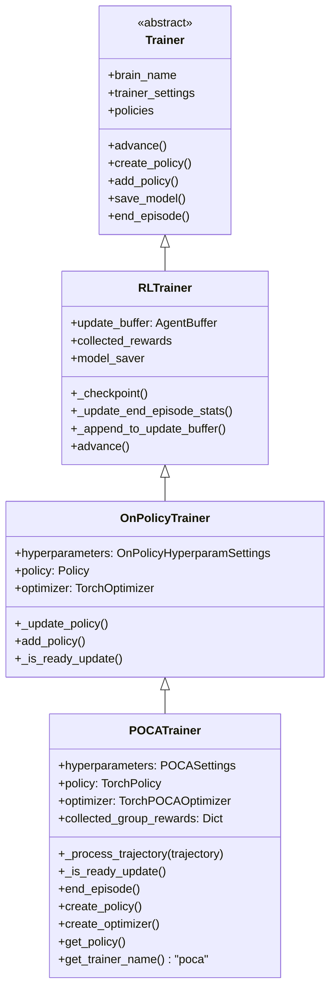
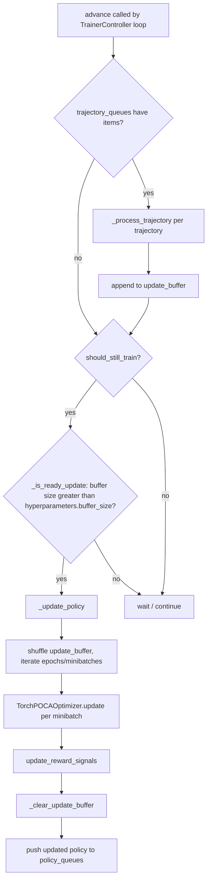
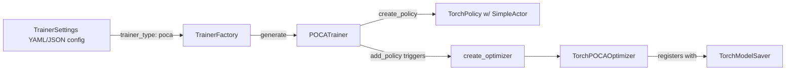

# `trainers_poca_trainer` — POCA (MA-POCA) Trainer

## Introduction

The `trainers_poca_trainer` module contains **`POCATrainer`**, the trainer implementation for Unity ML-Agents' **MA-POCA** (**M**ulti-**A**gent **PO**sthumous **C**redit **A**ssignment) algorithm. MA-POCA is a cooperative multi-agent reinforcement learning algorithm that lets a team of agents learn a shared, centralized critic while still training decentralized, per-agent policies. It is the standard trainer to use whenever agents belong to a `SimpleMultiAgentGroup` and receive **group rewards** in addition to (or instead of) individual rewards.

`POCATrainer` is a thin, algorithm-specific specialization of the generic on-policy training pipeline: it reuses almost all of the RL trainer plumbing (trajectory queueing, buffering, checkpointing, statistics reporting) from [`trainers_trainer_base`](trainers_trainer_base.md) and delegates the actual gradient computation to `TorchPOCAOptimizer`, documented in the sibling module [`trainers_poca_optimizer`](trainers_poca_optimizer.md). This document focuses on the **trainer** — the component responsible for turning raw environment `Trajectory` objects into training batches and for driving update/checkpoint/policy-distribution cycles for cooperative multi-agent groups.

---

## Module Purpose & Core Responsibilities

`POCATrainer` (in `ml-agents/mlagents/trainers/poca/trainer.py`) is responsible for:

1. **Trajectory processing** — converting per-agent `Trajectory` objects (which include the observations/actions of an agent's *groupmates*) into an `AgentBuffer` filled with value/baseline estimates, individual rewards, group rewards, and lambda-return advantages.
2. **Credit assignment** — combining the counterfactual **baseline** value (what would happen if this agent's action were marginalized out) with the **centralized value function** to compute an advantage signal that properly attributes credit to each agent for team performance.
3. **Group reward bookkeeping** — tracking cumulative group rewards per agent, reporting them once a whole team episode is complete, and cleaning up bookkeeping for agents that finish before the rest of the group.
4. **Policy/optimizer creation** — instantiating the `TorchPolicy` (with a `SimpleActor` decentralized actor) and the `TorchPOCAOptimizer` (centralized multi-agent critic) used for this behavior.
5. **Update gating** — deciding when enough experience has been collected to trigger a policy update (inherited pattern from `OnPolicyTrainer`).

It does **not** implement:
- Environment communication (`EnvManager`/`SubprocessEnvManager` — see [`trainers_core_env_management`](trainers_core_env_management.md))
- The actual gradient step, loss functions, or the multi-agent critic network (see [`trainers_poca_optimizer`](trainers_poca_optimizer.md))
- Trajectory/experience collection at the environment layer (see `AgentManager` in [`trainers_core_data_pipeline`](trainers_core_data_pipeline.md))
- Generic checkpointing/model export logic (see [`trainers_model_saver`](trainers_model_saver.md) and [`trainers_policy`](trainers_policy.md))

---

## Position in the Overall System

`POCATrainer` sits at the intersection of three larger subsystems:

- **[Built-in RL Algorithms](trainers_ppo.md)** family — sibling to `PPOTrainer` and `SACTrainer`, all extending the common `Trainer` → `RLTrainer` → `OnPolicyTrainer`/`OffPolicyTrainer` hierarchy defined in [`trainers_trainer_base`](trainers_trainer_base.md).
- **[Training Orchestration & Lifecycle Infrastructure](trainers_core_orchestration.md)** — `TrainerController` and `TrainerFactory` instantiate `POCATrainer` when a behavior's config specifies `trainer_type: poca`, and wire it into the trajectory/policy queue plumbing shared across all trainers.
- **[Unity Agent & Environment Foundation](Unity_Agent_&_Environment_Foundation.md)** — on the Unity (C#) side, `SimpleMultiAgentGroup` is what groups agents together and emits group-level rewards, which ultimately flow into `Trajectory.next_group_obs`, `BufferKey.GROUP_REWARD`, and `trajectory.all_group_dones_reached` consumed by `POCATrainer`.

```mermaid
graph TB
    subgraph Unity_Side["Unity Runtime (C#)"]
        SMAG[SimpleMultiAgentGroup]
    end

    subgraph EnvLayer["Python Environment Interface Layer"]
        UE[UnityEnvironment]
    end

    subgraph Orchestration["Training Orchestration & Lifecycle Infrastructure"]
        TC[TrainerController]
        TF[TrainerFactory]
        AM[AgentManager]
        TRAJ[Trajectory]
    end

    subgraph AlgoFamily["Built-in RL Algorithms"]
        BASE[Trainer / RLTrainer / OnPolicyTrainer]
        PT[POCATrainer]
        PO[TorchPOCAOptimizer]
    end

    subgraph NN["Neural Network Building Blocks"]
        TP[TorchPolicy]
        SA[SimpleActor]
        MANB[MultiAgentNetworkBody]
    end

    SMAG --> UE
    UE --> AM
    AM --> TRAJ
    TRAJ --> PT
    TF -->|creates| PT
    TC -->|drives .advance()| PT
    BASE -->|inherited by| PT
    PT -->|create_policy| TP
    TP --> SA
    PT -->|create_optimizer| PO
    PO --> MANB

    click BASE "trainers_trainer_base.md"
    click PO "trainers_poca_optimizer.md"
    click TC "trainers_core_orchestration.md"
    click AM "trainers_core_data_pipeline.md"
    click TP "trainers_policy.md"
```

---

## Class Hierarchy



`POCATrainer` overrides only what is algorithm-specific:
- `_process_trajectory` — POCA-specific credit assignment (baseline + centralized value + lambda returns).
- `_is_ready_update` — re-declared identically to `OnPolicyTrainer`'s version (buffer-size gate on `hyperparameters.buffer_size`).
- `end_episode` — additionally clears `collected_group_rewards`.
- `create_policy` / `create_optimizer` / `get_policy` / `get_trainer_name` — factory hooks required by the abstract base classes.

Everything else — `_update_policy` (the epoch/minibatch update loop), `advance()` (the main loop that drains trajectory queues and triggers updates), checkpointing, and statistics writing — is inherited unmodified from `OnPolicyTrainer`/`RLTrainer` (see [`trainers_trainer_base`](trainers_trainer_base.md) for full details).

---

## Key Concepts

### Centralized Critic + Decentralized Actor
- **Actor**: Each agent uses a `SimpleActor` (built via `create_policy`) that only observes its own local observations — this is what is deployed/inferenced at runtime.
- **Critic**: A single, shared `TorchPOCAOptimizer.POCAValueNetwork` (housed in `TorchPOCAOptimizer`) consumes the observations (and, for the baseline, actions) of *all* agents in the group via a `MultiAgentNetworkBody`. This centralized critic is only used during training and discarded/unused at inference time.

### Baseline vs. Value Estimate
- `value_estimates`: the centralized value function `V(all agents' obs)`.
- `baseline_estimates`: a counterfactual baseline that marginalizes out the acting agent's own action but conditions on the actions of groupmates — this baseline is subtracted from returns to reduce variance and enables *credit assignment*, i.e., quantifying how much a specific agent's action contributed to the team outcome.

### Group Reward Handling
`POCATrainer.collected_group_rewards` accumulates group-level reward (`BufferKey.GROUP_REWARD`) per `agent_id`. When:
- An agent's own episode ends (`trajectory.done_reached`) but the group hasn't fully finished (`not trajectory.all_group_dones_reached`), its entry is removed to avoid stale bookkeeping.
- The **entire group** finishes (`trajectory.all_group_dones_reached and trajectory.done_reached`), the cumulative group reward is reported to `StatsReporter` as `"Environment/Group Cumulative Reward"` and then cleared.

---

## Data Flow: Trajectory → Update Buffer

The core algorithmic logic lives in `_process_trajectory`. The following sequence diagram traces one trajectory through POCA-specific processing.

```mermaid
sequenceDiagram
    participant AM as AgentManager
    participant Q as trajectory_queue
    participant PT as POCATrainer
    participant OPT as TorchPOCAOptimizer
    participant BUF as update_buffer (AgentBuffer)
    participant SR as StatsReporter

    AM->>Q: put(Trajectory)
    PT->>Q: get_nowait() [via advance()]
    PT->>PT: _process_trajectory(trajectory)
    PT->>PT: agent_buffer_trajectory = trajectory.to_agentbuffer()
    PT->>PT: policy.actor.update_normalization(...)
    PT->>OPT: critic.update_normalization(...)
    PT->>OPT: get_trajectory_and_baseline_value_estimates(...)
    OPT-->>PT: value_estimates, baseline_estimates, value_next, memories

    loop for each reward signal
        PT->>OPT: reward_signal.evaluate(agent_buffer_trajectory)
        PT->>PT: lambda_return(rewards, values, gamma, lambd, value_next)
        PT->>PT: advantage = lambda_return - baseline_estimate
    end

    PT->>PT: global_advantages = mean(per-signal advantages)
    PT->>BUF: _append_to_update_buffer(agent_buffer_trajectory)
    PT->>SR: add_stat(Value/Baseline Estimates)

    alt trajectory.done_reached
        PT->>SR: _update_end_episode_stats(agent_id, optimizer)
        PT->>PT: cleanup collected_group_rewards (if team not done)
    end
    alt all_group_dones_reached and done_reached
        PT->>SR: add_stat("Environment/Group Cumulative Reward")
        PT->>PT: collected_group_rewards.pop(agent_id)
    end
```

### Advantage Computation Detail

For each active reward signal (typically only `extrinsic`, since POCA warns against Curiosity/GAIL — see below), POCA computes:

1. **Lambda return**: `lambda_return(r, V, gamma, lambd, value_next)` — a GAE-style bootstrapped return using the centralized value estimates.
2. **Local advantage**: `lambda_return - baseline_estimate` (baseline, not raw value, is subtracted — this is the credit-assignment trick).
3. **Global advantage**: mean across all reward-signal-specific local advantages, stored as `BufferKey.ADVANTAGES` and consumed later by `OnPolicyTrainer._update_policy` (PPO-style clipped surrogate loss in `TorchPOCAOptimizer.update`).

---

## Update / Training Cycle (inherited from `OnPolicyTrainer` / `RLTrainer`)



This full cycle — including checkpointing (`_checkpoint`), summary writing (`_write_summary`), and step incrementing — is defined generically in `RLTrainer`/`OnPolicyTrainer`. See [`trainers_trainer_base`](trainers_trainer_base.md) for the complete implementation and diagrams of `advance()`, `_update_policy()`, and checkpoint management.

---

## Construction & Factory Integration

`POCATrainer.__init__` accepts the same signature as all on-policy trainers (`behavior_name`, `reward_buff_cap`, `trainer_settings`, `training`, `load`, `seed`, `artifact_path`) and is instantiated by `TrainerFactory` (see [`trainers_trainer_base`](trainers_trainer_base.md)) whenever a `TrainerSettings.trainer_type` of `"poca"` is configured — resolved via the static `get_trainer_name()` returning `TRAINER_NAME = "poca"`.



- `create_policy(parsed_behavior_id, behavior_spec)` builds a `TorchPolicy` using `SimpleActor` (decentralized, non-conditional-sigma, non-tanh-squashed Gaussian/categorical action distributions) — this is the network exported for inference/ONNX.
- `create_optimizer()` returns a fresh `TorchPOCAOptimizer(self.policy, self.trainer_settings)`, which internally builds the centralized `POCAValueNetwork` critic. See [`trainers_poca_optimizer`](trainers_poca_optimizer.md) for full details on the optimizer's loss computation, value/baseline network architecture, and sequence-based memory evaluation for recurrent policies.
- `get_policy(name_behavior_id)` simply returns the single shared `self.policy` — POCA does not support self-play/multiple policies per trainer instance (a warning is logged by `OnPolicyTrainer.add_policy` if this is attempted).

---

## Reward Signal Constraints

`TorchPOCAOptimizer.create_reward_signals` (overridden from the base `TorchOptimizer`) emits a warning for any reward signal other than `Extrinsic` (e.g., Curiosity, GAIL, RND), since these are not designed for multi-agent credit assignment. It also forces `ExtrinsicRewardProvider.add_groupmate_rewards = True` so that group rewards are correctly summed with individual extrinsic rewards. This behavior directly affects what `POCATrainer._process_trajectory` iterates over in its `for name, reward_signal in self.optimizer.reward_signals.items()` loop — see [`trainers_torch_components_reward_providers`](trainers_torch_components_reward_providers.md) for reward provider implementations.

---

## Related Documentation

| Topic | Document |
|---|---|
| Centralized critic, `POCAValueNetwork`, loss computation | [`trainers_poca_optimizer`](trainers_poca_optimizer.md) |
| Base `Trainer`/`RLTrainer`/`OnPolicyTrainer` classes, update loop, checkpointing | [`trainers_trainer_base`](trainers_trainer_base.md) |
| `TrainerController`, `TrainerFactory`, `EnvironmentParameterManager` | [`trainers_core_orchestration`](trainers_core_orchestration.md) |
| `AgentManager`, `AgentBuffer`, `Trajectory`, `BufferKey` | [`trainers_core_data_pipeline`](trainers_core_data_pipeline.md) |
| `StatsReporter`, training status tracking | [`trainers_core_monitoring`](trainers_core_monitoring.md) |
| `TorchPolicy`, `Policy`, checkpoint manager | [`trainers_policy`](trainers_policy.md) |
| `TorchOptimizer` base class | [`trainers_optimizer`](trainers_optimizer.md) |
| `TorchModelSaver`, `BaseModelSaver` | [`trainers_model_saver`](trainers_model_saver.md) |
| `MultiAgentNetworkBody`, `SimpleActor`, `SharedActorCritic`, `ValueHeads` | [`trainers_torch_entities_networks`](trainers_torch_entities_networks.md), [`trainers_torch_entities_layers_encoders`](trainers_torch_entities_layers_encoders.md) |
| Reward providers (`ExtrinsicRewardProvider`, `CuriosityRewardProvider`, etc.) | [`trainers_torch_components_reward_providers`](trainers_torch_components_reward_providers.md) |
| Sibling algorithms: PPO, SAC | [`trainers_ppo`](trainers_ppo.md), [`trainers_sac`](trainers_sac.md) |
| Unity-side multi-agent grouping (`SimpleMultiAgentGroup`) | [`Unity_Agent_&_Environment_Foundation`](Unity_Agent_&_Environment_Foundation.md) |
| Python-Unity environment bridge | [`envs_core_api`](envs_core_api.md) |
