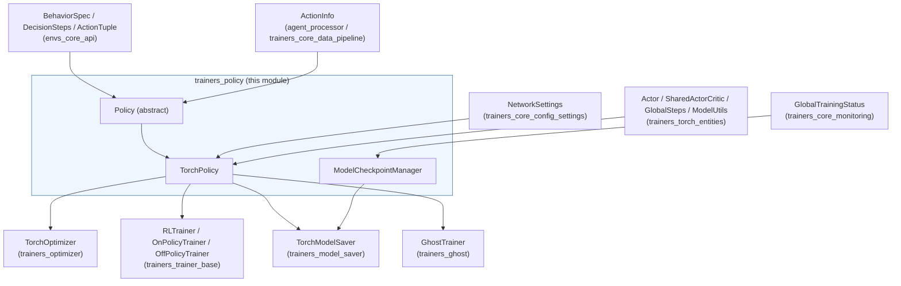
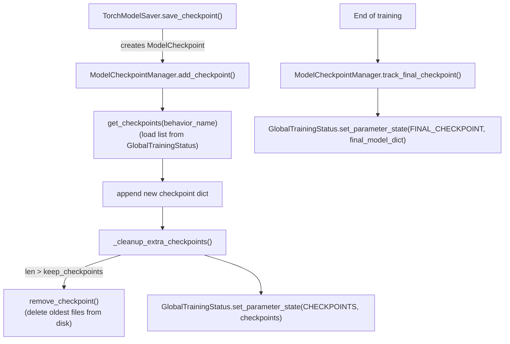
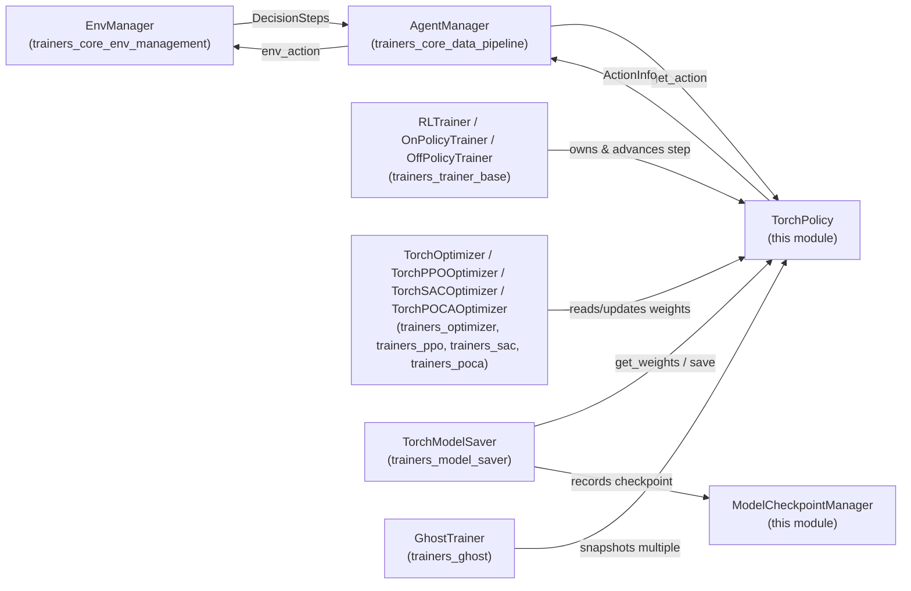

# Trainers Policy Module

## 1. Purpose & Overview

The `trainers_policy` module defines the **decision-making abstraction** at the heart of the ML-Agents training stack. A *Policy* is the object responsible for turning raw environment observations (`DecisionSteps`) into agent actions, for tracking recurrent memory/previous-action state across steps, and for exposing the weights that get optimized during training and exported for inference.

The module also provides **checkpoint bookkeeping** via `ModelCheckpointManager`, which records, prunes, and persists metadata about saved model checkpoints so that training runs can resume, export the best/last model, and respect user-configured retention limits (`keep-checkpoints`).

This module sits at a key integration point in the system:

* It is **consumed by** [Trainer implementations](trainers_trainer_base.md) (`RLTrainer`, `OnPolicyTrainer`, `OffPolicyTrainer`) and by the [Optimizer layer](trainers_optimizer.md) (`TorchOptimizer`), which wraps a `Policy` to compute losses and gradients.
* It is **consumed by** the [Model Saver](trainers_model_saver.md) (`TorchModelSaver`), which serializes policy weights and uses `ModelCheckpointManager` to track saved checkpoints.
* It **depends on** the [Neural Network Building Blocks](trainers_torch_entities.md) module for the actual `nn.Module` actor architecture (`SharedActorCritic`, `SimpleActor`-style classes, `GlobalSteps`, `ModelUtils`) and on [Training Configuration Settings](trainers_core_config_settings.md) for `NetworkSettings`.
* It **depends on** the [Environment Interface Layer](envs_core_api.md) for the `BehaviorSpec`, `DecisionSteps`, and `ActionTuple` types that define the observation/action contract with the Unity environment.
* It **depends on** [Training Monitoring](trainers_core_monitoring.md) (`GlobalTrainingStatus`) to persist checkpoint metadata across process restarts.
* It is specialized by the [Ghost Trainer](trainers_ghost.md) module for self-play, which manages multiple snapshotted policies.

## 2. Architecture Overview

The module consists of three tightly related files:

| File | Component | Responsibility |
|---|---|---|
| `policy/policy.py` | `Policy` (abstract base) | Defines the policy contract: action selection interface, memory management, previous-action tracking, weight get/set/load hooks, NaN-safety checks. |
| `policy/torch_policy.py` | `TorchPolicy` (concrete) | PyTorch implementation of `Policy`. Wraps an `Actor` neural network, evaluates observations to produce actions/log-probs/memories, and tracks the global training step. |
| `policy/checkpoint_manager.py` | `ModelCheckpointManager`, `ModelCheckpoint` | Static utility for recording, pruning, and querying model checkpoint metadata (paths, step count, reward, timestamp) via `GlobalTrainingStatus`. |

### 2.1 Class Diagram

```mermaid
classDiagram
    class Policy {
        <<abstract>>
        +BehaviorSpec behavior_spec
        +NetworkSettings network_settings
        +int seed
        +bool use_recurrent
        +int m_size
        +int sequence_length
        +make_empty_memory(num_agents)
        +save_memories(agent_ids, memory_matrix)
        +retrieve_memories(agent_ids)
        +retrieve_previous_memories(agent_ids)
        +remove_memories(agent_ids)
        +save_previous_action(agent_ids, action_tuple)
        +retrieve_previous_action(agent_ids)
        +remove_previous_action(agent_ids)
        +get_action(decision_requests, worker_id) ActionInfo
        +check_nan_action(action)
        +increment_step(n_steps)
        +get_current_step()
        +load_weights(values)
        +get_weights() List
        +init_load_weights()
    }

    class TorchPolicy {
        +GlobalSteps global_step
        +Actor actor
        +int export_memory_size
        +evaluate(decision_requests, global_agent_ids) Dict
        +get_action(decision_requests, worker_id) ActionInfo
        +get_current_step()
        +set_step(step)
        +increment_step(n_steps)
        +load_weights(values)
        +get_weights() List
        +get_modules() Dict
    }

    class ModelCheckpoint {
        +int steps
        +str file_path
        +float reward
        +float creation_time
        +List~str~ auxillary_file_paths
    }

    class ModelCheckpointManager {
        <<static utility>>
        +get_checkpoints(behavior_name) List
        +remove_checkpoint(checkpoint)
        +add_checkpoint(behavior_name, new_checkpoint, keep_checkpoints)
        +track_final_checkpoint(behavior_name, final_checkpoint)
    }

    Policy <|-- TorchPolicy
    ModelCheckpointManager ..> ModelCheckpoint : manages
    ModelCheckpointManager ..> GlobalTrainingStatus : reads/writes
    TorchPolicy --> "Actor (nn.Module)" : owns
    TorchPolicy --> GlobalSteps : owns
```

*`GlobalTrainingStatus` is defined in [Training Monitoring](trainers_core_monitoring.md); `Actor`/`GlobalSteps`/`ModelUtils` are defined in [Neural Network Building Blocks](trainers_torch_entities.md).*

### 2.2 Component Relationships in the Broader System



## 3. Core Concepts

### 3.1 The `Policy` Abstraction

`Policy` is an abstract base class that encapsulates everything a training loop needs from a decision-making component, independent of the underlying ML framework:

* **Behavior contract**: holds a `BehaviorSpec` (observation/action shapes) and `NetworkSettings` (architecture hyperparameters — memory size, sequence length, normalization).
* **Recurrent memory management**: `memory_dict` / `previous_memory_dict` keyed by `GlobalAgentId` allow LSTM-based policies to persist hidden state across the asynchronous, multi-agent step loop. `save_memories` / `retrieve_memories` / `retrieve_previous_memories` / `remove_memories` implement this bookkeeping generically.
* **Previous-action tracking**: needed for discrete action conditioning (e.g., autoregressive/sequential action heads) — `save_previous_action` / `retrieve_previous_action` / `remove_previous_action`.
* **Action generation contract**: `get_action(decision_requests, worker_id) -> ActionInfo` is the single entry point trainers and the `AgentManager` (see [Data Pipeline](trainers_core_data_pipeline.md)) use to obtain actions to send back to the Unity environment.
* **Weight lifecycle hooks**: `get_weights`, `load_weights`, `init_load_weights` are abstract hooks used by the [Model Saver](trainers_model_saver.md) and by self-play snapshotting in [Ghost Trainer](trainers_ghost.md).
* **Safety check**: `check_nan_action` guards against NaN propagation from a diverged network into the environment.

### 3.2 `TorchPolicy`: The PyTorch Implementation

`TorchPolicy` is the concrete implementation used throughout ML-Agents' built-in algorithms (PPO, SAC, POCA — see [Built-in RL Algorithms](trainers_ppo.md)) as well as the plugin algorithms (A2C, DQN — see the trainer plugin modules).

Key responsibilities:

* Instantiates an **Actor** network (`actor_cls(actor_kwargs)`) from [Neural Network Building Blocks](trainers_torch_entities.md) — e.g. `SimpleActor` or `SharedActorCritic` — using `observation_specs`, `network_settings`, and `action_spec` derived from the `BehaviorSpec`.
* Owns a `GlobalSteps` counter (`trainers_torch_entities`) tracking the total number of environment steps the policy has been trained on; this value drives learning-rate/entropy decay schedules and is exported into the ONNX/Sentis model as metadata.
* `evaluate()` performs the forward pass: converts observations to tensors, builds the discrete-action mask from `decision_requests.action_mask`, runs `actor.get_action_and_stats`, and converts the results (`action`, `log_probs`, `entropy`, `memory_out`) back to numpy for use by the outer training loop.
* `get_action()` is the public, environment-facing wrapper: it resolves `GlobalAgentId`s, invokes `evaluate()`, persists memories, performs the NaN safety check, and packages everything into an `ActionInfo`.
* Implements the weight I/O hooks (`get_weights`/`load_weights`) via `state_dict()`, used for synchronization between training and inference copies of a model, and for self-play snapshot exchange.

#### Action Evaluation Flow

```mermaid
sequenceDiagram
    participant Env as Unity Environment
    participant AM as AgentManager
    participant TP as TorchPolicy
    participant Actor as Actor (nn.Module)

    Env->>AM: DecisionSteps (observations)
    AM->>TP: get_action(decision_requests, worker_id)
    TP->>TP: resolve GlobalAgentIds
    TP->>TP: evaluate(decision_requests, global_agent_ids)
    TP->>TP: _extract_masks(decision_requests)
    TP->>TP: retrieve_memories(global_agent_ids)
    TP->>Actor: get_action_and_stats(obs, masks, memories)
    Actor-->>TP: action, run_out, memories
    TP->>TP: save_memories(global_agent_ids, memories)
    TP->>TP: check_nan_action(action)
    TP-->>AM: ActionInfo(action, env_action, outputs, agent_ids)
    AM->>Env: env_action
```

### 3.3 Checkpoint Management

`ModelCheckpointManager` provides a **stateless, static** API on top of persisted training status (`GlobalTrainingStatus`, see [Training Monitoring](trainers_core_monitoring.md)). It does not perform any serialization itself — that is the job of [`TorchModelSaver`](trainers_model_saver.md) — but rather tracks *metadata about checkpoints that have already been written to disk* so that:

* the number of retained checkpoints respects the user-configured `keep_checkpoints` setting (from `CheckpointSettings` in [Configuration Settings](trainers_core_config_settings.md));
* old checkpoint files (and any auxiliary files, e.g. `.onnx`/`.pt` pairs) are deleted from disk once they age out;
* the final checkpoint of a run is tracked separately (`STATUS.FINAL_CHECKPOINT`) so it is never subject to rotation.

#### Checkpoint Lifecycle



## 4. Key Data Structures

* **`ActionInfo`** (`mlagents/trainers/action_info.py`) — `NamedTuple(action, env_action, outputs, agent_ids)` returned by `get_action`; consumed by the `AgentManager` in [Training Orchestration Data Pipeline](trainers_core_data_pipeline.md) to step the environment and later constructed into `Trajectory` records.
* **`ModelCheckpoint`** (`attrs` class) — `steps`, `file_path`, `reward`, `creation_time`, `auxillary_file_paths`; the serializable unit tracked per checkpoint.
* **`GlobalAgentId`** — a composite identifier (`worker_id` + local `agent_id`) used as the dictionary key for memory/previous-action tracking across potentially many parallel environment workers (see [Environment Management](trainers_core_env_management.md)).

## 5. How This Module Fits Into Training



In summary, `trainers_policy` is the **narrow waist** between the neural-network world (`trainers_torch_entities`), the environment/data world (`envs_core_api`, `trainers_core_data_pipeline`), and the training-orchestration world (`trainers_trainer_base`, `trainers_optimizer`, `trainers_model_saver`, `trainers_ghost`). Its abstraction (`Policy`) allows trainers and optimizers to be written generically, while `TorchPolicy` provides the single production implementation, and `ModelCheckpointManager` keeps long-running training jobs' saved-model history consistent and bounded.

## 6. Related Modules

* [Training Orchestration Core — Configuration Settings](trainers_core_config_settings.md) — `NetworkSettings`, `CheckpointSettings` consumed by this module.
* [Training Orchestration Core — Data Pipeline](trainers_core_data_pipeline.md) — `AgentManager`/`ActionInfo`/`Trajectory` producers/consumers of `Policy.get_action`.
* [Training Orchestration Core — Monitoring](trainers_core_monitoring.md) — `GlobalTrainingStatus` used by `ModelCheckpointManager`.
* [Training Orchestration Core — Environment Management](trainers_core_env_management.md) — supplies `DecisionSteps` and worker IDs.
* [Trainer Base Classes](trainers_trainer_base.md) — owns and drives `Policy` instances.
* [Optimizer Layer](trainers_optimizer.md) — wraps `Policy` for gradient computation.
* [Model Saver](trainers_model_saver.md) — serializes `Policy` weights and drives `ModelCheckpointManager`.
* [Ghost Trainer (Self-Play)](trainers_ghost.md) — manages multiple `Policy` snapshots.
* [Neural Network Building Blocks](trainers_torch_entities.md) — supplies the `Actor`, `GlobalSteps`, and `ModelUtils` used by `TorchPolicy`.
* [Environment Interface Layer — Core API](envs_core_api.md) — supplies `BehaviorSpec`, `DecisionSteps`, `ActionTuple`.
* [Built-in RL Algorithms: PPO](trainers_ppo.md), [SAC](trainers_sac.md), [POCA](trainers_poca.md) — algorithm-specific `Optimizer`/`Trainer` pairs that use `TorchPolicy`.
