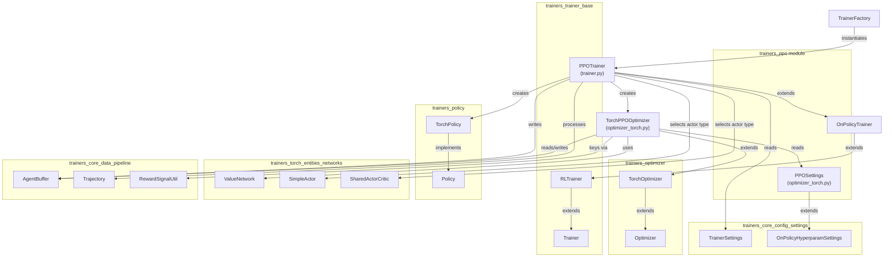
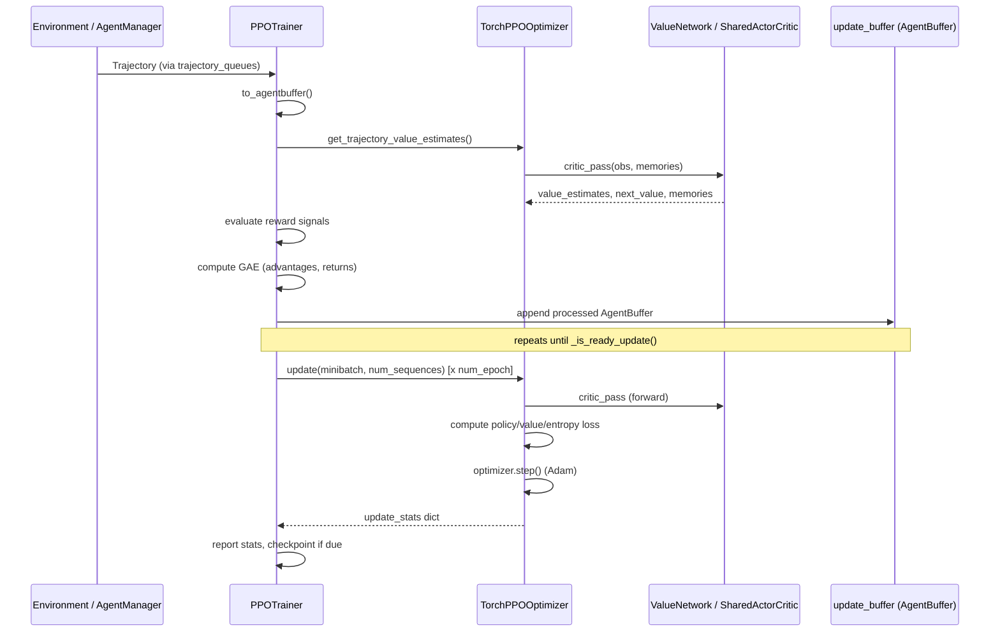
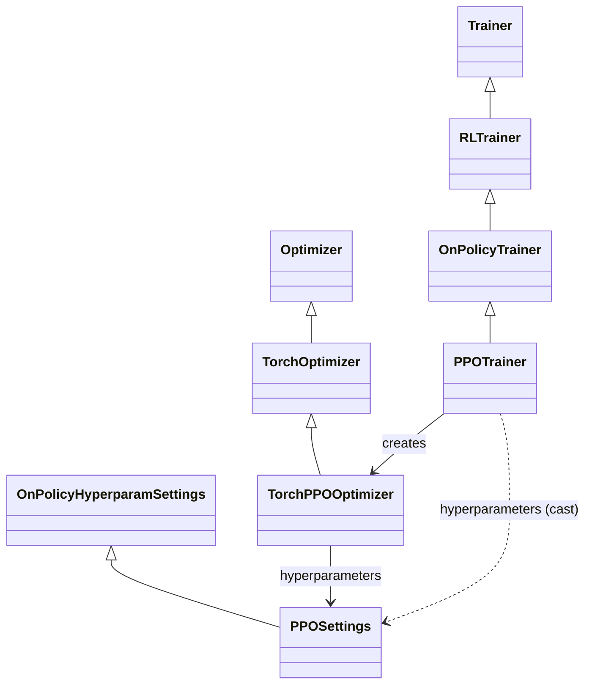

# Trainers PPO Module

## Introduction

The `trainers_ppo` module provides the concrete implementation of **Proximal Policy Optimization (PPO)** — the default and most widely used on-policy reinforcement learning algorithm in the ML-Agents Toolkit ([Schulman et al., 2017](https://arxiv.org/abs/1707.06347)). It plugs into the generic training infrastructure defined in [trainers_trainer_base.md](trainers_trainer_base.md) and [trainers_optimizer.md](trainers_optimizer.md), supplying the algorithm-specific pieces:

- **`PPOTrainer`** — orchestrates experience collection, advantage/return computation (GAE), and policy update scheduling for a single behavior.
- **`TorchPPOOptimizer`** (and its configuration class **`PPOSettings`**) — implements the PPO loss (clipped surrogate objective + value loss + entropy bonus) and performs the gradient updates on the policy/critic networks.

This module is one of three built-in algorithm implementations in the toolkit (alongside SAC and POCA — see [Related Modules](#related-modules)), and it is registered with, and instantiated by, the `TrainerFactory` described in [trainers_trainer_base.md](trainers_trainer_base.md).

## Purpose and Scope

PPO is an **on-policy actor-critic** algorithm. The `trainers_ppo` module is responsible for:

1. Converting raw environment trajectories into training batches annotated with **value estimates**, **advantages** (via Generalized Advantage Estimation, GAE) and **discounted returns**.
2. Managing a Torch-based **critic** (either a dedicated `ValueNetwork` or a critic shared with the actor via `SharedActorCritic`).
3. Computing the clipped PPO policy loss, value loss, and entropy bonus, and applying gradient updates through an Adam optimizer.
4. Exposing decayed hyperparameters (learning rate, clipping epsilon, entropy beta) that anneal over the course of training.
5. Integrating with auxiliary reward signals (extrinsic, curiosity, GAIL, RND — see [trainers_torch_components.md](trainers_torch_components.md)) and optional behavioral cloning (via `BCModule`).

It does **not** implement environment communication, network architectures, or the generic training loop — those responsibilities are delegated to sibling modules described below.

## Architecture Overview

## Component Responsibilities

### `PPOTrainer` (`ppo/trainer.py`)

`PPOTrainer` extends `OnPolicyTrainer` (see [trainers_trainer_base.md](trainers_trainer_base.md)) and is the entry point registered under the trainer name `"ppo"`. Its key responsibilities:

- **`create_policy`**: Builds a `TorchPolicy` using either a `SimpleActor` (default, separate actor/critic) or a `SharedActorCritic` (when `hyperparameters.shared_critic` is enabled) — both defined in [trainers_torch_entities_networks.md](trainers_torch_entities_networks.md).
- **`create_optimizer`**: Instantiates a `TorchPPOOptimizer` bound to the trainer's policy and settings.
- **`_process_trajectory`**: The core trajectory-processing pipeline:
  1. Delegates to `RLTrainer._process_trajectory` for step bookkeeping (summary/checkpoint scheduling, step increment).
  2. Converts the `Trajectory` into an `AgentBuffer` and updates observation normalization statistics for both actor and critic.
  3. Retrieves per-step value estimates and bootstrap values for each reward signal via `TorchOptimizer.get_trajectory_value_estimates`.
  4. Evaluates all configured reward signals (extrinsic + auxiliary, see [trainers_torch_components.md](trainers_torch_components.md)) and accumulates cumulative rewards for reporting.
  5. Computes **Generalized Advantage Estimation (GAE)** and discounted returns per reward signal, then averages them into global `ADVANTAGES` and `DISCOUNTED_RETURNS` buffer keys used by the optimizer.
  6. Appends the processed buffer to the trainer's `update_buffer` and updates end-of-episode statistics when the trajectory is terminal.
- **`get_policy`** / **`get_trainer_name`**: Simple accessors used by the orchestration layer.

The `_update_policy` method itself (mini-batching, epoch looping, shuffling) is inherited unchanged from `OnPolicyTrainer` in [trainers_trainer_base.md](trainers_trainer_base.md); `PPOTrainer` only supplies the trajectory processing and optimizer/policy construction logic that is specific to PPO.

### `TorchPPOOptimizer` and `PPOSettings` (`ppo/optimizer_torch.py`)

`PPOSettings` (an `attr.s` class extending `OnPolicyHyperparamSettings` from [trainers_core_config_settings.md](trainers_core_config_settings.md)) declares PPO-specific hyperparameters:

| Field | Default | Description |
|---|---|---|
| `beta` | `5.0e-3` | Entropy regularization coefficient |
| `epsilon` | `0.2` | PPO clipping range |
| `lambd` | `0.95` | GAE lambda |
| `num_epoch` | `3` | Number of optimization epochs per update |
| `shared_critic` | `False` | Whether actor and critic share a network body |
| `learning_rate_schedule` / `beta_schedule` / `epsilon_schedule` | `LINEAR` | Annealing schedules for the respective hyperparameters |

`TorchPPOOptimizer` extends `TorchOptimizer` (see [trainers_optimizer.md](trainers_optimizer.md)) and implements:

- **Critic construction**: If `shared_critic` is `False`, a dedicated `ValueNetwork` (one value head per reward signal) is created; otherwise the critic is the actor itself (`policy.actor`), enabling actor/critic weight sharing.
- **Decayed hyperparameters**: `decay_learning_rate`, `decay_epsilon`, `decay_beta` are `ModelUtils.DecayedValue` instances (see [trainers_torch_entities_utils_serialization_utils.md](trainers_torch_entities_utils_serialization_utils.md)) that linearly (or otherwise) anneal towards a floor value over `max_steps`.
- **`update(batch, num_sequences)`**: The main training step:
  1. Extracts old value estimates and returns per reward signal from the batch.
  2. Reconstructs observations, actions, action masks, and (optionally) recurrent memories from the `AgentBuffer`.
  3. Runs the actor (`policy.actor.get_stats`) to obtain new log-probabilities and entropy, and the critic (`critic.critic_pass`) to obtain new value estimates.
  4. Computes:
     - **Value loss** via `ModelUtils.trust_region_value_loss` (clipped value function loss).
     - **Policy loss** via `ModelUtils.trust_region_policy_loss` (PPO's clipped surrogate objective using the importance ratio between new and old log-probs and advantages).
     - **Total loss** = `policy_loss + 0.5 * value_loss - beta * entropy`.
  5. Performs a single Adam optimizer step and returns a dictionary of scalar statistics (`Losses/Policy Loss`, `Losses/Value Loss`, `Policy/Learning Rate`, `Policy/Epsilon`, `Policy/Beta`) that feed into the [trainers_core_monitoring.md](trainers_core_monitoring.md) stats pipeline.
- **`get_modules`**: Exposes the optimizer and critic (plus reward-signal sub-modules) for checkpointing via `TorchModelSaver` (see [trainers_model_saver.md](trainers_model_saver.md)).

## Data Flow: Trajectory → Update

## Class Hierarchy

## Key Dependencies

| Dependency | Module | Role |
|---|---|---|
| `OnPolicyTrainer`, `RLTrainer`, `Trainer`, `TrainerFactory` | [trainers_trainer_base.md](trainers_trainer_base.md) | Generic trainer lifecycle, epoch/minibatch update loop, factory instantiation |
| `Optimizer`, `TorchOptimizer` | [trainers_optimizer.md](trainers_optimizer.md) | Base optimizer contract, reward-signal wiring, trajectory value estimation, recurrent memory handling |
| `TorchPolicy`, `Policy` | [trainers_policy.md](trainers_policy.md) | Action sampling, actor network hosting, checkpointing hooks |
| `ValueNetwork`, `SimpleActor`, `SharedActorCritic`, `NetworkBody` | [trainers_torch_entities_networks.md](trainers_torch_entities_networks.md) | Underlying neural network architectures for actor and critic |
| `ModelUtils`, `DecayedValue` | [trainers_torch_entities_utils_serialization_utils.md](trainers_torch_entities_utils_serialization_utils.md) | Loss functions (`trust_region_policy_loss`, `trust_region_value_loss`), tensor conversion, hyperparameter decay |
| `AgentBuffer`, `RewardSignalUtil`, `BufferKey` | [trainers_core_data_pipeline.md](trainers_core_data_pipeline.md) | Structured storage of trajectories, reward/return/advantage/value buffer keys |
| `Trajectory`, `ObsUtil` | [trainers_core_data_pipeline.md](trainers_core_data_pipeline.md) | Raw trajectory representation and observation extraction |
| `TrainerSettings`, `OnPolicyHyperparamSettings`, `ScheduleType` | [trainers_core_config_settings.md](trainers_core_config_settings.md) | Typed configuration schema (YAML-driven) |
| Reward providers (extrinsic, curiosity, GAIL, RND), `BCModule` | [trainers_torch_components.md](trainers_torch_components.md) | Auxiliary/intrinsic reward computation and behavioral cloning regularization |
| `TorchModelSaver` | [trainers_model_saver.md](trainers_model_saver.md) | Checkpointing/exporting the PPO policy and optimizer state |
| `StatsReporter` | [trainers_core_monitoring.md](trainers_core_monitoring.md) | Collecting and writing training statistics (TensorBoard, console) |

## Related Modules

`trainers_ppo` is a peer to the other two built-in algorithm implementations under **Built-in RL Algorithms**:

- [trainers_sac.md](trainers_sac.md) — Soft Actor-Critic (off-policy).
- [trainers_poca.md](trainers_poca.md) — Multi-agent POCA (extends the PPO-style clipped-objective approach to cooperative multi-agent settings and shares much of `TorchOptimizer`'s infrastructure).

For fully custom/experimental algorithms plugged in externally, see [trainer_plugin_a2c.md](trainer_plugin_a2c.md) and [trainer_plugin_dqn.md](trainer_plugin_dqn.md), which follow the same `Trainer`/`Optimizer` extension pattern established by this module.

## Summary

The `trainers_ppo` module is a focused, two-file implementation that binds together the generic trainer/optimizer scaffolding, the neural network building blocks, and the data pipeline to realize the PPO algorithm. Its design cleanly separates **experience processing and scheduling** (`PPOTrainer`) from **loss computation and gradient updates** (`TorchPPOOptimizer`), making it a reference implementation for how new on-policy algorithms can be added to the ML-Agents training stack.
