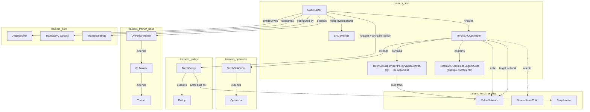

# Trainers SAC Module

## 1. Purpose & Overview

The `trainers_sac` module implements **Soft Actor-Critic (SAC)**, an off-policy, maximum-entropy
reinforcement learning algorithm, as one of the pluggable training backends of the ML-Agents
Python trainer stack. SAC is prized for its **sample efficiency** (thanks to a replay buffer and
off-policy updates) and its automatic **entropy-based exploration** tuning, making it a strong
alternative to the on-policy [PPO](trainers_ppo.md) algorithm — especially in continuous-control
tasks or environments where interacting with the simulator is expensive.

The module consists of exactly two files:

| File | Responsibility |
|---|---|
| `sac/trainer.py` | `SACTrainer` — orchestrates experience collection, replay-buffer management, and hooks into the generic off-policy training loop. |
| `sac/optimizer_torch.py` | `TorchSACOptimizer`, `SACSettings` — the PyTorch implementation of the SAC loss functions (Q-functions, value function, policy, and automatic entropy coefficient) and the twin Q-network architecture. |

Both components plug into the broader **Built-in RL Algorithms** family together with
[PPO](trainers_ppo.md) and [POCA](trainers_poca.md), and rely heavily on generic training
infrastructure documented in [Training Orchestration & Lifecycle Infrastructure](trainers_core.md)
and neural building blocks from [Neural Network Building Blocks](trainers_torch_entities.md).

## 2. Architecture Overview

SAC in ML-Agents follows the classic actor–critic-with-twin-Q design. The **actor** (policy) is a
stochastic Gaussian/Categorical network shared with other trainers, while the **critic** side
consists of a state-value network `V(s)`, a target value network, and two independent Q-networks
(`Q1`, `Q2`) used to mitigate overestimation bias. An automatically-tuned entropy coefficient
balances exploration vs. exploitation.



### Key Design Points

- **Off-policy learning**: `SACTrainer` extends [`OffPolicyTrainer`](trainers_trainer_base.md),
  which manages a large replay buffer (`update_buffer`), decoupling data collection from the
  frequency of gradient updates (`steps_per_update`).
- **Twin Q-networks**: `PolicyValueNetwork` wraps two independent `ValueNetwork` instances
  (`q1_network`, `q2_network`) from [`trainers_torch_entities`](trainers_torch_entities.md) to
  reduce Q-value overestimation, following the Clipped Double-Q trick used in TD3/SAC.
- **Automatic entropy tuning**: `LogEntCoef` stores learnable log-entropy coefficients (one for
  continuous actions, one per discrete branch) which are optimized via a dedicated
  `entropy_optimizer` to track a target entropy derived from the action space size.
- **Soft target updates**: A `target_network` (a `ValueNetwork` copy of the critic) is updated via
  Polyak/soft averaging (`ModelUtils.soft_update`, controlled by `tau`) each optimization step,
  stabilizing the TD backups used in the Q-loss.
- **SharedActorCritic incompatibility**: SAC explicitly disallows a `SharedActorCritic` policy
  architecture (raises `UnityTrainerException`) because SAC requires a *separate* critic from the
  actor to preserve off-policy correctness.

## 3. Component Reference

### 3.1 `SACSettings`
A configuration dataclass (via `attrs`) extending `OffPolicyHyperparamSettings`
(see [trainers_core_config_settings](trainers_core.md)). Key fields:

| Field | Description |
|---|---|
| `batch_size` | Minibatch size sampled from the replay buffer per update. |
| `buffer_size` | Maximum replay buffer capacity. |
| `buffer_init_steps` | Number of steps to collect before any updates begin. |
| `tau` | Soft-update coefficient for the target value network. |
| `steps_per_update` | Ratio of environment steps to gradient updates. |
| `save_replay_buffer` | Whether to checkpoint the replay buffer to disk. |
| `init_entcoef` | Initial value of the entropy coefficient(s). |
| `reward_signal_steps_per_update` | Update cadence for reward-signal networks (defaults to `steps_per_update`). |

### 3.2 `TorchSACOptimizer`
The core PyTorch optimizer, extending [`TorchOptimizer`](trainers_optimizer.md). Responsibilities:

- Builds the twin Q-network (`PolicyValueNetwork`), the critic `ValueNetwork`, and a
  `target_network`, all conditioned on `policy.behavior_spec` and `NetworkSettings`.
- Instantiates three independent Adam optimizers: `policy_optimizer`, `value_optimizer` (for
  Q1/Q2/critic parameters), and `entropy_optimizer` (for `LogEntCoef` parameters).
- Implements the four SAC loss terms:
  - `sac_q_loss` — TD/backup loss for Q1 and Q2 using rewards, dones, and the target value network.
  - `sac_value_loss` — regresses the state-value function toward the entropy-adjusted minimum of Q1/Q2.
  - `sac_policy_loss` — maximizes expected Q while penalizing negative entropy (reparameterized policy gradient).
  - `sac_entropy_loss` — adjusts `LogEntCoef` toward the configured target entropy.
- `update()` orchestrates a full gradient step: sampling observations/actions/memories from an
  `AgentBuffer` minibatch, running the actor to get reparameterized samples, computing all four
  losses, backpropagating through the three optimizers, and soft-updating the target network.
- `get_modules()` exposes all trainable sub-modules (Q-network, critic, target network,
  optimizers) plus reward-signal modules for checkpointing (used by
  [`TorchModelSaver`](trainers_model_saver.md)).

Internal helper classes:

| Class | Purpose |
|---|---|
| `PolicyValueNetwork` | Holds `q1_network` / `q2_network` (`ValueNetwork`s) and forwards through both, optionally freezing gradients per Q-head via `q1_grad`/`q2_grad`. |
| `LogEntCoef` | Thin `nn.Module` wrapper holding `discrete` and `continuous` learnable entropy coefficient tensors. |
| `TargetEntropy` (NamedTuple) | Stores the computed target entropy for discrete branches and the continuous action space, derived from `discrete_target_entropy_scale` / `continuous_target_entropy_scale`. |

### 3.3 `SACTrainer`
Extends [`OffPolicyTrainer`](trainers_trainer_base.md) and implements the SAC-specific hooks
required by the generic [`RLTrainer`](trainers_trainer_base.md) training loop:

- `create_policy()` — builds a `TorchPolicy` using `SimpleActor` with `conditional_sigma=True` and
  `tanh_squash=True` (Gaussian policy squashed through `tanh`, as required by SAC's action
  bounding), then attempts to load a saved replay buffer via `maybe_load_replay_buffer()`.
- `create_optimizer()` — instantiates `TorchSACOptimizer`.
- `_process_trajectory()` — converts an incoming `Trajectory` into an `AgentBuffer`, updates
  observation normalization statistics on both the actor and the critic, evaluates all configured
  reward signals for logging, computes bootstrap value estimates via
  `optimizer.get_trajectory_value_estimates`, handles truncated ("interrupted") episodes by
  duplicating the last observation and clearing the `done` flag (so the replay buffer doesn't treat
  a time-limit cutoff as a true terminal state), and finally appends the processed trajectory to
  the shared replay buffer (`update_buffer`, inherited from `RLTrainer`).
- `get_policy()` / `get_trainer_name()` — accessor and identity (`"sac"`) methods used by the
  [`TrainerFactory`](trainers_trainer_base.md).

## 4. Data & Control Flow

```mermaid
sequenceDiagram
    participant Env as Unity Environment
    participant AM as AgentManager<br/>(trainers_core)
    participant ST as SACTrainer
    participant Buf as Replay Buffer<br/>(AgentBuffer)
    participant Opt as TorchSACOptimizer
    participant Pol as TorchPolicy (Actor)

    Env->>AM: Observations / Rewards
    AM->>ST: Trajectory (via AgentManagerQueue)
    ST->>ST: _process_trajectory()
    ST->>Pol: update_normalization()
    ST->>Opt: get_trajectory_value_estimates()
    ST->>Buf: append processed experience

    loop every steps_per_update
        ST->>Buf: sample_mini_batch(batch_size)
        ST->>Opt: update(batch, num_sequences)
        Opt->>Opt: sac_q_loss / sac_value_loss
        Opt->>Opt: sac_policy_loss / sac_entropy_loss
        Opt->>Pol: backprop policy_optimizer
        Opt->>Opt: backprop value_optimizer
        Opt->>Opt: backprop entropy_optimizer
        Opt->>Opt: soft_update(target_network, tau)
    end

    ST->>Env: updated Policy (Actor) drives next actions
```

1. **Collection**: `SACTrainer` receives `Trajectory` objects from the
   [`AgentManager`](trainers_core.md) data pipeline, converts them to `AgentBuffer` entries, logs
   reward-signal evaluations, and appends them into a large replay buffer (unlike PPO, this buffer
   persists across many updates and is only truncated when it exceeds `buffer_size`).
2. **Update gating**: The inherited `OffPolicyTrainer._is_ready_update()` checks that enough
   experiences exist (`batch_size`) and that `buffer_init_steps` has elapsed.
3. **Optimization**: `OffPolicyTrainer._update_policy()` repeatedly samples random minibatches
   (not necessarily correlated with recent trajectories — a hallmark of off-policy learning) and
   calls `TorchSACOptimizer.update()`, which performs one gradient step across the policy, twin
   Q-networks/critic, and entropy coefficients.
4. **Reward signal updates**: Independently cadenced via `reward_signal_steps_per_update`,
   handled by `OffPolicyTrainer._update_reward_signals()`, which delegates to reward providers from
   [`trainers_torch_components_reward_providers`](trainers_torch_components.md) (e.g. Extrinsic,
   Curiosity, GAIL, RND).
5. **Checkpointing**: `save_model()` / `_checkpoint()` (inherited) additionally persist the replay
   buffer to `last_replay_buffer.hdf5` when `save_replay_buffer` is enabled, allowing training to
   resume with warm-started experience.

## 5. Relationship to Other Modules

- **[trainers_trainer_base](trainers_trainer_base.md)** — Provides the abstract `Trainer` →
  `RLTrainer` → `OffPolicyTrainer` hierarchy that `SACTrainer` extends; supplies the generic
  training loop, checkpointing, and buffer-truncation logic reused by SAC.
- **[trainers_optimizer](trainers_optimizer.md)** — Provides `Optimizer` and `TorchOptimizer` base
  classes with reward-signal management, behavioral-cloning integration, and trajectory value
  estimation utilities that `TorchSACOptimizer` builds upon.
- **[trainers_policy](trainers_policy.md)** — `TorchPolicy` (built with a `SimpleActor`) is the
  actor network that SAC trains; SAC configures it with `tanh_squash=True` for bounded continuous
  actions.
- **[trainers_torch_entities](trainers_torch_entities.md)** — Supplies `ValueNetwork` (used for the
  Q-networks, critic, and target network) and rejects `SharedActorCritic` architectures.
- **[trainers_core](trainers_core.md)** — Supplies `AgentBuffer`, `Trajectory`/`ObsUtil`,
  `TrainerSettings`, and the `AgentManager` data pipeline that feeds trajectories into `SACTrainer`.
- **[trainers_torch_components](trainers_torch_components.md)** — Supplies pluggable reward
  providers (Extrinsic, Curiosity, GAIL, RND) evaluated and optionally trained alongside SAC.
- **[trainers_model_saver](trainers_model_saver.md)** — Persists/loads the modules exposed by
  `TorchSACOptimizer.get_modules()` and the actor policy.
- **Sibling algorithms**: [PPO](trainers_ppo.md) (on-policy alternative) and
  [POCA](trainers_poca.md) (multi-agent, on-policy) live alongside SAC under the
  **Built-in RL Algorithms** family, all created through the shared
  `TrainerFactory` (see [trainers_trainer_base](trainers_trainer_base.md)).

## 6. Summary

The `trainers_sac` module is a compact but self-contained implementation of the SAC algorithm: one
file defines the trainer-level orchestration (data collection, replay buffer, bootstrapping), and
the other defines the full PyTorch optimization logic (twin Q-networks, entropy-regularized policy
loss, and automatic entropy tuning). It deliberately reuses the generic off-policy trainer
infrastructure and shared neural building blocks documented elsewhere in this wiki, keeping the
SAC-specific code focused purely on the mathematics and control flow unique to the algorithm.
