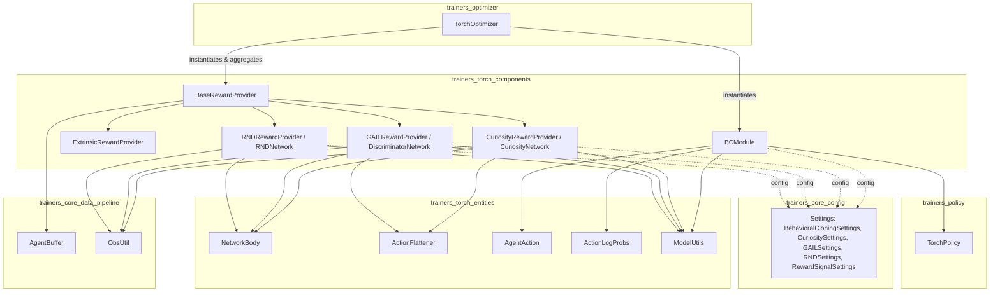
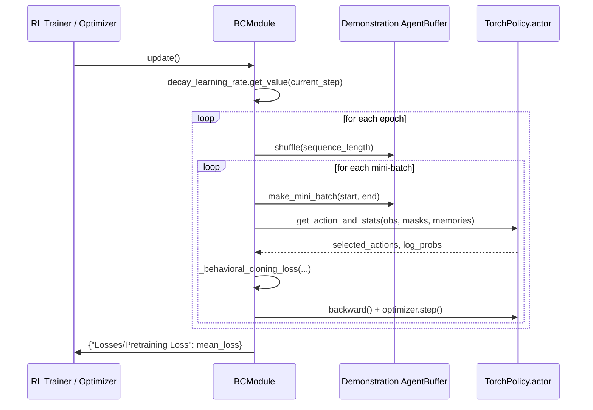
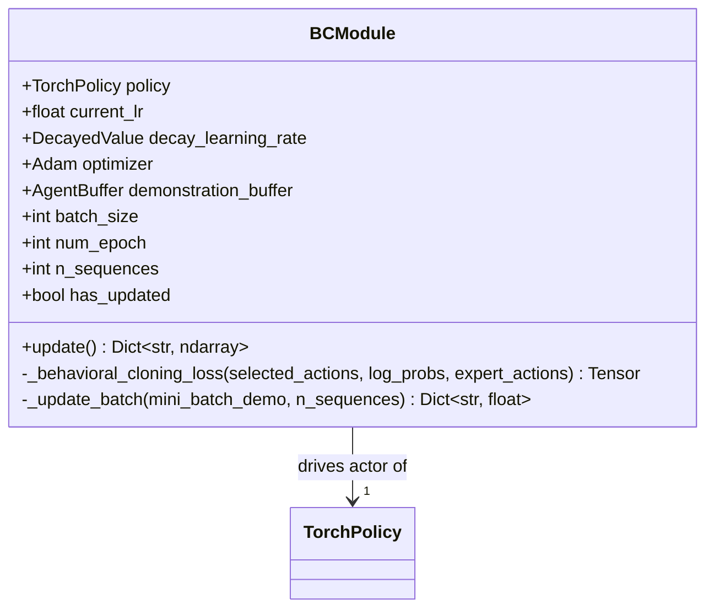
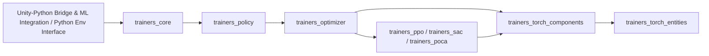

# Trainers Torch Components

## Purpose

The **Trainers Torch Components** module provides pluggable, self-contained PyTorch building blocks that extend the
core RL training loop with auxiliary learning signals and imitation-learning support. It sits on top of the generic
neural-network primitives defined in [Neural Network Building Blocks](trainers_torch_entities.md) and is consumed by
the RL algorithm optimizers in [Built-in RL Algorithms](trainers_ppo.md) (PPO, SAC, POCA) as well as by the generic
training infrastructure in [Training Orchestration & Lifecycle Infrastructure](trainers_core.md).

Concretely, the module contains two families of components:

1. **Behavioral Cloning (`BCModule`)** — an inline pretrainer/regularizer that clones expert demonstrations into the
   policy being trained, usable alongside any RL optimizer.
2. **Reward Providers** — a family of `BaseRewardProvider` implementations (`Extrinsic`, `Curiosity`, `GAIL`, `RND`)
   that compute additional or replacement reward signals from batches of experience. These are aggregated by
   `TorchOptimizer` (see [trainers_optimizer](trainers_optimizer.md)) to form the total training reward.

Both families are designed to be attached to a `TorchPolicy` (see [trainers_policy](trainers_policy.md)) and operate
on `AgentBuffer` mini-batches (see [trainers_core_data_pipeline](trainers_core_data_pipeline.md)), making them
interchangeable, composable extensions rather than hard-coded parts of any single trainer.

## Architecture Overview

## Sub-modules

| Sub-module | Description | Documentation |
|---|---|---|
| Behavioral Cloning | Inline imitation-learning module that fine-tunes the policy's actor towards expert demonstrations while RL training proceeds. | Documented below (single-file module) |
| Reward Providers | Family of auxiliary/alternative reward computation modules (Extrinsic, Curiosity, GAIL, RND) sharing a common `BaseRewardProvider` interface. | [trainers_torch_components_reward_providers.md](trainers_torch_components_reward_providers.md) |

---

## Behavioral Cloning: `BCModule`

### Purpose

`BCModule` (`ml-agents/mlagents/trainers/torch_entities/components/bc/module.py`) implements **inline behavioral
cloning**: it periodically nudges the policy's actor network towards actions recorded in expert demonstration data,
independent of (and concurrently with) the primary RL loss. This is used to speed up learning or bias the policy
towards known-good behavior, controlled by `BehavioralCloningSettings` (see
[trainers_core_config_settings](trainers_core_config_settings.md)).

### Responsibilities

- Loads a demonstration buffer via `demo_to_buffer` from the configured `demo_path`.
- Maintains its own Adam optimizer over `policy.actor.parameters()`, separate from the main RL optimizer.
- Anneals its learning rate over `settings.steps` using `ModelUtils.DecayedValue` (linear or constant schedule), from
  [trainers_torch_entities_utils_serialization_utils](trainers_torch_entities_utils_serialization_utils.md).
- On `update()`, repeatedly samples mini-batches from the demonstration buffer, computes a behavioral cloning loss,
  and performs a gradient step on the actor.
- Supports both continuous actions (MSE loss) and discrete actions (cross-entropy against one-hot expert actions).

### Key Interactions

- **`TorchPolicy`**: `BCModule` wraps and mutates the actor of a `TorchPolicy` instance (see
  [trainers_policy](trainers_policy.md)). It queries `policy.behavior_spec`, `policy.sequence_length`,
  `policy.use_recurrent`, and `policy.m_size` to correctly shape observations, action masks, and memories.
- **`AgentBuffer` / `ObsUtil`**: Demonstration data is stored and sampled using the same `AgentBuffer` abstraction
  used by the rest of the trainer stack (see [trainers_core_data_pipeline](trainers_core_data_pipeline.md)).
- **`AgentAction` / `ActionLogProbs`**: Uses the shared action representation and log-prob container types from
  [trainers_torch_entities_actions](trainers_torch_entities_actions.md) to compute the BC loss.
- **`ModelUtils`**: Uses helper functions (`list_to_tensor`, `actions_to_onehot`, `break_into_branches`,
  `update_learning_rate`) from
  [trainers_torch_entities_utils_serialization_utils](trainers_torch_entities_utils_serialization_utils.md).

### Update Flow

### Class Diagram

---

## Relationship to Reward Providers

While `BCModule` directly modifies the policy's actor weights via imitation loss, the **Reward Providers** sub-module
takes a different approach: it computes *reward signals* (intrinsic or from a discriminator) that are fed back into
the standard RL objective (e.g., PPO's advantage estimation) rather than directly updating the actor. Both mechanisms
can be combined for a given behavior (e.g., PPO + GAIL + BC), and both are configured through the settings classes in
[trainers_core_config_settings](trainers_core_config_settings.md) and wired together by the optimizers in
[trainers_optimizer](trainers_optimizer.md) and algorithm-specific optimizers such as
[trainers_ppo](trainers_ppo.md), [trainers_sac](trainers_sac.md), and [trainers_poca](trainers_poca.md).

See [trainers_torch_components_reward_providers.md](trainers_torch_components_reward_providers.md) for full details
on the reward provider implementations.

## Where This Module Fits in the Overall System

## Related Documentation

- [trainers_torch_components_reward_providers.md](trainers_torch_components_reward_providers.md) — detailed reward
  provider documentation (Extrinsic, Curiosity, GAIL, RND).
- [trainers_torch_entities.md](trainers_torch_entities.md) — overview of the generic neural network building blocks
  (`NetworkBody`, `ActionFlattener`, `AgentAction`, `ModelUtils`, etc.) reused by this module.
- [trainers_policy.md](trainers_policy.md) — the `TorchPolicy` class extended by `BCModule`.
- [trainers_optimizer.md](trainers_optimizer.md) — the `TorchOptimizer` that instantiates and aggregates reward
  providers.
- [trainers_core_data_pipeline.md](trainers_core_data_pipeline.md) — `AgentBuffer` and `ObsUtil`, the data containers
  consumed by all components in this module.
- [trainers_core_config_settings.md](trainers_core_config_settings.md) — configuration schema
  (`BehavioralCloningSettings`, `CuriositySettings`, `GAILSettings`, `RNDSettings`, `RewardSignalSettings`).
- [trainers_ppo.md](trainers_ppo.md), [trainers_sac.md](trainers_sac.md), [trainers_poca.md](trainers_poca.md) — the
  built-in RL algorithms that consume these components.
