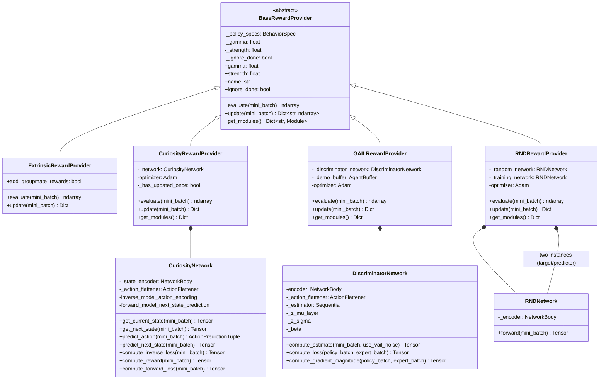
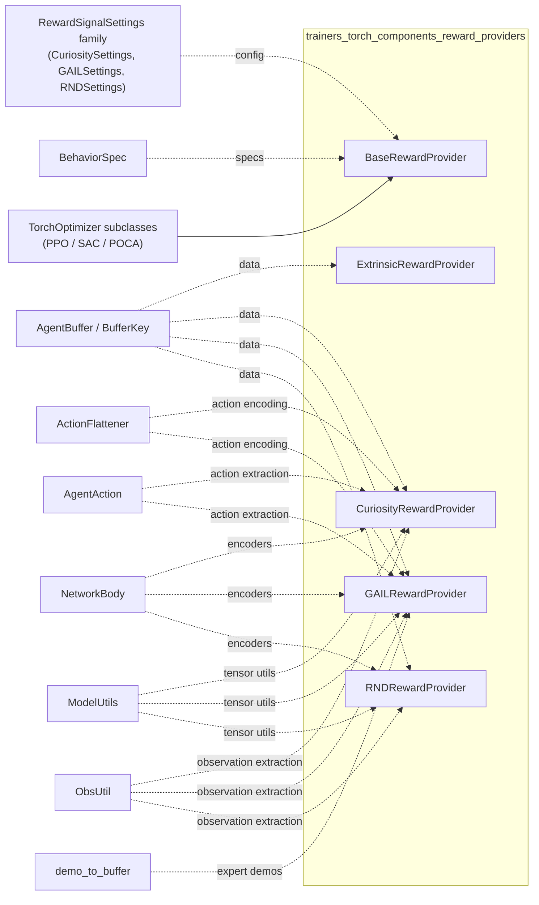
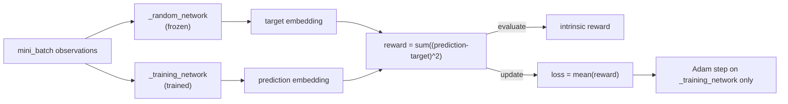
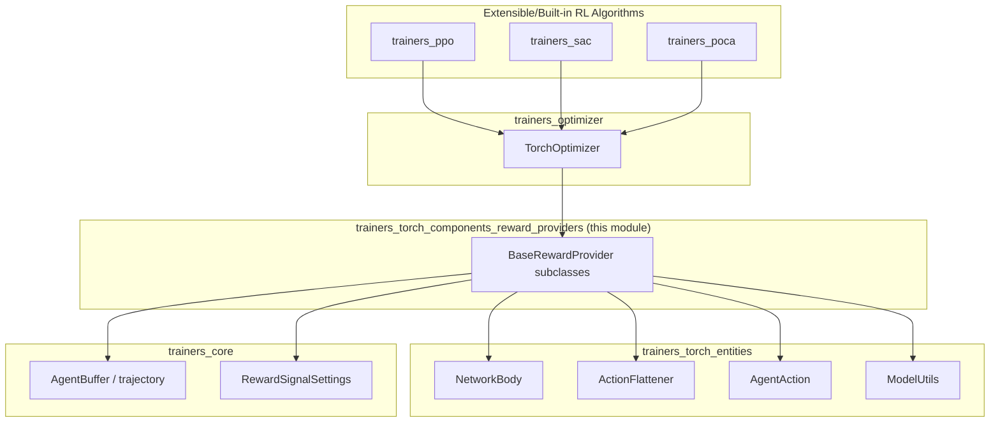

# Reward Providers (`trainers_torch_components_reward_providers`)

## 1. Purpose

The **Reward Providers** module implements the pluggable *reward signal* system used by ML-Agents' PyTorch
trainers. A reward provider is responsible for computing a scalar reward per experience (the "auxiliary" or
"extrinsic" reward) and, if it has learnable parameters, for updating itself from batches of collected
experience.

This module supplies the following concrete signals:

| Reward Signal | Class | Learns? | Purpose |
|---|---|---|---|
| Extrinsic | `ExtrinsicRewardProvider` | No | Passes through the environment reward (plus optional group/teammate rewards for multi-agent scenarios such as POCA). |
| Curiosity | `CuriosityRewardProvider` / `CuriosityNetwork` | Yes | Intrinsic Curiosity Module (ICM) — rewards the agent for visiting states whose outcome is hard to predict. |
| GAIL | `GAILRewardProvider` / `DiscriminatorNetwork` | Yes | Generative Adversarial Imitation Learning — rewards the agent for behaving like the demonstrator, using a discriminator trained against expert demonstrations. |
| RND | `RNDRewardProvider` / `RNDNetwork` | Yes | Random Network Distillation — rewards the agent for visiting novel states, using the prediction error between a fixed random network and a trained network. |

All reward providers share a single abstract contract, `BaseRewardProvider`, so that trainers/optimizers can
treat every signal uniformly (evaluate a reward, update the signal, expose its learnable modules for
checkpointing).

This module is a leaf sub-module of the [`trainers_torch_components`](trainers_torch_components.md) package
inside the broader [Neural Network Building Blocks](trainers_torch_entities.md) layer, and it is consumed by
the [RL optimizers](trainers_optimizer.md) that drive the built-in algorithms
([PPO](trainers_ppo.md), [SAC](trainers_sac.md), [POCA](trainers_poca.md)).

## 2. Architecture Overview

### 2.1 Class Hierarchy



### 2.2 External Dependencies



See:
- [`trainers_core_config_settings`](trainers_core_config_settings.md) for `RewardSignalSettings`,
  `CuriositySettings`, `GAILSettings`, `RNDSettings`.
- [`trainers_core_data_pipeline`](trainers_core_data_pipeline.md) for `AgentBuffer`, `BufferKey`, `ObsUtil`.
- [`trainers_torch_entities_networks`](trainers_torch_entities_networks.md) for `NetworkBody`.
- [`trainers_torch_entities_actions`](trainers_torch_entities_actions.md) for `ActionFlattener` and
  `AgentAction`.
- [`trainers_torch_entities_utils_serialization`](trainers_torch_entities_utils_serialization.md) for
  `ModelUtils`.
- [`envs_core_api`](envs_core_api.md) for `BehaviorSpec`.
- [`trainers_optimizer`](trainers_optimizer.md) for how reward providers are aggregated by
  `TorchOptimizer` subclasses used in [PPO](trainers_ppo.md), [SAC](trainers_sac.md), and
  [POCA](trainers_poca.md).

## 3. Common Contract — `BaseRewardProvider`

`BaseRewardProvider` (in `base_reward_provider.py`) is an `ABC` that every reward signal implements. It is
constructed with:
- `specs: BehaviorSpec` — the action/observation specification of the policy the reward applies to.
- `settings: RewardSignalSettings` — the per-signal configuration (`gamma`, `strength`, and a
  signal-specific `network_settings`/extra fields).

Key members:

| Member | Description |
|---|---|
| `gamma` | Discount factor used when this signal's rewards are converted into a return (read by the optimizer, not by the provider itself). |
| `strength` | Multiplier applied to the raw reward value before it is summed into the total reward. |
| `name` | Derived from the class name (`XxxRewardProvider` → `Xxx`), used as a key for reporting/statistics and for module identification in checkpoints. |
| `ignore_done` | If `True`, tells the optimizer that episode boundaries should be "bridged" — i.e., rewards from the next episode should count toward the return of the terminated episode. Used by intrinsic signals (Curiosity, RND) that have no natural episode end and would otherwise show artificial positive bias near terminal states. |
| `evaluate(mini_batch)` *(abstract)* | Given an `AgentBuffer` mini-batch, returns a `np.ndarray` of per-experience reward values. Must not mutate model parameters. |
| `update(mini_batch)` *(abstract)* | Performs a training step for the reward model (if any) using the mini-batch, and returns a `Dict[str, np.ndarray]` of stats (e.g. losses) to be reported via `StatsReporter` (see [`trainers_core_monitoring`](trainers_core_monitoring.md)). |
| `get_modules()` | Returns `{name: torch.nn.Module}` for any learnable sub-networks, enabling the [`TorchModelSaver`](trainers_model_saver.md) to persist/restore their weights. Default implementation returns `{}` (used by `ExtrinsicRewardProvider`, which has no learnable state). |

## 4. Reward Providers

### 4.1 `ExtrinsicRewardProvider`

The simplest signal — it does **not** learn. `evaluate()` reads `BufferKey.ENVIRONMENT_REWARDS` directly from
the mini-batch and, when `add_groupmate_rewards` is enabled (used by cooperative/multi-agent trainers such as
POCA — see [`trainers_poca`](trainers_poca.md)), adds the summed rewards of groupmates
(`BufferKey.GROUPMATE_REWARDS`) and the shared `BufferKey.GROUP_REWARD`. `update()` is a no-op returning `{}`.

```mermaid
sequenceDiagram
    participant Opt as TorchOptimizer
    participant ERP as ExtrinsicRewardProvider
    participant Buf as AgentBuffer

    Opt->>ERP: evaluate(mini_batch)
    ERP->>Buf: read ENVIRONMENT_REWARDS
    opt add_groupmate_rewards
        ERP->>Buf: read GROUPMATE_REWARDS
    end
    opt GROUP_REWARD present
        ERP->>Buf: read GROUP_REWARD
    end
    ERP-->>Opt: ndarray of total rewards
```

### 4.2 `CuriosityRewardProvider` / `CuriosityNetwork` (Intrinsic Curiosity Module)

Implements the ICM approach: an **inverse model** predicts the action taken given the current and next state
embeddings, and a **forward model** predicts the next state embedding given the current state and the action
taken. The intrinsic reward is the forward-model prediction error — high when the environment's dynamics
were poorly predicted (i.e., novel/surprising transitions).

Architecture (`CuriosityNetwork`):
- `_state_encoder` (`NetworkBody`) encodes raw observations into a hidden state embedding. Memory (LSTM) is
  explicitly disabled/warned-against since curiosity operates on independent transitions.
- `_action_flattener` (`ActionFlattener`) flattens continuous/discrete actions for use as forward-model input.
- `inverse_model_action_encoding`: a `LinearEncoder` combining current+next state embeddings.
- `continuous_action_prediction` / `discrete_action_prediction`: heads predicting the action that caused the
  transition.
- `forward_model_next_state_prediction`: predicts the next-state embedding from current state + action.

Training/evaluation flow:

```mermaid
flowchart TD
    A[mini_batch] --> B[get_current_state\nNetworkBody on obs_t]
    A --> C[get_next_state\nNetworkBody on obs_t+1]
    B --> D[inverse_model_action_encoding]
    C --> D
    D --> E[predict_action]
    E --> F[compute_inverse_loss\nvs actual action]
    B --> G[predict_next_state\nusing action_flattener]
    C --> H[compute_reward\nMSE(predicted, actual next state)]
    G --> H
    H --> I[compute_forward_loss]
    F --> J["loss = mult * (beta*forward + (1-beta)*inverse)"]
    I --> J
    J --> K[Adam optimizer step]
    H --> L["evaluate(): reward clipped to 1/strength,\nzeroed until first update"]
```

Notes:
- `beta = 0.2` weights forward vs. inverse loss; `loss_multiplier = 10.0` scales the combined loss.
- `evaluate()` clips reward to `1.0 / strength` for stability and multiplies by `_has_updated_once` (a
  0/1 flag) so that rewards are suppressed until the network has been trained at least once — avoiding noisy
  reward at initialization.
- `_ignore_done = True` since curiosity reward is not tied to episode termination.
- Depends on `mlagents.trainers.trajectory.ObsUtil` (see
  [`trainers_core_data_pipeline`](trainers_core_data_pipeline.md)) to extract current/next observations from
  the buffer, and `ModelUtils` for tensor conversion, one-hot encoding, and masked mean reduction
  (`dynamic_partition`).

### 4.3 `GAILRewardProvider` / `DiscriminatorNetwork` (Generative Adversarial Imitation Learning)

Trains a binary discriminator to distinguish policy-generated transitions from expert demonstration
transitions (loaded once at construction time via `demo_to_buffer(settings.demo_path, ...)`). The reward
given to the policy is derived from how well it "fools" the discriminator — i.e., how expert-like its
behavior looks.

Architecture (`DiscriminatorNetwork`):
- `encoder` (`NetworkBody`) encodes observations, optionally concatenated with flattened actions and the
  `done` flag (`use_actions` setting) — memory disabled, same rationale as Curiosity.
- Optional **VAIL** (Variational Adversarial Imitation Learning) mode (`use_vail`): projects the encoder's
  hidden state into a stochastic latent `z` (`_z_mu_layer`, `_z_sigma`) and regularizes it toward a
  unit Gaussian via a KL term controlled by a dual-ascent-updated `_beta` parameter, targeting a
  `mutual_information` budget.
- `_estimator`: sigmoid-activated linear layer producing the probability estimate that the input is expert
  data.

Reward computation (`evaluate`): `-log(1 - estimate * (1 - EPSILON))` — larger when the discriminator scores
the transition as more "expert-like".

Discriminator training (`update` → `compute_loss`):

```mermaid
sequenceDiagram
    participant Opt as TorchOptimizer
    participant GRP as GAILRewardProvider
    participant Demo as _demo_buffer
    participant Disc as DiscriminatorNetwork

    Opt->>GRP: update(policy_mini_batch)
    GRP->>Demo: sample_mini_batch(N)
    GRP->>Disc: encoder.update_normalization(expert_batch)
    GRP->>Disc: compute_loss(policy_batch, expert_batch)
    Disc->>Disc: compute_estimate(policy_batch, use_vail_noise=True)
    Disc->>Disc: compute_estimate(expert_batch, use_vail_noise=True)
    Disc->>Disc: discriminator_loss = -(log(expert) + log(1-policy))
    opt use_vail
        Disc->>Disc: kl_loss, vail_loss, update beta (dual ascent)
    end
    opt gradient_penalty_weight > 0
        Disc->>Disc: compute_gradient_magnitude (WGAN-style penalty)
    end
    Disc-->>GRP: total_loss, stats_dict
    GRP->>GRP: optimizer.zero_grad(); loss.backward(); optimizer.step()
    GRP-->>Opt: stats_dict
```

Notable implementation details:
- `compute_gradient_magnitude` implements the gradient penalty from Gulrajani et al. (WGAN-GP), interpolating
  between policy and expert inputs and penalizing the estimator's gradient norm — this stabilizes GAIL
  training against discriminator overfitting.
- Uses `mlagents.trainers.demo_loader.demo_to_buffer` to convert recorded demonstrations
  (see [`runtime_demonstrations`](runtime_demonstrations.md) and
  [`envs_wrappers`](envs_wrappers.md)-adjacent recording pipeline) into an `AgentBuffer` of expert
  transitions.

### 4.4 `RNDRewardProvider` / `RNDNetwork` (Random Network Distillation)

Implements RND (Burda et al., 2018): two structurally identical `RNDNetwork` encoders are created —
`_random_network` (frozen, never trained) and `_training_network` (trained to imitate the random network's
output on observed states). The intrinsic reward is the squared prediction error between the two; since the
training network can only match the random network well on states it has seen often, the error acts as a
novelty signal.



- `RNDNetwork.forward()` extracts observations via `ObsUtil.from_buffer`, encodes them with `NetworkBody`,
  and also calls `update_normalization(mini_batch)` on the encoder — meaning normalization statistics are
  updated as a side effect of any forward pass (both target and prediction networks update their own running
  stats).
- `_ignore_done = True`, matching Curiosity's rationale of no natural episode end for the novelty signal.
- `get_modules()` exposes both networks (`-pred` and `-target` suffixes) for checkpointing, since the frozen
  random network must be restored consistently across runs to keep rewards comparable.

## 5. Integration with Trainers/Optimizers

Reward providers are not used directly by end users; they are instantiated and orchestrated by the
`TorchOptimizer` subclasses (see [`trainers_optimizer`](trainers_optimizer.md)) based on the
`reward_signals` section of `TrainerSettings` (see
[`trainers_core_config_settings`](trainers_core_config_settings.md)). A typical optimizer:

1. Instantiates one `BaseRewardProvider` per configured `RewardSignalSettings` entry (Extrinsic is always
   present; Curiosity/GAIL/RND are optional).
2. During the update step, calls `evaluate()` on each provider to compute per-signal rewards, which are
   combined (weighted by `strength`) with the environment reward to form the total reward used for advantage
   computation.
3. Calls `update()` on each provider to train learnable signals, aggregating the returned stats dictionaries
   into training logs (surfaced through
   [`trainers_core_monitoring`](trainers_core_monitoring.md)'s `StatsReporter`).
4. Calls `get_modules()` on each provider so [`TorchModelSaver`](trainers_model_saver.md) can include reward
   signal weights in checkpoints, ensuring intrinsic reward computations remain stable across a resumed run.

```mermaid
sequenceDiagram
    participant Trainer as RLTrainer
    participant Opt as TorchOptimizer
    participant RS as RewardProviders
    participant Saver as TorchModelSaver

    Trainer->>Opt: update(batch)
    loop for each reward_signal
        Opt->>RS: evaluate(batch)
        RS-->>Opt: rewards[]
        Opt->>RS: update(batch)
        RS-->>Opt: stats dict
    end
    Opt->>Opt: combine total reward, compute advantages
    Opt-->>Trainer: losses / stats
    Trainer->>Saver: save checkpoint
    Saver->>RS: get_modules()
    RS-->>Saver: {name: nn.Module}
```

## 6. Where This Fits in the Bigger Picture



This module has no further sub-module documentation since it is a small, cohesive set of five files that
together implement a single design pattern (strategy pattern for reward signals). For details on the
frameworks it builds upon, see:
- [`trainers_torch_entities_networks`](trainers_torch_entities_networks.md) — shared encoder (`NetworkBody`).
- [`trainers_torch_entities_actions`](trainers_torch_entities_actions.md) — action representation/flattening.
- [`trainers_torch_entities_utils_serialization`](trainers_torch_entities_utils_serialization.md) — tensor
  utilities and model export.
- [`trainers_core_data_pipeline`](trainers_core_data_pipeline.md) — `AgentBuffer`, `BufferKey`, trajectory
  observation utilities (`ObsUtil`).
- [`trainers_core_config_settings`](trainers_core_config_settings.md) — configuration schema for each
  reward signal.
- [`trainers_optimizer`](trainers_optimizer.md) — consumers that wire reward providers into policy
  optimization for [PPO](trainers_ppo.md), [SAC](trainers_sac.md), and [POCA](trainers_poca.md).
