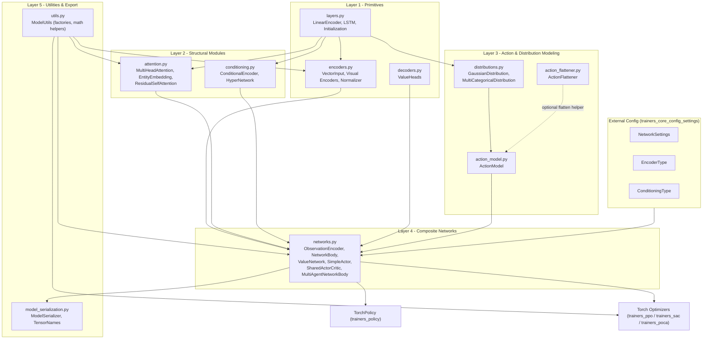
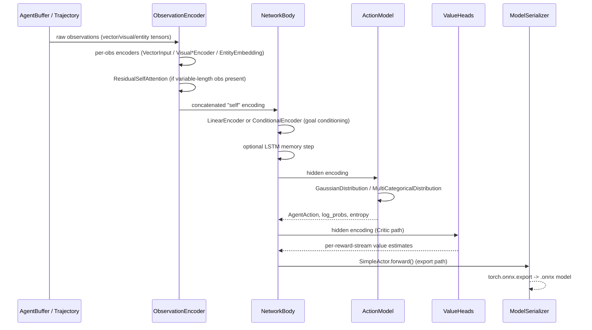

# Trainers Torch Entities

## 1. Purpose & Scope

`trainers_torch_entities` is the **PyTorch neural-network building-block library** at the heart of the ML-Agents trainer stack. It provides the low-level `torch.nn.Module` implementations that are composed together to build agent **Actors** and **Critics**: input encoders (vector, visual, variable-length entities), probability distributions, action sampling/evaluation logic, self-attention, conditioning (goal/hypernetworks), and the composite `NetworkBody`/`ValueNetwork`/`SharedActorCritic` classes that tie everything together. It also contains supporting utilities for model export (ONNX/Sentis) and generic tensor operations used across all algorithm implementations.

This module is **algorithm-agnostic**: it knows nothing about PPO, SAC, POCA or any specific loss function. Instead, it is consumed by:
- [Training_Orchestration_&_Lifecycle_Infrastructure](trainers_policy.md) — `TorchPolicy` instantiates `SimpleActor`/`SharedActorCritic` from `networks.py` to drive action selection.
- [Built-in_RL_Algorithms](trainers_ppo.md) ([PPO](trainers_ppo.md), [SAC](trainers_sac.md), [POCA](trainers_poca.md)) — Optimizers build `ValueNetwork`/`SharedActorCritic` instances and call into `ModelUtils` for loss helpers (`trust_region_policy_loss`, `trust_region_value_loss`).
- [trainers_torch_components](trainers_torch_components.md) — Behavioral Cloning and intrinsic reward providers (Curiosity, GAIL, RND) reuse `NetworkBody`, encoders, and `ModelUtils` to build their own small networks.
- [Extensible_RL_Algorithm_Plugins](trainer_plugin_a2c.md) — Third-party trainer plugins (A2C, DQN) also depend on these building blocks for consistency with the core trainer API.

Configuration objects that parameterize these networks (`NetworkSettings`, `EncoderType`, `ConditioningType`, `ScheduleType`) are defined in [trainers_core_config_settings](trainers_core_config_settings.md) and passed down into the constructors documented here.

## 2. Architecture Overview

The module is organized in five conceptual layers, from primitive building blocks up to fully composed networks:

## 3. Sub-modules

The module's components are grouped and documented in the following sub-module pages:

| Sub-module | Files | Responsibility |
|---|---|---|
| [trainers_torch_entities_layers_encoders](trainers_torch_entities_layers_encoders.md) | `layers.py`, `encoders.py`, `decoders.py` | Foundational `nn.Module` primitives: linear layers with custom initialization, LSTM memory module, vector/visual observation encoders, running normalization, and multi-stream value heads. |
| [trainers_torch_entities_attention_conditioning](trainers_torch_entities_attention_conditioning.md) | `attention.py`, `conditioning.py` | Self-attention mechanisms for variable-length ("entity") observations and multi-agent inputs, plus goal-conditioning via HyperNetworks. |
| [trainers_torch_entities_actions](trainers_torch_entities_actions.md) | `action_flattener.py`, `action_model.py`, `distributions.py` | Probability distributions (Gaussian/Tanh-Gaussian, Categorical) and the `ActionModel` that samples/evaluates/exports continuous and discrete actions. |
| [trainers_torch_entities_networks](trainers_torch_entities_networks.md) | `networks.py` | Composite network bodies (`ObservationEncoder`, `NetworkBody`, `MultiAgentNetworkBody`) and the top-level `Actor`/`Critic` implementations (`SimpleActor`, `SharedActorCritic`, `ValueNetwork`) used directly by policies and optimizers. |
| [trainers_torch_entities_utils_serialization](trainers_torch_entities_utils_serialization.md) | `utils.py`, `model_serialization.py` | `ModelUtils` static helper library (encoder factory functions, tensor math, PPO/POCA trust-region loss helpers) and `ModelSerializer`/`TensorNames` for exporting trained policies to ONNX/Sentis. |

## 4. High-Level Data Flow

The diagram below shows how a batch of observations flows through the composite pieces at inference/training time:

## 5. Key Design Notes

- **ONNX/Sentis compatibility**: Several modules (`MultiHeadAttention`, `LSTM`, `MultiCategoricalDistribution`) intentionally avoid standard PyTorch operators (e.g., `torch.split`, certain `permute` sequences) that are unsupported by Unity's Sentis inference runtime. The `exporting_to_onnx` context manager (in `model_serialization.py`) is checked throughout the code to toggle export-safe code paths.
- **Composable observation encoding**: `ObservationEncoder` (in `networks.py`) dynamically builds a heterogeneous stack of encoders based on `ObservationSpec.dimension_property` (visual / vector / variable-length), and only allocates a `ResidualSelfAttention` block when variable-length ("entity") observations are present.
- **Actor/Critic separation**: `SimpleActor` (policy-only) and `ValueNetwork` (critic-only) can be composed independently, or fused into a `SharedActorCritic` for algorithms that share a trunk network (e.g., PPO with shared network body).
- **Multi-agent support**: `MultiAgentNetworkBody` and `EntityEmbedding`/`ResidualSelfAttention` provide the self-attention machinery required by [POCA](trainers_poca.md), which needs to process a variable number of teammates.

## 6. Related Modules

- [trainers_torch_components](trainers_torch_components.md) — reward providers and BC module built on top of these primitives.
- [trainers_policy](trainers_policy.md) — `TorchPolicy` wraps `SimpleActor`/`SharedActorCritic` for action inference during rollouts.
- [trainers_optimizer](trainers_optimizer.md) — `TorchOptimizer` base class used by all RL algorithm optimizers that consume these networks.
- [trainers_ppo](trainers_ppo.md), [trainers_sac](trainers_sac.md), [trainers_poca](trainers_poca.md) — concrete RL algorithms building networks from this module.
- [trainers_core_config_settings](trainers_core_config_settings.md) — `NetworkSettings`, `EncoderType`, `ConditioningType`, `ScheduleType` configuration consumed by constructors throughout this module.
- [trainers_core_data_pipeline](trainers_core_data_pipeline.md) — `AgentBuffer`/`ObsUtil` supply the observation batches consumed by `ObservationEncoder.update_normalization` and `NetworkBody.forward`.
