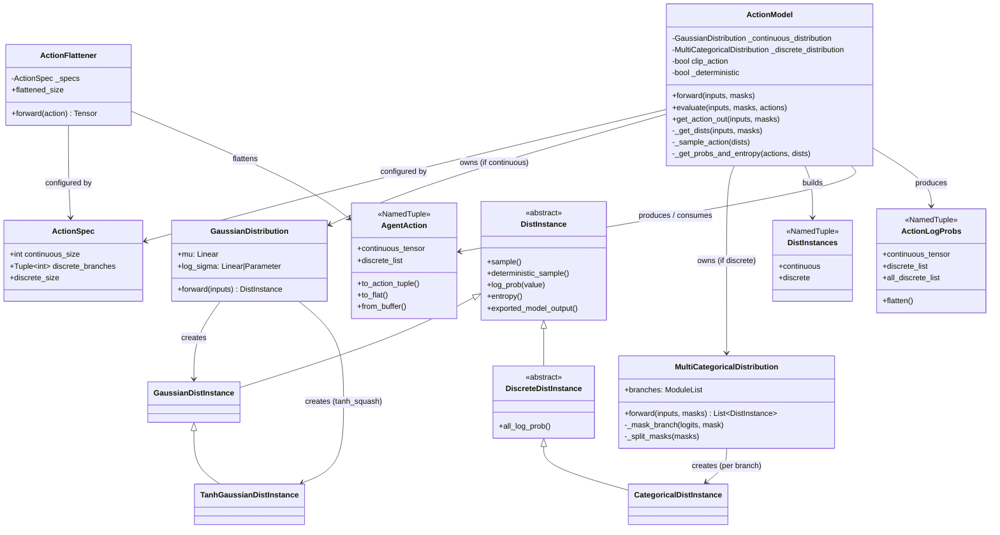
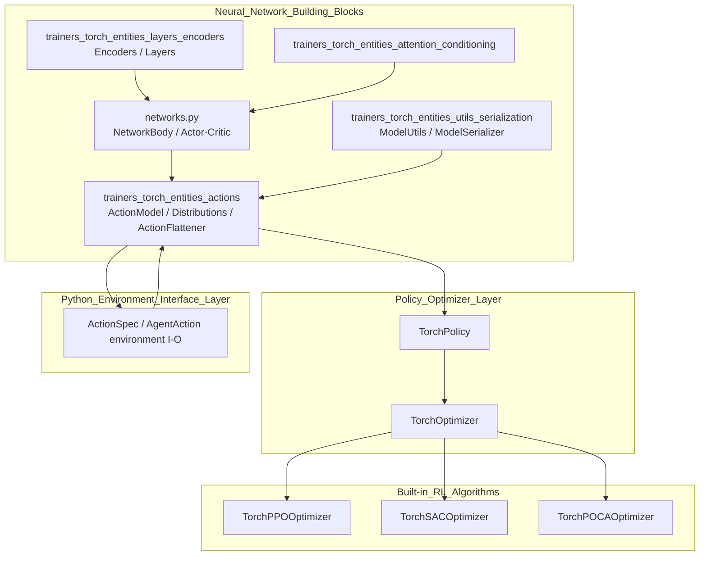
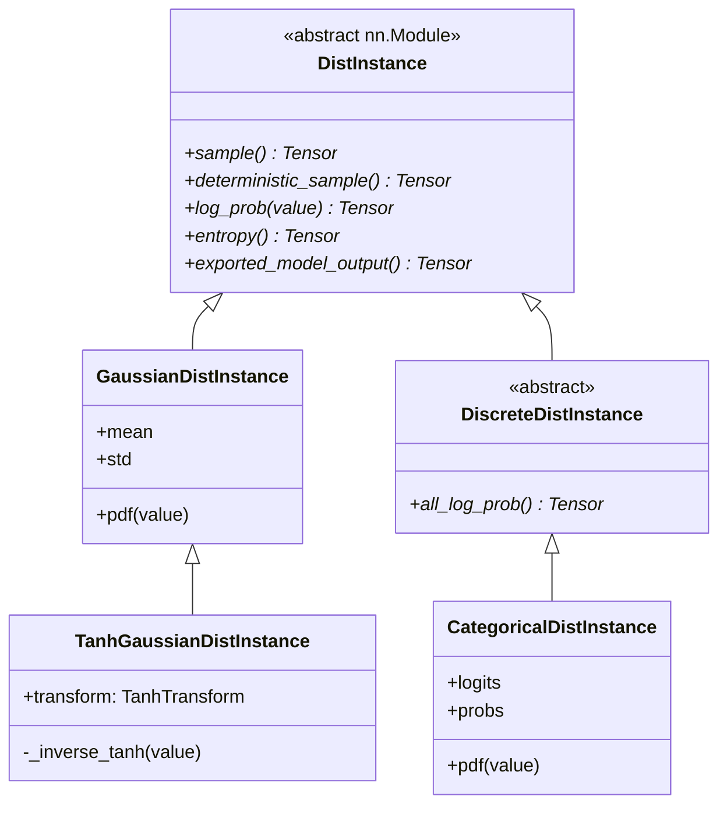
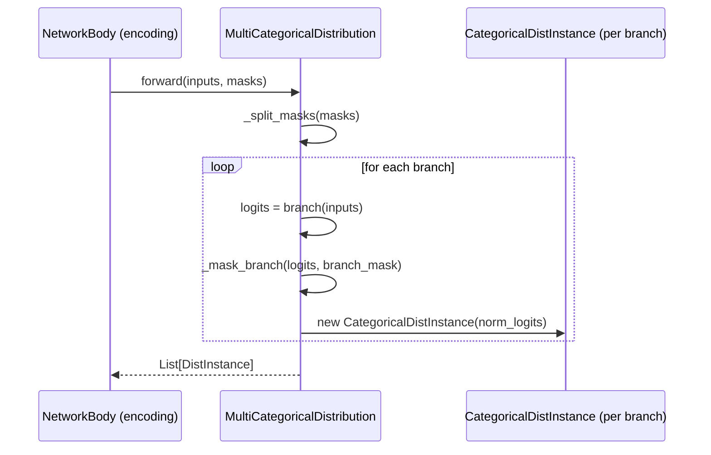
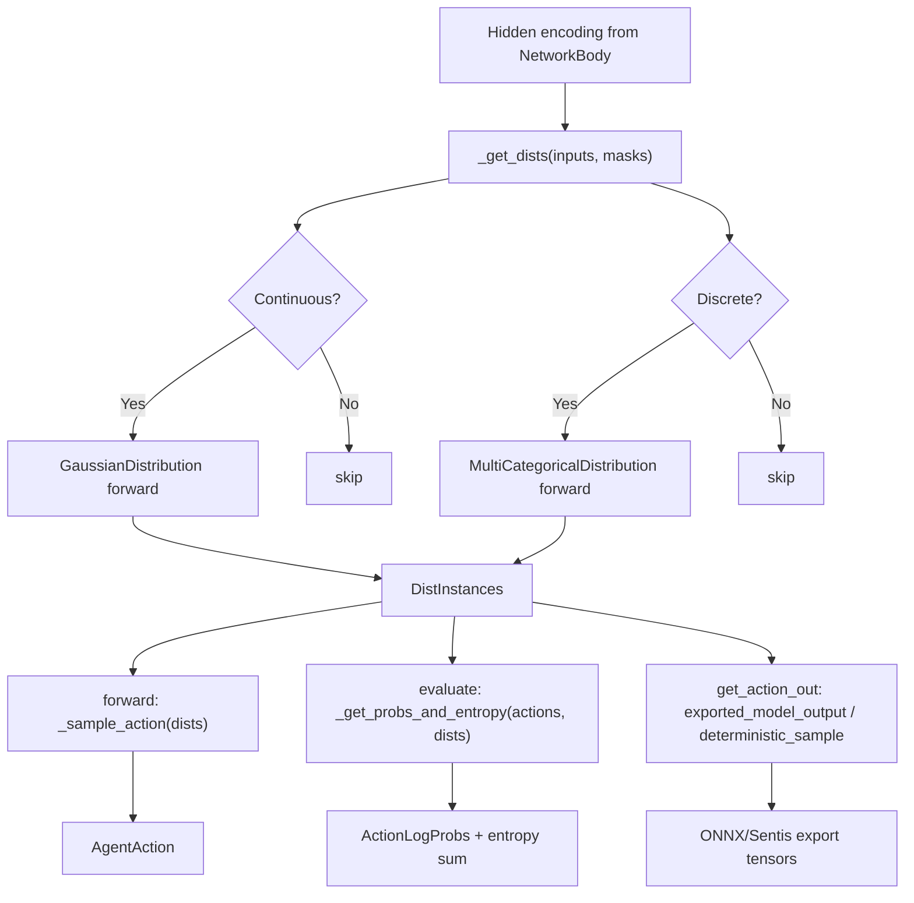
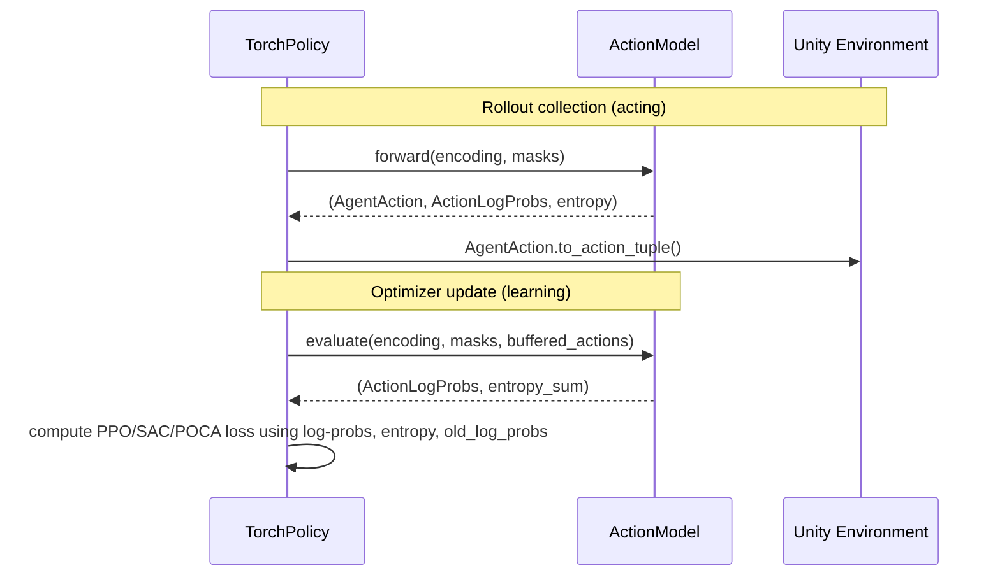
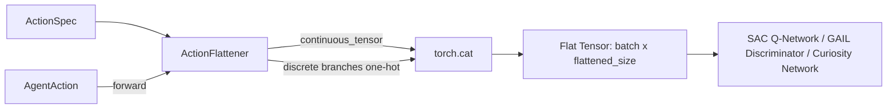
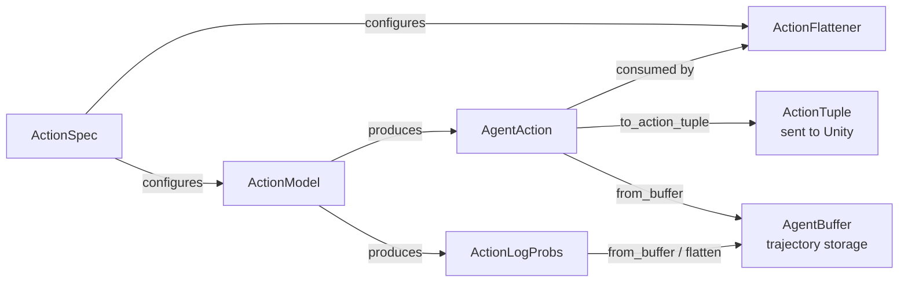

# Trainers Torch Entities: Actions Module

## Introduction

The **`trainers_torch_entities_actions`** module is the core PyTorch subsystem responsible for translating a policy network's internal encoding into concrete agent actions, and for computing the statistical quantities (log probabilities, entropies) needed by policy-gradient RL algorithms. It sits at the boundary between the generic neural-network "trunk" (see [trainers_torch_entities_networks](trainers_torch_entities_networks.md)) and the algorithm-specific optimizers (see [Built-in_RL_Algorithms](trainers_ppo.md)).

Three files make up this module:

| File | Responsibility |
|---|---|
| `distributions.py` | Defines probability distributions (`Gaussian`, `TanhGaussian`, `Categorical`, `MultiCategorical`) used to model continuous and discrete action spaces, along with their `nn.Module` wrappers that map a hidden encoding to distribution parameters. |
| `action_model.py` | The `ActionModel`, which composes continuous/discrete distributions into a single interface for sampling actions, evaluating log-probabilities/entropy, and producing ONNX/Sentis-exportable outputs. |
| `action_flattener.py` | The `ActionFlattener`, a small utility that converts an `AgentAction` (structured continuous + discrete tensors) into a single flat tensor (continuous concatenated with one-hot discrete), used e.g. to feed actions back into critic/Q networks. |

This module is a **leaf-level building block**: it has no dependency on the trainer orchestration layer, but it is used pervasively by policies and optimizers across all built-in and pluggable RL algorithms.

---

## 1. Purpose and Core Functionality

ML-Agents supports **hybrid action spaces** — an agent's action can be a mix of continuous (real-valued) and discrete (categorical, possibly multi-branch) components. This module provides the abstractions to:

1. **Parameterize distributions** from a policy network's hidden encoding (`GaussianDistribution`, `MultiCategoricalDistribution`).
2. **Sample actions** stochastically (training) or deterministically (inference/evaluation) from those distributions.
3. **Compute log-probabilities and entropies** of taken actions, required for policy gradient losses (PPO/POCA clipped objectives, entropy bonuses, importance sampling ratios).
4. **Support masking** of discrete branches (e.g., invalid actions in a game) via `_mask_branch`.
5. **Squash continuous actions** using `tanh` for the SAC algorithm's bounded action spaces (`TanhGaussianDistInstance`).
6. **Flatten structured actions** into single tensors for input into critics, discriminators (GAIL), or Q-networks (`ActionFlattener`).
7. **Export deterministic and stochastic outputs** in a form compatible with ONNX/Sentis for run-time inference in Unity (`get_action_out`).

### Key Types

- **`AgentAction`** (external, from `torch_entities/agent_action.py`) — a `NamedTuple` bundling a continuous tensor and a list of discrete tensors. It is the canonical in-memory representation of an action batch used throughout the trainer codebase (buffer serialization, trajectory storage, `ActionTuple` conversion for the environment).
- **`ActionLogProbs`** (external, from `torch_entities/action_log_probs.py`) — parallel structure holding log-probabilities (sampled and, for discrete branches, "all" log-probs used for KL/entropy computations).
- **`ActionSpec`** (from [Python_Environment_Interface_Layer](envs_core_api.md)) — describes the shape of the action space (`continuous_size`, `discrete_branches`) and is the configuration input to both `ActionModel` and `ActionFlattener`.

---

## 2. Architecture

### 2.1 Component Relationships



### 2.2 Module Position within the System



See also related documentation:
- [trainers_torch_entities_networks.md](trainers_torch_entities_networks.md) — the `NetworkBody`/`Actor-Critic` classes that produce the `inputs` encoding consumed by `ActionModel`.
- [trainers_torch_entities_layers_encoders.md](trainers_torch_entities_layers_encoders.md) — `linear_layer`, `Initialization` used to build distribution heads.
- [trainers_torch_entities_utils_serialization.md](trainers_torch_entities_utils_serialization.md) — `ModelUtils` (one-hot encoding, tensor conversions) and `ModelSerializer` (ONNX export using `ActionModel.get_action_out`).
- [trainers_policy.md](trainers_policy.md) — `TorchPolicy`, which owns an `ActionModel` instance and orchestrates the sample→act→store cycle.
- [envs_core_api.md](envs_core_api.md) — `ActionSpec`, `ActionTuple` and the environment step protocol that `AgentAction`/`ActionFlattener` interoperate with.

---

## 3. Detailed Component Documentation

### 3.1 `distributions.py`

Implements the distribution abstraction hierarchy used to model policy outputs.

#### Class Hierarchy



- **`GaussianDistInstance`**: Standard normal distribution parameterized by `mean`/`std`. Implements reparameterized `sample()`, closed-form `log_prob()`, and analytic Gaussian `entropy()`.
- **`TanhGaussianDistInstance`**: Wraps `GaussianDistInstance` with a `TanhTransform` to bound samples in `[-1, 1]` (used by SAC for bounded continuous actions). Adjusts `log_prob` via the change-of-variables Jacobian term.
- **`CategoricalDistInstance`**: Discrete distribution from `logits` (softmax to get `probs`). Implements `sample()` via `torch.multinomial`, `all_log_prob()` for full-branch log-probability vectors (used in discrete entropy/KL calculations), and an ONNX-friendly `pdf()` via `torch.gather` (avoiding unsupported `torch.diag`).

#### Distribution "Head" Modules

- **`GaussianDistribution(nn.Module)`**: Produces a `GaussianDistInstance` (or `TanhGaussianDistInstance` if `tanh_squash=True`) from a hidden encoding.
  - `mu`: linear layer (`KaimingHeNormal` init, gain 0.2).
  - `log_sigma`: either a **state-conditioned** linear layer (`conditional_sigma=True`) or a single learned parameter broadcast across the batch (workaround for Sentis inference not supporting `expand`).
  - Clamps `log_sigma` to `[-20, 2]` for numerical stability when conditional.

- **`MultiCategoricalDistribution(nn.Module)`**: Handles **multiple discrete action branches** (e.g., "move" + "jump" as separate categorical spaces).
  - Builds one linear "branch" per discrete action size (`_create_policy_branches`).
  - Splits a combined action-mask tensor into per-branch masks (`_split_masks`) and applies masking (`_mask_branch`) by combining a multiplicative zero-out and a large negative additive term — designed to be robust to ONNX/Sentis operator quirks (comment about `Sub` operand order).
  - Returns one `CategoricalDistInstance` per branch.



### 3.2 `action_model.py`

The **`ActionModel`** is the primary orchestrator combining continuous and discrete distributions into one coherent action interface tied to an `ActionSpec`.

#### Construction

```python
ActionModel(hidden_size, action_spec, conditional_sigma=False, tanh_squash=False, deterministic=False)
```
- Instantiates `GaussianDistribution` if `action_spec.continuous_size > 0`.
- Instantiates `MultiCategoricalDistribution` if `action_spec.discrete_size > 0`.
- `clip_action = not tanh_squash` — continuous outputs are clipped to `[-3, 3]/3` unless tanh squashing already bounds them (SAC uses `tanh_squash=True`; PPO/POCA typically clip).
- `deterministic` flag toggles between stochastic sampling (training rollouts) and greedy/mean action selection (deterministic evaluation mode).

#### Internal Data Flow



#### Public API

| Method | Used By | Purpose |
|---|---|---|
| `forward(inputs, masks)` | `TorchPolicy.get_action()` (rollout collection) | Samples action, computes log-probs & entropy in one pass. |
| `evaluate(inputs, masks, actions)` | Optimizers (`TorchPPOOptimizer`, `TorchPOCAOptimizer`, `TorchSACOptimizer`) during gradient updates | Recomputes log-probs/entropy for **already-taken** actions (from buffer), needed for importance-ratio and entropy-bonus terms. |
| `get_action_out(inputs, masks)` | `ModelSerializer` ([trainers_torch_entities_utils_serialization.md](trainers_torch_entities_utils_serialization.md)) | Produces ONNX-exportable continuous/discrete/deterministic outputs for Unity runtime inference. |
| `_sample_action`, `_get_dists`, `_get_probs_and_entropy` | internal | Helper stages shared by `forward`/`evaluate`. |

Note: the **deprecated** `action_out_deprecated` field in `get_action_out` supports legacy single-space (pure continuous or pure discrete) models only; hybrid action spaces set it to `None`.

#### Sequence: Training Rollout vs. Optimizer Update



### 3.3 `action_flattener.py`

**`ActionFlattener`** provides a stateless conversion of a structured `AgentAction` into a single dense tensor:

```
flattened = concat(continuous_tensor, one_hot(discrete_branch_1), ..., one_hot(discrete_branch_n))
```

- `flattened_size` = `continuous_size + sum(discrete_branches)` — useful for sizing downstream network inputs (e.g., Q-network state-action concatenation in SAC, or discriminator input in GAIL).
- `forward(action: AgentAction) -> Tensor` uses `ModelUtils.actions_to_onehot` (see [trainers_torch_entities_utils_serialization.md](trainers_torch_entities_utils_serialization.md)) to one-hot encode each discrete branch before concatenation.

This is functionally similar to `AgentAction.to_flat()`, but implemented as an injectable `nn.Module`-style helper configured once per `ActionSpec` (typically instantiated inside a network body or reward provider that needs a fixed-size action representation, e.g., `CuriosityNetwork`, `DiscriminatorNetwork`, or SAC's Q-network — see [trainers_torch_components](trainers_torch_components.md) and [trainers_sac.md](trainers_sac.md)).



---

## 4. Data Structures Interop

This module relies on and produces several `NamedTuple`-based data structures defined elsewhere but central to its operation:



- **`AgentAction`** and **`ActionLogProbs`** know how to (de)serialize themselves from/to an `AgentBuffer` (see [trainers_core_data_pipeline](trainers_core_data_pipeline.md)), enabling trajectories collected during rollouts to be replayed for gradient computation via `ActionModel.evaluate`.
- **`ActionSpec`** and **`ActionTuple`** originate in the environment interface layer ([envs_core_api.md](envs_core_api.md)) and define the contract between the Unity environment and the trainer's action-generation logic.

---

## 5. Usage Across Algorithms

| Algorithm | How it uses this module |
|---|---|
| **PPO** ([trainers_ppo.md](trainers_ppo.md)) | Uses `ActionModel.evaluate()` to get log-probs/entropy for the clipped surrogate objective (`ModelUtils.trust_region_policy_loss`) and entropy bonus. |
| **SAC** ([trainers_sac.md](trainers_sac.md)) | Uses `tanh_squash=True` in `ActionModel` for bounded continuous actions; uses `ActionFlattener`/`AgentAction.to_flat()` to feed actions into Q-networks. |
| **POCA** ([trainers_poca.md](trainers_poca.md)) | Same as PPO but extended for multi-agent counterfactual baselines; consumes grouped `AgentAction`s via `AgentAction.group_from_buffer`. |
| **A2C / DQN plugins** ([Extensible_RL_Algorithm_Plugins](trainer_plugin_a2c.md)) | Reuse `ActionModel`/`distributions.py` primitives for custom optimizer implementations, demonstrating the extensibility of this module beyond built-in trainers. |

---

## 6. Design Notes & Constraints

- **ONNX/Sentis compatibility**: Several implementation choices (`_mask_branch`'s formula, avoiding `torch.diag`, avoiding `torch.expand`, clamping ranges) exist specifically to ensure the exported graph works with Unity's Sentis inference engine. See [trainers_torch_entities_utils_serialization.md](trainers_torch_entities_utils_serialization.md) for the `ModelSerializer` that performs this export using `ActionModel.get_action_out`.
- **Deterministic vs. Stochastic**: The `deterministic` flag on `ActionModel` supports evaluation/inference workflows where reproducible, greedy actions are desired (as opposed to training-time exploration).
- **Backward compatibility**: The deprecated single-tensor `action_out_deprecated` output path exists only for non-hybrid action specs, preserving compatibility with older Unity-side inference code that expected a single action tensor.
- **Entropy aggregation**: Entropies across continuous and multiple discrete branches are **summed** (not averaged) per the `torch.sum(entropies, dim=1)` calls in `evaluate`/`forward`, matching the standard policy-gradient entropy bonus formulation.
