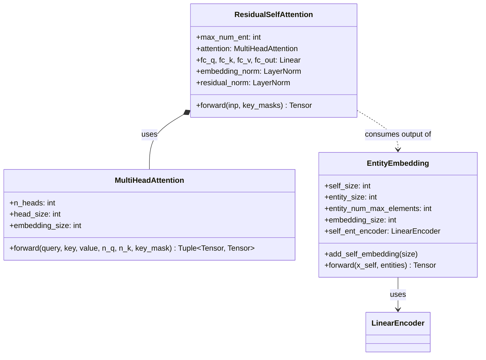
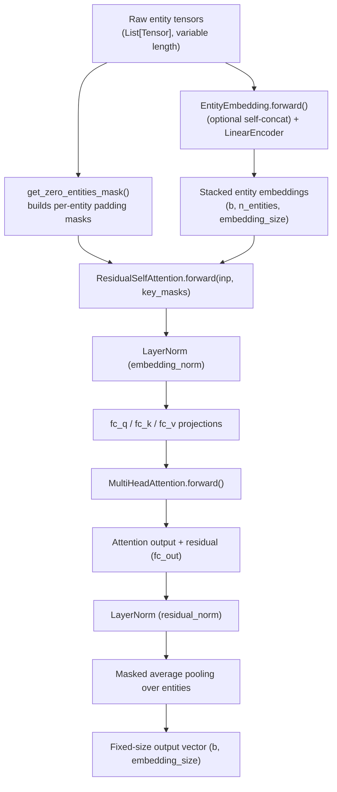
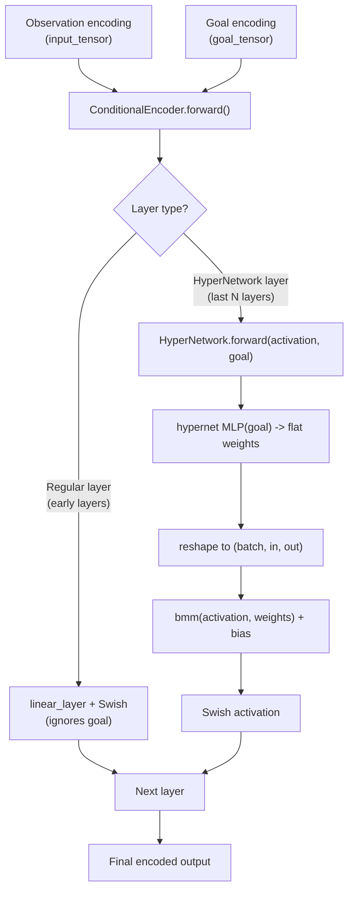
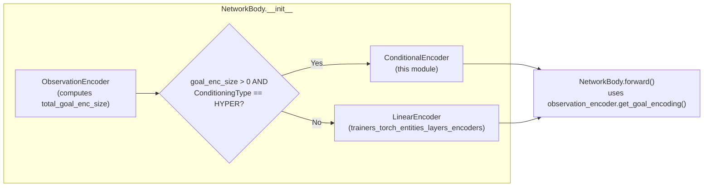
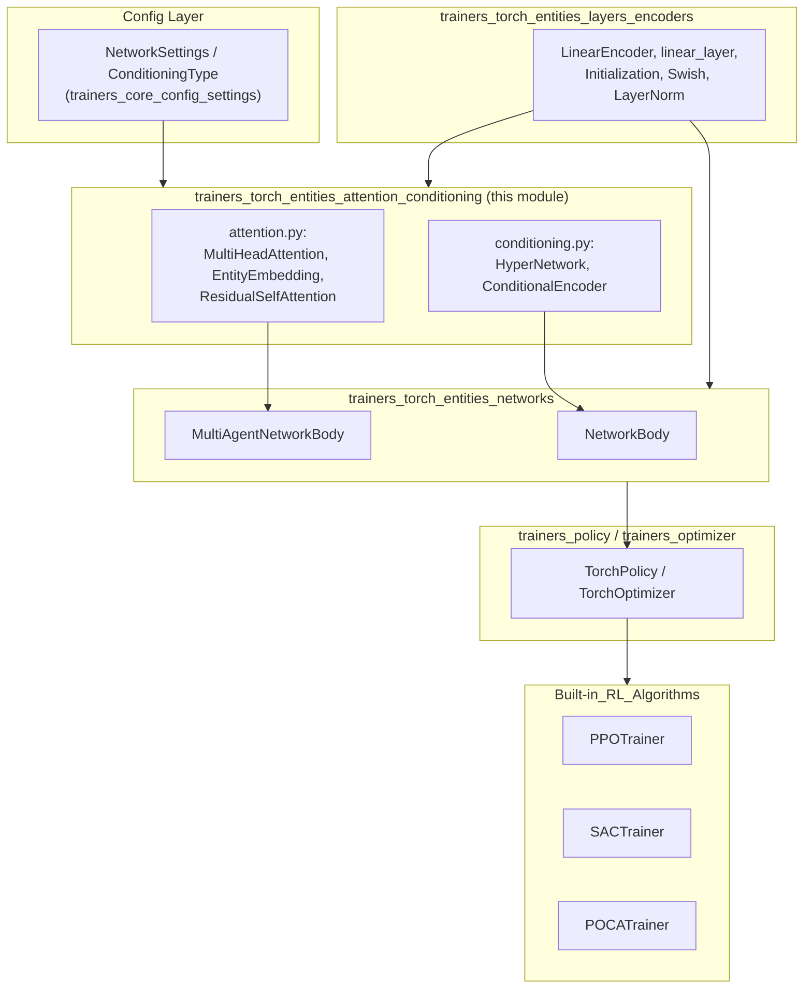

# Attention & Conditioning Building Blocks

## Introduction

This module provides two families of specialized PyTorch neural-network
primitives used throughout the ML-Agents Torch trainer stack:

1. **Self-Attention modules** (`attention.py`) — `MultiHeadAttention`,
   `EntityEmbedding`, and `ResidualSelfAttention` — which allow a network to
   consume a *variable-length, unordered* set of "entities" (e.g. other
   agents, buffer observations, or objects in a scene) and produce a single
   fixed-size representation.
2. **Conditioning modules** (`conditioning.py`) — `HyperNetwork` and
   `ConditionalEncoder` — which allow part of a network's weights to be
   *generated dynamically* from a separate "goal" or conditioning signal,
   instead of being fixed, learned parameters. This is the mechanism behind
   goal-conditioned policies (e.g. Directional/Vector goal observations).

Both families are low-level building blocks consumed by the higher-level
network bodies described in
[trainers_torch_entities_networks](trainers_torch_entities_networks.md)
(`NetworkBody`, `MultiAgentNetworkBody`), which in turn are used by the
policy/optimizer classes described in
[Training_Orchestration_&_Lifecycle_Infrastructure](trainers_core.md) and the
concrete RL algorithms in
[Built-in_RL_Algorithms](trainers_ppo.md).

This module sits as a leaf/utility layer in the dependency graph — it depends
on the more primitive [trainers_torch_entities_layers_encoders](trainers_torch_entities_layers_encoders.md)
module (for `LinearEncoder`, `linear_layer`, `Initialization`, `Swish`,
`LayerNorm`) but has no dependents *within* itself; everything else that uses
attention or conditioning imports from here.

---

## 1. Self-Attention (`attention.py`)

### Purpose

Many ML-Agents observation types are naturally **sets** rather than fixed
vectors:
- `BufferSensor` observations (a variable number of "entities", e.g. nearby
  objects or teammates).
- Multi-agent group observations, where the number of teammates/opponents can
  vary from episode to episode (used by the POCA trainer, see
  [trainers_poca](trainers_poca.md)).

A standard fully-connected network cannot handle a variable-length, unordered
input. The `ResidualSelfAttention` block (with its companion
`EntityEmbedding` and `MultiHeadAttention`) solves this by:

1. Encoding each entity (optionally concatenated with a "self" vector) into a
   common embedding space (`EntityEmbedding`).
2. Applying multi-head self-attention across all entities, with masking for
   padded/absent entities (`MultiHeadAttention`).
3. Adding a residual connection and average-pooling over the (unmasked)
   entities to produce a single, fixed-size, permutation-invariant output
   (`ResidualSelfAttention`).

This design is inspired by the entity/relational architecture described in
["Deep Reinforcement Learning with Relational Inductive Biases"](https://arxiv.org/pdf/1909.07528.pdf).

### Component Overview

| Component | Role |
|---|---|
| `MultiHeadAttention` | Low-level scaled dot-product multi-head attention. Custom implementation (not `torch.nn.MultiheadAttention`) because Sentis (Unity's inference engine) does not support all operators used by the built-in Torch op. |
| `EntityEmbedding` | Projects a batch of "entity" feature vectors (optionally concatenated with a "self" vector) into a common embedding space via a `LinearEncoder`. |
| `ResidualSelfAttention` | Combines Q/K/V projections, `MultiHeadAttention`, a residual connection, layer normalization, and masked average pooling to output one fixed-size vector per batch item. |
| `get_zero_entities_mask` | Helper that builds masks marking "all-zero" (i.e. padded/non-existent) entity rows so they can be excluded from attention and pooling. |

### Class Diagram



### Data Flow: Entity → Embedding → Attention → Pooled Output



### `MultiHeadAttention` Internals

- Splits `query`, `key`, `value` tensors of shape
  `(batch, n_elements, embedding_size)` into `n_heads` heads.
- Computes `QK^T` scaled attention scores, applies the `key_mask` (adding
  `NEG_INF` to masked-out positions before softmax so they contribute ~0
  weight), and produces a weighted sum over `value`.
- Note the deliberate `key -= 1; key += 1` no-op before a second permute —
  this works around an ONNX/Sentis graph-optimization quirk that would
  otherwise collapse two consecutive `permute` operations into an
  unsupported combined permute.
- Returns both the attended output and the raw attention weight matrix
  `(batch, heads, n_q, n_k)` (useful for debugging/visualization, though not
  consumed by default callers).

### `EntityEmbedding` Internals

- Holds a `LinearEncoder` (`self_ent_encoder`) that maps
  `entity_size` (+ optional `self_size`) → `embedding_size`.
- `add_self_embedding(size)` is called by consumers (e.g.
  `MultiAgentNetworkBody`) when they want ego-centric attention, i.e. every
  entity is concatenated with a "self" descriptor before embedding, so the
  attention can reason about each entity *relative to the acting agent*.
- `entity_num_max_elements` must be a fixed number (not `None`) for the
  module to be exportable to ONNX/Sentis; if unset and export is attempted
  (`exporting_to_onnx.is_exporting()`), a `UnityTrainerException` is raised.

### `ResidualSelfAttention` Internals

- Uses custom weight initialization (Normal init with small gain, following
  the T-Fixup scheme from ICML 2020) for stable training with residual
  attention blocks.
- `forward(inp, key_masks)`:
  1. Concatenates all `key_masks` (one per entity-group source) into one
     mask tensor.
  2. Applies `embedding_norm` (LayerNorm) to the input embeddings.
  3. Projects to Q, K, V via `fc_q`, `fc_k`, `fc_v`.
  4. Feeds through `MultiHeadAttention`.
  5. Adds a residual connection (`fc_out(output) + inp`) and applies
     `residual_norm`.
  6. Performs **masked average pooling** across the entity dimension —
     masked (padded) entities are excluded from both the numerator and
     denominator, guaranteeing the output is independent of how many padding
     slots were present.

### Consumers

`ResidualSelfAttention` and `EntityEmbedding` are used directly by
`MultiAgentNetworkBody` in
[trainers_torch_entities_networks](trainers_torch_entities_networks.md) to
build permutation-invariant encodings across teammates/opponents for
multi-agent algorithms such as POCA (see
[trainers_poca](trainers_poca.md)). They are also the underlying mechanism
for `BufferSensor`-based variable-entity observations produced by Unity's
[runtime_sensors_data](Unity_Perception_&_Sensing.md) (`BufferSensorComponent`).

---

## 2. Goal Conditioning (`conditioning.py`)

### Purpose

Standard networks learn a single fixed set of weights. **Hypernetwork-based
conditioning** instead lets a secondary "goal" input dynamically *generate*
the weights of (part of) the main network, allowing the same architecture to
adapt its computation based on context (e.g. a navigation target, a strategy
selector, or any other conditioning signal). This is exposed to users via the
`ConditioningType.HYPER` option in
[`NetworkSettings`](trainers_core_config_settings.md) and consumed by
`NetworkBody` (see below).

### Component Overview

| Component | Role |
|---|---|
| `HyperNetwork` | A small MLP ("the hypernetwork") that maps a `hyper_input` (goal) tensor into a *flat weight matrix* for a single linear layer, which is then applied to `input_activation` via batch matrix multiplication. |
| `ConditionalEncoder` | A multi-layer encoder where the **last `num_conditional_layers`** layers are `HyperNetwork` instances (goal-generated weights) and the earlier layers are regular `linear_layer`s. |

### Class Diagram

```mermaid
classDiagram
    class HyperNetwork {
        +input_size: int
        +output_size: int
        +hypernet: Sequential
        +bias: Parameter
        +forward(input_activation, hyper_input) Tensor
    }

    class ConditionalEncoder {
        +layers: ModuleList~Linear or HyperNetwork~
        +forward(input_tensor, goal_tensor) Tensor
    }

    ConditionalEncoder o-- HyperNetwork : last N layers
    ConditionalEncoder o-- "regular linear_layer" : earlier layers
```

### `HyperNetwork` Internals

- Given a `hyper_input` (goal) of size `hyper_input_size`, runs it through a
  small MLP (`num_layers` linear+Swish blocks) ending in a `LayerNorm` and a
  final linear layer (`flat_output`) that outputs
  `input_size * output_size` values — i.e. a **flattened weight matrix** for
  the main linear transform.
- Reshapes this flat vector into a `(batch, input_size, output_size)` weight
  tensor and applies it to `input_activation` via `torch.bmm`
  (batched matrix multiply), adding a normal (non-generated) learned `bias`
  parameter.
- The final hypernetwork layer's weights are manually re-initialized with a
  small uniform bound (`sqrt(1/(layer_size*input_size))`) for stable
  training at initialization.

### `ConditionalEncoder` Internals

- Iterates `num_layers` total layers; the final `num_conditional_layers` of
  them are replaced with `HyperNetwork` instances (each internally a 2-layer
  MLP, as constructed with `HyperNetwork(prev_size, hidden_size, goal_size,
  hidden_size, 2)`), while earlier layers are standard `linear_layer`s.
- `forward(input_tensor, goal_tensor)` iterates through `self.layers`,
  routing `goal_tensor` only to `HyperNetwork` layers; regular layers ignore
  it.

### Data Flow: Goal-Conditioned Encoding



### Consumers

`ConditionalEncoder` is used by `NetworkBody`
(see [trainers_torch_entities_networks](trainers_torch_entities_networks.md))
as the main body encoder **whenever**:
- The observation set includes goal-typed observations
  (`observation_encoder.total_goal_enc_size > 0`), and
- `NetworkSettings.goal_conditioning_type == ConditioningType.HYPER`
  (configured via [trainers_core_config_settings](trainers_core_config_settings.md)).

Otherwise, `NetworkBody` falls back to a plain `LinearEncoder` from
[trainers_torch_entities_layers_encoders](trainers_torch_entities_layers_encoders.md).



---

## 3. How This Module Fits into the Broader Architecture



### Key Integration Points

- **`NetworkBody`** (single-agent networks used by PPO/SAC and the base
  policy body) conditionally instantiates `ConditionalEncoder` for
  goal-conditioned tasks, otherwise using a plain `LinearEncoder`.
- **`MultiAgentNetworkBody`** (used for centralized critics / group
  observations, notably in [trainers_poca](trainers_poca.md)) always uses
  `EntityEmbedding` + `ResidualSelfAttention` to combine a variable number of
  per-agent observation/action embeddings into one fixed-size state
  encoding, and also tracks a running "current max agents seen"
  (`_current_max_agents`) to normalize an auxiliary `num_agents` feature fed
  downstream.
- **ONNX/Sentis export**: Both `EntityEmbedding` and `ResidualSelfAttention`
  enforce that `entity_num_max_elements` (or `max_num_ent`) is set before
  export, since variable-length tensors are not supported by Unity's Sentis
  inference runtime. This constraint is checked via
  `exporting_to_onnx.is_exporting()` from
  [trainers_torch_entities_utils_serialization](trainers_torch_entities_utils_serialization.md).

---

## 4. Related Documentation

- [trainers_torch_entities_layers_encoders](trainers_torch_entities_layers_encoders.md) —
  Base building blocks (`LinearEncoder`, `linear_layer`, `Initialization`,
  visual/vector encoders) that this module depends on.
- [trainers_torch_entities_networks](trainers_torch_entities_networks.md) —
  `NetworkBody` and `MultiAgentNetworkBody`, the primary consumers of both
  attention and conditioning modules.
- [trainers_torch_entities_utils_serialization](trainers_torch_entities_utils_serialization.md) —
  ONNX/Sentis export utilities (`ModelSerializer`, `exporting_to_onnx`)
  referenced by the export-safety checks in this module.
- [trainers_core_config_settings](trainers_core_config_settings.md) —
  `NetworkSettings` and `ConditioningType`, which control whether
  `ConditionalEncoder` is used.
- [trainers_poca](trainers_poca.md) — RL algorithm that most heavily relies
  on `MultiAgentNetworkBody`'s self-attention mechanism for centralized
  multi-agent critics.
- [Unity_Perception_&_Sensing](Unity_Perception_&_Sensing.md) —
  `BufferSensorComponent`, the Unity-side source of variable-length entity
  observations consumed by these attention modules.
