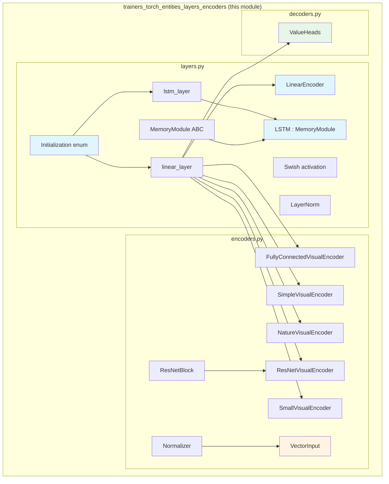
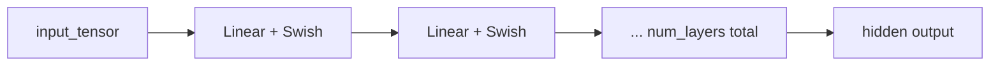
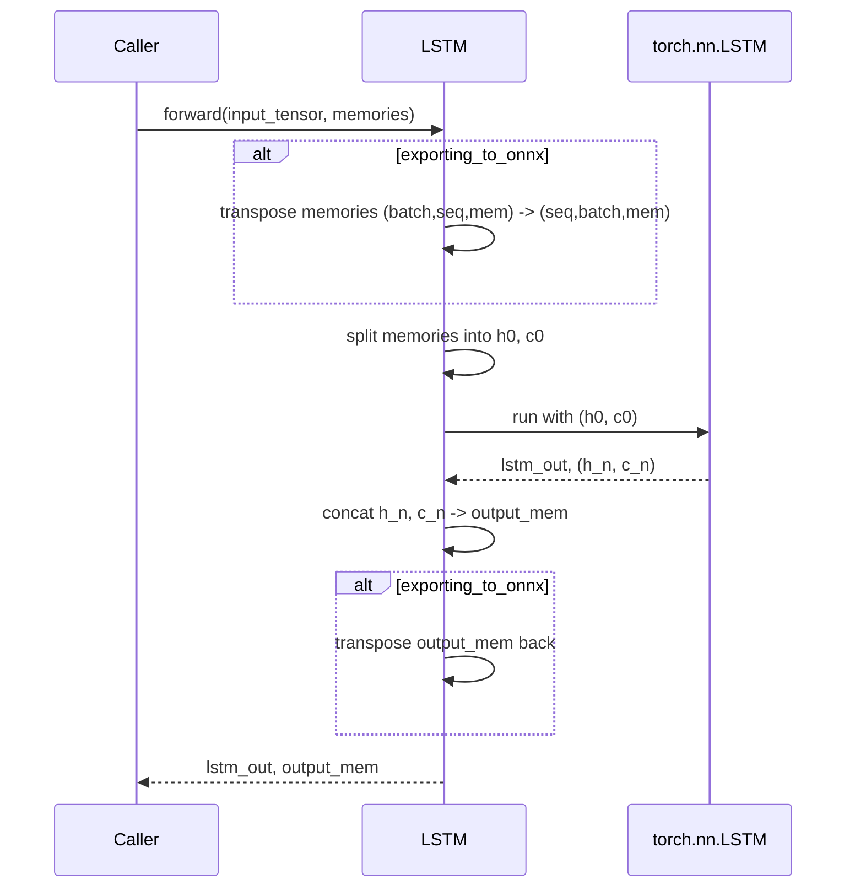
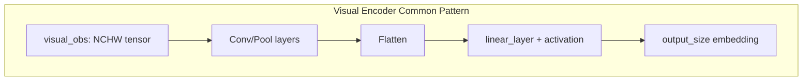
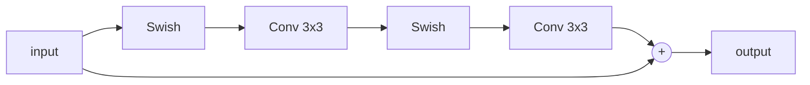
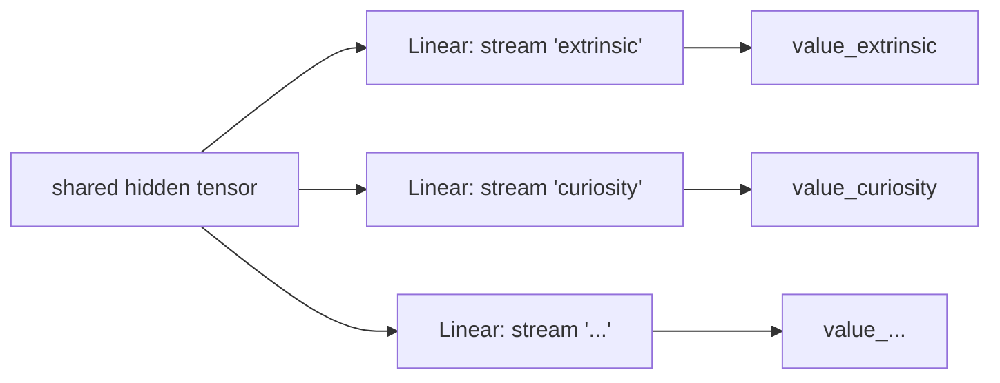
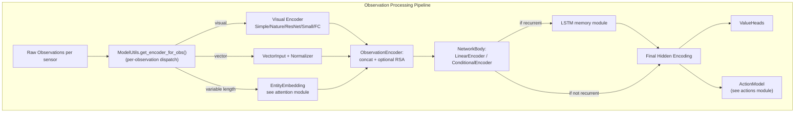

# Torch Layers & Encoders (`trainers_torch_entities_layers_encoders`)

## Introduction

This module provides the **foundational neural network building blocks** used throughout ML-Agents' PyTorch-based training stack. It contains:

- **Weight initialization utilities and primitive layers** (`layers.py`) — linear layers, LSTM memory modules, and activation functions with configurable initialization schemes.
- **Observation encoders** (`encoders.py`) — modules that transform raw vector and visual (image) observations into fixed-size latent embeddings, including several CNN architectures (Simple, Nature, ResNet, Small/Match3, Fully-Connected) and a running-statistics vector normalizer.
- **Value output heads** (`decoders.py`) — a small module (`ValueHeads`) that maps a shared hidden representation to one or more scalar value estimates (e.g., for multiple reward streams).

These components are low-level, reusable `torch.nn.Module` subclasses with no dependency on RL algorithm specifics. They are composed by higher-level modules — most notably [`NetworkBody`/`ObservationEncoder`](trainers_torch_entities_networks.md) — to build the full actor-critic networks used by PPO, SAC, and POCA trainers.

This module is a child of [`trainers_torch_entities`](trainers_torch_entities.md), which is itself part of the broader [`Neural_Network_Building_Blocks`](trainers_torch_entities.md) area feeding into [`Built-in_RL_Algorithms`](trainers_ppo.md).

---

## 1. Purpose & Scope

| Concern | Component(s) |
|---|---|
| Weight/bias initialization strategies | `Initialization` (enum), `linear_layer()`, `lstm_layer()` |
| Fully-connected stacks with activation | `LinearEncoder` |
| Recurrent memory (LSTM) with ONNX-export awareness | `LSTM` (implements `MemoryModule`) |
| Vector observation normalization | `Normalizer`, `VectorInput` |
| Visual observation encoding (CNNs) | `SimpleVisualEncoder`, `NatureVisualEncoder`, `ResNetVisualEncoder`, `SmallVisualEncoder`, `FullyConnectedVisualEncoder`, `ResNetBlock` |
| Multi-stream value prediction | `ValueHeads` |

These primitives are intentionally **algorithm-agnostic**: they know nothing about PPO/SAC/POCA losses or the RL training loop. They are pure `nn.Module` building blocks parameterized by shape/size arguments, and are wired together by [`NetworkBody` / `ObservationEncoder`](trainers_torch_entities_networks.md) using factory logic in [`ModelUtils`](trainers_torch_entities_utils_serialization.md).

---

## 2. Architecture Overview

---

## 3. Component Details

### 3.1 `layers.py` — Primitive Layers

#### `Initialization` (Enum)
Defines the supported weight/bias initialization schemes: `Zero`, `XavierGlorotNormal`, `XavierGlorotUniform`, `KaimingHeNormal`, `KaimingHeUniform`, `Normal`. Mapped internally to the corresponding `torch.nn.init` functions via the `_init_methods` dict.

#### `linear_layer()`
Factory function that creates a `torch.nn.Linear` and applies the chosen initialization to weights and biases, with an optional `kernel_gain` multiplier. Used pervasively across encoders, decoders, and the action/network modules.

#### `lstm_layer()`
Factory function creating a `torch.nn.LSTM`, applying per-gate initialization (the LSTM's weight/bias tensors are 4 stacked gate matrices) and adding a configurable `forget_bias` offset to the forget gate — mirroring TensorFlow LSTM conventions for better default training behavior.

#### `MemoryModule` (ABC)
Abstract interface for recurrent modules requiring an initial memory state. Declares `memory_size` (property) and `forward(input_tensor, memories) -> (output, new_memories)`.

#### `LinearEncoder`
A stack of `num_layers` fully-connected layers (via `linear_layer`) each followed by a `Swish` activation. This is the most common "body" encoder used to combine concatenated observation embeddings into a fixed hidden representation (default `KaimingHeNormal` init).

#### `LSTM` (implements `MemoryModule`)
Wraps `lstm_layer()` to provide recurrent memory for sequence-based policies. Key design details:
- `memory_size` is `2 * hidden_size` because the flat memory buffer is split into hidden state (`h0`) and cell state (`c0`) halves.
- Handles the axis-order difference required when **exporting to ONNX** (`exporting_to_onnx.is_exporting()`, from [`model_serialization`](trainers_torch_entities_utils_serialization.md)) — PyTorch's LSTM expects `(batch, seq, features)` when `batch_first=True`, but ONNX/Sentis runtime expects `(seq, batch, features)`.
- Avoids `torch.split` (unsupported by Sentis, Unity's inference runtime) in favor of manual slicing.

#### Supporting utilities
- `Swish` — `x * sigmoid(x)` activation used throughout encoders.
- `LayerNorm` — lightweight layer normalization without learnable affine parameters (used selectively, e.g. in attention).

---

### 3.2 `encoders.py` — Observation Encoders

#### `Normalizer`
Maintains running mean/variance statistics (as buffers, not parameters) for incoming vector observations using Welford's online algorithm, then clamps normalized output to `[-5, 5]`. Supports `update()` (incremental stats update) and `copy_from()` (for copying normalization stats between policies, e.g., in self-play or when synchronizing target networks).

#### `VectorInput`
Thin wrapper around an optional `Normalizer`. If `normalize=True`, applies normalization on `forward`; otherwise passes inputs through unchanged. Exposes `copy_normalization()` and `update_normalization()` pass-throughs. This is the encoder assigned to vector-type observations by [`ModelUtils.get_encoder_for_obs`](trainers_torch_entities_utils_serialization.md).

#### Visual Encoders
All visual encoders share the same interface: `__init__(height, width, initial_channels, output_size)` → `forward(visual_obs) -> Tensor[batch, output_size]`. They differ in architecture/receptive field/compute cost, and each has a **minimum input resolution** enforced by `ModelUtils.MIN_RESOLUTION_FOR_ENCODER`:

| Encoder | Conv Stack | Min Resolution | Typical Use |
|---|---|---|---|
| `FullyConnectedVisualEncoder` | None (flatten + linear) | 1 | Treats image as a flat vector; cheapest, useful for very small/simple grids |
| `SmallVisualEncoder` | 2×Conv (3×3) | 5 | Lightweight CNN, from the "Match3"/Candy-Crush research architecture |
| `SimpleVisualEncoder` | 2×Conv (8×8, 4×4) | 20 | Default lightweight CNN (Atari-DQN style, smaller) |
| `NatureVisualEncoder` | 3×Conv (8×8, 4×4, 3×3) | 36 | classic "Nature DQN" architecture |
| `ResNetVisualEncoder` | 3 stages × (Conv + MaxPool + 2×`ResNetBlock`) | 15 | Deepest option, uses residual blocks for higher capacity |

`conv_output_shape()` and `pool_out_shape()` are helper functions computing output spatial dimensions after convolution/pooling, used to correctly size the final flatten→dense layer.

`ResNetBlock` implements a standard pre-activation residual block: `x + Conv(Swish(Conv(Swish(x))))`, used as the repeating unit inside `ResNetVisualEncoder`.

---

### 3.3 `decoders.py` — Value Heads

#### `ValueHeads`
Given a shared hidden representation, produces one scalar value estimate **per named reward/value stream** (e.g., `extrinsic`, `curiosity`, `gail`) using an independent `linear_layer` per stream, stored in an `nn.ModuleDict`. Used by [`ValueNetwork`](trainers_torch_entities_networks.md) and various [reward providers](trainers_torch_components.md) that need multi-head value prediction (e.g., PPO, POCA optimizers combine extrinsic + intrinsic reward value streams).

---

## 4. How These Components Are Composed

The layers/encoders in this module are **not used standalone** in the training pipeline — they are selected and assembled by:

1. **`ModelUtils.get_encoder_for_obs`** (in [`trainers_torch_entities_utils_serialization`](trainers_torch_entities_utils_serialization.md)) — inspects each `ObservationSpec`'s `dimension_property` to decide whether to instantiate a visual encoder (via `ModelUtils.get_encoder_for_type`), a `VectorInput`, or an `EntityEmbedding` (for variable-length/attention-based observations, see [`trainers_torch_entities_attention_conditioning`](trainers_torch_entities_attention_conditioning.md)).
2. **`ObservationEncoder`** (in [`trainers_torch_entities_networks`](trainers_torch_entities_networks.md)) — holds the `nn.ModuleList` of per-observation encoders (produced by step 1), concatenates their outputs, and optionally applies a Residual Self-Attention (RSA) layer for variable-length entity inputs.
3. **`NetworkBody`** — takes the concatenated encoding from `ObservationEncoder`, optionally concatenates action embeddings (for Q-networks), feeds it through a `LinearEncoder` (or `ConditionalEncoder` for goal-conditioned tasks — see [`trainers_torch_entities_attention_conditioning`](trainers_torch_entities_attention_conditioning.md)), and optionally through an `LSTM` for recurrent policies.
4. **`ValueHeads`** — attached at the output of a `ValueNetwork` to produce per-stream value predictions consumed by RL optimizers (PPO/SAC/POCA — see [`Built-in_RL_Algorithms`](trainers_ppo.md)).

---

## 5. Key Design Considerations

### 5.1 ONNX / Sentis Export Compatibility
The `LSTM` module contains explicit branching for `exporting_to_onnx.is_exporting()` (flag defined in [`model_serialization`](trainers_torch_entities_utils_serialization.md)), since:
- Unity's Sentis inference engine expects a different tensor axis ordering than PyTorch's default `batch_first=True` LSTM.
- `torch.split` is avoided in favor of tensor slicing since Sentis does not support it.

This tight coupling means changes to LSTM memory layout must be validated against [`ModelSerializer`](trainers_torch_entities_utils_serialization.md), which builds the dummy inputs (`dummy_memories`) used for ONNX graph tracing.

### 5.2 Normalization State as Buffers, not Parameters
`Normalizer` stores `running_mean`, `running_variance`, and `normalization_steps` as **buffers** (`register_buffer`) rather than trainable parameters — they are updated via explicit `update()` calls (typically driven by `NetworkBody.update_normalization` from data in the [`AgentBuffer`](trainers_core_data_pipeline.md)) rather than backpropagation, and are still saved/loaded with the model's `state_dict()` for consistent inference behavior.

### 5.3 Minimum Resolution Enforcement
Each visual encoder architecture has a minimum supported input resolution enforced centrally in `ModelUtils.MIN_RESOLUTION_FOR_ENCODER` (in [`trainers_torch_entities_utils_serialization`](trainers_torch_entities_utils_serialization.md)) — this module's encoders do **not** self-validate; validation happens at the factory/dispatch level before instantiation.

### 5.4 Uniform Initialization Strategy
Nearly every layer in this module (`LinearEncoder`, all visual encoders, `ValueHeads`) defaults to `KaimingHeNormal` initialization with a `1.41` gain (`sqrt(2)`, the standard ReLU/LeakyReLU gain), providing consistent, well-conditioned starting weights across the network. `linear_layer()` centralizes this so behavior can be changed module-wide.

---

## 6. Related Modules

| Module | Relationship |
|---|---|
| [`trainers_torch_entities_networks`](trainers_torch_entities_networks.md) | Consumes `LinearEncoder`, `LSTM`, `VectorInput`, visual encoders, and `ValueHeads` to build `NetworkBody`, `ObservationEncoder`, and `ValueNetwork`. |
| [`trainers_torch_entities_utils_serialization`](trainers_torch_entities_utils_serialization.md) | `ModelUtils` factory functions decide which encoder class to instantiate; `ModelSerializer`/`exporting_to_onnx` govern the ONNX-export code paths in `LSTM`. |
| [`trainers_torch_entities_attention_conditioning`](trainers_torch_entities_attention_conditioning.md) | Provides `EntityEmbedding`/`ResidualSelfAttention` (for variable-length observations) and `ConditionalEncoder` (goal conditioning), which compose alongside this module's encoders inside `ObservationEncoder`/`NetworkBody`. |
| [`trainers_torch_entities_actions`](trainers_torch_entities_actions.md) | `ActionModel` consumes the hidden encoding produced by the `NetworkBody` (built from this module's layers) to produce action distributions. |
| [`trainers_torch_components`](trainers_torch_components.md) | Reward provider networks (Curiosity, GAIL, RND) reuse `LinearEncoder`, visual encoders, and `ValueHeads`/`linear_layer` patterns for their own internal networks. |
| [`trainers_core_data_pipeline`](trainers_core_data_pipeline.md) | `AgentBuffer` supplies the data used by `Normalizer.update()` / `ObservationEncoder.update_normalization()`. |
| [`trainers_ppo`](trainers_ppo.md), [`trainers_sac`](trainers_sac.md), [`trainers_poca`](trainers_poca.md) | Built-in RL algorithms whose optimizers ultimately depend on the encoders/value heads defined here via the network stack. |

---

## 7. Summary

This module forms the **lowest layer of the neural-network stack** in ML-Agents' PyTorch trainers: simple, well-tested, composable `nn.Module` building blocks for linear transformation, recurrence, observation normalization/encoding, and multi-stream value output. It has no knowledge of RL algorithms or training loops — its sole responsibility is providing correctly-initialized, ONNX-export-aware, shape-safe primitives that higher layers ([`NetworkBody`, `ObservationEncoder`](trainers_torch_entities_networks.md)) assemble into complete policy/value networks.
