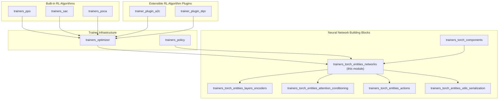
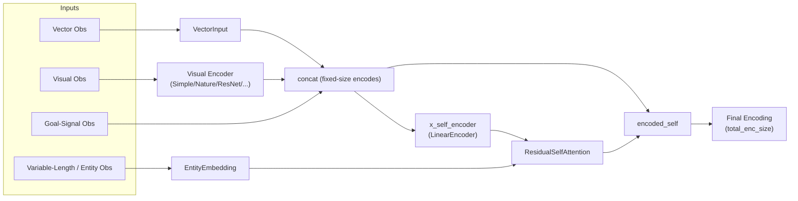
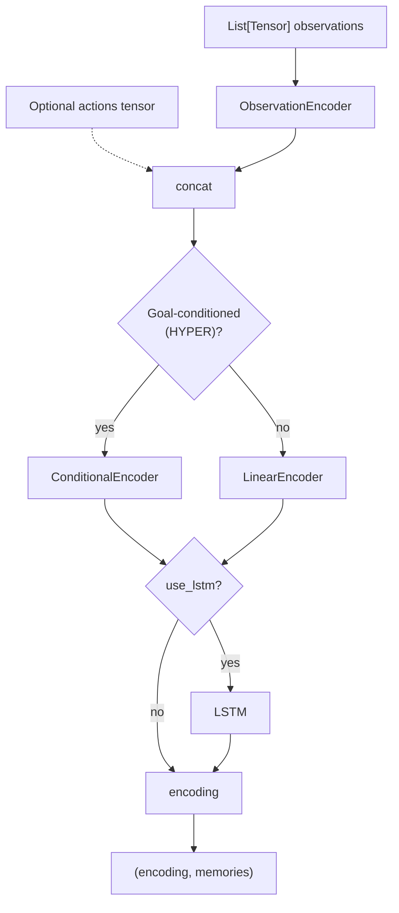
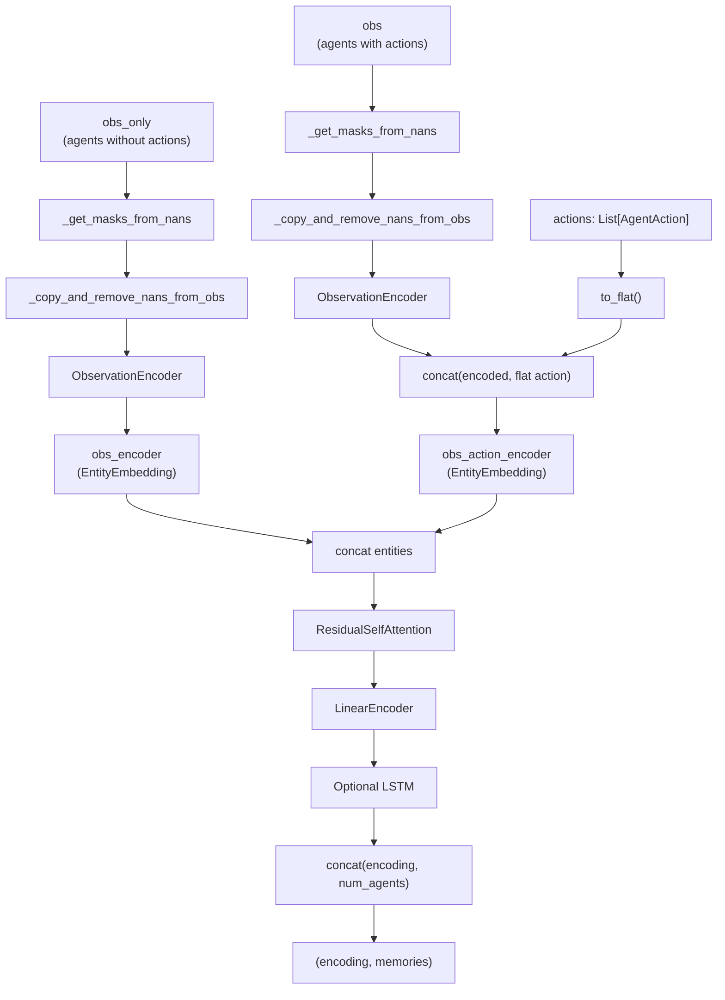
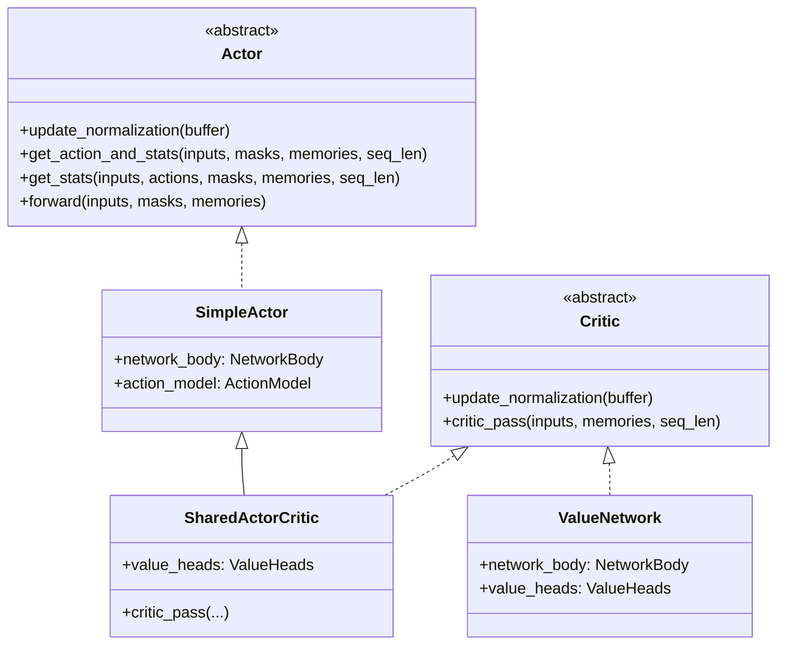
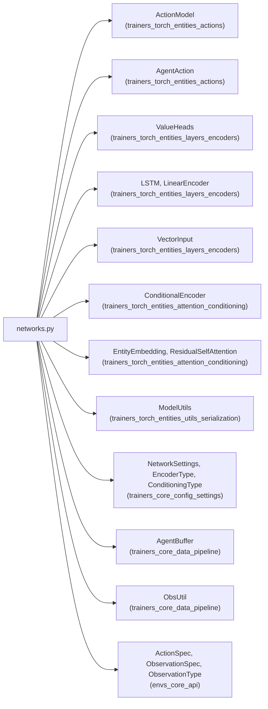
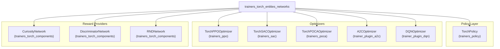

# Torch Entities: Networks (`trainers_torch_entities_networks`)

## Introduction

This module contains the **core neural-network bodies** used throughout the ML-Agents PyTorch
trainer stack. It defines the reusable building blocks that turn a set of raw Unity
observations into a fixed-size latent encoding, and the higher-level `Actor`/`Critic`
abstractions (`SimpleActor`, `SharedActorCritic`, `ValueNetwork`, `MultiAgentNetworkBody`) that
RL algorithms (PPO, SAC, POCA, and the plugin algorithms A2C/DQN) build on top of.

Conceptually, this module sits at the very center of the PyTorch network stack:

* It **consumes** lower-level primitives (visual/vector encoders, LSTM memory, linear layers,
  self-attention, hyper-network conditioning) from sibling modules.
* It **produces** the `Actor` and `Critic` network bodies that are wrapped by
  [`TorchPolicy`](trainers_policy.md) and the various
  [`TorchOptimizer`](trainers_optimizer.md) subclasses used by
  [PPO](trainers_ppo.md), [SAC](trainers_sac.md), and [POCA](trainers_poca.md).

Because this is a foundational module, most of its classes are *not* meant to be used
standalone by trainers; instead they are composed inside `SimpleActor`, `SharedActorCritic`,
and `ValueNetwork`, which are in turn instantiated by the [Optimizer](trainers_optimizer.md)
and [Policy](trainers_policy.md) layers.

## Module Position in the System



## Purpose & Responsibilities

| Responsibility | Classes |
|---|---|
| Encode a heterogeneous list of observations (vector, visual, variable-length/entity) into a single latent vector, optionally with goal-conditioning | `ObservationEncoder` |
| Combine the observation encoding with an optional action input, a fully-connected body, and optional LSTM memory | `NetworkBody` |
| Encode observations **and actions from multiple cooperating agents** using self-attention (used by MA-POCA) | `MultiAgentNetworkBody` |
| Produce state-value estimates for one or more reward streams | `ValueNetwork` |
| Track the global training step counter as a persistable `nn.Module` | `GlobalSteps` |
| Hold the current learning rate as a (non-persisted) module attribute | `LearningRate` |
| Combine an actor and a critic into a single network with shared weights (used by PPO) | `SharedActorCritic` |

> Note: `Actor`, `Critic`, and `SimpleActor` are also defined in `networks.py` but are
> considered part of the broader Actor/Critic contract shared with
> [`trainers_torch_entities_actions`](trainers_torch_entities_actions.md) and
> [`ActionModel`](trainers_torch_entities_actions.md); they are included here for
> completeness since `SharedActorCritic`, `ValueNetwork`, and `MultiAgentNetworkBody` all derive
> from or compose them.

## Core Components

### `ObservationEncoder`

The entry point for turning raw Unity observations into a single tensor.

* Uses `ModelUtils.create_input_processors` (see
  [`trainers_torch_entities_utils_serialization`](trainers_torch_entities_utils_serialization.md))
  to build one encoder per `ObservationSpec` — a visual CNN, a `VectorInput`, or an
  `EntityEmbedding` for variable-length observations.
* If any variable-length ("entity") observations exist, wires up a
  `ResidualSelfAttention` (RSA) block (from
  [`trainers_torch_entities_attention_conditioning`](trainers_torch_entities_attention_conditioning.md))
  to aggregate them into a fixed-size embedding, which is concatenated with the
  fixed-size ("self") observations.
* Tracks which observations are tagged `ObservationType.GOAL_SIGNAL` so that
  `get_goal_encoding()` can return just the goal-related embeddings for use by
  `ConditionalEncoder`-based hyper-network conditioning.
* Exposes `update_normalization()`/`copy_normalization()` to keep running vector-observation
  normalization statistics in sync (e.g. between policy and target networks).



### `NetworkBody`

The standard single-agent network body used by `SimpleActor` and `ValueNetwork`.

Pipeline: `ObservationEncoder` → (optional concat of actions, for Q-style value networks) →
body encoder → (optional LSTM).

* If goal-conditioning is enabled and configured as `ConditioningType.HYPER`, the body encoder
  is a `ConditionalEncoder` (hyper-network-based, see
  [`trainers_torch_entities_attention_conditioning`](trainers_torch_entities_attention_conditioning.md));
  otherwise it is a plain `LinearEncoder`
  (see [`trainers_torch_entities_layers_encoders`](trainers_torch_entities_layers_encoders.md)).
* If `NetworkSettings.memory` is set, an `LSTM` module (from the same layers module) processes
  the encoding sequence-wise and returns updated memories.



### `MultiAgentNetworkBody`

Used exclusively by **MA-POCA** ([`trainers_poca`](trainers_poca.md)) to build a
centralized-critic representation that works with a *variable* number of cooperating agents
sharing the same observation/action space.

Key mechanics:

1. Two `EntityEmbedding` encoders are created:
   * `obs_encoder` — embeds observation-only entities (agents without a corresponding action,
     e.g. because they've already acted or are dead).
   * `obs_action_encoder` — embeds the concatenation of an agent's observation encoding and its
     flattened action.
2. NaN-padded slots (agents that don't exist in a given transition) are detected via
   `_get_masks_from_nans` and zeroed out via `_copy_and_remove_nans_from_obs` before encoding,
   and the corresponding attention mask entries mark them as "invalid".
3. All per-agent embeddings are concatenated along the entity dimension and passed through a
   `ResidualSelfAttention` block to produce a single, permutation-invariant group encoding.
4. A `LinearEncoder` (optionally followed by an `LSTM`) further processes the aggregated
   encoding.
5. A normalized "number of agents present" scalar is concatenated to the final encoding so the
   downstream value heads can condition on group size. `_current_max_agents` is dynamically
   updated (as an `nn.Parameter`, so it is checkpointed) to track the largest group size seen
   so the normalization is stable across training.



### `Critic` / `ValueNetwork`

`Critic` is a lightweight abstract mix-in defining `update_normalization()` and
`critic_pass()`. `ValueNetwork` is the concrete standalone critic used by SAC- and
POCA-style algorithms that need a separate value function:

* Wraps a `NetworkBody` (or, for POCA, a `MultiAgentNetworkBody` in the derived
  `TorchPOCAOptimizer.POCAValueNetwork`, see [`trainers_poca`](trainers_poca.md)).
* Applies `ValueHeads` (from
  [`trainers_torch_entities_layers_encoders`](trainers_torch_entities_layers_encoders.md)) to
  the final encoding, producing one scalar value per configured reward stream (e.g.
  `extrinsic`, `curiosity`, `gail`).

### `Actor` / `SimpleActor` / `SharedActorCritic`

* `Actor` is the abstract contract for policy networks: `get_action_and_stats`, `get_stats`,
  and an ONNX-exportable `forward`.
* `SimpleActor` implements `Actor` using a `NetworkBody` + `ActionModel`
  (see [`trainers_torch_entities_actions`](trainers_torch_entities_actions.md) for
  `ActionModel`, `ActionFlattener`, and the distribution classes). It also stores metadata
  tensors (`version_number`, action-size vectors, `memory_size_vector`) as `nn.Parameter`s
  purely so they get exported into the ONNX/Sentis model — see
  [`trainers_torch_entities_utils_serialization`](trainers_torch_entities_utils_serialization.md)
  for how `ModelSerializer` consumes these.
* `SharedActorCritic` extends `SimpleActor` with `Critic`, adding a `ValueHeads` module that
  shares the same `NetworkBody` encoding as the actor — used by PPO
  ([`trainers_ppo`](trainers_ppo.md)) to save compute/parameters versus separate actor and
  critic networks.



### `GlobalSteps`

A minimal `nn.Module` wrapping a single non-trainable `int64` parameter
(`__global_step`). Because it's an `nn.Parameter`, it is automatically saved/restored by
`torch.save`/`load_state_dict`, which is how the training step counter survives checkpoint
save/resume in [`TorchModelSaver`](trainers_model_saver.md) and
[`ModelCheckpointManager`](trainers_policy.md).

### `LearningRate`

A trivial `nn.Module` holding the current learning rate as a `torch.Tensor` attribute (not a
buffer/parameter, so it is *not* checkpointed — actual learning-rate scheduling is handled by
`ModelUtils.DecayedValue` and `ModelUtils.update_learning_rate`, see
[`trainers_torch_entities_utils_serialization`](trainers_torch_entities_utils_serialization.md)).

## Dependencies



* [`trainers_torch_entities_actions`](trainers_torch_entities_actions.md) — `ActionModel`,
  `AgentAction`, and the underlying probability distributions used by `SimpleActor`.
* [`trainers_torch_entities_layers_encoders`](trainers_torch_entities_layers_encoders.md) —
  `LinearEncoder`, `LSTM`, `VectorInput`, visual encoders, and `ValueHeads`.
* [`trainers_torch_entities_attention_conditioning`](trainers_torch_entities_attention_conditioning.md)
  — `EntityEmbedding`, `ResidualSelfAttention`, `ConditionalEncoder`, `HyperNetwork`.
* [`trainers_torch_entities_utils_serialization`](trainers_torch_entities_utils_serialization.md)
  — `ModelUtils` (factory functions for encoders/RSA, decay schedules, loss helpers) and
  `ModelSerializer`/`TensorNames` for ONNX export.
* [`trainers_core_config_settings`](trainers_core_config_settings.md) — `NetworkSettings`,
  `EncoderType`, `ConditioningType` configuration objects that parameterize every network
  built here.
* [`trainers_core_data_pipeline`](trainers_core_data_pipeline.md) — `AgentBuffer` and
  `ObsUtil`, used for normalization statistics updates.
* [`envs_core_api`](envs_core_api.md) — `ActionSpec`, `ObservationSpec`, `ObservationType` data
  contracts describing the shape of an agent's action/observation space, originating from the
  Python-Unity communication layer.

## Consumers



* **`TorchPolicy`** (see [`trainers_policy`](trainers_policy.md)) instantiates a `SimpleActor`
  or `SharedActorCritic` to serve as the acting policy, and exposes `GlobalSteps` for step
  tracking.
* **`TorchPPOOptimizer`** (see [`trainers_ppo`](trainers_ppo.md)) uses `SharedActorCritic` so
  the actor and critic share a `NetworkBody`.
* **`TorchSACOptimizer`** (see [`trainers_sac`](trainers_sac.md)) uses separate `ValueNetwork`
  instances (Q functions and value function) alongside a `SimpleActor` policy.
* **`TorchPOCAOptimizer`** (see [`trainers_poca`](trainers_poca.md)) uses
  `MultiAgentNetworkBody` inside its `POCAValueNetwork` for the centralized critic, plus a
  `SimpleActor` for the decentralized policy.
* **Reward providers** (`CuriosityNetwork`, `DiscriminatorNetwork`, `RNDNetwork` — see
  [`trainers_torch_components`](trainers_torch_components.md)) reuse `NetworkBody` and
  `ObservationEncoder` internally to build their own intrinsic-reward-specific encoders.
* Plugin algorithms **`A2COptimizer`** and **`DQNOptimizer`** (see
  [`trainer_plugin_a2c`](trainer_plugin_a2c.md) and
  [`trainer_plugin_dqn`](trainer_plugin_dqn.md)) similarly build on `SimpleActor`/`ValueNetwork`
  to implement their respective algorithms, demonstrating how this module supports
  extensibility beyond the built-in algorithms.

## Data Flow: From Raw Observation to Action/Value

The following sequence illustrates a typical forward pass through the stack for a
single-agent policy (e.g. PPO), highlighting where this module's classes participate.

```mermaid
sequenceDiagram
    participant Env as Unity Environment
    participant Policy as TorchPolicy
    participant Actor as SimpleActor / SharedActorCritic
    participant NB as NetworkBody
    participant OE as ObservationEncoder
    participant AM as ActionModel

    Env->>Policy: observations (per ObservationSpec)
    Policy->>Actor: get_action_and_stats(inputs, masks, memories)
    Actor->>NB: forward(inputs, memories, sequence_length)
    NB->>OE: forward(inputs)
    OE-->>NB: encoded_self
    NB->>NB: body encoder (Linear/Conditional) [+ LSTM]
    NB-->>Actor: (encoding, memories)
    Actor->>AM: forward(encoding, masks)
    AM-->>Actor: (AgentAction, log_probs, entropy)
    Actor-->>Policy: (action, run_out, memories)
    Policy-->>Env: env_action
```

For `SharedActorCritic`, `critic_pass()` reuses the *same* `NetworkBody` (and hence the same
`ObservationEncoder`) to also compute `ValueHeads` outputs, avoiding a duplicate forward pass
through the observation encoder during PPO's combined actor+critic update.

## Design Notes

* **Composable encoders**: `ObservationEncoder` is deliberately generic over the
  observation type (vector/visual/entity/goal), so the same `NetworkBody` implementation works
  for every sensor combination without per-algorithm branching. Sensor definitions themselves
  live in [`runtime_sensors`](runtime_sensors.md) (Unity C# side) and are described by
  `ObservationSpec` from [`envs_core_api`](envs_core_api.md) on the Python side.
* **ONNX/Sentis exportability**: Several fields on `SimpleActor` (e.g.
  `version_number`, `continuous_act_size_vector`, `memory_size_vector`) exist purely to make
  the exported inference graph self-describing; consult
  [`trainers_torch_entities_utils_serialization`](trainers_torch_entities_utils_serialization.md)
  for the corresponding `ModelSerializer`/`TensorNames` mapping.
* **Attention-based scalability**: `MultiAgentNetworkBody` uses masking (via NaN-detection)
  rather than fixed-size padding assumptions, allowing POCA to train with a dynamically varying
  number of agents in a group, as long as an upper bound on attendable entities is tracked via
  `_current_max_agents`.
* **Normalization propagation**: `update_normalization`/`copy_normalization` patterns appear
  consistently across `ObservationEncoder`, `NetworkBody`, `MultiAgentNetworkBody`, and
  `ValueNetwork`, allowing running statistics computed on a policy network to be copied into
  target/critic networks (important for SAC's target value network).
