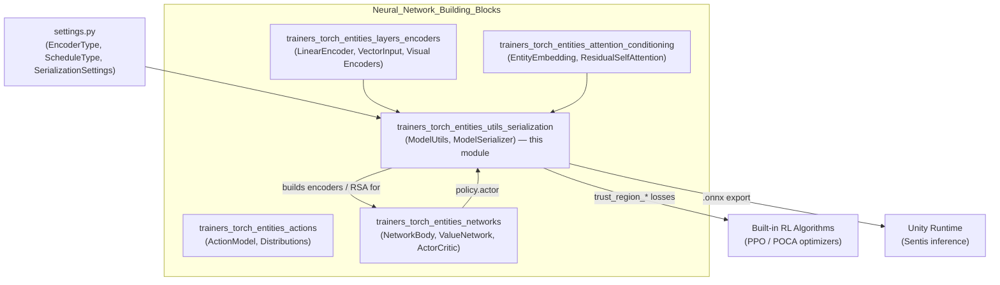
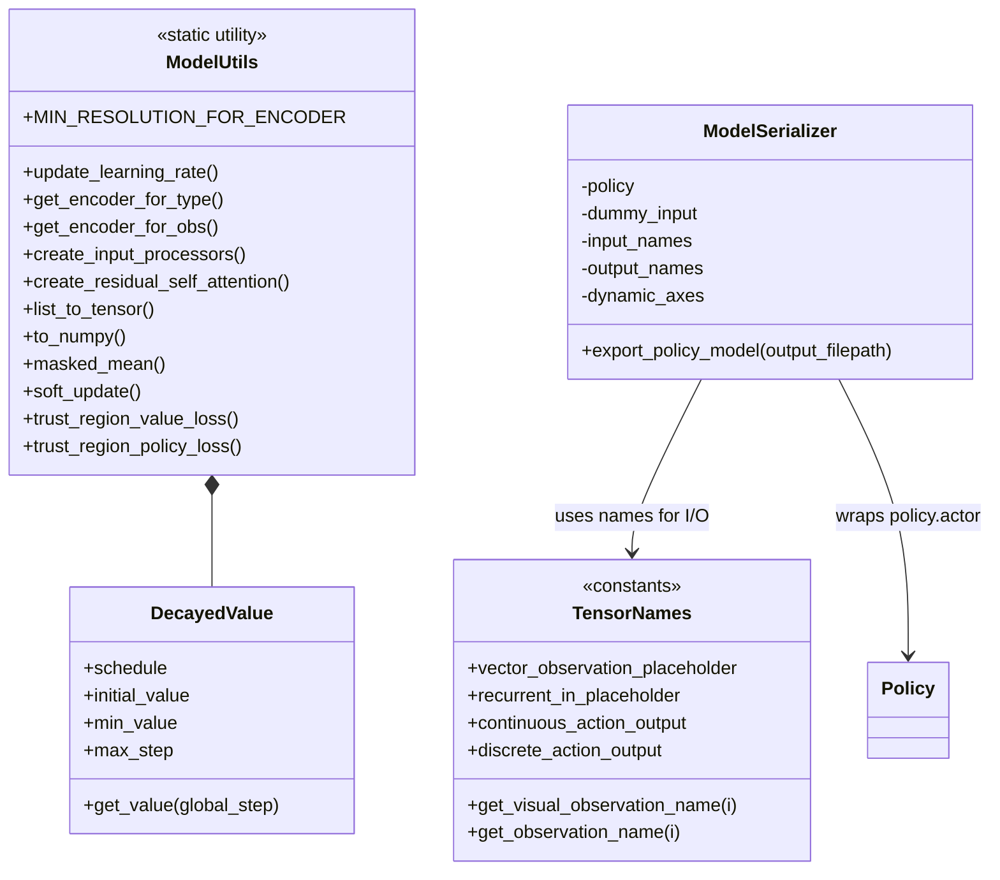

# Torch Entities: Utils & Serialization

## Introduction

The `trainers_torch_entities_utils_serialization` module is the "toolbox and export gateway" of the
[Neural Network Building Blocks](trainers_torch_entities.md) layer in ML-Agents. It contains two closely
related, but functionally distinct, pieces of infrastructure:

1. **`ModelUtils`** (`utils.py`) — a collection of static helper functions used throughout the PyTorch
   trainer stack to build encoders, convert between NumPy/Torch tensors, compute masked losses, decay
   hyperparameters over time, and implement shared PPO/POCA loss primitives (trust-region policy/value
   losses).
2. **`ModelSerializer` / `TensorNames`** (`model_serialization.py`) — the machinery that exports a trained
   PyTorch policy into an ONNX model that can be consumed by the Unity runtime (via Sentis/Barracuda) for
   in-game inference.

Although these two files serve different purposes, they are grouped together because both sit at the
*boundary* of the neural-network layer: `ModelUtils` is consumed by nearly every other network-construction
module to assemble models, while `ModelSerializer` is the terminal step that turns those assembled models
into a deployable artifact. Neither file depends on the other, but both are dependency sinks for the rest
of `trainers_torch_entities`.

## Role in the System



For the broader picture of how this module fits among its siblings, see the
[Neural Network Building Blocks](trainers_torch_entities.md) overview, which links to:
- [Layers & Encoders](trainers_torch_entities_layers_encoders.md)
- [Attention & Conditioning](trainers_torch_entities_attention_conditioning.md)
- [Actions](trainers_torch_entities_actions.md)
- [Networks](trainers_torch_entities_networks.md)

Downstream consumers of this module include:
- [Training Orchestration & Lifecycle Infrastructure](trainers_core.md) — specifically the
  [Model Saver](trainers_model_saver.md) and [Policy](trainers_policy.md) sub-modules, which call
  `ModelSerializer.export_policy_model` when checkpointing/exporting a policy.
- [Built-in RL Algorithms](trainers_ppo.md) — the PPO and [POCA](trainers_poca.md) optimizers use
  `ModelUtils.trust_region_policy_loss` / `trust_region_value_loss`.
- [Extensible RL Algorithm Plugins](trainer_plugin_a2c.md) — the A2C plugin optimizer reuses `ModelUtils`
  helpers (tensor conversions, masked mean, decayed values) for its own loss computation.

## Sub-modules

This module is composed of two independent code files, each documented in detail below:

| Sub-module | File | Description |
|---|---|---|
| [Model Utilities](trainers_torch_entities_utils_serialization_utils.md) | `utils.py` | Static helper class `ModelUtils` providing encoder factory functions, tensor conversions, decay schedules, and shared PPO/POCA loss functions. |
| [Model Serialization](trainers_torch_entities_utils_serialization_export.md) | `model_serialization.py` | `TensorNames` constants and `ModelSerializer`, responsible for exporting a trained policy to ONNX for Unity/Sentis inference. |

## Architecture Overview



## Data Flow: From Training to Deployment

```mermaid
sequenceDiagram
    participant Net as NetworkBody / ActorCritic
    participant MU as ModelUtils
    participant Opt as PPO/POCA Optimizer
    participant Pol as TorchPolicy
    participant MS as ModelSerializer
    participant Onnx as .onnx file

    Net->>MU: create_input_processors(observation_specs, ...)
    MU-->>Net: encoders, embedding_sizes
    Net->>MU: create_residual_self_attention(...)
    MU-->>Net: RSA + self-encoder (if variable-length obs)

    Opt->>MU: trust_region_policy_loss(...) / trust_region_value_loss(...)
    MU-->>Opt: loss tensors

    Pol->>MS: ModelSerializer(policy)
    MS->>MS: build dummy_input, input/output names, dynamic_axes
    Pol->>MS: export_policy_model(path)
    MS->>Onnx: torch.onnx.export(policy.actor, dummy_input, ...)
```

## Summary

- **`ModelUtils`** decouples generic PyTorch/NumPy plumbing (tensor conversion, decay schedules, masked
  losses) and observation-driven encoder construction from the specific network architectures defined in
  [Networks](trainers_torch_entities_networks.md), [Layers & Encoders](trainers_torch_entities_layers_encoders.md),
  and [Attention & Conditioning](trainers_torch_entities_attention_conditioning.md).
- **`ModelSerializer`** is the single choke point through which every trained policy passes on its way to
  becoming a Unity-consumable `.onnx` asset, using `TensorNames` to guarantee a stable contract between the
  exported graph and the C# inference code (`SentisModelParamLoader` in
  [Unity-Python Bridge & ML Integration](runtime_inference.md)).

See the detailed sub-module pages for full API descriptions:
- [Model Utilities](trainers_torch_entities_utils_serialization_utils.md)
- [Model Serialization](trainers_torch_entities_utils_serialization_export.md)
