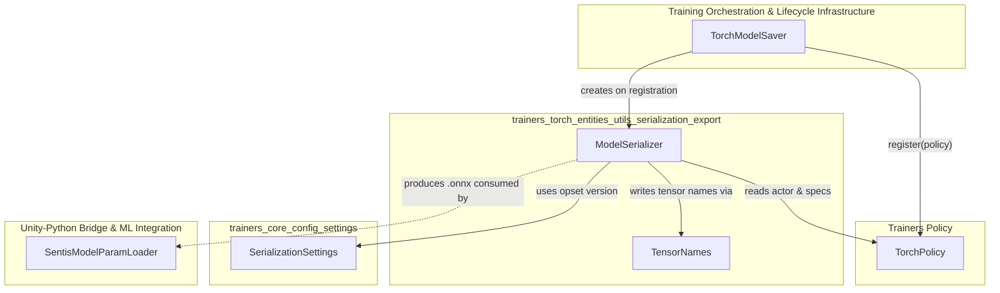
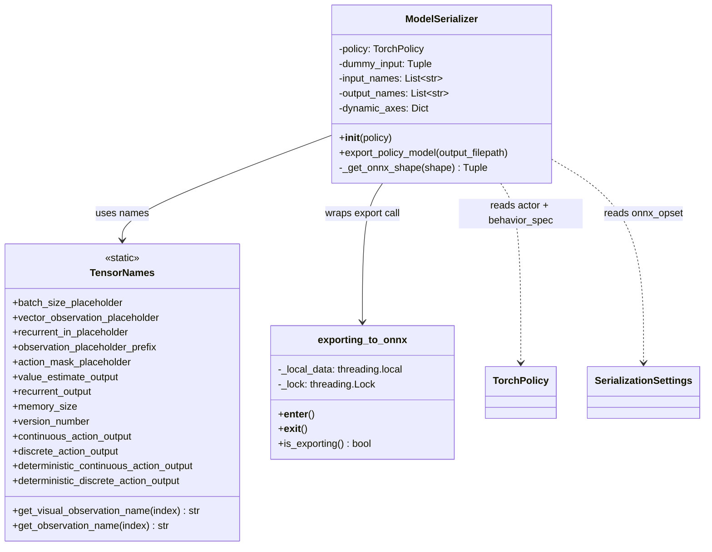
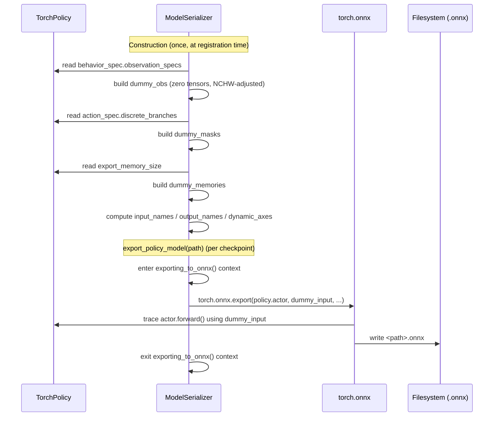
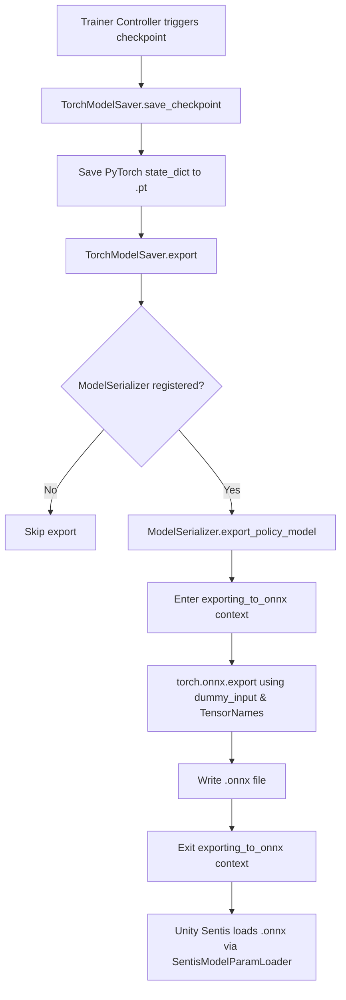

# Model Serialization & Export

## Introduction

The **Model Serialization & Export** module (`ml-agents/mlagents/trainers/torch_entities/model_serialization.py`) is responsible for converting a trained PyTorch policy (Actor network) into the [ONNX](https://onnx.ai/) format used by Sentis, Unity's neural-network inference runtime. This is the final bridge between the Python training stack and the Unity C# runtime: once a model is exported to `.onnx`, it can be embedded in a Unity project and run entirely on-device without any Python dependency.

This module defines two core components:

- **`TensorNames`** — a static registry of the exact input/output tensor name strings expected by the Unity Sentis inference code (`SentisModelParamLoader`) and by the ONNX graph itself. It acts as the shared "contract" between the Python exporter and the C# consumer.
- **`ModelSerializer`** — the class that builds dummy inputs matching a policy's `BehaviorSpec`, wires up input/output names and dynamic axes, and invokes `torch.onnx.export` to produce the `.onnx` file.

It sits at the very end of the **[Neural Network Building Blocks](trainers_torch_entities_utils_serialization.md)** hierarchy, converting the abstract PyTorch modules built by [`trainers_torch_entities_networks`](trainers_torch_entities_utils_serialization.md) and [`trainers_torch_entities_actions`](trainers_torch_entities_utils_serialization.md) into a portable artifact.

## Position in the System



Related documentation:
- [Model Saver](trainers_model_saver.md) — owns and drives `ModelSerializer` as part of checkpointing.
- [Trainers Policy](trainers_policy.md) — supplies the `TorchPolicy` (actor network + behavior spec) that is exported.
- [Settings](trainers_core_config_settings.md) — provides `SerializationSettings` (ONNX opset version, conversion toggle).
- [Neural Network Building Blocks parent module](trainers_torch_entities_utils_serialization.md) — sibling `ModelUtils` utilities module.
- [Unity-Python Bridge & ML Integration](runtime_inference.md) — `SentisModelParamLoader` on the C# side consumes the exported model and validates tensor names/shapes against this module's `TensorNames`.

## Core Components

### `TensorNames`

A pure static class (no instance state) that centralizes every string constant used to name tensors in the exported ONNX graph. Using a single source of truth prevents naming drift between:

1. The Python-side `ModelSerializer`, which assigns these names as `input_names`/`output_names` to `torch.onnx.export`.
2. The C#-side `SentisModelParamLoader` (see [Unity-Python Bridge & ML Integration](runtime_inference.md)), which looks up tensors by these same names when binding data at inference time.

**Categories of names:**

| Category | Examples | Purpose |
|---|---|---|
| Input placeholders | `vector_observation_placeholder`, `observation_placeholder_prefix`, `action_mask_placeholder`, `recurrent_in_placeholder` | Identify the observation, mask, and memory tensors fed into the graph. |
| Output tensors | `value_estimate_output`, `recurrent_output`, `continuous_action_output`, `discrete_action_output` | Identify tensors read back by the consumer after inference. |
| Metadata | `memory_size`, `version_number` | Constant/metadata outputs describing model capabilities. |
| Deterministic outputs | `deterministic_continuous_action_output`, `deterministic_discrete_action_output` | Non-sampled (mode/mean) action outputs, useful for reproducible inference. |
| Deprecated | `is_continuous_control_deprecated`, `action_output_deprecated`, `action_output_shape_deprecated` | Retained for backward compatibility with older Sentis/Barracuda model consumers. |

**Helper methods:**
- `get_visual_observation_name(index)` — builds `visual_observation_<index>` for legacy visual observation slots.
- `get_observation_name(index)` — builds `obs_<index>` for the modern, unified observation input naming scheme (used for both vector and visual observations).

### `exporting_to_onnx` (context manager)

A thread-safe context manager defined alongside `ModelSerializer`. Some model code paths (e.g., attention masking, distribution sampling) behave differently when being traced for ONNX export versus normal training/inference. Wrapping the export call in:

```python
with exporting_to_onnx():
    torch.onnx.export(...)
```

sets a thread-local + globally-locked flag that any downstream module can query via `exporting_to_onnx.is_exporting()` to switch to export-safe code paths (e.g., avoiding non-traceable operations). The global lock ensures only one export happens at a time across threads, which is important because the flag storage, while thread-local, gates concurrent modifications to shared model state during tracing.

### `ModelSerializer`

Constructed once per policy (typically by [`TorchModelSaver.register`](trainers_model_saver.md)), and reused for every checkpoint export during training.

**Constructor responsibilities:**
1. Reads `policy.behavior_spec.observation_specs` to build one dummy zero-tensor per observation, reshaping any 3D (visual) observation into ONNX/Sentis-expected `NCHW`-compatible ordering via `_get_onnx_shape`.
2. Builds a dummy `action_masks` tensor sized to the sum of discrete action branches.
3. Builds a dummy recurrent memory tensor sized to `policy.export_memory_size` (only the Actor's own memory, not any auxiliary critic/reward-provider memory).
4. Assembles `self.dummy_input = (dummy_obs, dummy_masks, dummy_memories)` — this tuple is passed directly to `torch.onnx.export` as the example input used for graph tracing.
5. Computes `input_names` (observation names + mask + recurrent-in) and `output_names` (version number, memory size, and — conditionally — continuous/discrete action outputs and recurrent output), based on which action space types the `BehaviorSpec.action_spec` declares.
6. Computes `dynamic_axes`, marking the batch dimension (`axis 0`) as dynamic for every named input/output so the exported graph can accept variable batch sizes at inference time.

**`export_policy_model(output_filepath)`:**
- Appends `.onnx` to the given path.
- Enters the `exporting_to_onnx()` context.
- Calls `torch.onnx.export(self.policy.actor, self.dummy_input, onnx_output_path, opset_version=SerializationSettings.onnx_opset, input_names=..., output_names=..., dynamic_axes=...)`.
- Logs completion.

Note that only `policy.actor` (the inference-time action-producing network) is exported — critic heads, reward-signal networks, and other auxiliary modules used only during training are intentionally excluded, keeping the runtime model minimal.

## Architecture Diagram



## Data Flow: Building the ONNX Export



## Process Flow: Checkpoint & Export Lifecycle



## Integration Points

- **Registration**: `ModelSerializer` is instantiated inside [`TorchModelSaver.register`](trainers_model_saver.md) the first time a `TorchPolicy` is registered with the saver — see `TorchModelSaver.__init__` / `register` in the [Trainers Model Saver](trainers_model_saver.md) module. The saver stores it as `self.exporter` and calls `export_policy_model` from its own `export` method on every checkpoint.
- **Configuration**: The ONNX opset version and whether conversion happens at all are controlled by `SerializationSettings` (`convert_to_onnx`, `onnx_opset`), defined in [`trainers_core_config_settings`](trainers_core_config_settings.md). `TorchModelSaver.copy_final_model` also checks `SerializationSettings.convert_to_onnx` before copying the final `.onnx` artifact to the output directory.
- **Source policy**: The `TorchPolicy` class (see [Trainers Policy](trainers_policy.md)) exposes `behavior_spec`, `actor`, and `export_memory_size`, all of which `ModelSerializer` depends on directly. Changes to the actor's `forward`/`get_action_and_stats` signature or to `BehaviorSpec` shape conventions will directly affect what `ModelSerializer` can trace.
- **Downstream consumer**: On the Unity side, `SentisModelParamLoader` (in [Unity-Python Bridge & ML Integration](runtime_inference.md)) parses the exported `.onnx` model and validates that its tensor names and shapes match what the C# `BehaviorParameters`/`Agent` code expects — the same names defined in `TensorNames`. Any change to `TensorNames` values must be mirrored on the C# side to avoid breaking inference.

## Key Design Notes

- **Actor-only export**: Only the actor network is exported; critic/value networks and reward-signal networks (e.g., curiosity, GAIL, RND — see [`trainers_torch_components`](trainers_torch_components.md)) remain Python/training-only and are never part of the ONNX graph.
- **Dynamic batch axis**: Every input and output declares its first axis (`batch`) as dynamic, allowing the same exported graph to be used for single-agent or batched multi-agent inference in Unity.
- **Backward compatibility**: Deprecated tensor names are preserved in `TensorNames` (though no longer emitted by current export logic here) to document the historical contract and help diagnose compatibility issues with older exported models or older Sentis/Barracuda loaders.
- **Thread-safety for tracing**: `exporting_to_onnx` uses both thread-local storage (to record "am I exporting" per-thread) and a shared lock (to serialize concurrent export attempts), since ONNX tracing can have side effects on modules with export-sensitive branches.
