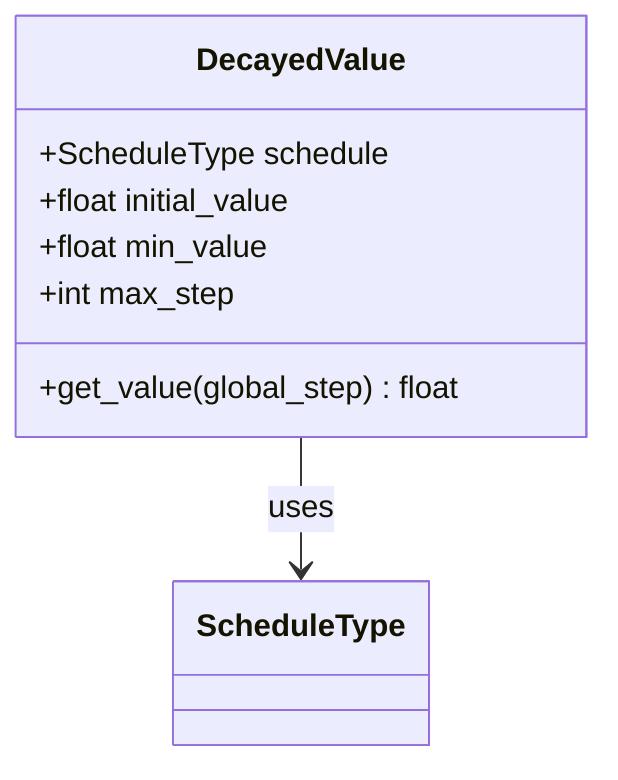
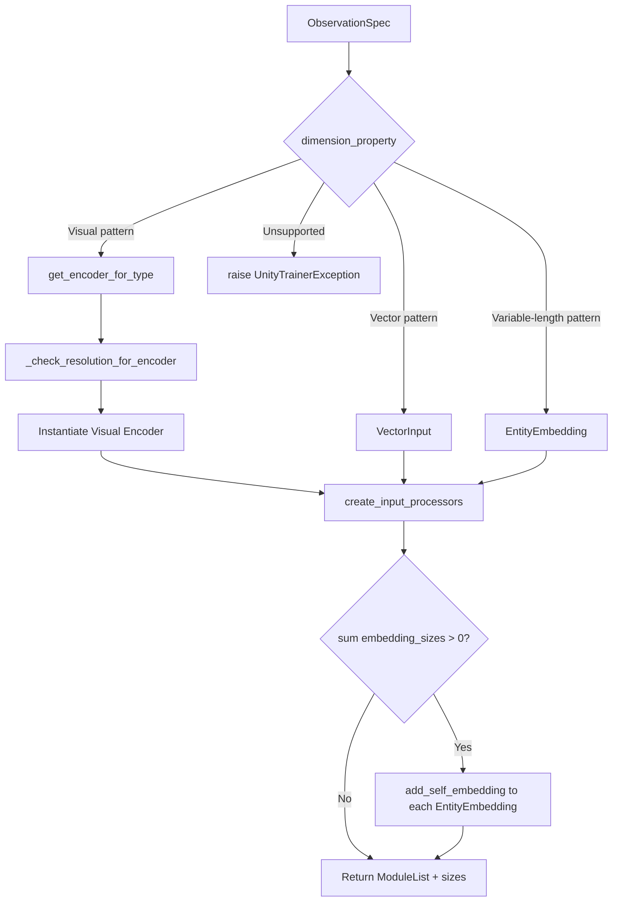
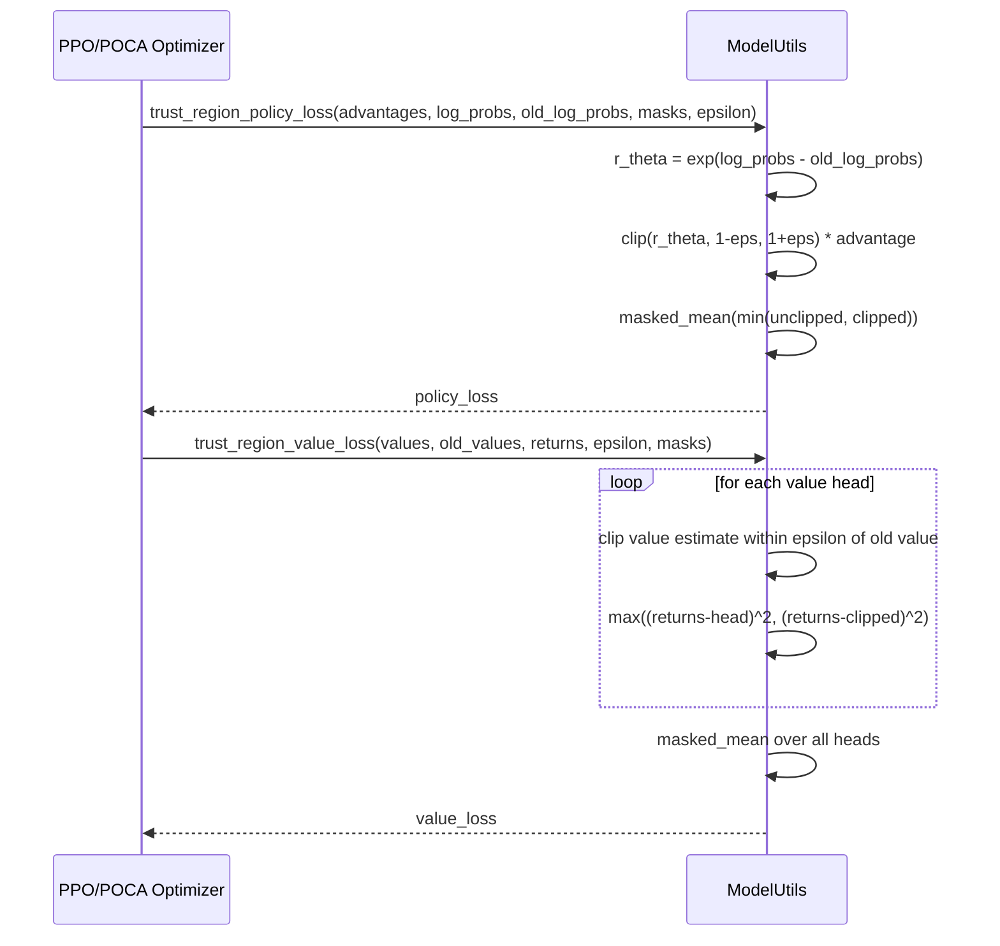
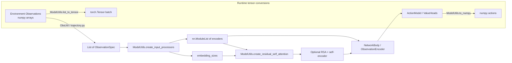

# Trainers Torch Entities Utils Serialization — Utils Module

## Introduction

The **`trainers_torch_entities_utils_serialization_utils`** module contains the `ModelUtils` class, a static-method toolbox that underpins nearly every PyTorch network built inside the ML-Agents trainers. It is the "glue" layer that translates high-level configuration (encoder types, observation specs, learning-rate schedules) into concrete PyTorch building blocks (encoders, tensors, attention modules), and it also supplies a set of shared tensor-math routines (masked means, Polyak averaging, PPO-style trust-region losses) used by multiple RL algorithm implementations.

This module has no runtime state — it only exposes static/class-level utility functions — and is imported extensively by the [Neural Network Building Blocks](trainers_torch_entities_utils_serialization.md) module family, the [Built-in RL Algorithms](trainers_ppo.md) (PPO/SAC/POCA), and the [Extensible RL Algorithm Plugins](trainer_plugin_a2c.md) (A2C/DQN).

---

## Purpose and Scope

`ModelUtils` serves four main responsibilities:

1. **Encoder selection & construction** — Given an `ObservationSpec` (shape + `DimensionProperty` semantics), it decides whether an observation should be routed through a visual encoder, a vector encoder, or a variable-length entity encoder, and instantiates the correct module.
2. **Value scheduling** — The nested `DecayedValue` class implements constant/linear decay schedules used for hyperparameters like learning rate, epsilon, and beta throughout training.
3. **Tensor conversion & manipulation helpers** — Fast numpy↔torch conversions, one-hot encoding of discrete actions, dynamic partitioning, masked mean, and Polyak (soft) updates for target networks.
4. **Shared RL loss functions** — `trust_region_policy_loss` and `trust_region_value_loss` implement the PPO/POCA-style clipped surrogate objectives, reused by multiple trainer optimizers.

Because these are generic, algorithm-agnostic operations, centralizing them in `ModelUtils` avoids duplicating logic across PPO, SAC, POCA, and community plugins.

---

## Architecture Overview

```mermaid
graph TB
    subgraph "trainers_torch_entities_utils_serialization_utils"
        MU[ModelUtils]
        DV[ModelUtils.DecayedValue]
        MU --- DV
    end

    subgraph "trainers_torch_entities_layers_encoders"
        LE[LinearEncoder]
        INIT[Initialization]
        SVE[SimpleVisualEncoder]
        NVE[NatureVisualEncoder]
        RVE[ResNetVisualEncoder]
        SmVE[SmallVisualEncoder]
        FCVE[FullyConnectedVisualEncoder]
        VI[VectorInput]
    end

    subgraph "trainers_torch_entities_attention_conditioning"
        EE[EntityEmbedding]
        RSA[ResidualSelfAttention]
    end

    subgraph "trainers_core_config_settings"
        ET[EncoderType]
        ST[ScheduleType]
    end

    subgraph "envs_core_api"
        OS[ObservationSpec]
        DP[DimensionProperty]
    end

    subgraph "trainers_core (exception)"
        UTE[UnityTrainerException]
    end

    MU -->|selects/instantiates| SVE
    MU --> NVE
    MU --> RVE
    MU --> SmVE
    MU --> FCVE
    MU --> VI
    MU -->|builds RSA when var-len obs found| EE
    MU --> RSA
    MU -->|reads| LE
    MU --> INIT
    DV -->|schedule type| ST
    MU -->|encoder type lookup| ET
    MU -->|interprets| OS
    MU --> DP
    MU -->|raises| UTE

    style MU fill:#4a90d9,color:#fff
    style DV fill:#7fb3e0,color:#000
```

---

## Component Breakdown

### `ModelUtils.DecayedValue`

A small stateful (but immutable-config) helper representing a scalar hyperparameter that decays over training steps.

- **`CONSTANT`** schedule: always returns `initial_value`.
- **`LINEAR`** schedule: delegates to `ModelUtils.polynomial_decay` (power=1.0), linearly interpolating from `initial_value` to `min_value` as `global_step` approaches `max_step`.
- Any other schedule raises `UnityTrainerException`.

Used throughout trainer optimizers (e.g., PPO's learning-rate, epsilon, and beta schedules) — see [Built-in RL Algorithms](trainers_ppo.md).

### `ModelUtils` — Encoder Construction Pipeline

`ModelUtils` classifies each observation using its `DimensionProperty` tuple and dispatches to the appropriate encoder family:

| Category | `DimensionProperty` pattern | Resulting module |
|---|---|---|
| Visual | `(NONE, TRANS_EQUIV, TRANS_EQUIV)` or all `UNSPECIFIED` (3-D shape) | One of `SimpleVisualEncoder`, `NatureVisualEncoder`, `ResNetVisualEncoder`, `SmallVisualEncoder`, `FullyConnectedVisualEncoder` (chosen by `EncoderType`) |
| Vector | `(NONE,)` or `(UNSPECIFIED,)` | `VectorInput` |
| Variable-length (entities) | `(VARIABLE_SIZE, NONE)` | `EntityEmbedding` |
| Other | anything else | raises `UnityTrainerException` |

Key methods:

- **`get_encoder_for_type(encoder_type)`** — maps an `EncoderType` enum value to its visual-encoder class (see [Layers & Encoders module](trainers_torch_entities_layers_encoders.md)).
- **`_check_resolution_for_encoder(height, width, vis_encoder_type)`** — validates that image dimensions meet the encoder's `MIN_RESOLUTION_FOR_ENCODER` requirement, raising `UnityTrainerException` if too small.
- **`get_encoder_for_obs(obs_spec, normalize, h_size, attention_embedding_size, vis_encode_type)`** — the single-observation dispatcher described above; returns `(module, embedding_size)`.
- **`create_input_processors(observation_specs, h_size, vis_encode_type, attention_embedding_size, normalize)`** — builds the full `nn.ModuleList` of encoders for *all* observations of an agent, and computes each embedding's contribution to the shared "self" embedding used by attention-based encoders.
- **`create_residual_self_attention(input_processors, embedding_sizes, hidden_size)`** — detects whether any `EntityEmbedding` processors are present; if so, constructs a `LinearEncoder` (self-encoder) and a `ResidualSelfAttention` (RSA) module. Used when agents observe variable numbers of entities (e.g., buffer sensors). See [Attention & Conditioning module](trainers_torch_entities_attention_conditioning.md).

These functions are the backbone of `NetworkBody`/`ObservationEncoder` construction in the [Networks module](trainers_torch_entities_networks.md).

### Tensor Conversion Utilities

| Method | Purpose |
|---|---|
| `list_to_tensor(ndarray_list, dtype)` | Fast conversion of a list of numpy arrays → single stacked `torch.Tensor` (uses `np.asanyarray` first for speed). |
| `list_to_tensor_list(ndarray_list, dtype)` | Same, but returns a list of individual tensors (used for variable-length/entity batches). |
| `to_numpy(tensor)` | Detach, move to CPU, and convert to numpy — the standard path for turning network outputs into environment actions or logged statistics. |
| `break_into_branches(concatenated_logits, action_size)` | Splits concatenated multi-discrete action logits into one tensor per branch. Used by `MultiCategoricalDistribution` (see [Actions module](trainers_torch_entities_actions.md)). |
| `actions_to_onehot(discrete_actions, action_size)` | Converts integer discrete actions into a list of one-hot tensors per branch — used for Q-value indexing (SAC, DQN) and BC losses. |
| `dynamic_partition(data, partitions, num_partitions)` | TensorFlow-style `dynamic_partition` reimplemented in torch; splits a tensor into `num_partitions` groups based on an index tensor (used in POCA / group-based value calculations). |

### Statistical / Optimization Helpers

- **`masked_mean(tensor, masks)`** — Computes the mean of `tensor` while ignoring masked-out (e.g., padded/terminal) entries. Handles both scalar and multi-dimensional tensors by permuting dimensions so the mask broadcasts correctly. Used pervasively for LSTM-padded sequences.
- **`soft_update(source, target, tau)`** — In-place Polyak averaging: `target = tau * source + (1 - tau) * target`. Used by SAC to update target value networks (see [Built-in RL Algorithms](trainers_sac.md)).
- **`update_learning_rate(optim, lr)`** — Directly mutates all parameter groups of a `torch.optim.Optimizer` to the given learning rate; paired with `DecayedValue.get_value()` to implement schedules.

### Trust-Region Loss Functions

- **`trust_region_policy_loss`** — implements the PPO clipped surrogate objective: `-mean(min(r_θ·A, clip(r_θ, 1-ε, 1+ε)·A))`, masked to ignore padded timesteps.
- **`trust_region_value_loss`** — implements the PPO/POCA clipped value loss over an arbitrary dict of value heads (supports multiple reward signals, e.g., extrinsic + curiosity + GAIL), returning the mean loss across heads.

Both functions are consumed directly by `TorchPPOOptimizer` and `TorchPOCAOptimizer` — see [Built-in RL Algorithms](trainers_ppo.md) and [POCA Optimizer](trainers_poca.md) — and can be reused by any custom optimizer wanting PPO-style clipping, including [Extensible RL Algorithm Plugins](trainer_plugin_a2c.md).

---

## End-to-End Data Flow: From Raw Observation to Network Input

This flow illustrates how raw environment observations become PyTorch tensors, get routed through the correct encoder type, are optionally passed through attention for variable-length entities, and ultimately drive the [Networks module](trainers_torch_entities_networks.md) that feeds [Action Model / Distributions](trainers_torch_entities_actions.md).

---

## Dependency Summary

| Dependency | Relationship | Documentation |
|---|---|---|
| `EncoderType`, `ScheduleType` (settings enums) | Input configuration for encoder/schedule selection | [Core Config Settings](trainers_core_config_settings.md) |
| `LinearEncoder`, `Initialization` | Used to build the "self" encoder before RSA | [Layers & Encoders](trainers_torch_entities_layers_encoders.md) |
| Visual encoder classes (`SimpleVisualEncoder`, `NatureVisualEncoder`, `ResNetVisualEncoder`, `SmallVisualEncoder`, `FullyConnectedVisualEncoder`), `VectorInput` | Instantiated by `get_encoder_for_type` / `get_encoder_for_obs` | [Layers & Encoders](trainers_torch_entities_layers_encoders.md) |
| `EntityEmbedding`, `ResidualSelfAttention` | Variable-length observation handling | [Attention & Conditioning](trainers_torch_entities_attention_conditioning.md) |
| `ObservationSpec`, `DimensionProperty` | Describe observation shape/semantics from the environment side | [Envs Core API](envs_core_api.md) |
| `UnityTrainerException` | Raised on invalid encoder/resolution configuration | [Training Orchestration Core](trainers_core.md) |
| `NetworkBody`, `ObservationEncoder`, `ValueNetwork` | Primary consumers of `create_input_processors`/`create_residual_self_attention` | [Networks](trainers_torch_entities_networks.md) |
| `ActionModel`, `MultiCategoricalDistribution` | Consume `break_into_branches`, `actions_to_onehot` | [Actions](trainers_torch_entities_actions.md) |
| `TorchPPOOptimizer`, `TorchPOCAOptimizer`, `TorchSACOptimizer` | Consume trust-region losses, `soft_update`, `DecayedValue` | [PPO](trainers_ppo.md), [POCA](trainers_poca.md), [SAC](trainers_sac.md) |
| `A2COptimizer`, `DQNOptimizer` (community plugins) | Reuse generic tensor utilities and loss helpers | [A2C Plugin](trainer_plugin_a2c.md), [DQN Plugin](trainer_plugin_dqn.md) |
| `ModelSerializer` (sibling module) | Exports the trained network to ONNX for Unity runtime inference | [Model Serialization / Export](trainers_torch_entities_utils_serialization_export.md) |

---

## Design Notes & Rationale

- **Static-only design**: `ModelUtils` intentionally has no instance state — all methods are `@staticmethod`. This makes it safe to call from any trainer/optimizer without worrying about shared mutable state, and it keeps the class as a pure "namespace" of related functions.
- **Encoder resolution validation early**: `_check_resolution_for_encoder` fails fast at network-construction time (not at forward-pass time) when a visual observation's resolution is too small for the chosen `EncoderType`, giving clear error messages tied to `MIN_RESOLUTION_FOR_ENCODER`.
- **Unified handling of fixed vs. variable-length observations**: By classifying observations solely via `DimensionProperty` tuples (rather than ad hoc shape-length checks), the same code path supports vector sensors, image sensors, and future sensor types (e.g., buffer/entity sensors) without special-casing each trainer.
- **Reused across all RL algorithms**: Because PPO, SAC, POCA, and third-party plugins (A2C, DQN) all build networks through `create_input_processors`, changes to encoder selection logic here propagate consistently across the entire [Built-in RL Algorithms](trainers_ppo.md) and [Extensible RL Algorithm Plugins](trainer_plugin_a2c.md) module families.

---

## Related Documentation

- [Layers & Encoders](trainers_torch_entities_layers_encoders.md) — Visual/vector encoder implementations and `LinearEncoder`.
- [Attention & Conditioning](trainers_torch_entities_attention_conditioning.md) — `EntityEmbedding` and `ResidualSelfAttention` details.
- [Networks](trainers_torch_entities_networks.md) — How `ModelUtils` output feeds into `NetworkBody`/`ValueNetwork`.
- [Actions](trainers_torch_entities_actions.md) — Action distributions consuming tensor utilities.
- [Model Serialization / Export](trainers_torch_entities_utils_serialization_export.md) — Sibling module responsible for ONNX export of the networks built with these utilities.
- [Core Config Settings](trainers_core_config_settings.md) — `EncoderType` and `ScheduleType` enum definitions.
- [Built-in RL Algorithms](trainers_ppo.md) — Primary consumers of trust-region loss helpers.
- [Extensible RL Algorithm Plugins](trainer_plugin_a2c.md) — Community algorithms reusing these utilities.

