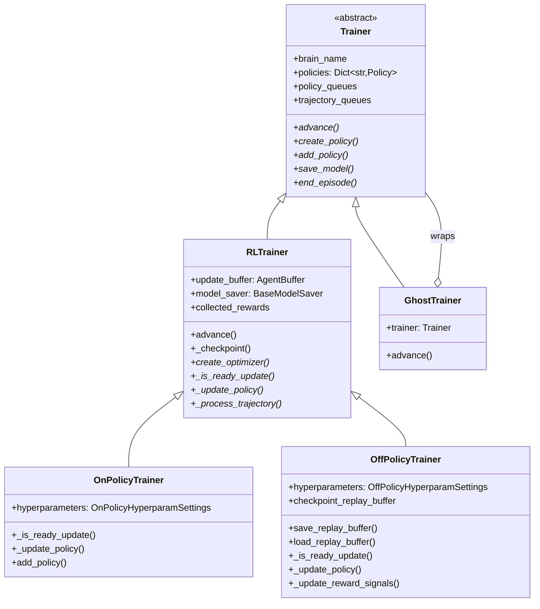
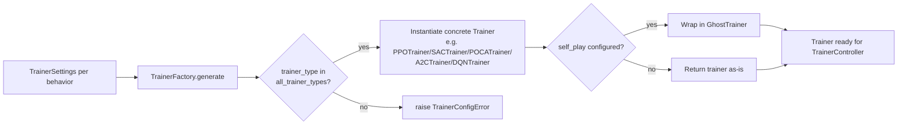

# Trainer Base Module (`trainers_trainer_base`)

## 1. Purpose

The `trainers_trainer_base` module defines the **abstract training lifecycle** used by every learning algorithm in the ML-Agents Python trainer stack (PPO, SAC, POCA, and third-party plugins such as A2C/DQN). It provides:

- **`Trainer`** — the abstract base contract every trainer must satisfy (policy management, queue subscription, stepping).
- **`RLTrainer`** — a concrete extension of `Trainer` that adds the shared machinery needed by *any* reward-signal-driven RL algorithm: experience buffering, checkpointing, statistics reporting, and the trajectory→buffer→update pipeline.
- **`OnPolicyTrainer`** / **`OffPolicyTrainer`** — the two canonical update strategies (on-policy epoch-based updates vs. off-policy replay-buffer updates) that concrete algorithms (PPO, SAC, POCA) subclass.
- **`TrainerFactory`** — the single entry point that instantiates the correct trainer subclass (and optionally wraps it for self-play) based on YAML/CLI configuration.

This module is the **backbone that all built-in and pluggable RL algorithms depend on**. It does not itself implement any specific algorithm's loss function or network — that responsibility belongs to the [Optimizer](trainers_optimizer.md) and [Neural Network Building Blocks](Neural_Network_Building_Blocks.md) layers. Instead, it defines *when* and *how* training happens: when to update, when to checkpoint, when to write stats, and how trajectories become training batches.

## 2. Where This Module Fits

```mermaid
graph TD
    TC[TrainerController<br/>trainers_core_orchestration] -->|drives .advance()| TF
    TF[TrainerFactory] -->|instantiates| RLT
    TF -->|wraps for self-play| GT[GhostTrainer<br/>trainers_ghost]

    subgraph trainers_trainer_base
        T[Trainer - abstract]
        RLT[RLTrainer]
        OnP[OnPolicyTrainer]
        OffP[OffPolicyTrainer]
        T --> RLT --> OnP
        RLT --> OffP
    end

    OnP -.subclassed by.-> PPO[PPOTrainer<br/>Built-in_RL_Algorithms]
    OnP -.subclassed by.-> POCA[POCATrainer<br/>Built-in_RL_Algorithms]
    OnP -.subclassed by.-> A2C[A2CTrainer<br/>Extensible_RL_Algorithm_Plugins]
    OffP -.subclassed by.-> SAC[SACTrainer<br/>Built-in_RL_Algorithms]
    OffP -.subclassed by.-> DQN[DQNTrainer<br/>Extensible_RL_Algorithm_Plugins]

    RLT -->|creates| OPT[TorchOptimizer<br/>trainers_optimizer]
    RLT -->|creates| MS[TorchModelSaver<br/>trainers_model_saver]
    RLT -->|reads/writes| CKPT[ModelCheckpointManager<br/>trainers_policy]
    T -->|holds| POL[Policy<br/>trainers_policy]
    T -->|pulls from| AQ[AgentManagerQueue<br/>trainers_core_data_pipeline]
    RLT -->|buffers into| AB[AgentBuffer<br/>trainers_core_data_pipeline]
    T -->|reports via| SR[StatsReporter<br/>trainers_core_monitoring]
```

Upstream: [`TrainerController`](trainers_core_orchestration.md) owns the main training loop and repeatedly calls `Trainer.advance()` on every trainer it manages, and calls `TrainerFactory.generate()` once per behavior to create trainers.

Downstream: concrete algorithm implementations in [Built-in_RL_Algorithms](Built-in_RL_Algorithms.md) (`PPOTrainer`, `SACTrainer`, `POCATrainer`) and [Extensible_RL_Algorithm_Plugins](Extensible_RL_Algorithm_Plugins.md) (`A2CTrainer`, `DQNTrainer`) subclass `OnPolicyTrainer`/`OffPolicyTrainer`, filling in `create_optimizer()`, `create_policy()`, and `_update_policy()`. Self-play wraps any of these trainers with `GhostTrainer` (see [trainers_ghost](trainers_ghost.md)).

## 3. Component Overview

### 3.1 `Trainer` (abstract base) — `trainer/trainer.py`

The root abstraction. Defines the minimal contract every trainer implementation must fulfil, independent of any RL algorithm details:

- **Identity & config**: `brain_name`, `trainer_settings`, `is_training`, `load`, `artifact_path`.
- **Policy bookkeeping**: `policies: Dict[str, Policy]`, `get_policy()`, abstract `create_policy()` / `add_policy()`.
- **Queues for the async pipeline**: `policy_queues` (trainer → environment) and `trajectory_queues` (environment → trainer), managed through `publish_policy_queue()` / `subscribe_trajectory_queue()`. These queues are `AgentManagerQueue` instances from [trainers_core_data_pipeline](trainers_core_data_pipeline.md).
- **Progress tracking**: `get_step`, `get_max_steps`, `should_still_train` (combines `is_training` and step budget), `reward_buffer` (recent episodic rewards, used e.g. for self-play lesson gating).
- **Threading flag**: `threaded` — whether the trainer's update loop may run concurrently with environment stepping.
- **Abstract lifecycle hooks** subclasses must implement: `save_model()`, `end_episode()`, `create_policy()`, `add_policy()`, `advance()`.

`Trainer` intentionally knows nothing about reward signals, buffers, or optimizers — that's `RLTrainer`'s job. This separation exists because `GhostTrainer` (see [trainers_ghost](trainers_ghost.md)) subclasses `Trainer` directly (not `RLTrainer`), since it simply wraps and delegates to an inner RL trainer rather than performing updates itself.

### 3.2 `RLTrainer` — `trainer/rl_trainer.py`

The shared base for every **reward-signal-based** trainer. Adds the concrete machinery common to on-policy and off-policy algorithms:

- **Experience buffer**: owns `update_buffer: AgentBuffer` (from [trainers_core_data_pipeline](trainers_core_data_pipeline.md)) that accumulates processed trajectories until enough data exists to update.
- **Reward bookkeeping**: `collected_rewards` (per-signal, per-agent cumulative reward dict) and `cumulative_returns_since_policy_update`, used to compute `_policy_mean_reward()` for checkpoint metadata.
- **Checkpointing**: `_checkpoint()` calls `self.model_saver.save_checkpoint()` and registers the result with `ModelCheckpointManager` (see [trainers_policy](trainers_policy.md)); `save_model()` performs the final export (ONNX) and calls `ModelCheckpointManager.track_final_checkpoint()`.
- **Model saver creation**: `create_model_saver()` instantiates a `TorchModelSaver` (see [trainers_model_saver](trainers_model_saver.md)).
- **Trajectory → buffer pipeline**: `_process_trajectory()` (abstract, extended by subclasses) increments the step counter, and triggers `_maybe_write_summary()` / `_maybe_save_model()` at fixed intervals; `_append_to_update_buffer()` resequences a trajectory's `AgentBuffer` into `update_buffer`, respecting the LSTM `sequence_length` when memory is enabled.
- **Main loop — `advance()`**: drains all subscribed `trajectory_queues`, calls `_process_trajectory()` for each trajectory, and — if `should_still_train` and `_is_ready_update()` — invokes `_update_policy()` and republishes the updated policy to every `policy_queue`. Supports both threaded and synchronous execution (`time.sleep` yield when threaded and no data was available).
- **Abstract hooks left to subclasses**: `create_optimizer()`, `_is_ready_update()`, `_update_policy()`, `_process_trajectory()`.

```mermaid
sequenceDiagram
    participant EnvMgr as EnvManager / AgentProcessor
    participant TQ as trajectory_queue
    participant RLT as RLTrainer.advance()
    participant Buf as update_buffer (AgentBuffer)
    participant Opt as TorchOptimizer
    participant PQ as policy_queue

    EnvMgr->>TQ: put(Trajectory)
    RLT->>TQ: get_nowait()
    RLT->>RLT: _process_trajectory(traj)
    RLT->>Buf: _append_to_update_buffer()
    Note over RLT: _is_ready_update()?
    RLT->>Opt: _update_policy() -> optimizer.update(minibatch)
    RLT->>RLT: _checkpoint() (periodic)
    RLT->>PQ: put(updated Policy)
```

### 3.3 `OnPolicyTrainer` — `trainer/on_policy_trainer.py`

Implements the **on-policy** update strategy used by PPO-family algorithms:

- `_is_ready_update()`: ready once `update_buffer.num_experiences > hyperparameters.buffer_size`.
- `_update_policy()`: normalizes advantages, shuffles the buffer, and performs `num_epoch` passes of mini-batch gradient updates (`optimizer.update()` + `optimizer.update_reward_signals()`) over the *entire* buffer, then clears the buffer (`_clear_update_buffer()`) — a hallmark of on-policy methods that discard data after use.
- `add_policy()`: binds a `Policy`, creates the `TorchOptimizer` via `create_optimizer()` (abstract, implemented by e.g. `PPOTrainer`), registers policy/optimizer with the `model_saver`, and restores `_step` from the policy for resumed runs.

Used by: `PPOTrainer`, `POCATrainer` (see [Built-in_RL_Algorithms](Built-in_RL_Algorithms.md)), `A2CTrainer` (see [Extensible_RL_Algorithm_Plugins](Extensible_RL_Algorithm_Plugins.md)).

### 3.4 `OffPolicyTrainer` — `trainer/off_policy_trainer.py`

Implements the **off-policy / replay-buffer** update strategy used by SAC-family algorithms:

- **Replay buffer persistence**: `save_replay_buffer()` / `load_replay_buffer()` serialize `update_buffer` to `last_replay_buffer.hdf5`; `maybe_load_replay_buffer()` restores it on resumed runs. Overrides `_checkpoint()` and `save_model()` to also persist the replay buffer when `checkpoint_replay_buffer` is set.
- **Update pacing**: tracks `update_steps` / `reward_signal_update_steps` counters and only updates once the `steps_per_update` / `reward_signal_steps_per_update` ratios (from `OffPolicyHyperparamSettings`) are satisfied, decoupling reward-signal updates from policy updates — unlike on-policy training, the buffer is **sampled**, not consumed, so old data persists (subject to `BUFFER_TRUNCATE_PERCENT = 0.8` truncation once `buffer_size` is exceeded).
- `_is_ready_update()`: ready once `update_buffer.num_experiences >= batch_size` and enough initial exploration steps (`buffer_init_steps`) have elapsed.
- `_update_reward_signals()`: updates reward signal networks independently of the policy, at their own cadence — simulating decoupled reward-model / policy training schemes from the literature.

Used by: `SACTrainer` (see [Built-in_RL_Algorithms](Built-in_RL_Algorithms.md)), `DQNTrainer` (see [Extensible_RL_Algorithm_Plugins](Extensible_RL_Algorithm_Plugins.md)).



### 3.5 `TrainerFactory` — `trainer/trainer_factory.py`

The construction entry point used by `TrainerController` to obtain a `Trainer` for each behavior name:

- `generate(behavior_name)`: looks up the behavior's `TrainerSettings` (see [trainers_core_config_settings](trainers_core_config_settings.md)) and delegates to `_initialize_trainer()`.
- `_initialize_trainer(...)`:
  1. Resolves the concrete trainer class from `trainer_settings.trainer_type` via the `all_trainer_types` plugin registry (populated by both built-in algorithms and [Extensible_RL_Algorithm_Plugins](Extensible_RL_Algorithm_Plugins.md)).
  2. Instantiates it with `(brain_name, min_lesson_length, trainer_settings, train_model, load_model, seed, trainer_artifact_path)` — `min_lesson_length` is obtained from `EnvironmentParameterManager` (see [trainers_core_orchestration](trainers_core_orchestration.md)) to size the reward buffer for curriculum lessons.
  3. If `trainer_settings.self_play` is configured, wraps the trainer in a `GhostTrainer` (see [trainers_ghost](trainers_ghost.md)), passing a shared `GhostController` for cross-trainer ELO coordination.
  4. Raises `TrainerConfigError` for unknown `trainer_type` values.



## 4. Key Design Points

- **Strategy split (on- vs. off-policy)** is encoded at the `RLTrainer` subclass level rather than via composition, keeping each update algorithm's control flow (epoch loop vs. ratio-gated sampling loop) explicit and simple to reason about.
- **Separation of concerns**: `Trainer` handles queue plumbing and policy registry; `RLTrainer` handles buffering/checkpointing/stats; concrete trainers (outside this module) supply only the optimizer and policy construction plus the update-loop specifics.
- **Resumability**: both `add_policy()` implementations restore `_step` from the loaded `Policy`'s step counter so training step accounting stays consistent across restarts; `OffPolicyTrainer` additionally restores its replay buffer from disk.
- **Extensibility**: new algorithms only need to subclass `OnPolicyTrainer` or `OffPolicyTrainer`, implement `create_optimizer()` / `create_policy()`, and register their trainer type with `all_trainer_types` for `TrainerFactory` to pick them up — no changes to this module are required (see [Extensible_RL_Algorithm_Plugins](Extensible_RL_Algorithm_Plugins.md) for a worked example with A2C/DQN).

## 5. Related Modules

| Module | Relationship |
|---|---|
| [trainers_core_orchestration](trainers_core_orchestration.md) | `TrainerController` drives `Trainer.advance()`; supplies `EnvironmentParameterManager` to `TrainerFactory`. |
| [trainers_core_data_pipeline](trainers_core_data_pipeline.md) | Supplies `AgentBuffer`, `AgentManagerQueue`, `Trajectory` consumed/produced by `RLTrainer`. |
| [trainers_core_monitoring](trainers_core_monitoring.md) | `StatsReporter` used by `Trainer`/`RLTrainer` for all metric reporting. |
| [trainers_core_config_settings](trainers_core_config_settings.md) | `TrainerSettings`, `OnPolicyHyperparamSettings`, `OffPolicyHyperparamSettings` configure trainer behavior. |
| [trainers_policy](trainers_policy.md) | `Policy` managed by `Trainer`; `ModelCheckpointManager` used for checkpoint tracking. |
| [trainers_optimizer](trainers_optimizer.md) | `TorchOptimizer` created via `create_optimizer()` and driven by `_update_policy()`. |
| [trainers_model_saver](trainers_model_saver.md) | `TorchModelSaver` created by `RLTrainer.create_model_saver()`. |
| [trainers_ghost](trainers_ghost.md) | `GhostTrainer` wraps a `Trainer` instance for self-play; `TrainerFactory` performs the wrapping. |
| [Built-in_RL_Algorithms](Built-in_RL_Algorithms.md) | `PPOTrainer`/`POCATrainer` extend `OnPolicyTrainer`; `SACTrainer` extends `OffPolicyTrainer`. |
| [Extensible_RL_Algorithm_Plugins](Extensible_RL_Algorithm_Plugins.md) | `A2CTrainer` extends `OnPolicyTrainer`; `DQNTrainer` extends `OffPolicyTrainer`. |
