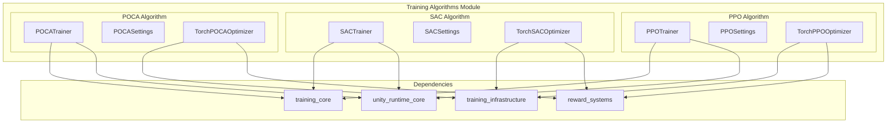
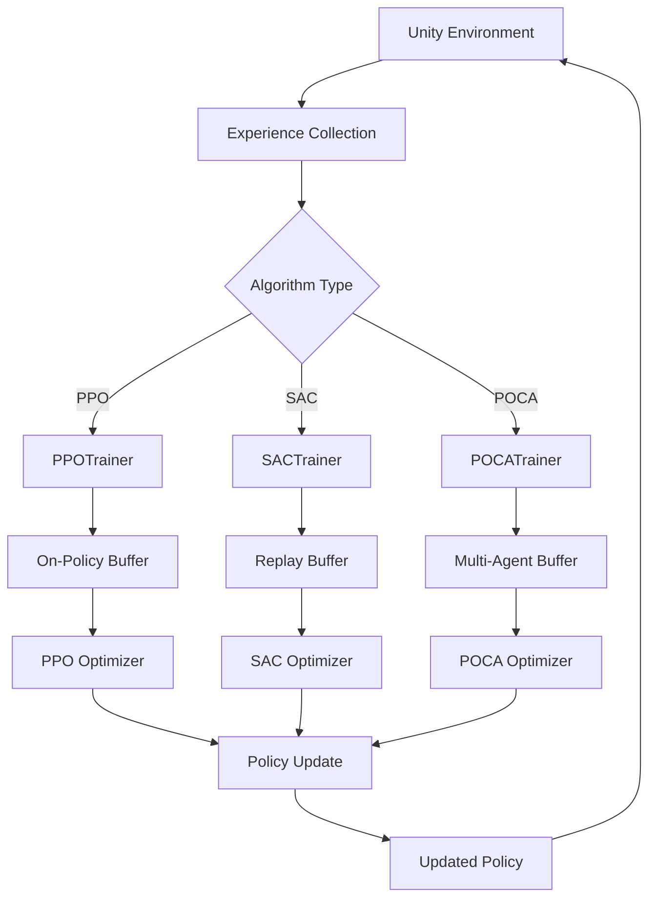
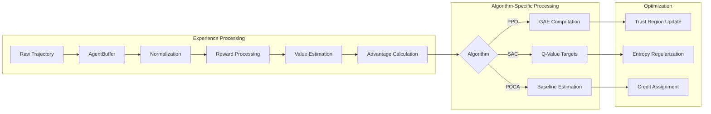
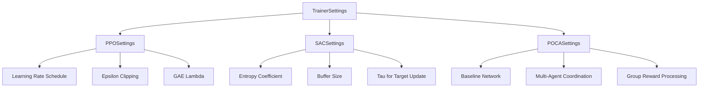

# Training Algorithms Module

## Overview

The `training_algorithms` module is the core implementation hub for reinforcement learning algorithms in Unity ML-Agents. This module provides three distinct training algorithms - PPO (Proximal Policy Optimization), SAC (Soft Actor-Critic), and POCA (Posthumous Credit Assignment) - each designed for different types of learning scenarios and agent behaviors.

## Purpose

This module serves as the algorithmic backbone of the ML-Agents training system, implementing state-of-the-art reinforcement learning algorithms that can handle:

- **Single-agent environments** with continuous and discrete action spaces
- **Multi-agent cooperative scenarios** with shared rewards and coordination
- **Complex policy optimization** with various exploration strategies
- **Memory-based learning** for partially observable environments

## Architecture Overview

The training algorithms module follows a consistent architectural pattern where each algorithm consists of two main components:

1. **Trainer Classes**: Orchestrate the training process, manage experience collection, and coordinate updates
2. **Optimizer Classes**: Implement the core mathematical operations and loss functions specific to each algorithm

## Algorithm Implementations

### PPO (Proximal Policy Optimization)
**Detailed Documentation**: [ppo_algorithm.md](ppo_algorithm.md)

PPO is an on-policy algorithm that provides stable policy updates through clipped objective functions. It's the most widely used algorithm in ML-Agents due to its reliability and ease of tuning. PPO is particularly effective for:
- Continuous control tasks with smooth action spaces
- Environments requiring stable, predictable learning curves
- Scenarios where sample efficiency is moderately important
- Single-agent learning with occasional multi-agent support

**Core Components**:
- `PPOTrainer`: Manages on-policy experience collection and training orchestration
- `PPOSettings`: Comprehensive hyperparameter configuration including clipping, GAE, and scheduling
- `TorchPPOOptimizer`: Implements trust region policy optimization with value function learning

### SAC (Soft Actor-Critic)
**Detailed Documentation**: [sac_algorithm.md](sac_algorithm.md)

SAC is an off-policy algorithm that maximizes both reward and entropy, promoting exploration while learning. It represents the state-of-the-art in continuous control and excels in:
- Complex continuous control tasks requiring nuanced policies
- Environments where extensive exploration is crucial for success
- Sample-efficient learning scenarios with replay buffer utilization
- High-dimensional action spaces with complex dynamics

**Core Components**:
- `SACTrainer`: Manages off-policy experience collection with replay buffer integration
- `SACSettings`: Advanced configuration for entropy regularization, buffer management, and target networks
- `TorchSACOptimizer`: Implements maximum entropy RL with twin Q-networks and automatic temperature tuning

### POCA (Posthumous Credit Assignment)
**Detailed Documentation**: [poca_algorithm.md](poca_algorithm.md)

POCA is specifically engineered for multi-agent cooperative environments where agents must learn coordination and credit assignment. It implements centralized training with decentralized execution and is optimal for:
- Multi-agent cooperative tasks with shared objectives
- Environments with team-based reward structures
- Scenarios requiring sophisticated agent coordination
- Complex multi-agent systems with varying team sizes

**Core Components**:
- `POCATrainer`: Orchestrates multi-agent training with group reward processing
- `POCASettings`: Configuration for baseline networks, multi-agent coordination, and credit assignment
- `TorchPOCAOptimizer`: Implements centralized critic with baseline estimation for proper credit assignment

## Technical Architecture

### Training Pipeline Flow

### Data Processing Architecture

### Memory and State Management

```mermaid
graph TB
    subgraph "Memory Systems"
        A[LSTM Memory] --> B[Sequence Processing]
        B --> C[Hidden State Management]
        C --> D[Memory Continuity]
    end
    
    subgraph "State Tracking"
        E[Agent States] --> F[Environment States]
        F --> G[Group States]
        G --> H[Global State]
    end
    
    subgraph "Buffer Management"
        I[Experience Buffer] --> J[Sampling Strategy]
        J --> K[Batch Formation]
        K --> L[Update Scheduling]
    end
```

## Integration with Other Modules

The training algorithms module integrates closely with several other system modules:

- **[training_core.md](training_core.md)**: Inherits base trainer and policy abstractions
- **[training_infrastructure.md](training_infrastructure.md)**: Uses network settings, optimizers, and shared components
- **[reward_systems.md](reward_systems.md)**: Integrates various reward signals for multi-objective learning
- **[unity_runtime_core.md](unity_runtime_core.md)**: Receives agent observations and sends actions back to Unity

## Configuration and Hyperparameters

Each algorithm provides extensive configuration options through their respective Settings classes:

## Performance Characteristics

| Algorithm | Sample Efficiency | Stability | Multi-Agent Support | Memory Usage |
|-----------|------------------|-----------|-------------------|--------------|
| PPO       | Medium           | High      | Limited           | Low          |
| SAC       | High             | Medium    | No                | Medium       |
| POCA      | Medium           | High      | Excellent         | High         |

## Usage Guidelines

### When to Use PPO
- Stable, reliable training is required
- Working with continuous control tasks
- Limited computational resources
- Need for interpretable training dynamics

### When to Use SAC
- Maximum sample efficiency is crucial
- Complex exploration is required
- Working with high-dimensional action spaces
- Off-policy learning is beneficial

### When to Use POCA
- Multi-agent cooperative scenarios
- Agents need to learn coordination
- Team-based reward structures
- Centralized training infrastructure is available

## Future Extensions

The modular design of this system allows for easy integration of additional algorithms such as:
- IMPALA for distributed training
- Rainbow DQN for discrete action spaces
- Multi-Agent DDPG for competitive scenarios
- Hierarchical reinforcement learning algorithms

## See Also

- [training_core.md](training_core.md) - Base trainer implementations
- [training_infrastructure.md](training_infrastructure.md) - Shared training components
- [reward_systems.md](reward_systems.md) - Reward signal implementations
- [unity_runtime_core.md](unity_runtime_core.md) - Unity integration layer