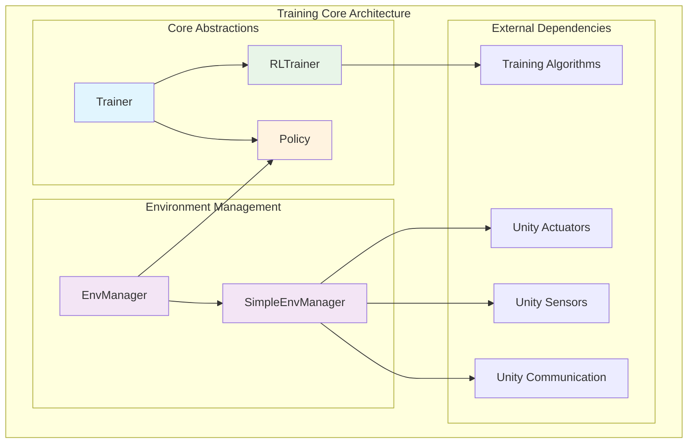
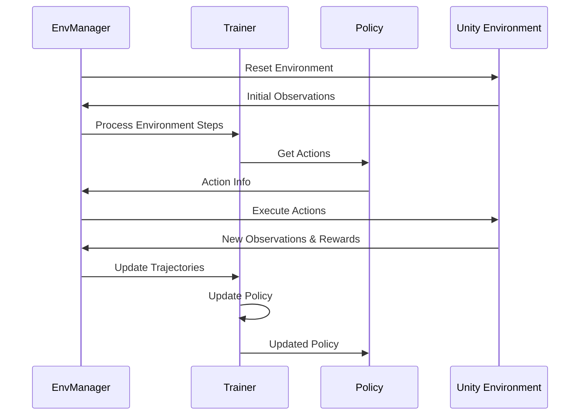
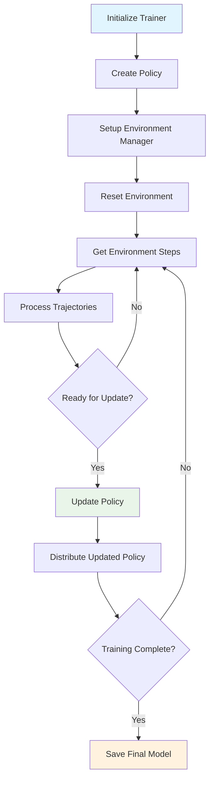

# Training Core Module

## Overview

The **training_core** module serves as the foundational layer for Unity ML-Agents' training system, providing the core abstractions and management infrastructure for reinforcement learning training workflows. This module defines the essential components that orchestrate the training process, manage environments, and coordinate policy execution across different training scenarios.

## Purpose

The training_core module establishes the fundamental architecture for:
- **Training Orchestration**: Core trainer abstractions that define the training lifecycle
- **Environment Management**: Infrastructure for managing Unity environments and their interactions
- **Policy Coordination**: Base policy abstractions for agent decision-making
- **Training Workflow**: Integration points between environments, policies, and training algorithms

## Architecture Overview

## Core Components

### 1. Trainer Abstractions

The module provides a hierarchical trainer system that forms the backbone of the training process. For detailed information about trainer implementations, see **[Trainer Abstractions](trainer_abstractions.md)**.

Key components:
- **Trainer**: Base abstract class defining the core training interface and lifecycle management
- **RLTrainer**: Specialized trainer for reinforcement learning with comprehensive reward signal support and model checkpointing

### 2. Environment Management

Environment management components handle Unity environment interactions and coordinate the training loop. For comprehensive details about environment management, see **[Environment Management](environment_management.md)**.

Key components:
- **EnvManager**: Abstract interface defining environment management contracts
- **SimpleEnvManager**: Concrete implementation optimized for single-environment training scenarios

### 3. Policy System

The policy system provides the foundation for agent decision-making and action generation. For in-depth coverage of policy implementations, see **[Policy System](policy_system.md)**.

Key components:
- **Policy**: Base policy class handling agent action generation, memory management, and state persistence

## Module Relationships

### Dependencies

The training_core module integrates with several other modules:

- **[training_algorithms](training_algorithms.md)**: Provides concrete trainer implementations (PPO, SAC, POCA)
- **[unity_actuators](unity_actuators.md)**: Handles action execution and specification
- **[unity_sensors](unity_sensors.md)**: Manages observation collection and processing
- **[unity_communication](unity_communication.md)**: Facilitates communication with Unity environments
- **[training_infrastructure](training_infrastructure.md)**: Provides configuration and optimization support

### Integration Points

## Key Features

### Training Lifecycle Management

- **Step Tracking**: Comprehensive step counting and progress monitoring
- **Model Checkpointing**: Automatic model saving and checkpoint management
- **Statistics Reporting**: Integration with TensorBoard for training metrics
- **Episode Management**: Proper episode boundary handling and reset coordination

### Memory and State Management

- **Recurrent Memory**: Support for LSTM/GRU memory in policies
- **Action History**: Previous action tracking for temporal dependencies
- **Agent State**: Persistent agent state management across episodes

### Multi-Environment Support

- **Scalable Architecture**: Support for multiple environment instances
- **Worker Coordination**: Multi-worker environment management
- **Policy Distribution**: Efficient policy updates across workers

## Training Flow

## Configuration Integration

The training_core module integrates with the [training_infrastructure](training_infrastructure.md) module for:

- **TrainerSettings**: Core training parameters and hyperparameters
- **NetworkSettings**: Neural network architecture configuration
- **Checkpoint Management**: Model persistence and loading strategies

## Best Practices

### Trainer Implementation

1. **Inherit from RLTrainer**: Use RLTrainer for reward-based learning scenarios
2. **Implement Abstract Methods**: Ensure all required methods are properly implemented
3. **Handle Threading**: Consider thread safety for multi-environment scenarios

### Environment Management

1. **Use Appropriate Manager**: Choose SimpleEnvManager for single environments, SubprocessEnvManager for production
2. **Handle Exceptions**: Implement proper error handling for environment failures
3. **Resource Cleanup**: Ensure proper cleanup of environment resources

### Policy Design

1. **Memory Management**: Properly handle recurrent memory for temporal dependencies
2. **Action Validation**: Implement action validation to prevent NaN values
3. **State Persistence**: Maintain agent state consistency across episodes

## Error Handling

The module provides comprehensive error handling through:

- **UnityPolicyException**: Policy-specific error handling
- **Validation Checks**: NaN detection and action validation
- **Graceful Degradation**: Proper handling of environment failures

## Performance Considerations

- **Batch Processing**: Efficient trajectory batch processing
- **Memory Usage**: Optimized memory management for large-scale training
- **Threading Support**: Optional threading for improved performance
- **Checkpoint Frequency**: Configurable checkpoint intervals to balance performance and safety

## Future Extensions

The training_core module is designed to support:

- **Custom Trainers**: Easy extension for new training algorithms
- **Advanced Environment Types**: Support for complex multi-agent scenarios
- **Distributed Training**: Foundation for distributed training architectures
- **Custom Policies**: Flexible policy implementations for specialized use cases