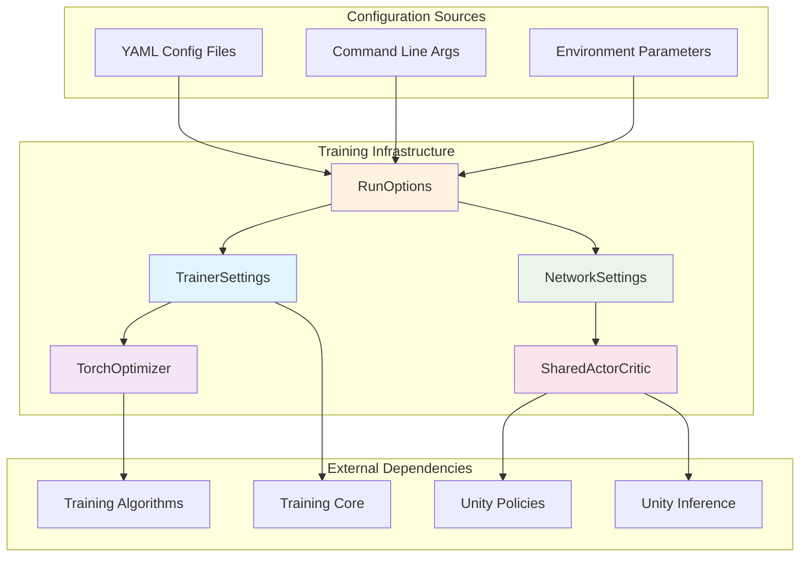

# Training Infrastructure Module

## Overview

The Training Infrastructure module serves as the foundational configuration and optimization layer for Unity ML-Agents training systems. It provides the core settings management, network architecture definitions, and optimization frameworks that enable machine learning training across different algorithms and environments.

## Purpose

This module acts as the backbone of the ML-Agents training pipeline by:

- **Configuration Management**: Centralizing all training parameters, hyperparameters, and system settings
- **Network Architecture**: Defining shared neural network components used across different training algorithms
- **Optimization Framework**: Providing the base optimization infrastructure for PyTorch-based training
- **Settings Validation**: Ensuring configuration consistency and parameter validation across the training pipeline

## Architecture Overview



## Core Components

### Configuration Management
- **TrainerSettings**: Comprehensive training configuration including hyperparameters, network settings, and algorithm-specific parameters
- **NetworkSettings**: Neural network architecture specifications including layer sizes, memory settings, and encoder types
- **RunOptions**: Top-level execution configuration combining trainer settings, environment parameters, and system options

### Optimization Framework
- **TorchOptimizer**: Base PyTorch optimization infrastructure providing reward signal management, trajectory evaluation, and update mechanisms

### Network Architecture
- **SharedActorCritic**: Unified neural network architecture combining actor and critic networks with shared parameters for efficient training

## Sub-modules

This module contains the following specialized sub-modules:

### [Configuration System](configuration_system.md)
Comprehensive configuration management system that handles all training parameters, validation, and settings inheritance. This sub-module provides the foundation for flexible and robust training configuration across different algorithms and environments.

**Key Features:**
- YAML-based configuration with command-line overrides
- Hierarchical settings with inheritance and validation
- Support for hyperparameter schedules and curriculum learning
- Environment parameter randomization and sampling

### [Optimization Infrastructure](optimization_infrastructure.md)
PyTorch-based optimization framework that provides the core training loop infrastructure, reward signal management, and trajectory processing capabilities used by all training algorithms.

**Key Features:**
- Base optimization class with extensible reward signal support
- Trajectory-based value estimation and bootstrapping
- Memory management for recurrent networks
- Integration with behavioral cloning and self-play

### [Network Architecture](network_architecture.md)
Unified neural network architecture definitions that provide shared actor-critic networks and encoding components used across different training algorithms for efficient parameter sharing and consistent network design.

**Key Features:**
- SharedActorCritic architecture combining actor and critic networks
- Support for various observation types and attention mechanisms
- Memory-enabled networks with LSTM support
- Optimized architectures for both training and inference

## Integration with Other Modules

### Training Algorithms Integration
The training infrastructure provides the foundational settings and optimization framework used by:
- [PPO Algorithm](training_algorithms.md#ppo-algorithm): Uses TrainerSettings and TorchOptimizer base classes
- [SAC Algorithm](training_algorithms.md#sac-algorithm): Extends optimization infrastructure for off-policy learning
- [POCA Algorithm](training_algorithms.md#poca-algorithm): Leverages shared network architectures for multi-agent training

### Unity Runtime Integration
- **Unity Policies**: SharedActorCritic networks are deployed as policies in Unity environments
- **Unity Inference**: Network architectures are optimized for inference in Unity runtime
- **Unity Communication**: Configuration settings control communication parameters

### Training Core Integration
- **Environment Management**: RunOptions configure environment parameters and execution settings
- **Policy System**: TrainerSettings define policy-specific configurations
- **Trainer Abstractions**: Base optimization framework supports different trainer implementations

## Key Features

### Flexible Configuration System
- YAML-based configuration with command-line overrides
- Hierarchical settings with inheritance and defaults
- Comprehensive validation and error handling
- Support for curriculum learning and parameter randomization

### Modular Network Architecture
- Shared actor-critic networks for efficient parameter usage
- Support for various observation types (vector, visual, variable-length)
- Memory-enabled networks with LSTM support
- Attention mechanisms for multi-agent scenarios

### Robust Optimization Framework
- PyTorch-based optimization with automatic differentiation
- Multiple reward signal support (extrinsic, intrinsic, curiosity, GAIL)
- Trajectory-based value estimation and bootstrapping
- Memory management for recurrent networks

### Extensible Design
- Plugin architecture for custom trainers and reward signals
- Configurable hyperparameter schedules
- Support for behavioral cloning and self-play
- Integration points for custom network architectures

## Configuration Examples

### Basic Training Configuration
```yaml
behaviors:
  MyAgent:
    trainer_type: ppo
    hyperparameters:
      batch_size: 1024
      buffer_size: 10240
      learning_rate: 3.0e-4
    network_settings:
      normalize: false
      hidden_units: 128
      num_layers: 2
    max_steps: 500000
```

### Advanced Network Configuration
```yaml
behaviors:
  ComplexAgent:
    trainer_type: sac
    network_settings:
      normalize: true
      hidden_units: 256
      num_layers: 3
      memory:
        sequence_length: 64
        memory_size: 128
      vis_encode_type: nature_cnn
```

## Performance Considerations

### Memory Management
- Efficient tensor operations with PyTorch
- Memory pooling for trajectory processing
- Gradient accumulation for large batch training
- Automatic memory cleanup for completed episodes

### Computational Optimization
- GPU acceleration support through PyTorch
- Vectorized operations for batch processing
- Efficient attention mechanisms for variable-length inputs
- Optimized network architectures for inference

### Scalability Features
- Multi-environment parallel training
- Distributed training support through configuration
- Efficient checkpoint management and resumption
- Resource monitoring and adaptive batch sizing

## Best Practices

### Configuration Management
1. Use YAML files for complex configurations
2. Leverage inheritance and default settings
3. Validate configurations before training
4. Document custom parameter choices

### Network Design
1. Start with default architectures and tune incrementally
2. Use normalization for stable training
3. Consider memory requirements for recurrent networks
4. Profile network performance for inference optimization

### Optimization Strategy
1. Monitor reward signals and training metrics
2. Use appropriate learning rate schedules
3. Balance exploration and exploitation through entropy settings
4. Implement proper checkpointing strategies

This training infrastructure module provides the essential foundation for all ML-Agents training operations, ensuring consistent, configurable, and efficient machine learning workflows across diverse Unity environments and training scenarios.