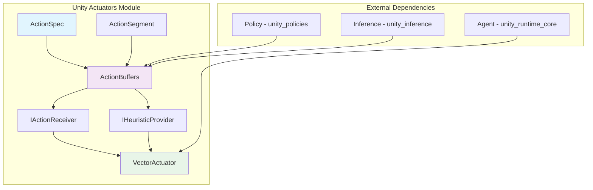
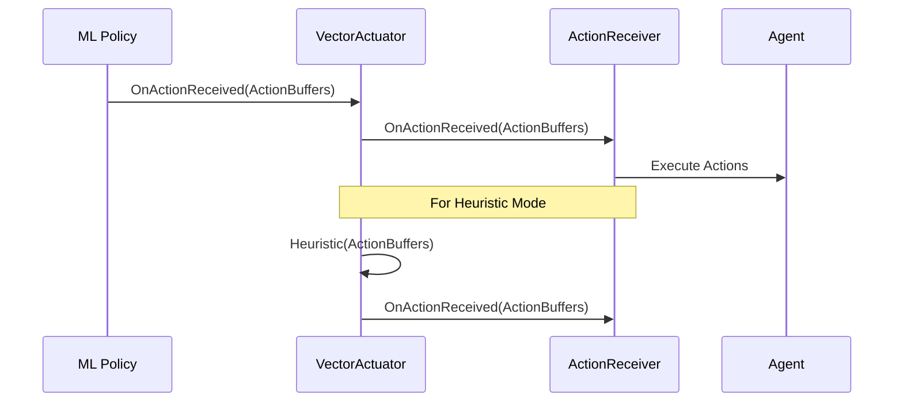

# Unity ML-Agents Actuators Module

## Overview

The Unity Actuators module is a core component of the Unity ML-Agents framework that provides the infrastructure for handling agent actions in reinforcement learning environments. This module defines the contracts and implementations for how agents receive, process, and execute actions from machine learning policies.

## Purpose

The actuators module serves as the bridge between ML policies and agent behavior by:

- **Action Management**: Defining structured ways to handle both continuous and discrete actions
- **Action Execution**: Providing interfaces for objects to receive and process actions
- **Heuristic Support**: Enabling manual control and debugging through heuristic providers
- **Memory Efficiency**: Implementing zero-copy action segments to avoid unnecessary allocations

## Architecture Overview



## Core Components

### Action Specification System
- **[ActionSpec](action_specification.md)**: Defines the structure and dimensions of action spaces
- **[ActionSegment](action_data_structures.md)**: Memory-efficient view into action arrays

### Action Processing System  
- **[ActionBuffers](action_data_structures.md)**: Container for both continuous and discrete actions
- **[IActionReceiver](action_interfaces.md)**: Interface for objects that can execute actions
- **[IHeuristicProvider](action_interfaces.md)**: Interface for manual action generation

### Action Execution System
- **[VectorActuator](action_execution.md)**: Primary actuator implementation that coordinates action flow

## Module Relationships

### Dependencies
- **[unity_runtime_core](unity_runtime_core.md)**: Provides Agent and AgentParameters for action coordination
- **[unity_policies](unity_policies.md)**: Supplies action decisions from various policy types
- **[unity_inference](unity_inference.md)**: Delivers neural network outputs as actions

### Dependents
- **[unity_sensors](unity_sensors.md)**: Works alongside actuators in the perception-action loop
- **[training_core](training_core.md)**: Uses action specifications for training configuration

## Key Features

### 1. Unified Action Handling
The module provides a unified approach to handling both continuous and discrete actions through the ActionBuffers system, eliminating the need for separate handling mechanisms.

### 2. Memory Optimization
ActionSegment provides zero-copy views into underlying arrays, reducing memory allocations and improving performance in high-frequency action processing scenarios.

### 3. Flexible Action Spaces
ActionSpec supports complex action spaces with mixed continuous and discrete actions, enabling sophisticated agent behaviors.

### 4. Heuristic Integration
Built-in support for heuristic policies allows for easy debugging, demonstration, and human-in-the-loop scenarios.

## Data Flow



## Integration Points

### With Unity Runtime Core
- Integrates with `Agent` class for action execution
- Uses `AgentParameters` for configuration
- Coordinates with `DecisionRequester` for action timing

### With Unity Policies
- Receives actions from `IPolicy` implementations
- Supports `HeuristicPolicy` through `IHeuristicProvider`
- Works with `RemotePolicy` and `SentisPolicy` for ML-driven actions

### With Unity Inference
- Processes neural network outputs into structured actions
- Handles tensor-to-action conversion through `TensorApplier`

## Usage Patterns

### Basic Action Receiver Implementation
```csharp
public class MyAgent : MonoBehaviour, IActionReceiver
{
    public void OnActionReceived(ActionBuffers actionBuffers)
    {
        // Process continuous actions
        var move = actionBuffers.ContinuousActions[0];
        var rotate = actionBuffers.ContinuousActions[1];
        
        // Process discrete actions
        var jump = actionBuffers.DiscreteActions[0];
    }
    
    public void WriteDiscreteActionMask(IDiscreteActionMask actionMask)
    {
        // Mask invalid actions
        actionMask.SetActionEnabled(0, 1, false);
    }
}
```

### Heuristic Provider Implementation
```csharp
public class MyHeuristic : IHeuristicProvider
{
    public void Heuristic(in ActionBuffers actionBuffersOut)
    {
        // Manual control mapping
        actionBuffersOut.ContinuousActions[0] = Input.GetAxis("Horizontal");
        actionBuffersOut.ContinuousActions[1] = Input.GetAxis("Vertical");
        actionBuffersOut.DiscreteActions[0] = Input.GetKey(KeyCode.Space) ? 1 : 0;
    }
}
```

## Performance Considerations

### Memory Efficiency
- ActionSegment avoids array copying through view-based access
- ActionBuffers reuses underlying arrays when possible
- Minimal allocations during action processing

### Processing Speed
- Direct array access through indexers
- Optimized enumeration support
- Profiler integration for performance monitoring

## Best Practices

1. **Action Space Design**: Keep action spaces as simple as possible while meeting behavioral requirements
2. **Memory Management**: Reuse ActionBuffers instances when possible to reduce GC pressure
3. **Action Masking**: Use discrete action masking to prevent invalid actions and improve training
4. **Heuristic Testing**: Implement heuristic providers for debugging and validation
5. **Performance Monitoring**: Use built-in profiler markers to identify bottlenecks

## Sub-Module Documentation

The unity_actuators module is organized into four specialized sub-modules, each handling specific aspects of the action processing pipeline:

### Core Sub-Modules

- **[Action Specification](action_specification.md)**: Comprehensive coverage of ActionSpec structure and action space definition, including factory methods, validation, and combination logic for both continuous and discrete action spaces.

- **[Action Data Structures](action_data_structures.md)**: Detailed examination of ActionSegment<T> and ActionBuffers, focusing on memory-efficient array segmentation, zero-copy operations, and performance optimization for action data handling.

- **[Action Interfaces](action_interfaces.md)**: Complete interface documentation for IActionReceiver and IHeuristicProvider, including ActionBuffers structure, action masking capabilities, and integration patterns with the broader ML-Agents ecosystem.

- **[Action Execution](action_execution.md)**: In-depth analysis of VectorActuator implementation, covering the forwarding pattern, action execution flow, profiling integration, and coordination between policies and action receivers.

## Related Documentation

- **[Unity Runtime Core](unity_runtime_core.md)**: Core agent and decision management
- **[Unity Policies](unity_policies.md)**: Policy implementations that generate actions
- **[Unity Inference](unity_inference.md)**: Neural network inference for action generation
- **[Training Core](training_core.md)**: Training systems that consume action specifications