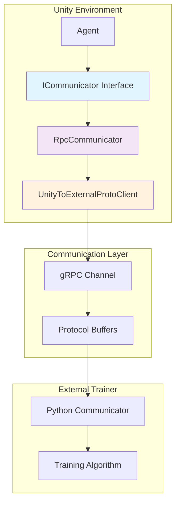
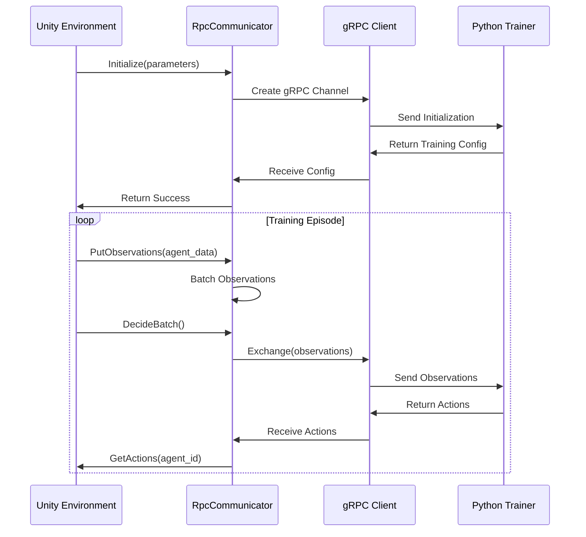

# Unity Communication Module

## Overview

The Unity Communication module serves as the critical bridge between Unity ML-Agents environments and external training systems (primarily Python-based trainers). This module implements a robust gRPC-based communication protocol that enables real-time data exchange for machine learning training workflows.

## Purpose

The module facilitates:
- **Bidirectional Communication**: Seamless data exchange between Unity environments and external trainers
- **Protocol Management**: Standardized communication protocols using gRPC and Protocol Buffers
- **Training Coordination**: Synchronization of training episodes, observations, and actions
- **Version Compatibility**: Ensures compatibility between Unity and Python ML-Agents versions

## Architecture Overview



## Core Components

### 1. ICommunicator Interface
- **Purpose**: Defines the contract for all communication implementations
- **Key Responsibilities**:
  - Initialize communication channels
  - Subscribe agent behaviors
  - Exchange observations and actions
  - Handle training lifecycle events

### 2. RpcCommunicator
- **Purpose**: Concrete implementation of gRPC-based communication
- **Key Features**:
  - Connection management with external trainers
  - Message serialization/deserialization
  - Error handling and recovery
  - Version compatibility checking

### 3. UnityToExternalProtoClient
- **Purpose**: Auto-generated gRPC client for protocol buffer communication
- **Functionality**:
  - Low-level message exchange
  - Network protocol handling
  - Asynchronous communication support

## Communication Protocol

### Message Flow


### Data Structures

#### Initialization Parameters
- **CommunicatorInitParameters**: Unity-side initialization data
- **UnityRLInitParameters**: External trainer initialization data
- **UnityRLInputParameters**: Runtime training parameters

#### Communication Events
- **QuitCommandHandler**: Handles training termination
- **ResetCommandHandler**: Manages environment resets
- **RLInputReceivedHandler**: Processes training input updates

## Integration with Other Modules

### Dependencies
- **[unity_runtime_core](unity_runtime_core.md)**: Provides agent management and decision coordination
- **[unity_actuators](unity_actuators.md)**: Supplies action specifications and execution interfaces
- **[unity_sensors](unity_sensors.md)**: Delivers observation data for transmission
- **[unity_side_channels](unity_side_channels.md)**: Enables auxiliary data communication

### External Connections
- **[python_environment](python_environment.md)**: Connects to Python-based training environments
- **[training_core](training_core.md)**: Interfaces with ML training algorithms

## Key Features

### 1. Protocol Version Management
```csharp
internal static bool CheckCommunicationVersionsAreCompatible(
    string unityCommunicationVersion,
    string pythonApiVersion
)
```
- Ensures compatibility between Unity and Python versions
- Prevents training failures due to protocol mismatches
- Provides clear error messages for version conflicts

### 2. Batch Processing
- Efficient batching of agent observations
- Optimized network communication
- Reduced latency in training loops

### 3. Error Handling
- Graceful connection failure recovery
- Comprehensive logging for debugging
- Automatic cleanup on application exit

### 4. Platform Support
- Conditional compilation for supported platforms
- Editor and standalone build compatibility
- Training platform validation

## Usage Patterns

### Basic Communication Setup
```csharp
// Initialize communicator
var communicator = RpcCommunicator.Create();
var initParams = new CommunicatorInitParameters
{
    port = 5005,
    name = "TrainingEnvironment",
    unityPackageVersion = "2.0.0",
    unityCommunicationVersion = "1.5.0"
};

// Establish connection
bool success = communicator.Initialize(initParams, out var externalParams);
```

### Agent Behavior Registration
```csharp
// Subscribe agent behavior
communicator.SubscribeBrain("AgentBehavior", actionSpec);

// Send observations
communicator.PutObservations(behaviorName, agentInfo, sensors);

// Process batch and get actions
communicator.DecideBatch();
var actions = communicator.GetActions(behaviorName, agentId);
```

## Performance Considerations

### Optimization Strategies
- **Message Batching**: Groups multiple agent observations into single network calls
- **Sensor Validation**: Debug-only validation to minimize runtime overhead
- **Memory Management**: Efficient reuse of message objects
- **Connection Pooling**: Maintains persistent gRPC connections

### Monitoring and Diagnostics
- Built-in timing measurements using TimerStack
- Comprehensive error logging with context
- Network status monitoring
- Training analytics integration

## Configuration

### Network Settings
- **Port Configuration**: Configurable communication port (default: 5005)
- **Timeout Management**: Deadline handling for network operations
- **Channel Credentials**: Insecure local connections for development

### Platform Compatibility
- **Supported Platforms**: Unity Editor, Standalone builds
- **Conditional Compilation**: Platform-specific feature availability
- **Runtime Validation**: Automatic platform capability detection

## Error Handling and Recovery

### Common Error Scenarios
1. **Connection Failures**: Trainer not available or network issues
2. **Version Mismatches**: Incompatible Unity/Python versions
3. **Message Size Limits**: Observations exceeding gRPC limits
4. **Protocol Errors**: Malformed messages or unexpected responses

### Recovery Mechanisms
- Automatic connection cleanup on failures
- Graceful degradation when trainer disconnects
- Clear error messages for troubleshooting
- Application lifecycle integration

## Future Considerations

### Extensibility Points
- **Custom Communicators**: Interface allows alternative implementations
- **Protocol Extensions**: Support for new message types
- **Side Channel Integration**: Auxiliary data communication channels
- **Performance Optimizations**: Streaming and compression support

### Compatibility Strategy
- Semantic versioning for protocol changes
- Backward compatibility maintenance
- Migration guides for breaking changes
- Feature capability negotiation

## Related Documentation

- **[unity_runtime_core](unity_runtime_core.md)**: Core agent and decision management
- **[unity_side_channels](unity_side_channels.md)**: Auxiliary communication channels
- **[python_environment](python_environment.md)**: Python-side communication implementation
- **[training_core](training_core.md)**: Training system integration

---

*This documentation covers the Unity Communication module's architecture, implementation, and integration patterns within the ML-Agents ecosystem.*