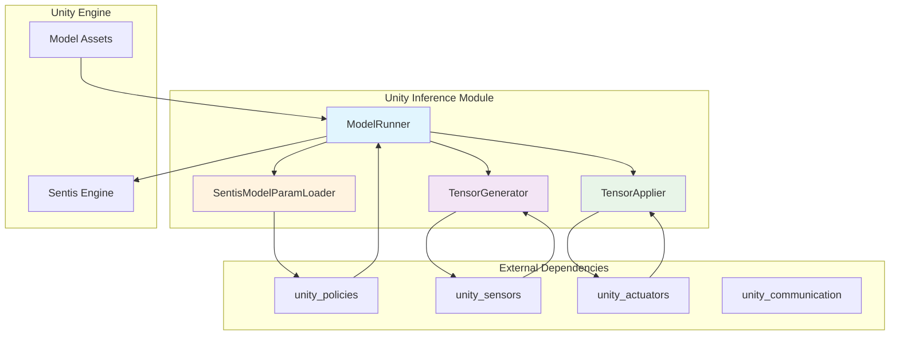
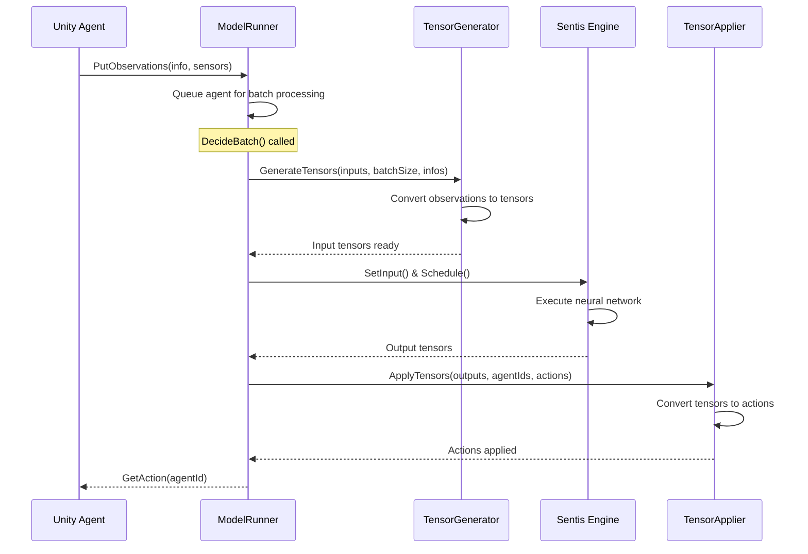
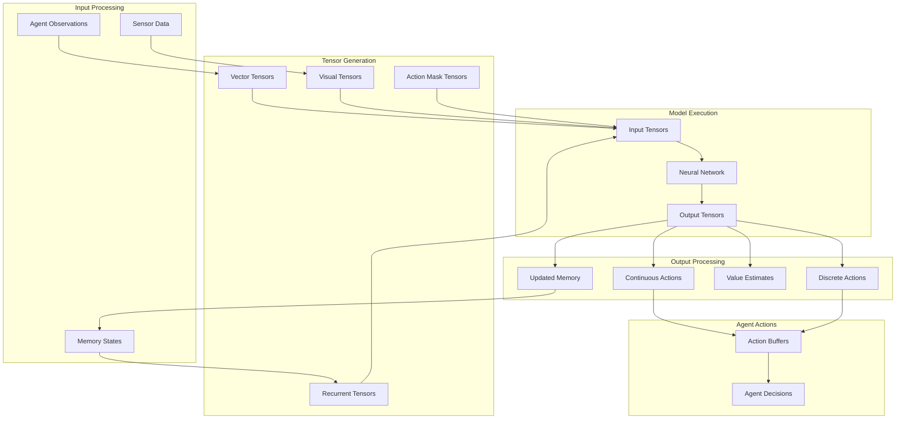

# Unity ML-Agents Inference Module

## Overview

The Unity ML-Agents Inference Module is a critical component of the Unity ML-Agents framework that handles neural network model execution and inference within Unity environments. This module serves as the bridge between trained machine learning models and Unity agents, enabling real-time decision-making through efficient tensor operations and model execution.

## Purpose

The inference module provides:
- **Model Execution**: Runs trained neural network models using Unity's Sentis inference engine
- **Tensor Management**: Handles input/output tensor generation, transformation, and application
- **Model Validation**: Ensures compatibility between models and agent configurations
- **Performance Optimization**: Provides efficient batch processing and memory management for inference operations

## Architecture Overview

The unity_inference module consists of four core components that work together to provide seamless model inference capabilities:

## Component Relationships

## Core Components Overview

The unity_inference module contains four primary components that work together to provide neural network inference capabilities:

| Component | File | Primary Function | Sub-Module |
|-----------|------|------------------|------------|
| **ModelRunner** | `ModelRunner.cs` | Central inference orchestrator and batch processor | [Model Execution](model_execution.md) |
| **TensorGenerator** | `TensorGenerator.cs` | Converts observations to input tensors | [Tensor Processing](tensor_processing.md) |
| **TensorApplier** | `TensorApplier.cs` | Converts output tensors to agent actions | [Tensor Processing](tensor_processing.md) |
| **SentisModelParamLoader** | `SentisModelParamLoader.cs` | Model validation and compatibility checking | [Model Validation](model_validation.md) |

## Sub-Modules

The unity_inference module is organized into three specialized sub-modules, each handling distinct aspects of the inference pipeline:

### 1. Model Execution
**Documentation**: [model_execution.md](model_execution.md)

Handles the core model execution pipeline, including batch processing, Sentis engine integration, and action retrieval. The ModelRunner component serves as the central orchestrator for all inference operations.

**Key Features**:
- Batch processing of agent observations
- Sentis engine integration and execution
- Memory management for recurrent models
- Performance profiling and optimization

### 2. Tensor Processing
**Documentation**: [tensor_processing.md](tensor_processing.md)

Manages the conversion between Unity agent data and neural network tensors. This includes both input tensor generation from observations and output tensor application to agent actions.

**Key Features**:
- Multi-format observation tensor generation
- Output tensor interpretation and action conversion
- Memory state management for recurrent networks
- Batch tensor operations

### 3. Model Validation
**Documentation**: [model_validation.md](model_validation.md)

Ensures compatibility between trained models and Unity agent configurations through comprehensive validation and error reporting.

**Key Features**:
- Model version compatibility checking
- Input/output shape verification
- Comprehensive error reporting
- Multi-version model support

## Data Flow Architecture

## Integration with Other Modules

### Dependencies

The unity_inference module integrates closely with several other modules:

- **[unity_sensors](unity_sensors.md)**: Provides observation data through various sensor types
- **[unity_actuators](unity_actuators.md)**: Receives processed actions for agent execution
- **[unity_policies](unity_policies.md)**: Integrates with policy systems for decision-making
- **[unity_runtime_core](unity_runtime_core.md)**: Works with core agent components for decision requests

### External Integrations

- **Unity Sentis Engine**: Provides the underlying neural network execution capabilities
- **Model Assets**: Loads and manages trained neural network models
- **Unity Profiler**: Integrates performance monitoring and optimization

## Key Features

### Batch Processing
- Efficient processing of multiple agents simultaneously
- Optimized memory usage through batch operations
- Scalable performance for large agent populations

### Model Compatibility
- Support for multiple ML-Agents model versions (1.x and 2.x)
- Comprehensive validation and error reporting
- Flexible input/output tensor handling

### Memory Management
- Efficient tensor allocation and disposal
- Recurrent network state management
- Memory leak prevention through proper cleanup

### Performance Optimization
- Unity Profiler integration for performance monitoring
- Configurable inference devices (CPU, GPU Compute, GPU Pixel)
- Deterministic inference support for reproducible results

## Usage Patterns

### Basic Inference Flow
1. **Initialization**: ModelRunner is created with a trained model and configuration
2. **Observation Collection**: Agents provide observations through `PutObservations()`
3. **Batch Processing**: `DecideBatch()` processes all queued agents
4. **Action Retrieval**: Agents retrieve actions using `GetAction()`

### Model Validation
1. **Compatibility Check**: SentisModelParamLoader validates model against agent configuration
2. **Error Reporting**: Detailed feedback on incompatibilities
3. **Version Support**: Handles different ML-Agents model versions

## Performance Considerations

- **Batch Size**: Larger batches improve GPU utilization but increase memory usage
- **Inference Device**: CPU is often fastest for smaller models, GPU for larger ones
- **Memory Management**: Proper disposal of tensors prevents memory leaks
- **Profiling**: Use Unity Profiler to identify performance bottlenecks

## Error Handling

The module provides comprehensive error handling through:
- Model compatibility validation
- Tensor shape verification
- Runtime error reporting
- Graceful degradation for missing components

## Future Considerations

- Enhanced support for newer Sentis engine features
- Improved batch processing algorithms
- Extended model format support
- Performance optimizations for mobile platforms