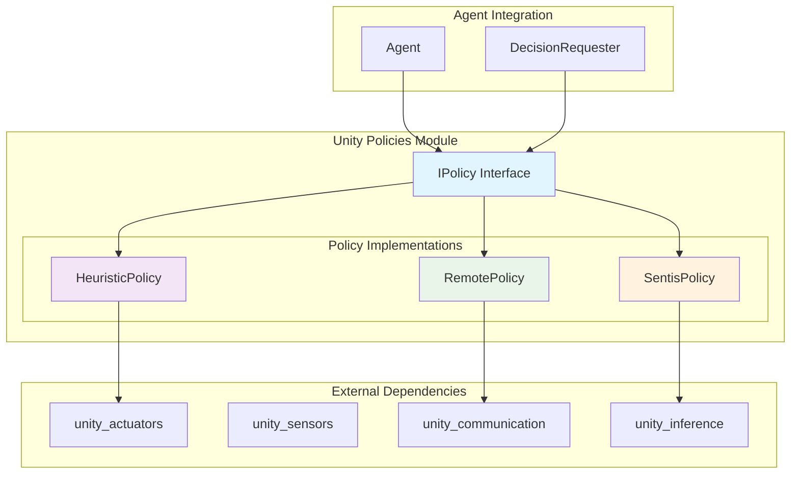
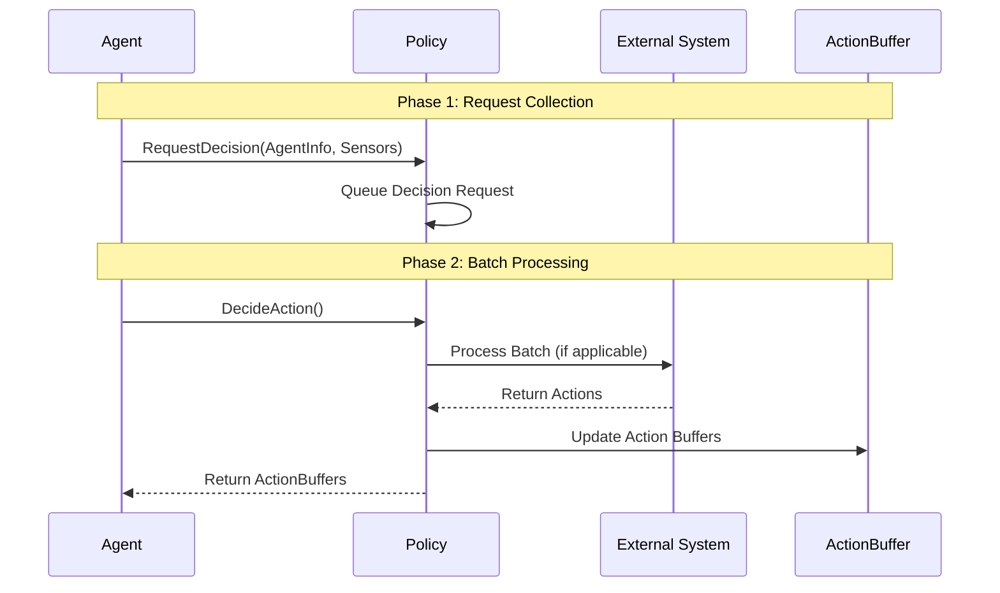
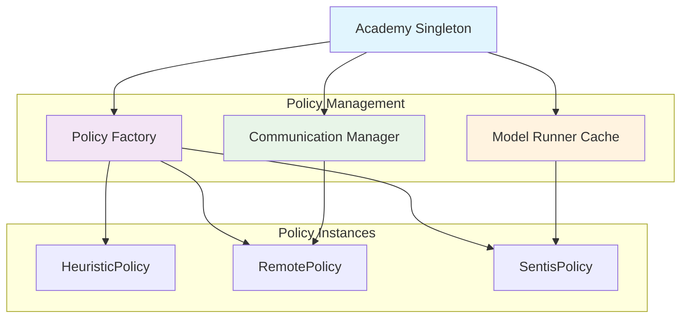
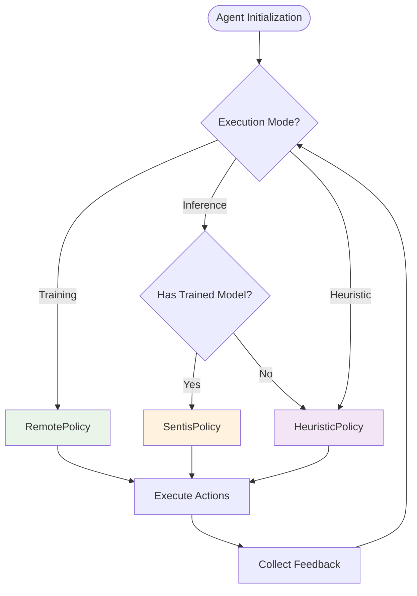

# Unity ML-Agents Policies Module

## Overview

The Unity Policies module is a core component of the Unity ML-Agents framework that provides the decision-making infrastructure for intelligent agents. This module defines the policy interface and implements various policy types that determine how agents select actions based on their observations and current state.

## Purpose

The policies module serves as the brain of ML-Agents, responsible for:
- **Decision Making**: Converting agent observations into actionable decisions
- **Policy Abstraction**: Providing a unified interface for different decision-making strategies
- **Runtime Flexibility**: Supporting multiple policy types that can be switched during runtime
- **Training Integration**: Seamlessly connecting with external training systems

## Architecture Overview

The policies module follows a strategy pattern design, where different policy implementations can be used interchangeably through a common interface. This allows agents to switch between human-controlled heuristics, remote training policies, and local inference models without code changes.



## Core Components

### IPolicy Interface
The foundational interface that defines the contract for all policy implementations:

```csharp
internal interface IPolicy : IDisposable
{
    void RequestDecision(AgentInfo info, List<ISensor> sensors);
    ref readonly ActionBuffers DecideAction();
}
```

**Key Methods:**
- **RequestDecision()**: Signals that an agent needs a decision, providing agent info and sensor data
- **DecideAction()**: Returns the final action decision as ActionBuffers
- **Batching Support**: Allows for efficient batch processing of multiple agents

### Policy Implementations

#### 1. HeuristicPolicy
**Purpose**: Executes human-defined heuristic logic for agent control

**Implementation Details:**
- Directly integrates with ActuatorManager for heuristic execution
- Processes sensor data for consistency with other policy types
- Uses NullList pattern to discard observation data efficiently
- Maintains ActionBuffers for continuous and discrete actions

**Use Cases:**
- Manual testing and debugging
- Baseline behavior comparisons
- Fallback behavior when other policies fail
- Rapid prototyping of agent behaviors

**Key Features:**
- Zero-latency decision making
- Direct actuator integration via `ApplyHeuristic()`
- Sensor processing for consistency across policy types

#### 2. RemotePolicy  
**Purpose**: Connects agents to external training systems via communication protocols

**Implementation Details:**
- Integrates with ICommunicator for external communication
- Subscribes behaviors to the Academy's communication system
- Tracks agent episodes and manages decision batching
- Includes analytics integration for training metrics

**Use Cases:**
- Training phase with external Python trainers
- Distributed learning environments
- Research and experimentation workflows

**Key Features:**
- Communication integration via Academy.Instance.Communicator
- Analytics tracking with TrainingAnalytics
- Batch decision processing for multiple agents
- Episode-based agent identification

#### 3. SentisPolicy
**Purpose**: Performs local inference using trained neural network models

**Implementation Details:**
- Uses shared ModelRunner instances for efficiency
- Supports multiple inference devices (CPU, GPU, Compute Shader)
- Provides deterministic inference options
- Integrates with Unity's Sentis inference engine

**Use Cases:**
- Production deployment of trained models
- Real-time inference in standalone applications
- Edge deployment scenarios

**Key Features:**
- Multiple inference backends (Burst, ComputeShader, PixelShader)
- Model sharing across multiple agents
- Deterministic execution options for reproducible results
- Analytics integration for inference monitoring

## Technical Implementation Details

### Decision Flow Architecture

The policy system follows a two-phase decision process that enables efficient batching and resource management:



### Memory Management and Performance

#### Action Buffer Management
All policies implement efficient action buffer management:

```csharp
// ActionBuffers structure for both continuous and discrete actions
public readonly struct ActionBuffers
{
    public ActionSegment<float> ContinuousActions { get; }
    public ActionSegment<int> DiscreteActions { get; }
}
```

**Key Optimizations:**
- **Buffer Reuse**: Action buffers are reused across decision cycles to minimize garbage collection
- **Segment-based Design**: ActionSegment provides efficient array slicing without copying
- **Memory Pooling**: Shared buffers reduce memory allocation overhead

#### Sensor Data Processing
Each policy handles sensor data differently based on its requirements:

- **HeuristicPolicy**: Uses NullList pattern to discard sensor data while maintaining API consistency
- **RemotePolicy**: Forwards sensor data to external training systems via communication channels
- **SentisPolicy**: Processes sensor data through TensorGenerator for neural network input

### Policy-Specific Implementation Patterns

#### HeuristicPolicy Implementation Pattern
```csharp
public ref readonly ActionBuffers DecideAction()
{
    if (!m_Done && m_DecisionRequested)
    {
        m_ActionBuffers.Clear();
        m_ActuatorManager.ApplyHeuristic(m_ActionBuffers);
    }
    m_DecisionRequested = false;
    return ref m_ActionBuffers;
}
```

**Design Principles:**
- **Immediate Execution**: No batching or queuing overhead
- **State Management**: Tracks decision requests and completion status
- **Resource Efficiency**: Minimal memory allocation and processing

#### RemotePolicy Communication Pattern
```csharp
public void RequestDecision(AgentInfo info, List<ISensor> sensors)
{
    m_AgentId = info.episodeId;
    m_Communicator?.PutObservations(m_FullyQualifiedBehaviorName, info, sensors);
}

public ref readonly ActionBuffers DecideAction()
{
    m_Communicator?.DecideBatch();
    var actions = m_Communicator?.GetActions(m_FullyQualifiedBehaviorName, m_AgentId);
    m_LastActionBuffer = actions == null ? ActionBuffers.Empty : (ActionBuffers)actions;
    return ref m_LastActionBuffer;
}
```

**Design Principles:**
- **Asynchronous Communication**: Separates observation sending from action retrieval
- **Batch Optimization**: Groups multiple agent decisions for efficient processing
- **Fault Tolerance**: Handles communication failures gracefully

#### SentisPolicy Inference Pattern
```csharp
public void RequestDecision(AgentInfo info, List<ISensor> sensors)
{
    m_AgentId = info.episodeId;
    m_ModelRunner?.PutObservations(info, sensors);
}

public ref readonly ActionBuffers DecideAction()
{
    if (m_ModelRunner == null)
    {
        m_LastActionBuffer = ActionBuffers.Empty;
    }
    else
    {
        m_ModelRunner?.DecideBatch();
        m_LastActionBuffer = m_ModelRunner.GetAction(m_AgentId);
    }
    return ref m_LastActionBuffer;
}
```

**Design Principles:**
- **Model Sharing**: Multiple policies can share the same ModelRunner instance
- **Device Abstraction**: Supports multiple inference backends transparently
- **Batch Inference**: Optimizes neural network execution through batching

### Integration Patterns

#### Academy Integration
All policies integrate with the Unity ML-Agents Academy system:



#### Resource Sharing Mechanisms

**ModelRunner Sharing for SentisPolicy:**
- Multiple SentisPolicy instances can share the same ModelRunner
- Sharing is based on model asset and inference device combination
- Reduces memory usage and improves performance for multi-agent scenarios

**Communication Channel Sharing for RemotePolicy:**
- All RemotePolicy instances share the Academy's communication system
- Behavior names are used to distinguish between different agent types
- Enables efficient batch communication with external training systems

## System Integration

The policies module integrates with several other Unity ML-Agents modules:

```mermaid
graph LR
    subgraph "Data Flow"
        Sensors[unity_sensors] --> Policies[unity_policies]
        Policies --> Actuators[unity_actuators]
    end
    
    subgraph "Communication"
        Policies <--> Communication[unity_communication]
    end
    
    subgraph "Inference"
        Policies --> Inference[unity_inference]
    end
    
    subgraph "Runtime Core"
        RuntimeCore[unity_runtime_core] --> Policies
    end
    
    style Policies fill:#e1f5fe
```

### Dependencies

- **[unity_actuators](unity_actuators.md)**: Provides action execution capabilities and action specifications
- **[unity_sensors](unity_sensors.md)**: Supplies observation data for decision making
- **[unity_communication](unity_communication.md)**: Enables remote policy communication during training
- **[unity_inference](unity_inference.md)**: Powers local neural network inference for SentisPolicy
- **[unity_runtime_core](unity_runtime_core.md)**: Provides agent management and decision coordination

## Policy Selection Strategy

The framework supports dynamic policy selection based on the agent's current mode:



## Key Features

### Batch Processing
All policies support batch processing for efficient handling of multiple agents:
- **Request Batching**: Multiple decision requests can be queued
- **Batch Execution**: Decisions are processed together for optimal performance
- **Synchronized Updates**: All agents in a batch receive decisions simultaneously

### Analytics Integration
Policies automatically collect and report usage analytics:
- **Model Usage Tracking**: Monitors which models are being used
- **Performance Metrics**: Tracks inference times and decision frequencies
- **Training Progress**: Reports training-related statistics

### Resource Management
The module implements efficient resource management:
- **Model Sharing**: Multiple agents can share the same inference model
- **Memory Optimization**: Efficient buffer management for action data
- **Lifecycle Management**: Proper cleanup and disposal of resources

## Usage Patterns

### Development Workflow
1. **Prototyping**: Start with HeuristicPolicy for initial behavior development
2. **Training**: Switch to RemotePolicy for machine learning training
3. **Deployment**: Use SentisPolicy for production inference

### Runtime Switching
Policies can be switched at runtime to support different operational modes:
```csharp
// Example policy switching logic
if (trainingMode)
    policy = new RemotePolicy(actionSpec, actuators, behaviorName);
else if (hasTrainedModel)
    policy = new SentisPolicy(actionSpec, actuators, model, device, behaviorName);
else
    policy = new HeuristicPolicy(actuatorManager, actionSpec);
```

## Performance Considerations

### Inference Optimization
- **Device Selection**: Choose appropriate inference device (CPU/GPU) based on model complexity
- **Batch Size**: Optimize batch sizes for your specific hardware configuration
- **Model Sharing**: Leverage shared model runners for multiple agents using the same model

### Memory Management
- **Action Buffer Reuse**: Policies reuse action buffers to minimize garbage collection
- **Sensor Data Handling**: Efficient processing of observation data from sensors
- **Resource Cleanup**: Proper disposal patterns prevent memory leaks

## Best Practices

1. **Policy Selection**: Choose the appropriate policy type for your use case
2. **Error Handling**: Implement fallback mechanisms for policy failures
3. **Performance Monitoring**: Track policy performance and resource usage
4. **Model Versioning**: Maintain proper versioning for trained models
5. **Testing**: Validate policy behavior across different scenarios

## Future Considerations

The policies module is designed for extensibility:
- **Custom Policies**: New policy types can be added by implementing IPolicy
- **Hybrid Approaches**: Combination policies that blend multiple strategies
- **Advanced Inference**: Support for more sophisticated inference backends
- **Distributed Policies**: Policies that span multiple devices or systems

This module forms the decision-making core of the Unity ML-Agents framework, providing the flexibility and performance needed for diverse AI applications in Unity environments.