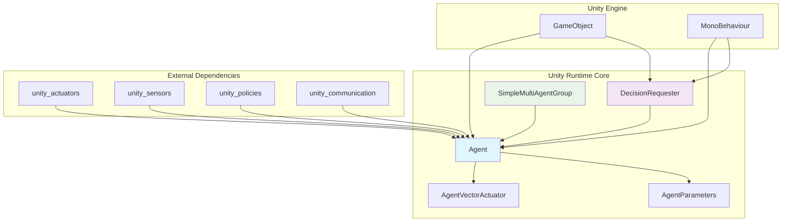
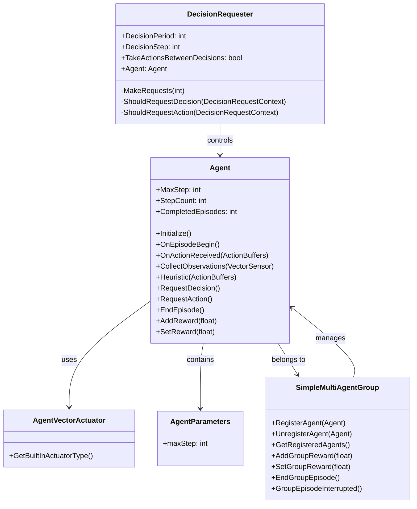
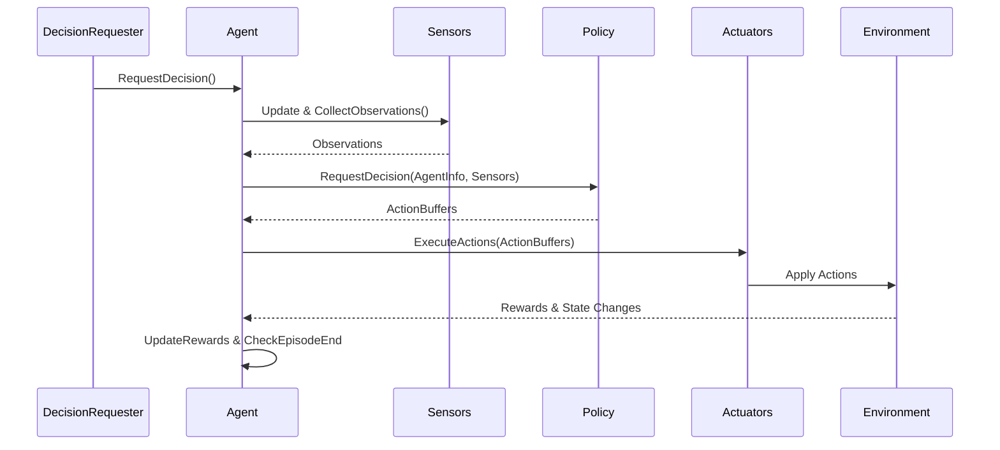
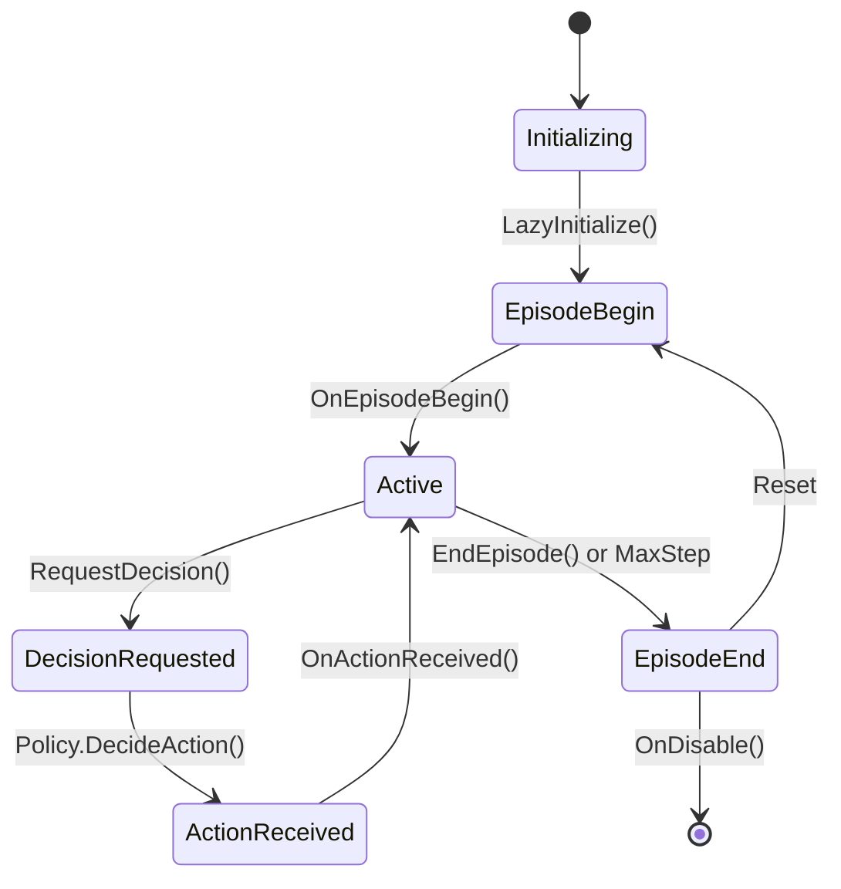

# Unity ML-Agents Runtime Core Module

## Overview

The Unity Runtime Core module serves as the foundational layer of the Unity ML-Agents framework, providing the essential components for agent behavior, decision-making, and multi-agent coordination within Unity environments. This module acts as the primary interface between Unity GameObjects and the ML-Agents training pipeline, enabling seamless integration of machine learning capabilities into Unity applications.

## Purpose

The unity_runtime_core module is designed to:

- **Agent Management**: Provide the core Agent class that serves as the base for all ML-Agents implementations
- **Decision Orchestration**: Manage the timing and flow of agent decision-making processes
- **Multi-Agent Coordination**: Enable group-based agent interactions and shared rewards
- **Action Execution**: Handle the translation between ML decisions and Unity GameObject actions
- **Observation Collection**: Coordinate the gathering of environmental observations for decision-making

## Architecture Overview

The module follows a component-based architecture that integrates seamlessly with Unity's GameObject system:



## Core Components

The unity_runtime_core module is organized into three main sub-modules, each handling specific aspects of agent functionality:

### 1. Agent Core System
**[Detailed Documentation: agent_core.md](agent_core.md)**

The Agent Core system provides the fundamental building blocks for ML-Agents:
- **Agent Class**: Central component inheriting from MonoBehaviour with complete lifecycle management
- **AgentVectorActuator**: Specialized actuator for backward compatibility and vector action handling
- **AgentParameters**: Configuration structure for agent behavior parameters

**Key Capabilities:**
- Episode management with configurable step limits
- Reward accumulation and tracking
- Observation collection coordination
- Action execution delegation
- Integration with Unity's component system

### 2. Decision Management System
**[Detailed Documentation: decision_management.md](decision_management.md)**

The Decision Management system orchestrates the timing and flow of agent decision-making:
- **DecisionRequester**: Automated decision timing control component
- **Configurable Decision Frequency**: Flexible timing configuration for different scenarios
- **Action Repetition Control**: Management of actions between decision points

**Configuration Features:**
- `DecisionPeriod`: Frequency of decision requests
- `DecisionStep`: Timing offset for decision requests
- `TakeActionsBetweenDecisions`: Action repetition control

### 3. Multi-Agent Coordination System
**[Detailed Documentation: multi_agent_coordination.md](multi_agent_coordination.md)**

The Multi-Agent Coordination system enables group-based agent interactions:
- **SimpleMultiAgentGroup**: Group management and coordination
- **Shared Reward Distribution**: Group-wide reward mechanisms
- **Synchronized Episode Control**: Coordinated episode management
- **Resource Management**: Proper cleanup and lifecycle management

**Group Operations:**
- Agent registration and deregistration
- Group reward management
- Episode synchronization
- Resource cleanup

## Component Relationships



## Integration with Other Modules

The unity_runtime_core module serves as the central hub that integrates with other ML-Agents modules:

### Actuator Integration
- **[unity_actuators](unity_actuators.md)**: Provides action execution capabilities through VectorActuator and ActionSpec
- **AgentVectorActuator**: Specialized actuator for backward compatibility with legacy agent implementations

### Sensor Integration  
- **[unity_sensors](unity_sensors.md)**: Supplies observation collection through various sensor types
- **Observation Pipeline**: Coordinates sensor updates and observation gathering for decision-making

### Policy Integration
- **[unity_policies](unity_policies.md)**: Connects to decision-making policies (Heuristic, Remote, Sentis)
- **Decision Flow**: Manages the flow from observations to actions through policy evaluation

### Communication Integration
- **[unity_communication](unity_communication.md)**: Enables external training process communication
- **Training Coordination**: Facilitates data exchange with Python training environments

## Data Flow Architecture



## Episode Lifecycle Management

The module provides comprehensive episode management:



## Configuration and Customization

### Agent Configuration
```csharp
public class CustomAgent : Agent
{
    public override void Initialize()
    {
        // One-time setup
        MaxStep = 1000; // Configure episode length
    }
    
    public override void OnEpisodeBegin()
    {
        // Reset agent state for new episode
    }
    
    public override void CollectObservations(VectorSensor sensor)
    {
        // Add observations for decision-making
        sensor.AddObservation(transform.position);
        sensor.AddObservation(transform.rotation);
    }
    
    public override void OnActionReceived(ActionBuffers actions)
    {
        // Execute actions in environment
        var movement = actions.ContinuousActions[0];
        transform.Translate(Vector3.forward * movement);
    }
}
```

### Decision Requester Setup
```csharp
// Automatic decision requesting every 5 steps
DecisionRequester requester = GetComponent<DecisionRequester>();
requester.DecisionPeriod = 5;
requester.TakeActionsBetweenDecisions = true;
```

### Multi-Agent Group Usage
```csharp
SimpleMultiAgentGroup group = new SimpleMultiAgentGroup();
group.RegisterAgent(agent1);
group.RegisterAgent(agent2);
group.AddGroupReward(1.0f); // Reward all agents in group
```

## Performance Considerations

### Optimization Strategies
- **Decision Frequency**: Use appropriate DecisionPeriod values to balance responsiveness and performance
- **Observation Efficiency**: Minimize expensive operations in CollectObservations()
- **Memory Management**: Proper cleanup of sensors and actuators in OnDisable()
- **Group Management**: Efficient agent registration/deregistration in multi-agent scenarios

### Resource Management
- Automatic cleanup of sensors and actuators on agent disable
- Proper disposal of multi-agent groups
- Memory-efficient action buffer reuse
- Optimized sensor update cycles

## Best Practices

### Agent Implementation
1. **Always call base methods** when overriding OnEnable/OnDisable
2. **Use appropriate MaxStep values** to prevent infinite episodes during training
3. **Implement proper reward scaling** to maintain numerical stability
4. **Handle edge cases** in OnActionReceived for robust behavior

### Decision Management
1. **Configure DecisionPeriod** based on environment complexity and response requirements
2. **Use TakeActionsBetweenDecisions** for continuous control scenarios
3. **Consider DecisionStep offsets** to distribute computational load across agents

### Multi-Agent Coordination
1. **Properly register/unregister agents** to prevent memory leaks
2. **Use group rewards judiciously** to encourage cooperation
3. **Synchronize episode endings** when agents are interdependent
4. **Dispose of groups** when no longer needed

## Error Handling and Debugging

### Common Issues
- **Initialization Errors**: Ensure proper component setup and dependencies
- **Action Space Mismatches**: Verify ActionSpec configuration matches implementation
- **Observation Size Mismatches**: Confirm VectorObservationSize matches CollectObservations output
- **Memory Leaks**: Proper cleanup of multi-agent groups and sensor components

### Debugging Tools
- Built-in recursion checkers for CollectObservations and OnEpisodeBegin
- Comprehensive logging for agent lifecycle events
- Performance timing with TimerStack integration
- Reward tracking and statistics collection

This module forms the foundation of the Unity ML-Agents framework, providing the essential infrastructure for creating intelligent agents within Unity environments. Its tight integration with Unity's component system and comprehensive lifecycle management make it the cornerstone for all ML-Agents implementations.